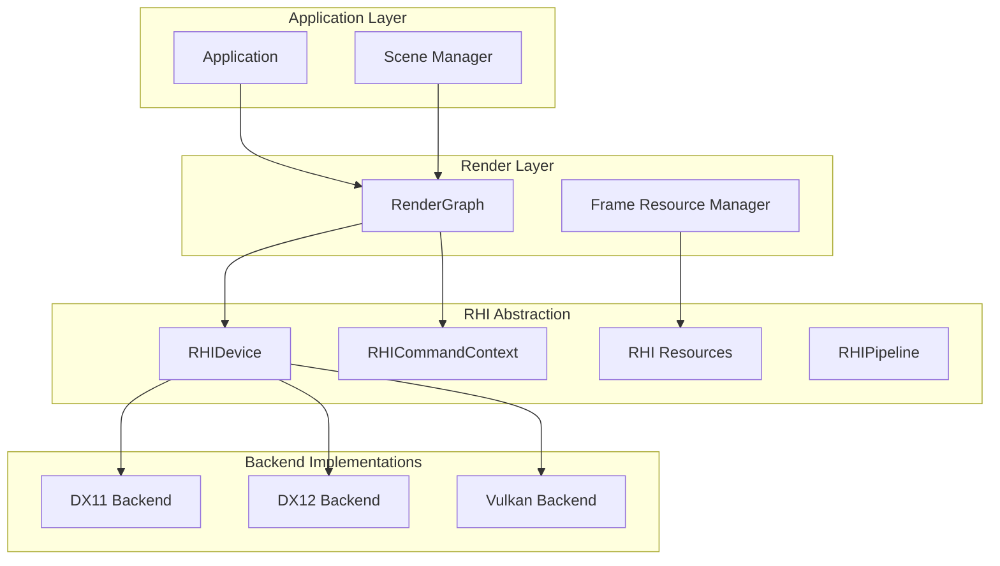
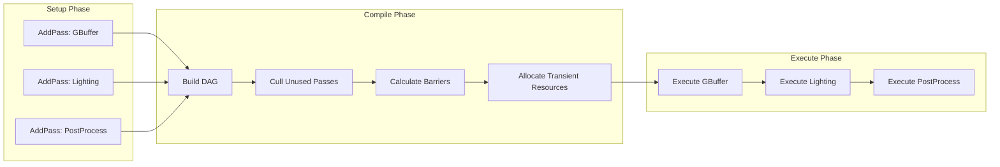
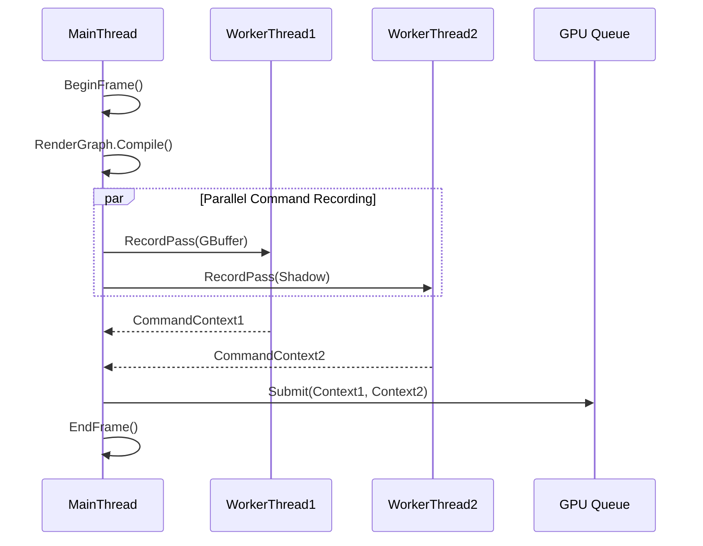
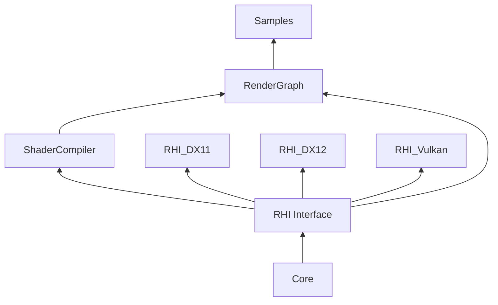
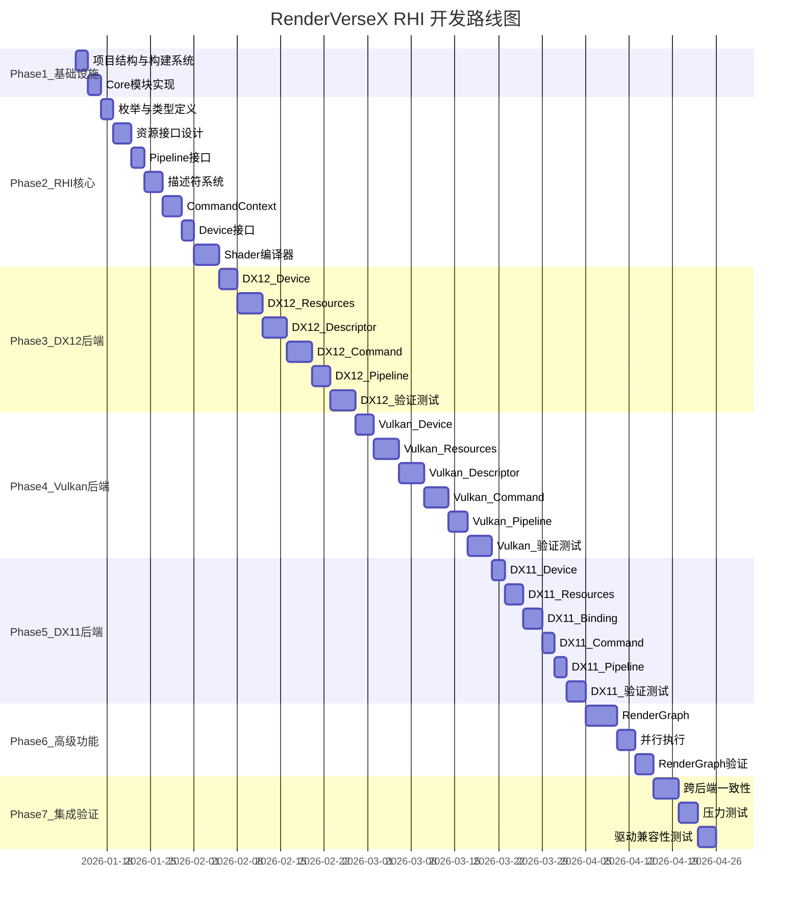

# RenderVerseX RHI 架构设计方案

## 1. 整体架构



## 2. 目录结构

```
RenderVerseX/
├── CMakeLists.txt               # 根构建文件
├── CMakePresets.json            # CMake预设配置
├── vcpkg.json                   # vcpkg依赖清单
├── vcpkg-configuration.json     # vcpkg仓库配置
├── .gitignore
│
├── RHI/
│   ├── CMakeLists.txt
│   ├── Include/RHI/
│   │   ├── RHI.h                    # 统一头文件
│   │   ├── RHIDefinitions.h         # 枚举、常量、格式定义
│   │   ├── RHIDevice.h              # 设备抽象 (含队列同步接口)
│   │   ├── RHICommandContext.h      # 命令上下文
│   │   ├── RHIResources.h           # 资源基类
│   │   ├── RHIBuffer.h              # Buffer资源
│   │   ├── RHITexture.h             # Texture资源
│   │   ├── RHITextureView.h         # Texture View抽象 (新增)
│   │   ├── RHISampler.h             # 采样器
│   │   ├── RHIShader.h              # Shader抽象
│   │   ├── RHIPipeline.h            # PSO抽象
│   │   ├── RHIPipelineCache.h       # Pipeline缓存 (新增)
│   │   ├── RHIRenderPass.h          # RenderPass定义
│   │   ├── RHIDescriptor.h          # 描述符/绑定组
│   │   ├── RHIDescriptorAllocator.h # 描述符分配器
│   │   ├── RHIPipelineLayoutCache.h # Pipeline Layout缓存
│   │   ├── RHISwapChain.h           # 交换链 (含窗口句柄抽象)
│   │   ├── RHISynchronization.h     # 同步原语 (含队列同步点)
│   │   └── RHICapabilities.h        # 设备能力查询 (含 Push Constant 限制)
│   ├── Private/
│   │   ├── RHIModule.cpp            # 后端动态加载
│   │   ├── RHIValidation.cpp        # 调试验证层
│   │   └── DescriptorCache.cpp      # 描述符缓存
│   └── Shaders/
│       └── ShaderCompiler.h         # Shader编译接口
│
├── RHI_DX11/
│   ├── CMakeLists.txt
│   ├── Include/DX11/
│   │   ├── DX11Device.h
│   │   └── DX11Capabilities.h       # DX11 特有配置
│   └── Private/
│       ├── DX11Device.cpp
│       ├── DX11CommandContext.cpp
│       ├── DX11Resources.cpp
│       ├── DX11Pipeline.cpp
│       ├── DX11SwapChain.cpp
│       ├── DX11BindingRemapper.cpp  # Slot 映射器
│       └── DX11PushConstants.cpp    # Push Constants 模拟 (新增)
│
├── RHI_DX12/
│   ├── CMakeLists.txt
│   ├── Include/DX12/
│   │   └── DX12Device.h
│   └── Private/
│       ├── DX12Device.cpp
│       ├── DX12CommandContext.cpp
│       ├── DX12DescriptorHeap.cpp
│       ├── DX12Resources.cpp
│       └── DX12Pipeline.cpp
│
├── RHI_Vulkan/
│   ├── CMakeLists.txt
│   ├── Include/Vulkan/
│   │   └── VulkanDevice.h
│   └── Private/
│       ├── VulkanDevice.cpp
│       ├── VulkanCommandContext.cpp
│       ├── VulkanDescriptorPool.cpp
│       ├── VulkanResources.cpp
│       └── VulkanPipeline.cpp
│
├── RenderGraph/
│   ├── CMakeLists.txt
│   ├── Include/RenderGraph/
│   │   ├── RenderGraph.h            # 主入口
│   │   ├── RenderGraphPass.h        # Pass定义
│   │   ├── RenderGraphResource.h    # 虚拟资源
│   │   └── RenderGraphBuilder.h     # 构建器
│   └── Private/
│       ├── RenderGraph.cpp
│       ├── RenderGraphCompiler.cpp  # 依赖分析、屏障插入
│       └── RenderGraphExecutor.cpp  # 执行器
│
├── ShaderCompiler/
│   ├── CMakeLists.txt
│   ├── Include/ShaderCompiler/
│   │   ├── ShaderCompiler.h
│   │   ├── ShaderReflection.h
│   │   ├── ShaderPermutation.h      # 变体管理
│   │   ├── ShaderHotReload.h        # 热重载支持 (新增)
│   │   └── DX11SlotMapping.h        # DX11 Slot 映射定义
│   └── Private/
│       ├── DXCCompiler.cpp          # HLSL编译 (支持 DXBC/DXIL/SPIR-V)
│       ├── SPIRVReflect.cpp         # SPIR-V反射
│       ├── ShaderCache.cpp          # Shader缓存
│       ├── ShaderPermutationCache.cpp  # 变体缓存
│       ├── ShaderHotReload.cpp      # 热重载实现 (新增)
│       └── DX11SlotMapper.cpp       # DX11 Slot 映射生成
│
├── Core/
│   ├── Include/Core/
│   │   ├── Types.h                  # 基础类型
│   │   ├── RefCounted.h             # 引用计数基类
│   │   ├── Handle.h                 # 句柄系统
│   │   └── ThreadSafe.h             # 线程安全工具
│   └── Private/
│       └── Memory.cpp
│
├── Samples/
│   └── Triangle/
│       └── main.cpp
│
└── Tests/                           # 验证测试 (新增)
    ├── CMakeLists.txt
    ├── TestFramework/
    │   ├── TestRunner.h
    │   ├── Assertions.h
    │   └── ImageCompare.h
    ├── DX12Validation/
    │   └── main.cpp
    ├── VulkanValidation/
    │   └── main.cpp
    ├── DX11Validation/
    │   └── main.cpp
    ├── RenderGraphValidation/
    │   └── main.cpp
    └── Shaders/
        ├── Triangle.hlsl
        └── TexturedQuad.hlsl
```

## 3. 核心数据模型

### 3.1 侵入式引用计数基类 (Intrusive RefCounting)

采用侵入式设计，避免双重堆分配，引用计数与对象在同一缓存行，性能更优。

**关键设计：使用回调接口解耦 Core 与 RenderLayer**

```cpp
// Core/Include/Core/RefCounted.h

// 延迟删除接口 - 解决 Core 依赖 RenderLayer 的循环依赖问题
class IDeferredDeleter {
public:
    virtual ~IDeferredDeleter() = default;
    virtual void DeferredDelete(const class RefCounted* object) = 0;
};

// 全局注册点 (在引擎初始化时由 FrameResourceManager 注册)
class DeferredDeleterRegistry {
    static IDeferredDeleter* s_deleter;
    
public:
    static void Register(IDeferredDeleter* deleter) { s_deleter = deleter; }
    static IDeferredDeleter* Get() { return s_deleter; }
};

// 侵入式引用计数基类
class RefCounted {
    mutable std::atomic<uint32_t> m_refCount{0};
    
protected:
    virtual ~RefCounted() = default;
    
public:
    void AddRef() const {
        m_refCount.fetch_add(1, std::memory_order_relaxed);
    }
    
    // Release 返回 true 表示引用归零，由调用方决定如何处理
    bool Release() const {
        return m_refCount.fetch_sub(1, std::memory_order_acq_rel) == 1;
    }
    
    uint32_t GetRefCount() const { return m_refCount.load(std::memory_order_relaxed); }
};

// 智能指针 - 负责调用延迟删除
template<typename T>
class RHIRef {
    static_assert(std::is_base_of_v<RefCounted, T>, "T must inherit from RefCounted");
    T* m_ptr = nullptr;
    
    void TryDelete() {
        if (m_ptr && m_ptr->Release()) {
            // 引用归零，加入延迟删除队列
            if (auto* deleter = DeferredDeleterRegistry::Get()) {
                deleter->DeferredDelete(m_ptr);
            } else {
                // Fallback: 无延迟删除器时直接删除 (用于测试/工具)
                delete m_ptr;
            }
            m_ptr = nullptr;
        }
    }
    
public:
    RHIRef() = default;
    explicit RHIRef(T* ptr) : m_ptr(ptr) { if (m_ptr) m_ptr->AddRef(); }
    RHIRef(const RHIRef& other) : m_ptr(other.m_ptr) { if (m_ptr) m_ptr->AddRef(); }
    RHIRef(RHIRef&& other) noexcept : m_ptr(other.m_ptr) { other.m_ptr = nullptr; }
    ~RHIRef() { TryDelete(); }
    
    RHIRef& operator=(const RHIRef& other);
    RHIRef& operator=(RHIRef&& other) noexcept;
    
    T* Get() const { return m_ptr; }
    T* operator->() const { return m_ptr; }
    T& operator*() const { return *m_ptr; }
    explicit operator bool() const { return m_ptr != nullptr; }
    
    void Reset(T* ptr = nullptr);
};

// RHI 资源基类
class RHIResource : public RefCounted {
protected:
    std::string m_debugName;
    
public:
    void SetDebugName(const char* name) { m_debugName = name ? name : ""; }
    const std::string& GetDebugName() const { return m_debugName; }
};

using RHIBufferRef = RHIRef<RHIBuffer>;
using RHITextureRef = RHIRef<RHITexture>;
using RHIPipelineRef = RHIRef<RHIPipeline>;
```

**初始化时注册：**

```cpp
// RenderGraph/Private/FrameResourceManager.cpp

class FrameResourceManager : public IDeferredDeleter {
public:
    void Initialize() {
        // 注册到 Core 层
        DeferredDeleterRegistry::Register(this);
    }
    
    void DeferredDelete(const RefCounted* object) override {
        // 加入当前帧的延迟删除队列
        m_frames[m_currentFrameIndex].pendingDeletes.push_back(object);
    }
};
```

### 3.2 核心枚举定义

```cpp
// RHI/Include/RHI/RHIDefinitions.h
enum class RHIBackendType { DX11, DX12, Vulkan };
enum class RHIFormat { R8_UNORM, RGBA8_UNORM, RGBA16_FLOAT, D24_UNORM_S8_UINT, ... };
enum class RHITextureUsage { ShaderResource, RenderTarget, DepthStencil, UnorderedAccess };
enum class RHIBufferUsage { Vertex, Index, Constant, Structured, IndirectArgs };
enum class RHIPrimitiveTopology { TriangleList, TriangleStrip, LineList, PointList };
enum class RHIResourceState { Common, RenderTarget, DepthWrite, ShaderResource, UnorderedAccess, CopyDest, CopySrc };
enum class RHICommandQueueType { Graphics, Compute, Copy };
```

### 3.3 设备接口

```cpp
// RHI/Include/RHI/RHIDevice.h
class IRHIDevice {
public:
    virtual ~IRHIDevice() = default;

    // 资源创建
    virtual RHIBufferRef CreateBuffer(const RHIBufferDesc& desc) = 0;
    virtual RHITextureRef CreateTexture(const RHITextureDesc& desc) = 0;
    virtual RHITextureViewRef CreateTextureView(const RHITextureViewDesc& desc) = 0;
    virtual RHISamplerRef CreateSampler(const RHISamplerDesc& desc) = 0;
    virtual RHIShaderRef CreateShader(const RHIShaderDesc& desc) = 0;
    virtual RHIPipelineRef CreateGraphicsPipeline(const RHIGraphicsPipelineDesc& desc) = 0;
    virtual RHIPipelineRef CreateComputePipeline(const RHIComputePipelineDesc& desc) = 0;

    // 命令上下文
    virtual RHICommandContextRef CreateCommandContext(RHICommandQueueType type) = 0;
    virtual void SubmitCommandContext(RHICommandContext* ctx, RHIFence* signalFence = nullptr) = 0;

    // 交换链
    virtual RHISwapChainRef CreateSwapChain(const RHISwapChainDesc& desc) = 0;

    // 同步
    virtual RHIFenceRef CreateFence(uint64_t initialValue = 0) = 0;
    virtual void WaitForFence(RHIFence* fence, uint64_t value) = 0;
    
    // 队列同步 (用于跨队列依赖，如 Compute -> Graphics)
    virtual RHIQueueSyncPoint SignalQueue(RHICommandQueueType queue) = 0;
    virtual void WaitOnQueue(RHICommandQueueType waitingQueue, RHIQueueSyncPoint syncPoint) = 0;

    // 帧管理
    virtual void BeginFrame() = 0;
    virtual void EndFrame() = 0;
    virtual void WaitIdle() = 0;

    // 能力查询
    virtual const RHICapabilities& GetCapabilities() const = 0;
};

// 队列同步点 - 用于跨队列依赖
struct RHIQueueSyncPoint {
    RHICommandQueueType queue;
    uint64_t fenceValue;
    RHIFence* fence;  // 内部管理，用户无需关心
};

// 工厂函数
std::unique_ptr<IRHIDevice> CreateRHIDevice(RHIBackendType backend, const RHIDeviceDesc& desc);
```

### 3.4 命令上下文

```cpp
// RHI/Include/RHI/RHICommandContext.h

// Subresource 范围描述，用于细粒度屏障
struct RHISubresourceRange {
    uint32_t baseMipLevel = 0;
    uint32_t mipLevelCount = RHI_ALL_MIPS;      // ~0u 表示所有 mip
    uint32_t baseArrayLayer = 0;
    uint32_t arrayLayerCount = RHI_ALL_LAYERS;  // ~0u 表示所有 array slice
    RHITextureAspect aspect = RHITextureAspect::Color;  // Color, Depth, Stencil
};

// 资源屏障描述
struct RHITextureBarrier {
    RHITexture* texture;
    RHIResourceState stateBefore;
    RHIResourceState stateAfter;
    RHISubresourceRange subresourceRange;  // 支持 Subresource 级别屏障
};

struct RHIBufferBarrier {
    RHIBuffer* buffer;
    RHIResourceState stateBefore;
    RHIResourceState stateAfter;
    uint64_t offset = 0;
    uint64_t size = RHI_WHOLE_SIZE;  // ~0ull 表示整个 buffer
};

class IRHICommandContext {
public:
    // 生命周期
    virtual void Begin() = 0;
    virtual void End() = 0;
    virtual void Reset() = 0;

    // === 调试标记 (PIX/RenderDoc 支持) ===
    virtual void BeginEvent(const char* name, uint32_t color = 0) = 0;
    virtual void EndEvent() = 0;
    virtual void SetMarker(const char* name, uint32_t color = 0) = 0;

    // === 资源屏障 (支持 Subresource 粒度) ===
    virtual void ResourceBarrier(const RHITextureBarrier& barrier) = 0;
    virtual void ResourceBarrier(const RHIBufferBarrier& barrier) = 0;
    virtual void ResourceBarriers(std::span<const RHITextureBarrier> textureBarriers,
                                  std::span<const RHIBufferBarrier> bufferBarriers) = 0;
    
    // 便捷版本：整个资源的屏障
    void ResourceBarrier(RHITexture* texture, RHIResourceState before, RHIResourceState after);
    void ResourceBarrier(RHIBuffer* buffer, RHIResourceState before, RHIResourceState after);

    // RenderPass
    virtual void BeginRenderPass(const RHIRenderPassDesc& desc) = 0;
    virtual void EndRenderPass() = 0;

    // === 绑定 ===
    virtual void SetPipeline(RHIPipeline* pipeline) = 0;
    virtual void SetVertexBuffer(uint32_t slot, RHIBuffer* buffer, uint64_t offset = 0) = 0;
    virtual void SetIndexBuffer(RHIBuffer* buffer, RHIFormat format, uint64_t offset = 0) = 0;
    
    // 支持 Dynamic Offsets (用于 Uniform Buffer 动态偏移，减少 Descriptor Set 数量)
    virtual void SetDescriptorSet(uint32_t slot, RHIDescriptorSet* set,
                                  std::span<const uint32_t> dynamicOffsets = {}) = 0;
    virtual void SetPushConstants(const void* data, uint32_t size, uint32_t offset = 0) = 0;

    // 视口/裁剪
    virtual void SetViewport(const RHIViewport& viewport) = 0;
    virtual void SetViewports(std::span<const RHIViewport> viewports) = 0;
    virtual void SetScissor(const RHIRect& scissor) = 0;
    virtual void SetScissors(std::span<const RHIRect> scissors) = 0;

    // 绘制
    virtual void Draw(uint32_t vertexCount, uint32_t instanceCount = 1,
                      uint32_t firstVertex = 0, uint32_t firstInstance = 0) = 0;
    virtual void DrawIndexed(uint32_t indexCount, uint32_t instanceCount = 1,
                             uint32_t firstIndex = 0, int32_t vertexOffset = 0,
                             uint32_t firstInstance = 0) = 0;
    virtual void DrawIndirect(RHIBuffer* buffer, uint64_t offset, uint32_t drawCount, uint32_t stride) = 0;
    virtual void DrawIndexedIndirect(RHIBuffer* buffer, uint64_t offset, uint32_t drawCount, uint32_t stride) = 0;

    // Compute
    virtual void Dispatch(uint32_t x, uint32_t y, uint32_t z) = 0;
    virtual void DispatchIndirect(RHIBuffer* buffer, uint64_t offset) = 0;

    // 拷贝
    virtual void CopyBuffer(RHIBuffer* src, RHIBuffer* dst,
                            uint64_t srcOffset, uint64_t dstOffset, uint64_t size) = 0;
    virtual void CopyTexture(RHITexture* src, RHITexture* dst,
                             const RHITextureCopyDesc& desc = {}) = 0;
    virtual void CopyBufferToTexture(RHIBuffer* src, RHITexture* dst,
                                     const RHIBufferTextureCopyDesc& desc) = 0;
    virtual void CopyTextureToBuffer(RHITexture* src, RHIBuffer* dst,
                                     const RHIBufferTextureCopyDesc& desc) = 0;
};
```

### 3.5 资源描述符

```cpp
// RHI/Include/RHI/RHIBuffer.h
struct RHIBufferDesc {
    uint64_t size;
    RHIBufferUsage usage;
    RHIMemoryType memoryType;  // Default, Upload, Readback
    const char* debugName = nullptr;
};

// RHI/Include/RHI/RHITexture.h
struct RHITextureDesc {
    uint32_t width, height, depth;
    uint32_t mipLevels;
    uint32_t arraySize;
    RHIFormat format;
    RHITextureUsage usage;
    RHITextureDimension dimension;  // 1D, 2D, 3D, Cube
    RHISampleCount sampleCount;
    const char* debugName = nullptr;
};

// RHI/Include/RHI/RHITextureView.h
enum class RHITextureViewType {
    ShaderResource,    // SRV (采样/读取)
    UnorderedAccess,   // UAV (读写)
    RenderTarget,      // RTV
    DepthStencil       // DSV
};

struct RHITextureViewDesc {
    RHITexture* texture;
    RHIFormat format;                  // 可重解释格式 (如 RGBA8 -> R32)
    RHITextureViewType viewType;
    RHITextureDimension dimension;     // 可与原纹理不同 (如 Cube -> 2DArray)
    RHISubresourceRange subresources;  // Mip/Layer 范围
    const char* debugName = nullptr;
};

class RHITextureView : public RHIResource {
public:
    virtual RHITexture* GetTexture() const = 0;
    virtual const RHITextureViewDesc& GetDesc() const = 0;
};

using RHITextureViewRef = RHIRef<RHITextureView>;

// RHI/Include/RHI/RHISwapChain.h
// 跨平台窗口句柄抽象
struct RHIWindowHandle {
    enum class Type { Win32, X11, Wayland, Cocoa };
    Type type;
    
    union {
        struct { void* hwnd; void* hinstance; } win32;
        struct { void* display; uint32_t window; } x11;
        struct { void* display; void* surface; } wayland;
        struct { void* nsWindow; } cocoa;
    };
    
    // 便捷工厂函数
    static RHIWindowHandle FromWin32(void* hwnd, void* hinstance = nullptr) {
        RHIWindowHandle h{};
        h.type = Type::Win32;
        h.win32.hwnd = hwnd;
        h.win32.hinstance = hinstance;
        return h;
    }
    
    static RHIWindowHandle FromGLFW(struct GLFWwindow* window); // 实现在 cpp 中
};

struct RHISwapChainDesc {
    RHIWindowHandle window;            // 平台窗口句柄
    uint32_t width;
    uint32_t height;
    RHIFormat format = RHIFormat::RGBA8_UNORM;
    uint32_t bufferCount = 3;          // 三重缓冲
    bool vsync = true;
    bool allowTearing = false;         // 可变刷新率 (VRR/FreeSync/G-Sync)
    const char* debugName = nullptr;
};

class RHISwapChain : public RHIResource {
public:
    virtual RHITextureRef GetCurrentBackBuffer() = 0;
    virtual uint32_t GetCurrentBackBufferIndex() const = 0;
    virtual void Present() = 0;
    virtual void Resize(uint32_t width, uint32_t height) = 0;
    virtual const RHISwapChainDesc& GetDesc() const = 0;
};

using RHISwapChainRef = RHIRef<RHISwapChain>;

// RHI/Include/RHI/RHIPipeline.h
struct RHIGraphicsPipelineDesc {
    RHIShader* vertexShader;
    RHIShader* pixelShader;
    RHIShader* geometryShader = nullptr;
    RHIShader* hullShader = nullptr;
    RHIShader* domainShader = nullptr;

    RHIInputLayout inputLayout;
    RHIRasterState rasterState;
    RHIDepthStencilState depthStencilState;
    RHIBlendState blendState;
    RHIPrimitiveTopology topology;

    uint32_t numRenderTargets;
    RHIFormat renderTargetFormats[8];
    RHIFormat depthStencilFormat;
    RHISampleCount sampleCount;
};
```

### 3.6 描述符绑定模型

采用类似 WebGPU 的 BindGroup 模型，但需特别处理 DX11 的扁平 Slot 模型。

```cpp
// RHI/Include/RHI/RHIDescriptor.h

struct RHIBindingLayoutEntry {
    uint32_t binding;
    RHIShaderStage visibility;
    RHIBindingType type;  // UniformBuffer, StorageBuffer, Texture, Sampler, StorageTexture
    uint32_t count = 1;   // 数组大小 (Bindless 时可为大数)
    bool isDynamic = false;  // 是否支持 Dynamic Offset
};

struct RHIBindGroupLayoutDesc {
    uint32_t entryCount;
    const RHIBindingLayoutEntry* entries;
};

struct RHIBindGroupEntry {
    uint32_t binding;
    RHIBuffer* buffer = nullptr;
    uint64_t offset = 0;
    uint64_t size = 0;
    RHITextureView* textureView = nullptr;  // 使用 View 而非 Texture
    RHISampler* sampler = nullptr;
};

class IRHIBindGroupLayout : public RHIResource { /* ... */ };
class IRHIBindGroup : public RHIResource { /* ... */ };

// PipelineLayout = 多个 BindGroupLayout 的组合
struct RHIPipelineLayoutDesc {
    uint32_t bindGroupLayoutCount;
    RHIBindGroupLayout* bindGroupLayouts[4];  // 最多4个 Set
    uint32_t pushConstantSize;
    RHIShaderStage pushConstantStages;
};
```

### 3.7 DX11 Slot 映射机制

DX11 只有扁平的 Slot 模型 (t0-t127, s0-s15, b0-b13, u0-u63)，需要在 Shader 编译时生成映射表。

```cpp
// ShaderCompiler/Include/ShaderCompiler/DX11SlotMapping.h

// Slot 映射策略：Set * 32 + Binding (可配置)
struct DX11SlotMappingConfig {
    uint32_t slotsPerSet = 32;  // 每个 Set 占用的槽位数
    // Set 0: Slot 0-31, Set 1: Slot 32-63, Set 2: Slot 64-95, Set 3: Slot 96-127
};

// 编译时生成的映射表
struct DX11BindingSlot {
    uint32_t set;
    uint32_t binding;
    RHIBindingType type;
    uint32_t dx11Slot;  // 映射后的 DX11 槽位
};

struct DX11SlotMapping {
    std::vector<DX11BindingSlot> textureSlots;   // t registers
    std::vector<DX11BindingSlot> samplerSlots;   // s registers  
    std::vector<DX11BindingSlot> cbufferSlots;   // b registers
    std::vector<DX11BindingSlot> uavSlots;       // u registers
};

// Shader 编译结果中包含映射信息
struct ShaderCompileResult {
    // ... 原有字段 ...
    DX11SlotMapping dx11SlotMapping;  // DX11 专用
};
```

### 3.8 Descriptor Cache 机制 (DX12/Vulkan)

频繁创建销毁 Descriptor Set 开销很大，使用线性分配器优化瞬态绑定。

```cpp
// RHI/Include/RHI/RHIDescriptorAllocator.h

// 线性描述符分配器 - 每帧重置
class LinearDescriptorAllocator {
public:
    // 从当前帧的池中分配
    RHIDescriptorSet* AllocateTransient(RHIBindGroupLayout* layout);
    
    // 帧结束时重置所有分配
    void Reset();
    
private:
    // DX12: ID3D12DescriptorHeap ring buffer
    // Vulkan: VkDescriptorPool per frame
};

// 缓存的描述符 - 用于持久化绑定
class DescriptorCache {
public:
    // 根据绑定内容的 hash 查找或创建
    RHIDescriptorSet* GetOrCreate(const RHIBindGroupDesc& desc);
    
    // LRU 清理
    void Cleanup(uint32_t maxAge);
    
private:
    std::unordered_map<uint64_t, CachedDescriptor> m_cache;
};

// 每帧资源管理器集成
class FrameResourceManager {
    // ...
    std::array<LinearDescriptorAllocator, FRAME_COUNT> m_descriptorAllocators;
    
public:
    LinearDescriptorAllocator& GetCurrentFrameDescriptorAllocator();
};
```

### 3.9 Pipeline Layout 缓存与 Bindless 策略

```cpp
// RHI/Include/RHI/RHIPipelineLayoutCache.h

class PipelineLayoutCache {
public:
    // 根据 layout 描述的 hash 查找或创建
    RHIPipelineLayout* GetOrCreate(const RHIPipelineLayoutDesc& desc);
    
private:
    std::unordered_map<uint64_t, RHIPipelineLayoutRef> m_cache;
};

// Bindless 资源表 (可选，用于大规模场景)
struct BindlessTableDesc {
    uint32_t maxTextures = 1000000;
    uint32_t maxBuffers = 100000;
    uint32_t maxSamplers = 2048;
};

class IBindlessResourceTable {
public:
    // 分配 Bindless 索引
    uint32_t AllocateTextureIndex(RHITextureView* view);
    uint32_t AllocateBufferIndex(RHIBuffer* buffer);
    
    // 释放索引 (延迟到帧结束)
    void FreeTextureIndex(uint32_t index);
    void FreeBufferIndex(uint32_t index);
    
    // 获取绑定的描述符表 (Shader 中通过索引访问)
    RHIDescriptorSet* GetBindlessDescriptorSet() const;
};
```

### 3.10 设备能力查询与 Bindless 回退

```cpp
// RHI/Include/RHI/RHICapabilities.h

struct RHICapabilities {
    RHIBackendType backendType;
    std::string adapterName;
    std::string driverVersion;
    
    // 基础能力
    uint32_t maxTextureSize;
    uint32_t maxTextureLayers;
    uint32_t maxColorAttachments;
    uint32_t maxComputeWorkGroupSize[3];
    uint64_t dedicatedVideoMemory;      // 独立显存大小
    
    // Push Constants / Root Constants 限制
    uint32_t maxPushConstantSize;       // DX12: 256 bytes (64 DWORDs), Vulkan: 通常 128-256 bytes
                                        // DX11: 模拟为 Constant Buffer，无硬限制但建议 <= 256
    
    // Bindless 支持
    bool supportsBindless;              // 是否支持 Bindless 资源
    uint32_t maxBindlessTextures;       // 最大 Bindless 纹理数
    uint32_t maxBindlessBuffers;        // 最大 Bindless 缓冲区数
    
    // 高级特性
    bool supportsRaytracing;
    bool supportsMeshShaders;
    bool supportsVariableRateShading;
    bool supportsAsyncCompute;
    
    // DX11 特有
    struct DX11Caps {
        ThreadingMode threadingMode;
        uint32_t minDrawCallsForMultithread;
        bool supportsDeferredContext;
        D3D_FEATURE_LEVEL featureLevel;
    } dx11;
    
    // DX12 特有
    struct DX12Caps {
        uint32_t resourceBindingTier;   // 1, 2, 3
        bool supportsRootSignature1_1;
        bool supportsEnhancedBarriers;  // D3D12_FEATURE_D3D12_OPTIONS12
        bool supportsDRED;              // Device Removed Extended Data (GPU 崩溃诊断)
    } dx12;
    
    // Vulkan 特有
    struct VulkanCaps {
        bool supportsDescriptorIndexing;
        bool supportsBufferDeviceAddress;
        bool supportsDynamicRendering;  // VK_KHR_dynamic_rendering
        uint32_t vulkanApiVersion;      // VK_API_VERSION_1_2, 1_3 等
    } vulkan;
};
```

### 3.10.1 Push Constants 跨后端处理

```cpp
// DX11 不支持原生 Push Constants，需要模拟

// RHI_DX11/Private/DX11PushConstants.h
class DX11PushConstantEmulator {
public:
    DX11PushConstantEmulator(ID3D11Device* device, uint32_t maxSize = 256) {
        // 创建专用的 Constant Buffer
        D3D11_BUFFER_DESC desc{};
        desc.ByteWidth = AlignUp(maxSize, 16);
        desc.Usage = D3D11_USAGE_DYNAMIC;
        desc.BindFlags = D3D11_BIND_CONSTANT_BUFFER;
        desc.CPUAccessFlags = D3D11_CPU_ACCESS_WRITE;
        device->CreateBuffer(&desc, nullptr, &m_buffer);
    }
    
    void Update(ID3D11DeviceContext* ctx, const void* data, uint32_t size, uint32_t offset) {
        // 使用 Map/Unmap 更新数据
        D3D11_MAPPED_SUBRESOURCE mapped;
        ctx->Map(m_buffer.Get(), 0, D3D11_MAP_WRITE_DISCARD, 0, &mapped);
        memcpy(static_cast<uint8_t*>(mapped.pData) + offset, data, size);
        ctx->Unmap(m_buffer.Get(), 0);
    }
    
    void Bind(ID3D11DeviceContext* ctx, uint32_t slot = 0) {
        // 绑定到固定槽位 (如 b14，预留给 Push Constants)
        ID3D11Buffer* buffers[] = { m_buffer.Get() };
        ctx->VSSetConstantBuffers(slot, 1, buffers);
        ctx->PSSetConstantBuffers(slot, 1, buffers);
    }
    
private:
    ComPtr<ID3D11Buffer> m_buffer;
    static constexpr uint32_t PUSH_CONSTANT_SLOT = 14;  // 使用 b14 作为 Push Constant 槽
};

// 在 DX11CommandContext 中使用
class DX11CommandContext : public IRHICommandContext {
public:
    void SetPushConstants(const void* data, uint32_t size, uint32_t offset) override {
        // 验证大小限制
        RVX_ASSERT(offset + size <= 256, "Push constants exceed 256 byte limit");
        m_pushConstantEmulator.Update(m_context.Get(), data, size, offset);
        m_pushConstantEmulator.Bind(m_context.Get());
    }
};
```

### 3.11 Bindless 回退策略

DX11 不支持真正的 Bindless，需要在材质系统层面提供回退。

```cpp
// 材质系统使用示例

class Material {
public:
    void Apply(RHICommandContext& ctx, const RHICapabilities& caps) {
        if (caps.supportsBindless) {
            // 现代路径：使用 Bindless 索引
            // Shader: Texture2D textures[] : register(t0, space1);
            //         uint textureIndex = pushConstants.albedoIndex;
            //         float4 color = textures[textureIndex].Sample(...);
            
            ctx.SetDescriptorSet(0, m_bindlessTable->GetBindlessDescriptorSet());
            
            MaterialPushConstants pc;
            pc.albedoIndex = m_albedoTextureIndex;
            pc.normalIndex = m_normalTextureIndex;
            ctx.SetPushConstants(&pc, sizeof(pc));
            
        } else {
            // DX11 回退路径：传统绑定
            // Shader: Texture2D albedoTex : register(t0);
            //         Texture2D normalTex : register(t1);
            
            ctx.SetDescriptorSet(0, m_traditionalDescriptorSet);
        }
    }
    
private:
    // Bindless 模式
    IBindlessResourceTable* m_bindlessTable;
    uint32_t m_albedoTextureIndex;
    uint32_t m_normalTextureIndex;
    
    // 传统模式 (DX11 回退)
    RHIDescriptorSetRef m_traditionalDescriptorSet;
};

// Shader 变体自动选择
class MaterialShader {
public:
    RHIPipelineRef GetPipeline(const RHICapabilities& caps) {
        std::vector<ShaderMacro> macros;
        
        if (caps.supportsBindless) {
            macros.push_back({"USE_BINDLESS", "1"});
        }
        
        return m_pipelineCache.GetOrCreate(m_basePipelineDesc, macros);
    }
};
```

## 4. RenderGraph 设计


```cpp
// RenderGraph/Include/RenderGraph/RenderGraph.h

// 虚拟资源句柄 - Subresource 粒度
struct RGTextureHandle {
    uint32_t index;
    
    // Subresource 访问
    RGTextureHandle Subresource(uint32_t mipLevel, uint32_t arraySlice = 0) const;
    RGTextureHandle MipRange(uint32_t baseMip, uint32_t mipCount) const;
};

struct RGBufferHandle {
    uint32_t index;
    
    // 范围访问
    RGBufferHandle Range(uint64_t offset, uint64_t size) const;
};

// Pass 资源访问声明
class RenderGraphBuilder {
public:
    // 读取资源 (自动推断 ShaderResource 状态)
    RGTextureHandle Read(RGTextureHandle texture, 
                         RHIShaderStage stages = RHIShaderStage::AllGraphics);
    
    // 写入资源 (RenderTarget / UAV)
    RGTextureHandle Write(RGTextureHandle texture, 
                          RHIResourceState state = RHIResourceState::RenderTarget);
    
    // 读写资源 (UAV)
    RGTextureHandle ReadWrite(RGTextureHandle texture);
    
    // Subresource 级别的精细控制
    RGTextureHandle ReadMip(RGTextureHandle texture, uint32_t mipLevel);
    RGTextureHandle WriteMip(RGTextureHandle texture, uint32_t mipLevel);
    
    // 声明深度缓冲
    void SetDepthStencil(RGTextureHandle texture, 
                         bool depthWrite = true,
                         bool stencilWrite = false);
};

class RenderGraph {
public:
    // 声明虚拟资源 (RenderGraph 管理生命周期，可被别名复用)
    RGTextureHandle CreateTexture(const RGTextureDesc& desc);
    RGBufferHandle CreateBuffer(const RGBufferDesc& desc);

    // 导入外部资源 (用户管理生命周期)
    // initialState: 资源进入 RenderGraph 时的状态
    RGTextureHandle ImportTexture(RHITexture* texture, RHIResourceState initialState);
    RGBufferHandle ImportBuffer(RHIBuffer* buffer, RHIResourceState initialState);
    
    // 设置导出状态 (资源离开 RenderGraph 后应处于的状态)
    // 用于外部代码后续使用该资源
    void SetExportState(RGTextureHandle texture, RHIResourceState finalState);
    void SetExportState(RGBufferHandle buffer, RHIResourceState finalState);

    // 添加Pass
    template<typename Data>
    RenderGraphPass& AddPass(
        const char* name,
        RenderGraphPassType type,  // Graphics, Compute, Copy
        std::function<void(RenderGraphBuilder&, Data&)> setup,
        std::function<void(const Data&, RHICommandContext&)> execute
    );
    
    // 添加异步计算 Pass (在独立 Compute Queue 执行)
    template<typename Data>
    RenderGraphPass& AddAsyncComputePass(
        const char* name,
        std::function<void(RenderGraphBuilder&, Data&)> setup,
        std::function<void(const Data&, RHICommandContext&)> execute
    );

    // 编译 (分析依赖、计算屏障、分配瞬态资源)
    void Compile();
    
    // 执行 (自动处理 Subresource 级别的屏障)
    void Execute(RHICommandContext& ctx);
    
    // 获取编译统计信息
    struct CompileStats {
        uint32_t totalPasses;
        uint32_t culledPasses;           // 被剔除的无用 Pass
        uint32_t barrierCount;           // 插入的屏障数
        uint32_t transientTextureCount;  // 瞬态纹理数
        uint32_t transientBufferCount;   // 瞬态缓冲区数
        uint64_t transientMemoryBytes;   // 瞬态资源总内存
        uint32_t aliasedResourceCount;   // 内存别名复用次数
    };
    const CompileStats& GetCompileStats() const;
    
private:
    // === 内部状态追踪 ===
    
    // 资源的完整状态追踪
    struct ResourceStateTracker {
        // 整体状态 (用于快速查询)
        RHIResourceState currentState;
        
        // Subresource 级别状态 (仅当有细粒度访问时使用)
        // Key = mipLevel * arraySize + arraySlice
        std::unordered_map<uint32_t, RHIResourceState> subresourceStates;
        
        // 追踪最后写入该资源的 Pass
        uint32_t lastWritePassIndex = UINT32_MAX;
        
        // 导入资源的初始状态
        RHIResourceState importedState;
        
        // 导出状态 (执行结束后转换到此状态)
        std::optional<RHIResourceState> exportState;
        
        bool hasSubresourceTracking = false;
    };
    
    std::unordered_map<uint32_t, ResourceStateTracker> m_textureStates;
    std::unordered_map<uint32_t, ResourceStateTracker> m_bufferStates;
    
    // 编译器计算精确的 Subresource 屏障
    void ComputeSubresourceBarriers();
    
    // 为异步计算生成队列同步点
    void InsertQueueSyncPoints();
};

// 使用示例：外部资源状态管理
/*
    auto backBuffer = graph.ImportTexture(swapChain->GetCurrentBackBuffer(), 
                                          RHIResourceState::Present);
    
    // 设置最终状态，让 RenderGraph 在执行结束时转换
    graph.SetExportState(backBuffer, RHIResourceState::Present);
    
    graph.AddPass("Tonemap", ...,
        [&](RenderGraphBuilder& builder, Data& data) {
            data.output = builder.Write(backBuffer);  // 内部会转换到 RenderTarget
        },
        [](const Data& data, RHICommandContext& ctx) {
            // 执行后处理...
        }
    );
    
    graph.Compile();
    graph.Execute(ctx);
    // 此时 backBuffer 已自动转换回 Present 状态，可直接 Present
*/
```

**Subresource 屏障优化示例：**

```cpp
// 场景：Mip Chain 生成
graph.AddPass<MipGenData>("MipGen", RenderGraphPassType::Compute,
    [&](RenderGraphBuilder& builder, MipGenData& data) {
        // 精确声明每个 Mip 的读写关系
        for (uint32_t i = 1; i < mipCount; ++i) {
            data.srcMips[i-1] = builder.ReadMip(texture, i - 1);   // 读 Mip N-1
            data.dstMips[i] = builder.WriteMip(texture, i);         // 写 Mip N
        }
    },
    [](const MipGenData& data, RHICommandContext& ctx) {
        // 编译器会自动插入：Mip0 ShaderResource -> Mip1 UAV 的屏障
        // 而不是整个纹理的屏障
    }
);
```

## 5. Shader 编译系统

### 5.1 编译接口

```cpp
// ShaderCompiler/Include/ShaderCompiler/ShaderCompiler.h

struct ShaderMacro {
    std::string name;
    std::string value;
    
    bool operator==(const ShaderMacro& other) const;
    size_t Hash() const;
};

// Shader 字节码类型
enum class ShaderBytecodeType {
    DXBC,   // DX11 (通过 DXC 的 -Fo 或 FXC 编译)
    DXIL,   // DX12 (通过 DXC 编译)
    SPIRV   // Vulkan (通过 DXC -spirv 编译)
};

struct ShaderCompileOptions {
    RHIShaderStage stage;
    const char* entryPoint;
    const char* sourceCode;
    const char* sourcePath;  // 用于 #include 解析
    std::vector<ShaderMacro> defines;
    RHIBackendType targetBackend;
    bool enableDebugInfo;
    
    // Shader Model 版本 (DX11 需要 5.0, DX12/Vulkan 可使用 6.0+)
    uint32_t shaderModelMajor = 6;
    uint32_t shaderModelMinor = 0;
};

struct ShaderCompileResult {
    bool success;
    std::vector<uint8_t> bytecode;
    ShaderBytecodeType bytecodeType;      // 字节码类型
    ShaderReflection reflection;
    std::string errorMessage;
    uint64_t permutationHash;              // 变体唯一标识
    
    // DX11 专用映射 (仅当 bytecodeType == DXBC 时有效)
    std::optional<DX11SlotMapping> dx11SlotMapping;
};

class IShaderCompiler {
public:
    virtual ShaderCompileResult Compile(const ShaderCompileOptions& options) = 0;
    
    // 批量编译 (用于预热)
    virtual std::vector<ShaderCompileResult> CompileBatch(
        std::span<const ShaderCompileOptions> options) = 0;
};
```

### 5.1.1 跨平台编译路径

```
┌─────────────┐
│  HLSL 源码  │
└──────┬──────┘
       │
       ▼
┌──────────────────────────────────────────────────────────────┐
│                        DXC 编译器                             │
├──────────────────┬──────────────────┬───────────────────────┤
│   -T vs_6_0      │   -T vs_6_0      │   -T vs_6_0 -spirv    │
│   -Fo output     │   (默认 DXIL)     │   -fspv-target-env=   │
│   (SM 5.0 DXBC)  │                  │   vulkan1.2           │
├──────────────────┼──────────────────┼───────────────────────┤
│      DXBC        │      DXIL        │      SPIR-V           │
│   (DX11 后端)    │   (DX12 后端)     │   (Vulkan 后端)        │
└──────────────────┴──────────────────┴───────────────────────┘
```

```cpp
// ShaderCompiler/Private/DXCCompiler.cpp

class DXCShaderCompiler : public IShaderCompiler {
public:
    ShaderCompileResult Compile(const ShaderCompileOptions& options) override {
        std::vector<LPCWSTR> args;
        
        // 通用参数
        args.push_back(L"-E"); args.push_back(ToWide(options.entryPoint));
        args.push_back(L"-T"); args.push_back(GetShaderProfile(options));
        
        if (options.enableDebugInfo) {
            args.push_back(L"-Zi");
            args.push_back(L"-Qembed_debug");
        }
        
        // 后端特定参数
        switch (options.targetBackend) {
        case RHIBackendType::DX11:
            // DX11: 使用 Shader Model 5.0，生成 DXBC
            // 注意：DXC 也可生成 SM5.0 DXBC，无需 FXC
            args.push_back(L"-Fo");  // 输出 DXBC 格式
            break;
            
        case RHIBackendType::DX12:
            // DX12: 默认生成 DXIL
            break;
            
        case RHIBackendType::Vulkan:
            // Vulkan: 生成 SPIR-V
            args.push_back(L"-spirv");
            args.push_back(L"-fspv-target-env=vulkan1.2");
            args.push_back(L"-fvk-use-dx-layout");        // 保持 DX 内存布局
            args.push_back(L"-fvk-use-dx-position-w");    // DX 风格的 W 坐标
            break;
        }
        
        // 添加宏定义
        for (const auto& macro : options.defines) {
            args.push_back(L"-D");
            args.push_back(ToWide(macro.name + "=" + macro.value));
        }
        
        // 执行编译
        ComPtr<IDxcResult> result;
        m_compiler->Compile(/* ... */);
        
        ShaderCompileResult output;
        output.bytecodeType = GetBytecodeType(options.targetBackend);
        
        // 反射提取
        if (options.targetBackend == RHIBackendType::Vulkan) {
            output.reflection = ReflectSPIRV(output.bytecode);
        } else {
            output.reflection = ReflectDXIL(output.bytecode);
        }
        
        // DX11 额外生成 Slot 映射
        if (options.targetBackend == RHIBackendType::DX11) {
            output.dx11SlotMapping = GenerateDX11SlotMapping(output.reflection);
        }
        
        return output;
    }
    
private:
    LPCWSTR GetShaderProfile(const ShaderCompileOptions& options) {
        // DX11 必须使用 SM 5.0
        if (options.targetBackend == RHIBackendType::DX11) {
            switch (options.stage) {
                case RHIShaderStage::Vertex:   return L"vs_5_0";
                case RHIShaderStage::Pixel:    return L"ps_5_0";
                case RHIShaderStage::Compute:  return L"cs_5_0";
                // ...
            }
        }
        
        // DX12/Vulkan 使用配置的版本
        std::wstring profile = GetStagePrefix(options.stage);
        profile += L"_" + std::to_wstring(options.shaderModelMajor);
        profile += L"_" + std::to_wstring(options.shaderModelMinor);
        return profile.c_str();
    }
    
    ComPtr<IDxcCompiler3> m_compiler;
    ComPtr<IDxcUtils> m_utils;
};
```

### 5.2 Shader 变体管理 (Permutation System)

```cpp
// ShaderCompiler/Include/ShaderCompiler/ShaderPermutation.h

// 变体定义 - 声明 Shader 支持的所有宏组合
struct ShaderPermutationDef {
    std::string name;
    std::vector<std::string> options;  // 可能的值，空表示 0/1 布尔
};

// 变体集合
class ShaderPermutationSet {
public:
    void AddBoolPermutation(const char* name);  // 如 "USE_SOFT_SHADOW"
    void AddEnumPermutation(const char* name, std::initializer_list<const char*> options);
    
    // 计算总变体数
    uint32_t GetTotalPermutationCount() const;
    
    // 根据变体索引生成宏列表
    std::vector<ShaderMacro> GetMacrosForPermutation(uint32_t index) const;
    
    // 根据宏列表计算变体索引
    uint32_t GetPermutationIndex(const std::vector<ShaderMacro>& macros) const;
    
private:
    std::vector<ShaderPermutationDef> m_defs;
};

// 变体缓存 - 避免重复编译
class ShaderPermutationCache {
public:
    // 获取或编译变体
    RHIShaderRef GetOrCompile(
        const char* shaderPath,
        RHIShaderStage stage,
        const std::vector<ShaderMacro>& macros,
        RHIBackendType backend
    );
    
    // 预热：批量编译所有变体
    void Warmup(const char* shaderPath, const ShaderPermutationSet& permutations);
    
    // 持久化到磁盘
    void SaveToFile(const char* cachePath);
    void LoadFromFile(const char* cachePath);
    
private:
    // Key = Hash(shaderPath + stage + macros + backend)
    std::unordered_map<uint64_t, RHIShaderRef> m_cache;
};

// ShaderCompiler/Include/ShaderCompiler/ShaderReflection.h
struct ShaderReflection {
    struct ResourceBinding {
        std::string name;
        uint32_t set;
        uint32_t binding;
        RHIBindingType type;
        uint32_t count;
    };

    struct PushConstant {
        uint32_t offset;
        uint32_t size;
    };

    struct InputAttribute {
        std::string semantic;
        uint32_t location;
        RHIFormat format;
    };

    std::vector<ResourceBinding> resources;
    std::vector<PushConstant> pushConstants;
    std::vector<InputAttribute> inputs;
    std::vector<InputAttribute> outputs;
};
```

### 5.3 Pipeline 缓存与变体

```cpp
// RHI/Include/RHI/RHIPipelineCache.h

class RHIPipelineCache {
public:
    // Key = Hash(PipelineDesc + ShaderPermutationHash)
    RHIPipelineRef GetOrCreate(const RHIGraphicsPipelineDesc& desc);
    RHIPipelineRef GetOrCreate(const RHIComputePipelineDesc& desc);
    
    // 清理长时间未使用的 Pipeline
    void Cleanup(uint32_t maxAgeFrames);
    
    // 热重载：使指定 Shader 相关的所有 Pipeline 失效
    void InvalidateShader(const char* shaderPath);
    
private:
    struct CacheEntry {
        RHIPipelineRef pipeline;
        uint32_t lastUsedFrame;
        std::vector<std::string> shaderPaths;  // 关联的 Shader 路径
    };
    
    std::unordered_map<uint64_t, CacheEntry> m_graphicsCache;
    std::unordered_map<uint64_t, CacheEntry> m_computeCache;
};
```

### 5.4 Shader 热重载 (开发期功能)

```cpp
// ShaderCompiler/Include/ShaderCompiler/ShaderHotReload.h

// 文件修改监听回调
class IShaderFileWatcher {
public:
    virtual ~IShaderFileWatcher() = default;
    
    // 当 Shader 文件被修改时调用
    virtual void OnShaderModified(const char* path, uint64_t timestamp) = 0;
};

// 热重载管理器
class ShaderHotReloadManager {
public:
    // 启用热重载 (仅在 Debug 构建中可用)
    void Enable(const char* shaderDirectory);
    void Disable();
    bool IsEnabled() const;
    
    // 注册监听器
    void AddWatcher(IShaderFileWatcher* watcher);
    void RemoveWatcher(IShaderFileWatcher* watcher);
    
    // 每帧调用，检查文件修改
    void Poll();
    
    // 强制重新编译指定 Shader
    void ForceRecompile(const char* path);
    
private:
    std::vector<IShaderFileWatcher*> m_watchers;
    std::unordered_map<std::string, uint64_t> m_fileTimestamps;
    std::string m_watchDirectory;
    bool m_enabled = false;
};

// 集成到 ShaderPermutationCache
class ShaderPermutationCache : public IShaderFileWatcher {
public:
    // 启用热重载
    void EnableHotReload(ShaderHotReloadManager* manager) {
        manager->AddWatcher(this);
        m_hotReloadManager = manager;
    }
    
    void OnShaderModified(const char* path, uint64_t timestamp) override {
        // 清除该 Shader 的所有变体缓存
        InvalidateShader(path);
        
        // 通知关联的 Pipeline Cache
        if (m_pipelineCache) {
            m_pipelineCache->InvalidateShader(path);
        }
        
        RVX_LOG_INFO("Shader hot-reloaded: {}", path);
    }
    
private:
    void InvalidateShader(const char* path);
    
    ShaderHotReloadManager* m_hotReloadManager = nullptr;
    RHIPipelineCache* m_pipelineCache = nullptr;
};

// 使用示例
/*
#if RVX_DEBUG
    ShaderHotReloadManager hotReload;
    hotReload.Enable("Shaders/");
    
    shaderCache.EnableHotReload(&hotReload);
    
    // 游戏循环中
    while (running) {
        hotReload.Poll();  // 检查文件修改
        
        // 正常渲染流程...
        // 修改过的 Shader 会在下次使用时自动重新编译
    }
#endif
*/
```

## 6. 多线程模型



- 每个线程持有独立的 `RHICommandContext`
- 主线程负责 RenderGraph 编译和任务分发
- 工作线程并行录制命令
- 主线程统一提交到 GPU 队列

## 7. 帧资源管理

采用 Ring Buffer 模式管理帧资源，避免 GPU/CPU 资源竞争：

```cpp
constexpr uint32_t FRAME_COUNT = 3;  // 三重缓冲

class FrameResourceManager {
    struct FrameResources {
        RHIFenceRef frameFence;
        uint64_t fenceValue;
        std::vector<RHIResourceRef> pendingDeletes;  // 延迟删除队列
        // 每帧的动态资源池
    };

    std::array<FrameResources, FRAME_COUNT> frames;
    uint32_t currentFrameIndex;

public:
    void BeginFrame();
    void EndFrame();
    void DeferredDelete(RHIResourceRef resource);
};
```

## 8. 后端实现策略

| 特性 | DX11 | DX12 | Vulkan |

|------|------|------|--------|

| 命令录制 | Immediate Context + Deferred Context | Command List | Command Buffer |

| 资源屏障 | 自动 (驱动处理) | 手动 ResourceBarrier | 手动 Pipeline Barrier |

| 描述符 | 直接绑定 | Descriptor Heap | Descriptor Set |

| 内存管理 | 自动 | Committed/Placed Resource | VMA (Vulkan Memory Allocator) |

| Shader格式 | DXBC | DXIL | SPIR-V |

### DX11 特殊处理

**多线程降级策略：**

DX11 的 Deferred Context 性能开销通常比 DX12 的 CommandList 大，且驱动支持质量参差不齐。

```cpp
// RHI_DX11/Include/DX11/DX11Capabilities.h

struct DX11BackendConfig {
    enum class ThreadingMode {
        SingleThreaded,     // 始终单线程 (最安全)
        DeferredContext,    // 使用 Deferred Context
        Adaptive            // 根据 DrawCall 数量自适应
    };
    
    ThreadingMode threadingMode = ThreadingMode::Adaptive;
    uint32_t minDrawCallsForMultithread = 500;  // Adaptive 模式阈值
};
```

**Slot 映射实现 (预计算优化)：**

避免运行时遍历 vector 查表，在资源创建时预先扁平化。

```cpp
// RHI_DX11/Private/DX11DescriptorSet.h

// DX11 专用的扁平化描述符集
class DX11DescriptorSet : public RHIDescriptorSet {
public:
    // 在创建时预计算，将 Set/Binding 转换为 DX11 槽位的连续数组
    struct FlattenedBindings {
        // 按 DX11 槽位索引的连续数组，空槽位为 nullptr
        std::array<ID3D11ShaderResourceView*, 128> srvs{};
        std::array<ID3D11SamplerState*, 16> samplers{};
        std::array<ID3D11Buffer*, 14> cbuffers{};
        std::array<ID3D11UnorderedAccessView*, 64> uavs{};
        
        // 实际使用的范围，用于优化绑定调用
        uint32_t srvCount = 0;
        uint32_t samplerCount = 0;
        uint32_t cbufferCount = 0;
        uint32_t uavCount = 0;
    };
    
    FlattenedBindings m_flattened;
    
    // 创建时预计算扁平化绑定
    void Bake(const DX11SlotMapping& mapping);
};

// RHI_DX11/Private/DX11BindingRemapper.cpp

class DX11BindingRemapper {
public:
    // 高性能绑定 - 直接使用预计算的扁平数组
    void Apply(ID3D11DeviceContext* ctx, DX11DescriptorSet* set) {
        const auto& flat = set->m_flattened;
        
        // 单次调用绑定所有 SRV
        if (flat.srvCount > 0) {
            ctx->PSSetShaderResources(0, flat.srvCount, flat.srvs.data());
            ctx->VSSetShaderResources(0, flat.srvCount, flat.srvs.data());
        }
        
        // 单次调用绑定所有 Sampler
        if (flat.samplerCount > 0) {
            ctx->PSSetSamplers(0, flat.samplerCount, flat.samplers.data());
            ctx->VSSetSamplers(0, flat.samplerCount, flat.samplers.data());
        }
        
        // 单次调用绑定所有 CBV
        if (flat.cbufferCount > 0) {
            ctx->PSSetConstantBuffers(0, flat.cbufferCount, flat.cbuffers.data());
            ctx->VSSetConstantBuffers(0, flat.cbufferCount, flat.cbuffers.data());
        }
    }
};
```

**RenderGraph 执行策略自适应：**

```cpp
void RenderGraphExecutor::Execute(IRHIDevice* device, RenderGraph& graph) {
    const auto& caps = device->GetCapabilities();
    
    if (caps.backendType == RHIBackendType::DX11) {
        if (caps.dx11.threadingMode == ThreadingMode::Adaptive) {
            uint32_t totalDrawCalls = EstimateDrawCalls(graph);
            if (totalDrawCalls < caps.dx11.minDrawCallsForMultithread) {
                ExecuteSingleThreaded(device, graph);
                return;
            }
        }
    }
    
    ExecuteMultiThreaded(device, graph);
}
```

### DX12 特殊处理

- **Root Signature 缓存**：相同布局的 Pipeline 共享 Root Signature
- **Descriptor Heap 管理**：
  - Shader Visible Heap: CBV/SRV/UAV (GPU 可见)
  - Non-Shader Visible Heap: RTV/DSV
- **Residency 管理**：大型场景需要管理显存常驻

### Vulkan 特殊处理

- **Descriptor Pool 策略**：每帧一个 Pool，帧结束时整体 Reset
- **Pipeline Cache**：使用 VkPipelineCache 加速 PSO 创建
- **Memory Aliasing**：RenderGraph 瞬态资源使用内存别名

### DX12/Vulkan 共同点

- 显式资源屏障
- 基于描述符堆/描述符池
- 手动管理命令分配器/命令池
- 支持 Bindless (Descriptor Indexing)

## 9. 组件依赖关系



## 10. 构建系统 (CMake + vcpkg)

### 10.1 vcpkg 配置

```json
// vcpkg.json
{
  "name": "renderversex",
  "version": "0.1.0",
  "dependencies": [
    "spdlog",
    "glfw3",
    "vulkan",
    "vulkan-memory-allocator",
    "spirv-reflect",
    "directx-dxc",
    {
      "name": "d3d12-memory-allocator",
      "platform": "windows"
    }
  ],
  "builtin-baseline": "2024.01.12"
}
```
```cmake
# vcpkg-configuration.json
{
  "default-registry": {
    "kind": "git",
    "repository": "https://github.com/microsoft/vcpkg",
    "baseline": "2024.01.12"
  }
}
```

### 10.2 CMake Presets

```json
// CMakePresets.json
{
  "version": 6,
  "configurePresets": [
    {
      "name": "debug",
      "displayName": "Debug",
      "binaryDir": "${sourceDir}/build/Debug",
      "cacheVariables": {
        "CMAKE_BUILD_TYPE": "Debug",
        "CMAKE_TOOLCHAIN_FILE": {
          "value": "$env{VCPKG_ROOT}/scripts/buildsystems/vcpkg.cmake",
          "type": "FILEPATH"
        },
        "RVX_ENABLE_DX11": "ON",
        "RVX_ENABLE_DX12": "ON",
        "RVX_ENABLE_VULKAN": "ON",
        "RVX_BUILD_SAMPLES": "ON",
        "RVX_BUILD_TESTS": "ON"
      }
    },
    {
      "name": "release",
      "displayName": "Release",
      "inherits": "debug",
      "binaryDir": "${sourceDir}/build/Release",
      "cacheVariables": {
        "CMAKE_BUILD_TYPE": "Release"
      }
    }
  ],
  "buildPresets": [
    {
      "name": "debug",
      "configurePreset": "debug"
    },
    {
      "name": "release",
      "configurePreset": "release"
    }
  ]
}
```

### 10.3 根目录 CMakeLists.txt

```cmake
# CMakeLists.txt
cmake_minimum_required(VERSION 3.21)
project(RenderVerseX VERSION 0.1.0 LANGUAGES CXX)

set(CMAKE_CXX_STANDARD 20)
set(CMAKE_CXX_STANDARD_REQUIRED ON)
set(CMAKE_EXPORT_COMPILE_COMMANDS ON)

# 构建选项
option(RVX_ENABLE_DX11 "Enable DirectX 11 backend" ON)
option(RVX_ENABLE_DX12 "Enable DirectX 12 backend" ON)
option(RVX_ENABLE_VULKAN "Enable Vulkan backend" ON)
option(RVX_BUILD_SAMPLES "Build sample applications" ON)

# 查找依赖
find_package(spdlog CONFIG REQUIRED)
find_package(glfw3 CONFIG REQUIRED)

if(RVX_ENABLE_VULKAN)
    find_package(Vulkan REQUIRED)
    find_package(VulkanMemoryAllocator CONFIG REQUIRED)
    find_package(unofficial-spirv-reflect CONFIG REQUIRED)
endif()

# Windows SDK for DX11/DX12
if(WIN32 AND (RVX_ENABLE_DX11 OR RVX_ENABLE_DX12))
    # DXC comes from vcpkg
    find_package(directx-dxc CONFIG REQUIRED)
    if(RVX_ENABLE_DX12)
        find_package(D3D12MemoryAllocator CONFIG REQUIRED)
    endif()
endif()

# 子模块
add_subdirectory(Core)
add_subdirectory(RHI)
add_subdirectory(ShaderCompiler)

if(RVX_ENABLE_DX11)
    add_subdirectory(RHI_DX11)
endif()

if(RVX_ENABLE_DX12)
    add_subdirectory(RHI_DX12)
endif()

if(RVX_ENABLE_VULKAN)
    add_subdirectory(RHI_Vulkan)
endif()

add_subdirectory(RenderGraph)

if(RVX_BUILD_SAMPLES)
    add_subdirectory(Samples)
endif()
```

### 10.4 模块 CMakeLists.txt 示例

```cmake
# Core/CMakeLists.txt
add_library(RVX_Core STATIC)

target_sources(RVX_Core PRIVATE
    Private/Memory.cpp
)

target_include_directories(RVX_Core PUBLIC
    $<BUILD_INTERFACE:${CMAKE_CURRENT_SOURCE_DIR}/Include>
    $<INSTALL_INTERFACE:include>
)

target_link_libraries(RVX_Core PUBLIC
    spdlog::spdlog
)
```
```cmake
# RHI/CMakeLists.txt
add_library(RVX_RHI STATIC)

target_sources(RVX_RHI PRIVATE
    Private/RHIModule.cpp
    Private/RHIValidation.cpp
)

target_include_directories(RVX_RHI PUBLIC
    $<BUILD_INTERFACE:${CMAKE_CURRENT_SOURCE_DIR}/Include>
    $<INSTALL_INTERFACE:include>
)

target_link_libraries(RVX_RHI PUBLIC
    RVX_Core
)

# 根据启用的后端设置编译定义
if(RVX_ENABLE_DX11)
    target_compile_definitions(RVX_RHI PUBLIC RVX_ENABLE_DX11=1)
endif()
if(RVX_ENABLE_DX12)
    target_compile_definitions(RVX_RHI PUBLIC RVX_ENABLE_DX12=1)
endif()
if(RVX_ENABLE_VULKAN)
    target_compile_definitions(RVX_RHI PUBLIC RVX_ENABLE_VULKAN=1)
endif()
```
```cmake
# RHI_Vulkan/CMakeLists.txt
add_library(RVX_RHI_Vulkan STATIC)

target_sources(RVX_RHI_Vulkan PRIVATE
    Private/VulkanDevice.cpp
    Private/VulkanCommandContext.cpp
    Private/VulkanDescriptorPool.cpp
    Private/VulkanResources.cpp
    Private/VulkanPipeline.cpp
)

target_include_directories(RVX_RHI_Vulkan PUBLIC
    $<BUILD_INTERFACE:${CMAKE_CURRENT_SOURCE_DIR}/Include>
)

target_link_libraries(RVX_RHI_Vulkan PUBLIC
    RVX_RHI
    Vulkan::Vulkan
    GPUOpen::VulkanMemoryAllocator
)
```
```cmake
# Samples/Triangle/CMakeLists.txt
add_executable(Triangle main.cpp)

target_link_libraries(Triangle PRIVATE
    RVX_RenderGraph
    glfw
)

# 链接所有启用的后端
if(RVX_ENABLE_DX11)
    target_link_libraries(Triangle PRIVATE RVX_RHI_DX11)
endif()
if(RVX_ENABLE_DX12)
    target_link_libraries(Triangle PRIVATE RVX_RHI_DX12)
endif()
if(RVX_ENABLE_VULKAN)
    target_link_libraries(Triangle PRIVATE RVX_RHI_Vulkan)
endif()
```

### 10.5 构建命令

```bash
# 首次配置 (确保 VCPKG_ROOT 环境变量已设置)
cmake --preset debug

# 构建
cmake --build --preset debug

# 构建 Release
cmake --preset release
cmake --build --preset release
```

## 11. 第三方依赖 (通过 vcpkg 管理)

| 依赖 | vcpkg 包名 | 用途 |

|------|-----------|------|

| DXC | directx-dxc | HLSL 编译到 DXIL/SPIR-V |

| SPIRV-Reflect | spirv-reflect | SPIR-V 着色器反射 |

| VMA | vulkan-memory-allocator | Vulkan 内存管理 |

| D3D12MA | d3d12-memory-allocator | DX12 内存分配器 |

| spdlog | spdlog | 日志系统 |

| GLFW | glfw3 | 跨平台窗口管理 |

| Vulkan SDK | vulkan | Vulkan API |

## 12. 执行计划与验证流程

### 12.1 执行路线图

> **注意**：以下时间估计包含了调试、驱动兼容性问题处理的缓冲时间。实际进度可能因问题复杂度而有所调整。



### 12.1.1 时间估计说明

| Phase | 原估计 | 调整后 | 调整原因 |
|-------|--------|--------|----------|
| DX12 后端 | ~11 天 | ~22 天 | GPU 调试耗时，Descriptor Heap 管理复杂 |
| Vulkan 后端 | ~11 天 | ~22 天 | 跨驱动兼容性 (AMD/NVIDIA/Intel)，Validation Layer 问题修复 |
| DX11 后端 | ~9 天 | ~15 天 | Slot 映射调试，Deferred Context 兼容性 |
| RenderGraph | ~7 天 | ~11 天 | Subresource 屏障逻辑复杂 |
| 集成验证 | ~4 天 | ~10 天 | 跨后端一致性问题通常需要多轮迭代 |

**总工期估计**：
- **原计划**：约 52 天
- **调整后**：约 100 天（约 3.5 个月）

**关键里程碑**：
1. **Week 3**：RHI 核心接口冻结，可开始后端开发
2. **Week 7**：DX12 Triangle 渲染通过
3. **Week 11**：Vulkan Triangle 渲染通过
4. **Week 14**：DX11 Triangle 渲染通过
5. **Week 16**：RenderGraph 集成完成
6. **Week 18**：跨后端一致性验证通过

### 12.2 Phase 3: DX12 验证流程

```cpp
// Tests/DX12Validation/main.cpp

class DX12ValidationSuite {
public:
    void RunAll() {
        // 1. 基础验证
        Test_DeviceCreation();
        Test_SwapChainCreation();
        
        // 2. 资源验证
        Test_BufferCreation();
        Test_TextureCreation();
        Test_BufferUpload();
        Test_TextureUpload();
        
        // 3. 描述符验证
        Test_DescriptorHeapAllocation();
        Test_RootSignatureCreation();
        Test_DescriptorSetBinding();
        
        // 4. 渲染验证
        Test_TriangleRendering();      // 核心：绘制三角形
        Test_TexturedQuad();           // 纹理采样
        Test_MultipleRenderTargets();  // MRT
        
        // 5. 生命周期验证
        Test_ResourceLifecycle();      // 延迟删除
        Test_MultiFrameResources();    // 多帧资源管理
        Test_MemoryLeakDetection();    // 内存泄漏检测
        
        // 6. Debug Layer 验证
        Test_DebugLayerEnabled();
        Test_ResourceStateValidation();
    }
    
private:
    void Test_TriangleRendering() {
        // 创建顶点缓冲
        auto vb = device->CreateBuffer({
            .size = sizeof(vertices),
            .usage = RHIBufferUsage::Vertex,
            .memoryType = RHIMemoryType::Upload
        });
        
        // 录制命令
        auto ctx = device->CreateCommandContext(RHICommandQueueType::Graphics);
        ctx->Begin();
        ctx->BeginEvent("Triangle Rendering");
        ctx->BeginRenderPass(renderPassDesc);
        ctx->SetPipeline(pipeline.Get());
        ctx->SetVertexBuffer(0, vb.Get());
        ctx->Draw(3, 1, 0, 0);
        ctx->EndRenderPass();
        ctx->EndEvent();
        ctx->End();
        
        device->SubmitCommandContext(ctx.Get());
        device->WaitIdle();
        
        // 验证：读取渲染结果并比较
        ValidateRenderOutput(swapChain->GetCurrentBackBuffer());
    }
};
```

### 12.3 Phase 4: Vulkan 验证流程

```cpp
// Tests/VulkanValidation/main.cpp

class VulkanValidationSuite {
public:
    void RunAll() {
        // 1. 基础验证
        Test_InstanceCreation();
        Test_ValidationLayerEnabled();  // VK_LAYER_KHRONOS_validation
        Test_PhysicalDeviceSelection();
        Test_LogicalDeviceCreation();
        
        // 2. 资源验证
        Test_VMAIntegration();          // VulkanMemoryAllocator
        Test_BufferCreation();
        Test_ImageCreation();
        
        // 3. 描述符验证
        Test_DescriptorPoolCreation();
        Test_DescriptorSetLayoutCreation();
        Test_DescriptorSetAllocation();
        
        // 4. 渲染验证
        Test_RenderPassCreation();
        Test_FramebufferCreation();
        Test_TriangleRendering();
        
        // 5. 同步验证
        Test_PipelineBarriers();
        Test_SubresourceBarriers();     // Mip/ArraySlice 级别
        
        // 6. GPU 调试
        Test_DebugUtilsMessenger();
        Test_ObjectNaming();            // vkSetDebugUtilsObjectName
    }
};
```

### 12.4 Phase 5: DX11 验证流程

```cpp
// Tests/DX11Validation/main.cpp

class DX11ValidationSuite {
public:
    void RunAll() {
        // 1. 基础验证
        Test_DeviceCreation();
        Test_FeatureLevelCheck();       // D3D_FEATURE_LEVEL_11_0+
        Test_DebugLayerEnabled();
        
        // 2. Slot 映射验证
        Test_SlotMappingGeneration();   // Set/Binding -> DX11 Slot
        Test_FlattenedBindingBake();    // 预计算扁平化
        Test_BindingRemapperApply();    // 运行时应用
        
        // 3. 渲染验证
        Test_TriangleRendering();
        Test_MultiSlotBinding();        // 验证多 Set 映射正确
        
        // 4. 多线程验证
        Test_DeferredContextCreation();
        Test_AdaptiveThreadingDecision();  // 验证自适应降级
        
        // 5. Bindless 回退验证
        Test_BindlessCapabilityQuery();    // 应返回 false
        Test_TraditionalBindingFallback(); // 验证回退路径正确
    }
};
```

### 12.5 验证通过标准

| Phase | 验证项 | 通过标准 |
|-------|--------|----------|
| P3.6 DX12 | Triangle 渲染 | 窗口显示正确三角形，无 Debug Layer 错误 |
| P3.6 DX12 | 资源生命周期 | 延迟删除正确触发，无内存泄漏 |
| P3.6 DX12 | 多帧测试 | 连续渲染 1000 帧无错误 |
| P4.6 Vulkan | Triangle 渲染 | 窗口显示正确三角形，无 Validation Layer 错误 |
| P4.6 Vulkan | 屏障验证 | Subresource 屏障正确插入 |
| P4.6 Vulkan | GPU 调试 | RenderDoc 可正确捕获帧 |
| P5.6 DX11 | Triangle 渲染 | 窗口显示正确三角形，无 Debug Layer 错误 |
| P5.6 DX11 | Slot 映射 | 多 Space 绑定正确映射到 DX11 Slot |
| P5.6 DX11 | 多线程降级 | 低 DrawCall 场景正确降级为单线程 |
| P7.1 跨后端 | 一致性 | 同一场景在三个后端渲染结果像素级一致 |
| P7.2 压力测试 | 性能 | 10000 DrawCall 帧率 > 60 FPS |

### 12.6 测试目录结构

```
Tests/
├── CMakeLists.txt
├── TestFramework/
│   ├── TestRunner.h
│   ├── Assertions.h
│   └── ImageCompare.h          # 像素比较工具
│
├── DX12Validation/
│   ├── CMakeLists.txt
│   └── main.cpp
│
├── VulkanValidation/
│   ├── CMakeLists.txt
│   └── main.cpp
│
├── DX11Validation/
│   ├── CMakeLists.txt
│   └── main.cpp
│
├── RenderGraphValidation/
│   ├── CMakeLists.txt
│   └── main.cpp
│
├── CrossBackendValidation/
│   ├── CMakeLists.txt
│   └── main.cpp
│
└── Shaders/
    ├── Triangle.hlsl
    ├── TexturedQuad.hlsl
    └── Compute.hlsl
```

## 13. 优化方案落地 (基于当前设计)

本节将前述建议转化为可实现的接口与规则，尽量保持现有结构不推倒重来。

### 13.1 RenderGraph 资源状态与 Barrier 规则表

目标：以统一“访问类型 → 资源状态”的规则驱动 Barrier 生成，减少后端差异与重复屏障。

```cpp
// RenderGraph/Include/RenderGraph/RenderGraphAccess.h

enum class RGAccessType {
    Read,
    Write,
    ReadWrite
};

enum class RGResourceType {
    Buffer,
    Texture
};

// 统一规则表（由 RenderGraphCompiler 使用）
struct RGStateMapping {
    RHIResourceState readState;
    RHIResourceState writeState;
    RHIResourceState readWriteState;
};

// 示例：Graphics/Compute/Copy 队列可分别配置
struct RGQueueStateRules {
    RGStateMapping buffer;
    RGStateMapping texture;
};
```

### 13.2 RenderGraph 视图句柄 (View Handle)

目标：把 TextureView/BufferView 纳入 RenderGraph 生命周期，避免外部创建导致状态/生命周期不一致。

```cpp
// RenderGraph/Include/RenderGraph/RenderGraph.h

struct RGTextureViewHandle { uint32_t index; };
struct RGBufferViewHandle { uint32_t index; };

// 由 RenderGraph 创建 View，绑定到 RGTextureHandle/RGBufferHandle
RGTextureViewHandle CreateTextureView(RGTextureHandle texture, const RHITextureViewDesc& desc);
RGBufferViewHandle CreateBufferView(RGBufferHandle buffer, const RHIBufferViewDesc& desc);
```

### 13.3 PipelineLayout / DescriptorLayout 统一缓存规则

目标：统一 Bindless 与传统路径的 Layout Hash，降低重复创建与后端差异。

```cpp
// RHI/Include/RHI/RHIPipelineLayoutCache.h

struct RHIPipelineLayoutKey {
    uint64_t layoutHash;     // BindGroupLayouts + PushConstants
    uint64_t bindlessHash;   // Bindless Table 描述 (若启用)
};
```

### 13.4 CommandContext 队列属性与 Copy 限制

目标：加强 RenderGraph 调度策略，避免错误地在非支持队列执行命令。

```cpp
// RHI/Include/RHI/RHICommandContext.h

class IRHICommandContext {
public:
    virtual RHICommandQueueType GetQueueType() const = 0;
    // Copy-only queue 仅允许 Copy/Barrier
};
```

### 13.5 RenderGraph Barrier 合并与去重策略

目标：编译期减少冗余 Barrier，提升 GPU 性能。

规则建议：
- 同一 Pass 内相同资源的多次 Read/Write 合并为一次
- 相邻 Pass 之间的同状态转换合并
- Subresource 访问时只对实际使用范围插入 Barrier

---

## 14. 实施计划 (分阶段落地)

> 原则：先确保 RenderGraph 的可用性与正确性，再逐步做性能优化与高级功能。每阶段都有可验证产出。

### Phase 1：正确性与可用性 (预计 5~7 天)

1. 子资源与范围访问：让 `ReadMip/WriteMip/Range` 真正生效，生成 Subresource Barrier  
2. Pass 队列语义：区分 Graphics/Compute/Copy，限制非法队列命令  
3. 资源导出状态：支持资源离开 RG 的最终状态（尤其是 SwapChain backbuffer）  
4. RenderGraphValidation 用例补充：read/write + barrier 基础覆盖

**验证**：
- RenderGraphValidation 覆盖基本读写与 Barrier  
- Triangle/简单样例可通过 RG 正确绘制  

### Phase 2：性能与稳定性 (预计 4~6 天)

1. Barrier 合并与去重（同资源连续状态合并）  
2. 生命周期分析（为 alias 做准备）  
3. Compile 统计：barrierCount / mergedBarriers / transientCount  

**验证**：
- Barrier 计数下降但输出一致  
- 统计输出符合预期  

### Phase 3：功能完整性 (预计 6~9 天)

1. Async Compute：跨队列依赖与同步  
2. View Handle 引入：`RGTextureViewHandle` / `RGBufferViewHandle`  
3. 外部资源与视图导入限制（避免生命周期冲突）  

**验证**：
- Async Compute 用例正确同步  
- View 生命周期与状态转换正确  

### Phase 4：集成与示例 (预计 3~5 天)

1. Triangle/Scene 接入 RenderGraph  
2. Graph 可视化输出（dump/Graphviz）  
3. Cross-backend 一致性回归

**验证**：
- DX12/Vulkan 结果一致  
- RenderGraphValidation 通过

---

## 15. 风险与回退策略

- **Barrier 规则错误**：保留 Debug 模式强制 “全资源 barrier” 作为回退
- **View 生命周期冲突**：RenderGraph 引入 “外部 View 导入” 黑名单，仅允许 Import Texture/Buffer
- **Bindless 差异化**：在能力查询不足时回退到传统 Layout，不共享缓存

---

## 16. 推荐优先级

1. Phase 1：正确性与可用性  
2. Phase 2：性能与稳定性  
3. Phase 3：功能完整性  
4. Phase 4：集成与示例  