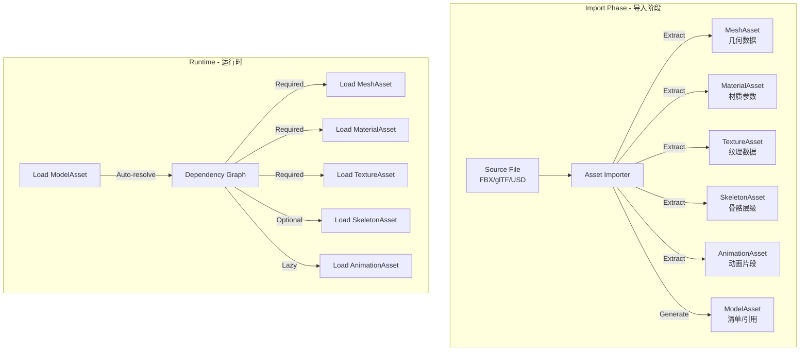
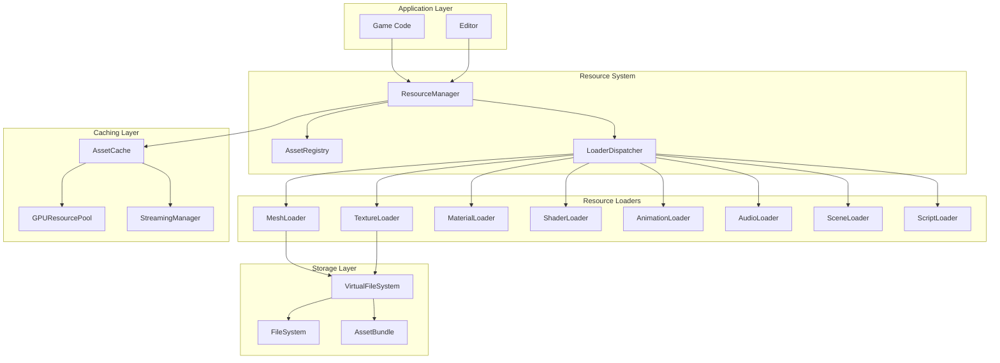
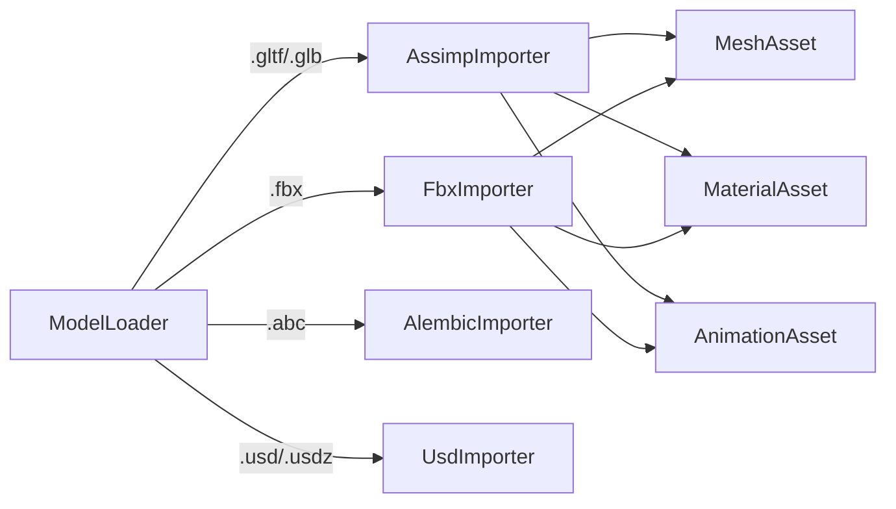
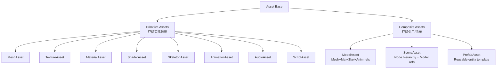
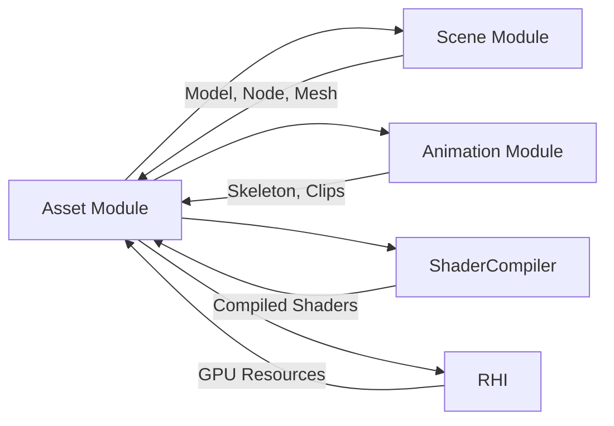

# Resource Management System Design

## Design Philosophy: Separated Storage + Composite Loading

**核心设计决策**：采用"分离存储 + 组合加载"的混合式架构



### Key Benefits

| 特性 | 说明 |

|------|------|

| **资源复用** | 多个角色共享同一动画/材质/纹理 |

| **按需加载** | 动画等可选资源延迟加载 |

| **精细内存管理** | 每种资源独立卸载 |

| **热重载** | 只重载变化的子资源 |

| **简洁API** | 用户只需 `Load<ModelAsset>("x.fbx")` |

### ModelAsset as Manifest

```cpp
// ModelAsset 不存储实际数据，只存储引用（清单）
class ModelAsset : public Asset {
public:
    // 必需组件 - 加载 Model 时自动加载
    AssetHandle<MeshAsset> mesh;
    std::vector<AssetHandle<MaterialAsset>> materials;
    
    // 可选组件 - 有骨骼时才加载
    AssetHandle<SkeletonAsset> skeleton;
    
    // 延迟加载 - 只存储ID，按需加载
    std::vector<AssetId> animationIds;
    
    // 便捷方法
    AssetHandle<AnimationAsset> LoadAnimation(const std::string& name);
    AssetHandle<AnimationAsset> LoadAnimation(size_t index);
    
    // 获取所有依赖
    std::vector<AssetId> GetRequiredDependencies() const override;
    std::vector<AssetId> GetOptionalDependencies() const override;
};
```

### Memory Efficiency Example

```
场景：100个士兵角色，3种动画，2种材质变体

整体式加载：
  100 × (Mesh + Materials + Animations) = 100 × 50MB = 5GB

分离式加载（共享资源）：
  1 × MeshAsset (30MB)
  2 × MaterialAsset (5MB each)
  3 × AnimationAsset (10MB each)
  100 × ModelAsset (引用只，~1KB each)
  = 30 + 10 + 30 + 0.1 = ~70MB

节省：98.6%
```

## Architecture Overview



## Module Structure

```
Asset/
  CMakeLists.txt
  Include/
    Asset/
      # ============ Core Framework ============
      Asset.h                    # Base asset class
      AssetHandle.h              # Smart handle with ref counting
      AssetId.h                  # Asset identification (GUID/hash)
      AssetRegistry.h            # Asset metadata registry
      AssetCache.h               # In-memory cache
      AssetLoader.h              # Loader interface
      ResourceManager.h          # Main facade API
      
      # ============ Loading & Streaming ============
      AsyncLoader.h              # Async loading queue with thread pool
      StreamingManager.h         # Mipmap/LOD streaming
      DependencyGraph.h          # Dependency tracking & resolution
      LoadingQueue.h             # Priority-based load queue
      
      # ============ Storage ============
      VirtualFileSystem.h        # Unified file access
      AssetBundle.h              # Packed asset format (.rvxpak)
      AssetDatabase.h            # Asset metadata DB (.rvxdb)
      FileWatcher.h              # File change detection
      
      # ============ Primitive Asset Types ============
      # 存储实际数据的资源类型
      Types/
        MeshAsset.h              # 几何数据
        TextureAsset.h           # 纹理数据
        MaterialAsset.h          # 材质参数 + 纹理引用
        ShaderAsset.h            # 编译后的着色器
        SkeletonAsset.h          # 骨骼层级
        AnimationAsset.h         # 动画片段
        AudioAsset.h             # 音频数据
        ScriptAsset.h            # 脚本代码
      
      # ============ Composite Asset Types ============
      # 存储引用/清单的资源类型
      Types/
        ModelAsset.h             # Mesh + Materials + Skeleton + Animations 引用
        SceneAsset.h             # Node hierarchy + Models 引用
        PrefabAsset.h            # 可复用的实体模板
      
      # ============ Loaders (Importers) ============
      Loaders/
        IAssetLoader.h           # Loader interface
        MeshLoader.h             # FBX, glTF, OBJ → MeshAsset
        TextureLoader.h          # PNG, JPG, DDS, KTX → TextureAsset
        MaterialLoader.h         # .mat files → MaterialAsset
        ShaderLoader.h           # HLSL → ShaderAsset (via ShaderCompiler)
        AnimationLoader.h        # FBX, glTF → AnimationAsset
        AudioLoader.h            # WAV, OGG, MP3 → AudioAsset
        SceneLoader.h            # .scene files → SceneAsset
        ModelLoader.h            # FBX, glTF → ModelAsset (orchestrates sub-loaders)
  
  Private/
    # Core implementations
    Asset.cpp
    AssetHandle.cpp
    AssetRegistry.cpp
    AssetCache.cpp
    ResourceManager.cpp
    
    # Loading
    AsyncLoader.cpp
    DependencyGraph.cpp
    StreamingManager.cpp
    
    # Storage
    VirtualFileSystem.cpp
    AssetBundle.cpp
    AssetDatabase.cpp
    FileWatcher.cpp
    
    # Asset types
    Types/
      MeshAsset.cpp
      TextureAsset.cpp
      MaterialAsset.cpp
      ...
    
    # Loaders
    Loaders/
      MeshLoader.cpp
      TextureLoader.cpp
      ...
      
    # Format-specific importers (from geometry importer migration)
    Importers/
      Assimp/
        AssimpImporter.cpp
        AssimpAnimationExtractor.cpp
        AssimpMaterialParser.cpp
      Fbx/
        FbxImporter.cpp
        FbxAnimationExtractor.cpp
        FbxMaterialParser.cpp
      Alembic/
        AlembicImporter.cpp
        AlembicAnimationExtractor.cpp
      Usd/
        UsdImporter.cpp
        UsdAnimationExtractor.cpp
        UsdMaterialConverter.cpp
```

### Loader vs Importer Distinction

| 组件 | 职责 | 示例 |

|------|------|------|

| **Loader** | 高层抽象，根据文件类型分发到Importer | `MeshLoader` 根据扩展名选择 Assimp/FBX/USD |

| **Importer** | 具体格式解析实现 | `AssimpImporter` 处理 glTF, OBJ, STL |

| **Extractor** | 从场景中提取特定数据 | `FbxAnimationExtractor` 提取骨骼动画 |



## Core Components

### 1. Asset Base Class

```cpp
// Asset.h
namespace RVX::Asset {

using AssetId = uint64_t;  // GUID or hash

enum class AssetState {
    Unloaded,
    Loading,
    Loaded,
    Failed,
    Unloading
};

enum class AssetType : uint32_t {
    Unknown = 0,
    Mesh,
    Texture,
    Material,
    Shader,
    Animation,
    Audio,
    Scene,
    Script,
    // Extensible...
};

class Asset : public RefCounted {
public:
    virtual ~Asset() = default;
    
    AssetId GetId() const { return m_id; }
    AssetType GetType() const { return m_type; }
    AssetState GetState() const { return m_state; }
    const std::string& GetPath() const { return m_path; }
    
    // Dependencies
    const std::vector<AssetId>& GetDependencies() const;
    
    // Memory
    virtual size_t GetMemoryUsage() const = 0;
    virtual size_t GetGPUMemoryUsage() const { return 0; }
    
protected:
    AssetId m_id{0};
    AssetType m_type{AssetType::Unknown};
    std::atomic<AssetState> m_state{AssetState::Unloaded};
    std::string m_path;
    std::vector<AssetId> m_dependencies;
};

} // namespace RVX::Asset
```

### 2. Asset Handle (Reference Counting)

```cpp
// AssetHandle.h
template<typename T>
class AssetHandle {
public:
    AssetHandle() = default;
    explicit AssetHandle(T* asset);
    AssetHandle(const AssetHandle& other);
    AssetHandle(AssetHandle&& other) noexcept;
    ~AssetHandle();
    
    // Access
    T* Get() const { return m_asset; }
    T* operator->() const { return m_asset; }
    T& operator*() const { return *m_asset; }
    
    // State
    bool IsValid() const { return m_asset != nullptr; }
    bool IsLoaded() const;
    AssetState GetState() const;
    
    // Async wait
    void WaitForLoad() const;
    bool TryWaitForLoad(uint32_t timeoutMs) const;
    
private:
    T* m_asset{nullptr};
};

// Type aliases
using MeshHandle = AssetHandle<MeshAsset>;
using TextureHandle = AssetHandle<TextureAsset>;
using MaterialHandle = AssetHandle<MaterialAsset>;
// ...
```

### 3. Resource Manager (Main API)

```cpp
// ResourceManager.h
class ResourceManager {
public:
    static ResourceManager& Get();
    
    // Synchronous loading
    template<typename T>
    AssetHandle<T> Load(const std::string& path);
    
    template<typename T>
    AssetHandle<T> Load(AssetId id);
    
    // Asynchronous loading
    template<typename T>
    std::future<AssetHandle<T>> LoadAsync(const std::string& path);
    
    template<typename T>
    void LoadAsync(const std::string& path, 
                   std::function<void(AssetHandle<T>)> callback);
    
    // Batch loading
    void LoadBatch(const std::vector<std::string>& paths,
                   std::function<void(float progress)> onProgress = nullptr,
                   std::function<void()> onComplete = nullptr);
    
    // Unloading
    void Unload(AssetId id);
    void UnloadUnused();  // GC pass
    
    // Hot reload
    void EnableHotReload(bool enable);
    void CheckForChanges();  // Poll file changes
    
    // Cache control
    void SetCacheLimit(size_t bytes);
    void ClearCache();
    
    // Statistics
    struct Stats {
        size_t totalAssets;
        size_t loadedAssets;
        size_t pendingLoads;
        size_t memoryUsage;
        size_t gpuMemoryUsage;
    };
    Stats GetStats() const;
    
private:
    std::unique_ptr<AssetRegistry> m_registry;
    std::unique_ptr<AssetCache> m_cache;
    std::unique_ptr<AsyncLoader> m_asyncLoader;
    std::unique_ptr<VirtualFileSystem> m_vfs;
    std::unordered_map<AssetType, std::unique_ptr<AssetLoader>> m_loaders;
};
```

### 4. Async Loading System

```cpp
// AsyncLoader.h
class AsyncLoader {
public:
    struct LoadRequest {
        AssetId id;
        std::string path;
        AssetType type;
        int priority{0};  // Higher = more urgent
        std::function<void(Asset*)> callback;
    };
    
    void Submit(LoadRequest request);
    void Cancel(AssetId id);
    void SetThreadCount(int count);
    
    // Process completed loads on main thread
    void ProcessCallbacks();
    
private:
    std::priority_queue<LoadRequest> m_queue;
    std::vector<std::thread> m_workers;
    ThreadSafeQueue<std::pair<AssetId, Asset*>> m_completed;
};
```

### 5. Dependency Graph

```cpp
// DependencyGraph.h
class DependencyGraph {
public:
    void AddAsset(AssetId id, const std::vector<AssetId>& dependencies);
    void RemoveAsset(AssetId id);
    
    // Get load order (topological sort)
    std::vector<AssetId> GetLoadOrder(AssetId rootId) const;
    
    // Get all assets that depend on this one
    std::vector<AssetId> GetDependents(AssetId id) const;
    
    // Check for circular dependencies
    bool HasCircularDependency(AssetId id) const;
    
private:
    std::unordered_map<AssetId, std::vector<AssetId>> m_dependencies;
    std::unordered_map<AssetId, std::vector<AssetId>> m_dependents;
};
```

### 6. Virtual File System

```cpp
// VirtualFileSystem.h
class VirtualFileSystem {
public:
    // Mount points
    void Mount(const std::string& virtualPath, 
               const std::string& physicalPath);
    void MountBundle(const std::string& virtualPath,
                     const std::string& bundlePath);
    void Unmount(const std::string& virtualPath);
    
    // File operations
    bool Exists(const std::string& path) const;
    std::vector<uint8_t> ReadFile(const std::string& path) const;
    std::unique_ptr<IStream> OpenStream(const std::string& path) const;
    
    // Directory operations
    std::vector<std::string> ListDirectory(const std::string& path) const;
    
    // Watch for changes (hot reload)
    void Watch(const std::string& path,
               std::function<void(const std::string&)> callback);
    void StopWatching(const std::string& path);
    
private:
    struct MountPoint {
        std::string virtualPath;
        std::unique_ptr<IFileProvider> provider;
    };
    std::vector<MountPoint> m_mounts;
};
```

### 7. Asset Bundle Format

```cpp
// AssetBundle.h
struct BundleHeader {
    char magic[4] = {'R','V','X','B'};
    uint32_t version;
    uint32_t assetCount;
    uint32_t tocOffset;      // Table of contents
    uint32_t dataOffset;
    uint32_t flags;          // Compression, encryption
};

struct BundleEntry {
    AssetId id;
    AssetType type;
    uint64_t offset;
    uint64_t compressedSize;
    uint64_t uncompressedSize;
    uint32_t checksum;
    char path[256];
};

class AssetBundle {
public:
    static AssetBundle* Open(const std::string& path);
    static void Create(const std::string& outputPath,
                       const std::vector<std::string>& assetPaths);
    
    std::vector<uint8_t> ReadAsset(AssetId id) const;
    bool Contains(AssetId id) const;
    std::vector<AssetId> GetAllAssetIds() const;
    
private:
    std::unique_ptr<IStream> m_stream;
    std::unordered_map<AssetId, BundleEntry> m_entries;
};
```

## Resource Type Implementations

### Asset Type Hierarchy



### Model Asset (Composite - 组合资源)

```cpp
class ModelAsset : public Asset {
public:
    // ========== 必需依赖 (Required Dependencies) ==========
    // 加载 ModelAsset 时自动加载这些资源
    
    AssetHandle<MeshAsset> GetMesh() const { return m_mesh; }
    const std::vector<AssetHandle<MaterialAsset>>& GetMaterials() const { return m_materials; }
    
    // ========== 可选依赖 (Optional Dependencies) ==========
    // 存在时加载，不存在时为空
    
    bool HasSkeleton() const { return m_skeleton.IsValid(); }
    AssetHandle<SkeletonAsset> GetSkeleton() const { return m_skeleton; }
    
    // ========== 延迟加载 (Lazy Loading) ==========
    // 只存储ID，用户请求时才加载
    
    size_t GetAnimationCount() const { return m_animationIds.size(); }
    std::string GetAnimationName(size_t index) const;
    
    // 按需加载动画
    AssetHandle<AnimationAsset> LoadAnimation(size_t index);
    AssetHandle<AnimationAsset> LoadAnimation(const std::string& name);
    
    // 预加载所有动画
    void PreloadAllAnimations();
    
    // ========== 材质覆盖 (Material Override) ==========
    // 运行时替换材质，不影响原始资源
    
    void SetMaterialOverride(size_t slot, AssetHandle<MaterialAsset> material);
    void ClearMaterialOverrides();
    
    // ========== 依赖查询 ==========
    
    std::vector<AssetId> GetRequiredDependencies() const override {
        std::vector<AssetId> deps;
        deps.push_back(m_mesh.GetId());
        for (const auto& mat : m_materials) {
            deps.push_back(mat.GetId());
        }
        return deps;
    }
    
    std::vector<AssetId> GetOptionalDependencies() const override {
        std::vector<AssetId> deps;
        if (m_skeleton.IsValid()) {
            deps.push_back(m_skeleton.GetId());
        }
        deps.insert(deps.end(), m_animationIds.begin(), m_animationIds.end());
        return deps;
    }
    
private:
    // 必需
    AssetHandle<MeshAsset> m_mesh;
    std::vector<AssetHandle<MaterialAsset>> m_materials;
    
    // 可选
    AssetHandle<SkeletonAsset> m_skeleton;
    
    // 延迟加载
    std::vector<AssetId> m_animationIds;
    std::vector<std::string> m_animationNames;
    std::unordered_map<size_t, AssetHandle<AnimationAsset>> m_loadedAnimations;
    
    // 运行时覆盖
    std::unordered_map<size_t, AssetHandle<MaterialAsset>> m_materialOverrides;
};
```

### Mesh Asset (Primitive - 原始资源)

```cpp
class MeshAsset : public Asset {
public:
    // CPU 数据
    std::shared_ptr<Mesh> GetMesh() const { return m_mesh; }
    
    // GPU 资源 (延迟创建)
    RHI::BufferHandle GetVertexBuffer();
    RHI::BufferHandle GetIndexBuffer();
    
    // LOD 支持
    int GetLODCount() const;
    std::shared_ptr<Mesh> GetLOD(int level) const;
    void SetLODBias(float bias);
    
    // 边界
    const BoundingBox& GetBounds() const;
    
    // 内存统计
    size_t GetMemoryUsage() const override;
    size_t GetGPUMemoryUsage() const override;
    
    // GPU 资源管理
    void UploadToGPU(RHI::Device* device);
    void ReleaseGPUResources();
    bool IsGPUResident() const;
    
private:
    std::shared_ptr<Mesh> m_mesh;
    std::vector<std::shared_ptr<Mesh>> m_lods;
    BoundingBox m_bounds;
    
    // GPU 资源 (惰性创建)
    RHI::BufferHandle m_vertexBuffer;
    RHI::BufferHandle m_indexBuffer;
    bool m_gpuDirty{true};
};
```

### Material Asset (Primitive - 原始资源)

```cpp
class MaterialAsset : public Asset {
public:
    // 基础属性
    const std::string& GetName() const;
    MaterialType GetMaterialType() const;  // PBR, Unlit, Custom
    
    // 纹理引用 (自动作为依赖)
    AssetHandle<TextureAsset> GetTexture(TextureSlot slot) const;
    void SetTexture(TextureSlot slot, AssetHandle<TextureAsset> texture);
    
    // 参数
    Vec4 GetParameter(const std::string& name) const;
    void SetParameter(const std::string& name, const Vec4& value);
    
    // Shader 引用
    AssetHandle<ShaderAsset> GetShader() const;
    
    // GPU 资源
    RHI::PipelineStateHandle GetPipelineState(const RenderPassInfo& passInfo);
    
    // 依赖
    std::vector<AssetId> GetRequiredDependencies() const override {
        std::vector<AssetId> deps;
        for (const auto& [slot, tex] : m_textures) {
            if (tex.IsValid()) deps.push_back(tex.GetId());
        }
        if (m_shader.IsValid()) deps.push_back(m_shader.GetId());
        return deps;
    }
    
private:
    std::string m_name;
    MaterialType m_type{MaterialType::PBR};
    
    std::unordered_map<TextureSlot, AssetHandle<TextureAsset>> m_textures;
    std::unordered_map<std::string, Vec4> m_parameters;
    AssetHandle<ShaderAsset> m_shader;
};
```

### Texture Asset (Primitive - 原始资源)

```cpp
class TextureAsset : public Asset {
public:
    // GPU 纹理
    RHI::TextureHandle GetTexture() const { return m_texture; }
    
    // 元数据
    uint32_t GetWidth() const;
    uint32_t GetHeight() const;
    RHI::Format GetFormat() const;
    uint32_t GetMipLevels() const;
    bool IsCubemap() const;
    bool IsArray() const;
    
    // Mipmap 流式加载
    bool IsStreaming() const;
    void RequestMipLevel(int level);
    int GetResidentMipLevel() const;
    int GetRequestedMipLevel() const;
    
    // 内存
    size_t GetMemoryUsage() const override { return 0; }  // CPU已释放
    size_t GetGPUMemoryUsage() const override;
    
private:
    RHI::TextureHandle m_texture;
    TextureMetadata m_metadata;
    
    // 流式加载状态
    int m_residentMipLevel{0};
    int m_requestedMipLevel{0};
};
```

### Skeleton Asset (Primitive - 原始资源)

```cpp
class SkeletonAsset : public Asset {
public:
    // 骨骼数据
    const Animation::Skeleton& GetSkeleton() const { return *m_skeleton; }
    
    // 查询
    int GetBoneCount() const;
    int FindBoneIndex(const std::string& name) const;
    const std::string& GetBoneName(int index) const;
    
    // 绑定姿态
    const Mat4& GetBindPose(int boneIndex) const;
    const Mat4& GetInverseBindPose(int boneIndex) const;
    
    size_t GetMemoryUsage() const override;
    
private:
    std::shared_ptr<Animation::Skeleton> m_skeleton;
};
```

### Animation Asset (Primitive - 原始资源)

```cpp
class AnimationAsset : public Asset {
public:
    // 动画数据
    const Animation::AnimationClip& GetClip() const { return *m_clip; }
    
    // 元数据
    const std::string& GetName() const;
    float GetDuration() const;  // 秒
    float GetFrameRate() const;
    int GetFrameCount() const;
    
    // 兼容性检查
    bool IsCompatibleWith(const SkeletonAsset& skeleton) const;
    
    size_t GetMemoryUsage() const override;
    
private:
    std::shared_ptr<Animation::AnimationClip> m_clip;
};
```

### Scene Asset (Composite - 组合资源)

```cpp
class SceneAsset : public Asset {
public:
    // 场景层级
    std::shared_ptr<Node> GetRootNode() const { return m_rootNode; }
    
    // 包含的模型引用
    const std::vector<AssetHandle<ModelAsset>>& GetModels() const;
    
    // 场景设置
    const SceneSettings& GetSettings() const;  // 光照、天空盒等
    
    // 实例化
    std::shared_ptr<Node> Instantiate() const;  // 创建副本
    
    std::vector<AssetId> GetRequiredDependencies() const override;
    
private:
    std::shared_ptr<Node> m_rootNode;
    std::vector<AssetHandle<ModelAsset>> m_models;
    SceneSettings m_settings;
};
```

## Implementation Phases

### Phase 1: Core Framework (基础架构)

**目标**：建立资源系统的核心骨架

- `Asset` 基类 + 引用计数 (利用现有 `Core/RefCounted.h`)
- `AssetHandle<T>` 智能句柄
- `AssetId` 生成 (路径哈希 + GUID)
- `AssetRegistry` 元数据注册表
- `AssetCache` 内存缓存 (LRU策略)
- `ResourceManager` 单例门面
- `VirtualFileSystem` 统一文件访问 (仅文件系统)
- `IAssetLoader` 接口定义

**产出文件**：

- `Asset/Include/Asset/Asset.h`
- `Asset/Include/Asset/AssetHandle.h`
- `Asset/Include/Asset/AssetRegistry.h`
- `Asset/Include/Asset/AssetCache.h`
- `Asset/Include/Asset/ResourceManager.h`
- `Asset/Include/Asset/VirtualFileSystem.h`

### Phase 2: First Primitive Assets (首批原始资源)

**目标**：实现最常用的资源类型

- `TextureAsset` + `TextureLoader` (PNG, JPG, DDS)
- `MeshAsset` + `MeshLoader` (集成现有 Scene 模块)
- `MaterialAsset` + `MaterialLoader`
- `ShaderAsset` + `ShaderLoader` (集成 ShaderCompiler 模块)

**集成**：

- 利用现有 `Scene/Mesh.h`
- 利用现有 `Scene/Material.h`
- 利用现有 `ShaderCompiler/ShaderCompiler.h`

### Phase 3: Model Composite Asset (模型组合资源)

**目标**：实现分离存储+组合加载的核心

- `ModelAsset` (清单资源)
- `ModelLoader` (协调子加载器)
- `DependencyGraph` 依赖图
- 自动依赖解析
- 延迟加载机制 (动画)

**关键实现**：

```cpp
// 加载 ModelAsset 时自动触发依赖链
Load<ModelAsset>("x.fbx")
  → ModelLoader.Load()
    → 解析FBX获取子资源ID
    → DependencyGraph.GetLoadOrder()
    → 并行加载 MeshAsset, MaterialAsset[], TextureAsset[]
    → 组装 ModelAsset
```

### Phase 4: Geometry Importers (几何导入器)

**目标**：迁移现有导入器到资源系统

- Assimp 导入器 (glTF, GLB, OBJ, STL)
- FBX 导入器 (需要 FBX SDK)
- Alembic 导入器 (ABC)
- USD 导入器 (USD/USDZ)

**迁移来源**：`D:\Work\found\src\renderer\resouce\importer\geometry\`

### Phase 5: Animation & Skeleton Assets (动画资源)

**目标**：完善动画支持

- `SkeletonAsset` + `SkeletonLoader`
- `AnimationAsset` + `AnimationLoader`
- Animation Extractors 集成
- 延迟加载动画验证

**集成**：利用现有 `Animation` 模块

### Phase 6: Async Loading (异步加载)

**目标**：支持非阻塞资源加载

- `AsyncLoader` 线程池
- 优先级加载队列
- 回调系统
- 进度追踪
- 批量加载

### Phase 7: Scene & Prefab Assets (场景资源)

**目标**：支持复杂场景

- `SceneAsset` (节点层级 + 模型引用)
- `PrefabAsset` (可复用模板)
- `SceneLoader`
- 场景序列化/反序列化

### Phase 8: Advanced Features (高级功能)

**目标**：生产级功能

- `FileWatcher` 文件监控
- 热重载系统
- `AssetBundle` 打包/解包
- 纹理 Mipmap 流式加载
- 内存预算管理
- `AudioAsset` + `ScriptAsset`

### Phase Summary

| Phase | 内容 | 依赖 | 预计工作量 |

|-------|------|------|-----------|

| 1 | Core Framework | - | 中 |

| 2 | Primitive Assets | Phase 1, Scene模块 | 中 |

| 3 | ModelAsset | Phase 2 | 中 |

| 4 | Geometry Importers | Phase 3 | 大 |

| 5 | Animation Assets | Phase 3, Animation模块 | 中 |

| 6 | Async Loading | Phase 1-3 | 中 |

| 7 | Scene Assets | Phase 3 | 中 |

| 8 | Advanced Features | All | 大 |

## Integration with Existing Modules



## Usage Examples

### Basic Loading (Hybrid Approach)

```cpp
// 加载模型 - 自动解析并加载所有必需依赖 (mesh, materials, textures)
auto model = ResourceManager::Get().Load<ModelAsset>("models/character.fbx");

// 访问子资源 - 已自动加载
auto mesh = model->GetMesh();
auto materials = model->GetMaterials();
auto skeleton = model->GetSkeleton();  // 如果存在

// 渲染
renderer->DrawMesh(mesh->GetVertexBuffer(), mesh->GetIndexBuffer(), materials);
```

### Lazy Animation Loading

```cpp
// 模型加载时动画不会自动加载
auto model = ResourceManager::Get().Load<ModelAsset>("models/character.fbx");

// 查看可用动画
for (size_t i = 0; i < model->GetAnimationCount(); ++i) {
    LOG_INFO("Animation {}: {}", i, model->GetAnimationName(i));
}

// 需要时才加载动画
auto walkAnim = model->LoadAnimation("walk");
auto runAnim = model->LoadAnimation("run");

// 使用动画
animator->Play(walkAnim);
animator->CrossFade(runAnim, 0.3f);
```

### Resource Sharing

```cpp
// 100个士兵共享同一模型资源
std::vector<Entity> soldiers;
auto soldierModel = ResourceManager::Get().Load<ModelAsset>("models/soldier.fbx");

for (int i = 0; i < 100; ++i) {
    Entity soldier;
    soldier.model = soldierModel;  // 共享引用，不复制数据
    soldier.transform = RandomTransform();
    soldiers.push_back(soldier);
}

// 内存中只有 1 份 mesh、material、texture 数据
```

### Material Override

```cpp
auto model = ResourceManager::Get().Load<ModelAsset>("models/car.fbx");

// 创建材质变体 - 红色车
auto redPaint = ResourceManager::Get().Load<MaterialAsset>("materials/red_paint.mat");
model->SetMaterialOverride(0, redPaint);

// 另一辆车 - 蓝色
auto blueCarModel = ResourceManager::Get().Load<ModelAsset>("models/car.fbx");
auto bluePaint = ResourceManager::Get().Load<MaterialAsset>("materials/blue_paint.mat");
blueCarModel->SetMaterialOverride(0, bluePaint);

// 两辆车共享相同的 mesh，但使用不同的材质
```

### Async Loading with Progress

```cpp
// 异步加载 - 适合大型资源
ResourceManager::Get().LoadAsync<ModelAsset>("models/huge_building.fbx",
    [](AssetHandle<ModelAsset> model) {
        if (model.IsValid()) {
            scene->AddModel(model);
        }
    });

// 批量加载场景资源
std::vector<std::string> levelAssets = {
    "models/terrain.fbx",
    "models/buildings.fbx",
    "models/vegetation.fbx",
    "textures/skybox.hdr"
};

ResourceManager::Get().LoadBatch(levelAssets,
    [](float progress) {
        loadingUI->SetProgress(progress);
        loadingUI->SetText(fmt::format("Loading... {:.0f}%", progress * 100));
    },
    []() {
        loadingUI->Hide();
        gameState->StartLevel();
    }
);
```

### Hot Reload (Editor Mode)

```cpp
// 启用热重载
ResourceManager::Get().EnableHotReload(true);

// 游戏循环中检查文件变化
void EditorUpdate() {
    ResourceManager::Get().CheckForChanges();
    // 修改磁盘上的纹理/材质/shader后，自动重新加载
}

// 监听特定资源变化
ResourceManager::Get().OnAssetReloaded([](AssetId id, Asset* asset) {
    if (asset->GetType() == AssetType::Shader) {
        LOG_INFO("Shader reloaded: {}", asset->GetPath());
        renderer->InvalidatePipelines();
    }
});
```

### Direct Sub-Asset Access

```cpp
// 也可以直接加载子资源，用于高级用例

// 直接加载纹理
auto texture = ResourceManager::Get().Load<TextureAsset>("textures/grass_albedo.png");

// 直接加载材质
auto material = ResourceManager::Get().Load<MaterialAsset>("materials/water.mat");

// 直接加载动画（用于共享动画库）
auto genericWalk = ResourceManager::Get().Load<AnimationAsset>("animations/generic_walk.anim");

// 应用到任何兼容骨骼的模型
if (genericWalk->IsCompatibleWith(*model->GetSkeleton())) {
    animator->Play(genericWalk);
}
```

### Memory Management

```cpp
// 获取内存统计
auto stats = ResourceManager::Get().GetStats();
LOG_INFO("Assets: {}/{} loaded", stats.loadedAssets, stats.totalAssets);
LOG_INFO("CPU Memory: {} MB", stats.memoryUsage / (1024 * 1024));
LOG_INFO("GPU Memory: {} MB", stats.gpuMemoryUsage / (1024 * 1024));

// 设置内存预算
ResourceManager::Get().SetCacheLimit(512 * 1024 * 1024);  // 512 MB

// 卸载未使用的资源 (引用计数为0)
ResourceManager::Get().UnloadUnused();

// 强制卸载特定资源
ResourceManager::Get().Unload(model->GetId());
```