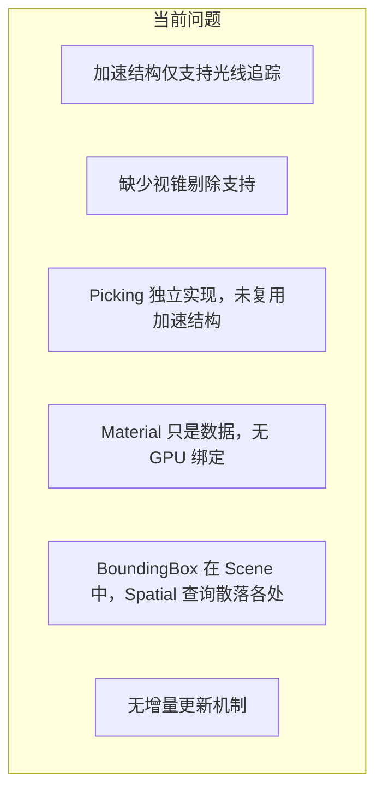
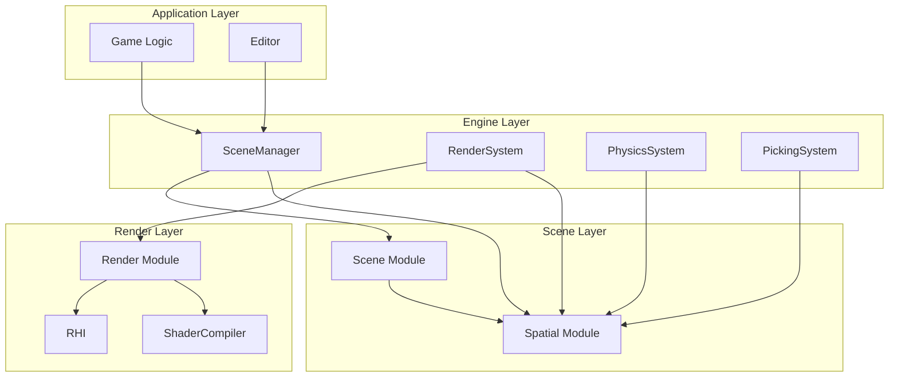
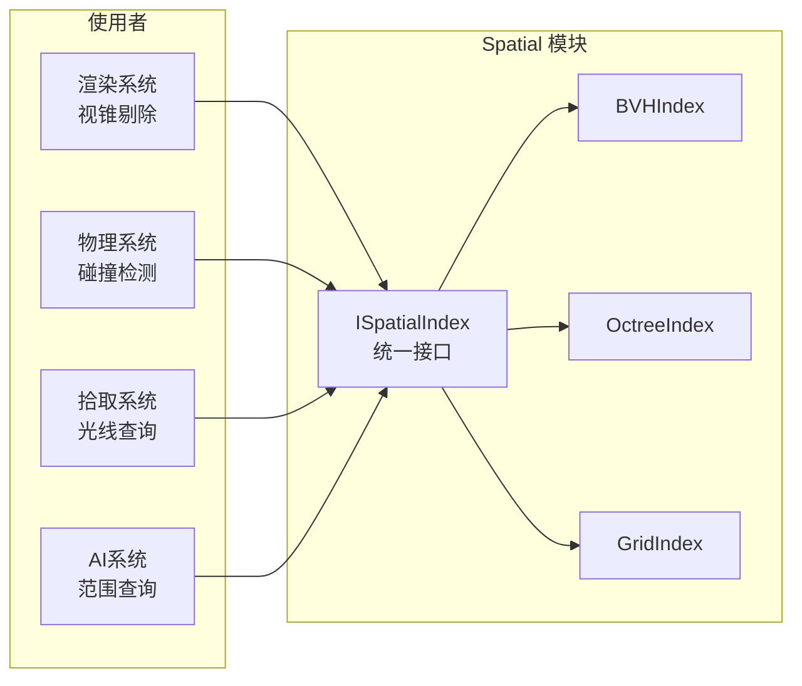
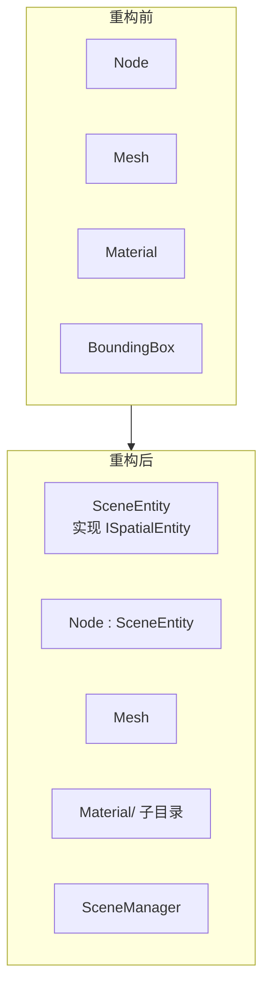
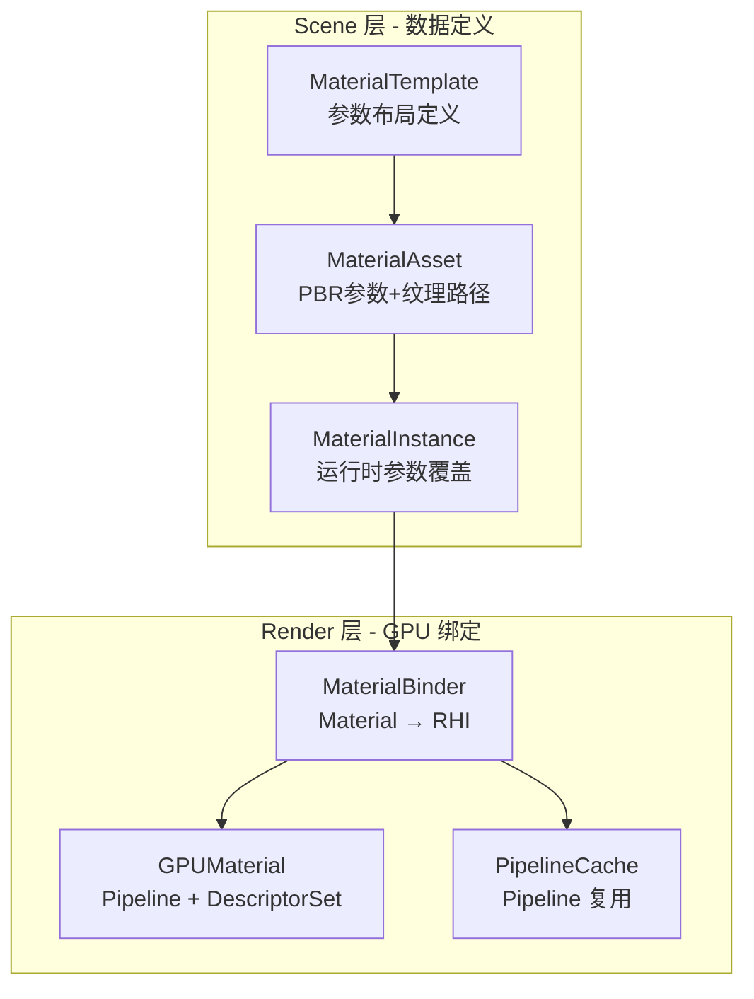
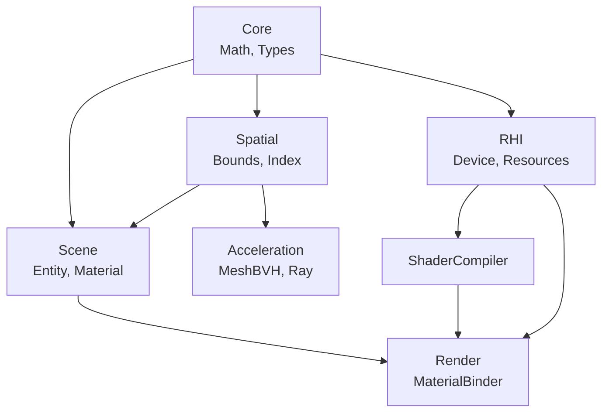

# Unified Scene and Spatial System Design

## 1. 概述与设计目标

本文档描述 RenderVerseX 引擎的统一场景结构、空间加速结构和材质系统的设计方案。

### 1.1 设计目标

| 目标 | 说明 |
|------|------|
| **统一场景表示** | 所有可渲染对象使用统一的实体模型 |
| **可插拔加速结构** | BVH/Octree/Grid 可互换，场景层不感知具体实现 |
| **高效空间查询** | 视锥剔除、光线拾取、范围查询使用同一套 API |
| **增量更新** | 动态场景无需全量重建加速结构 |
| **材质数据分离** | 材质定义与 GPU 绑定分离，便于序列化和编辑 |

### 1.2 核心设计原则

1. **分层解耦** - 场景表示、空间索引、GPU 绑定各司其职
2. **接口抽象** - 通过接口隔离具体实现，便于扩展和测试
3. **语义内聚** - 相关概念放在同一模块，避免碎片化
4. **渐进式实现** - 先实现核心功能，后续逐步完善

---

## 2. 当前架构分析

### 2.1 现有模块结构

```
RenderVerseX/
├── Scene/                  # 场景表示
│   ├── Node.h              # 场景图节点 + Transform + 组件系统
│   ├── Mesh.h              # 几何数据
│   ├── Material.h          # PBR 材质数据
│   ├── Model.h             # 场景容器
│   └── BoundingBox.h       # AABB
│
├── Acceleration/           # 加速结构（光线追踪专用）
│   ├── BVH.h               # MeshBVH + SceneBVH
│   ├── Ray.h               # 光线定义
│   └── Intersection.h      # 相交算法
│
├── Render/                 # 渲染服务
│   └── RenderService.h     # 基础渲染服务
│
└── Picking/                # 拾取系统
    └── PickingSystem.h     # 独立实现
```

### 2.2 现有问题



| 问题 | 影响 |
|------|------|
| 加速结构仅用于光线追踪 | 视锥剔除需要另写，代码重复 |
| 无统一空间查询接口 | 每个系统（渲染、物理、拾取）各自实现 |
| Material 与 RHI 断层 | Samples 直接操作 Shader/Pipeline |
| 静态构建 | 动态场景需要完全重建 |

---

## 3. 整体架构设计

### 3.1 模块总览



### 3.2 模块职责

| 模块 | 职责 | 主要类 |
|------|------|--------|
| **Scene** | 场景实体、组件、材质数据 | SceneEntity, Node, Mesh, MaterialAsset |
| **Spatial** | 边界体积、空间索引、查询接口 | ISpatialIndex, BVHIndex, Frustum |
| **Render** | 材质绑定、渲染管线、GPU 资源 | MaterialBinder, RenderList |
| **Acceleration** | 光线追踪专用（三角形级 BVH） | MeshBVH, Ray, Intersection |

---

## 4. Spatial 模块设计（新增）

### 4.1 设计理念

Spatial 模块提供**统一的空间查询能力**，供渲染、物理、拾取等系统使用。



### 4.2 文件结构

```
Spatial/                            # NEW MODULE
├── CMakeLists.txt
├── Include/Spatial/
│   ├── Spatial.h                   # 统一头文件
│   │
│   ├── Bounds/                     # 边界体积
│   │   ├── BoundingBox.h           # AABB（从 Scene 移入）
│   │   ├── BoundingSphere.h        # 包围球
│   │   ├── Frustum.h               # 视锥体
│   │   ├── OrientedBox.h           # OBB
│   │   └── BoundsTests.h           # 相交测试函数
│   │
│   ├── Query/                      # 查询定义
│   │   ├── SpatialQuery.h          # 查询类型、过滤器、结果
│   │   └── QueryFilter.h           # 层级/类型过滤
│   │
│   ├── Index/                      # 空间索引
│   │   ├── ISpatialIndex.h         # 核心抽象接口
│   │   ├── BVHIndex.h              # BVH 实现
│   │   ├── OctreeIndex.h           # 八叉树实现
│   │   ├── GridIndex.h             # 均匀网格实现
│   │   └── SpatialFactory.h        # 工厂创建
│   │
│   └── Debug/
│       └── SpatialDebug.h          # 调试可视化
│
└── Private/
    ├── Bounds/
    │   ├── BoundingSphere.cpp
    │   ├── Frustum.cpp
    │   └── BoundsTests.cpp
    │
    └── Index/
        ├── BVHIndex.cpp
        ├── OctreeIndex.cpp
        ├── GridIndex.cpp
        └── SpatialFactory.cpp
```

### 4.3 核心接口

#### 4.3.1 ISpatialIndex - 空间索引抽象

```cpp
// Spatial/Include/Spatial/Index/ISpatialIndex.h

namespace RVX::Spatial
{
    // 查询结果
    struct QueryResult
    {
        EntityHandle handle;
        float distance;         // 光线查询时的距离
        float sortKey;          // 排序键
    };

    // 索引统计
    struct IndexStats
    {
        size_t entityCount;
        size_t nodeCount;
        size_t memoryBytes;
        int maxDepth;
        float avgEntitiesPerLeaf;
    };

    // 空间索引接口
    class ISpatialIndex
    {
    public:
        virtual ~ISpatialIndex() = default;

        // =====================================================================
        // 构建与更新
        // =====================================================================
        
        // 完全重建
        virtual void Build(std::span<ISpatialEntity*> entities) = 0;
        
        // 增量操作
        virtual void Insert(ISpatialEntity* entity) = 0;
        virtual void Remove(EntityHandle handle) = 0;
        virtual void Update(ISpatialEntity* entity) = 0;
        virtual void Commit() = 0;  // 提交批量更新

        // =====================================================================
        // 查询
        // =====================================================================
        
        // 视锥剔除
        virtual void QueryFrustum(
            const Frustum& frustum,
            const QueryFilter& filter,
            std::vector<QueryResult>& outResults) const = 0;

        // 包围盒查询
        virtual void QueryBox(
            const BoundingBox& box,
            const QueryFilter& filter,
            std::vector<QueryResult>& outResults) const = 0;

        // 球形范围查询
        virtual void QuerySphere(
            const Vec3& center, float radius,
            const QueryFilter& filter,
            std::vector<QueryResult>& outResults) const = 0;

        // 光线查询（最近）
        virtual bool QueryRay(
            const Ray& ray,
            const QueryFilter& filter,
            QueryResult& outResult) const = 0;

        // 光线查询（全部）
        virtual void QueryRayAll(
            const Ray& ray,
            const QueryFilter& filter,
            std::vector<QueryResult>& outResults) const = 0;

        // =====================================================================
        // 调试
        // =====================================================================
        
        virtual IndexStats GetStats() const = 0;
        virtual void DebugDraw(IDebugRenderer* renderer) const = 0;
    };
}
```

#### 4.3.2 ISpatialEntity - 可索引实体接口

```cpp
// Spatial/Include/Spatial/ISpatialEntity.h

namespace RVX::Spatial
{
    // 任何想被空间索引的对象需实现此接口
    class ISpatialEntity
    {
    public:
        using Handle = uint32_t;
        static constexpr Handle InvalidHandle = ~0u;

        virtual ~ISpatialEntity() = default;

        // 唯一标识
        virtual Handle GetHandle() const = 0;

        // 世界空间边界
        virtual BoundingBox GetWorldBounds() const = 0;

        // 过滤属性
        virtual uint32_t GetLayerMask() const { return ~0u; }
        virtual uint32_t GetTypeMask() const { return ~0u; }

        // 脏标记
        virtual bool IsSpatialDirty() const = 0;
        virtual void ClearSpatialDirty() = 0;
    };
}
```

#### 4.3.3 QueryFilter - 查询过滤器

```cpp
// Spatial/Include/Spatial/Query/QueryFilter.h

namespace RVX::Spatial
{
    struct QueryFilter
    {
        uint32_t layerMask = ~0u;    // 层级掩码
        uint32_t typeMask = ~0u;     // 类型掩码
        
        // 自定义过滤回调
        std::function<bool(ISpatialEntity*)> customFilter = nullptr;

        // 便捷构造
        static QueryFilter All() { return {}; }
        static QueryFilter Layer(uint32_t layer) { return {1u << layer, ~0u}; }
        static QueryFilter Type(uint32_t type) { return {~0u, 1u << type}; }
    };
}
```

### 4.4 边界体积

#### 4.4.1 BoundingBox（从 Scene 移入）

保持现有 `BoundingBox` 实现，移动到 `Spatial/Bounds/`。

#### 4.4.2 Frustum - 视锥体

```cpp
// Spatial/Include/Spatial/Bounds/Frustum.h

namespace RVX::Spatial
{
    class Frustum
    {
    public:
        // 从 VP 矩阵构造
        void ExtractFromMatrix(const Mat4& viewProj);
        
        // 从相机参数构造
        void SetPerspective(const Vec3& position, const Vec3& forward,
                           const Vec3& up, float fovY, float aspect,
                           float nearZ, float farZ);

        // 测试
        bool Contains(const Vec3& point) const;
        bool Intersects(const BoundingBox& box) const;
        bool Intersects(const BoundingSphere& sphere) const;

        // 获取平面
        const Plane& GetPlane(int index) const;  // 0-5: Near, Far, Left, Right, Top, Bottom

    private:
        std::array<Plane, 6> m_planes;
        std::array<Vec3, 8> m_corners;  // 可选，用于精确测试
    };
}
```

### 4.5 具体索引实现

#### 4.5.1 BVHIndex

```cpp
// Spatial/Include/Spatial/Index/BVHIndex.h

namespace RVX::Spatial
{
    struct BVHConfig
    {
        int maxLeafSize = 4;
        int sahBuckets = 12;
        float traversalCost = 1.0f;
        float intersectionCost = 1.0f;
    };

    class BVHIndex : public ISpatialIndex
    {
    public:
        explicit BVHIndex(const BVHConfig& config = {});

        void Build(std::span<ISpatialEntity*> entities) override;
        void Insert(ISpatialEntity* entity) override;
        void Remove(EntityHandle handle) override;
        void Update(ISpatialEntity* entity) override;
        void Commit() override;

        void QueryFrustum(...) const override;
        void QueryBox(...) const override;
        void QuerySphere(...) const override;
        bool QueryRay(...) const override;
        void QueryRayAll(...) const override;

        IndexStats GetStats() const override;
        void DebugDraw(IDebugRenderer* renderer) const override;

    private:
        struct Node { /* bounds, children, primitives */ };
        
        std::vector<Node> m_nodes;
        std::vector<ISpatialEntity*> m_entities;
        std::unordered_map<EntityHandle, size_t> m_entityIndex;
        
        BVHConfig m_config;
        
        // 增量更新缓冲
        std::vector<ISpatialEntity*> m_pendingInserts;
        std::vector<EntityHandle> m_pendingRemoves;
        bool m_needsRebuild = false;
    };
}
```

#### 4.5.2 OctreeIndex

```cpp
// Spatial/Include/Spatial/Index/OctreeIndex.h

namespace RVX::Spatial
{
    struct OctreeConfig
    {
        BoundingBox worldBounds;        // 世界边界
        int maxDepth = 8;               // 最大深度
        int maxEntitiesPerNode = 16;    // 每节点最大实体数
        float looseness = 1.0f;         // 松散系数（1.0=标准, 2.0=松散）
    };

    class OctreeIndex : public ISpatialIndex
    {
    public:
        explicit OctreeIndex(const OctreeConfig& config);
        
        // ISpatialIndex implementation...

    private:
        struct Node
        {
            BoundingBox bounds;
            BoundingBox looseBounds;
            std::array<std::unique_ptr<Node>, 8> children;
            std::vector<ISpatialEntity*> entities;
            int depth;
        };

        std::unique_ptr<Node> m_root;
        std::unordered_map<EntityHandle, Node*> m_entityLocation;
        OctreeConfig m_config;
    };
}
```

---

## 5. Scene 模块重构

### 5.1 设计变更



### 5.2 文件结构

```
Scene/
├── CMakeLists.txt
├── Include/Scene/
│   ├── Scene.h                     # 统一头文件
│   │
│   ├── SceneManager.h              # NEW: 场景管理器
│   ├── SceneEntity.h               # NEW: 实体基类
│   │
│   ├── Node.h                      # 重构: 继承 SceneEntity
│   ├── Transform.h                 # 分离: 从 Node 中提取
│   ├── Model.h                     # 保持
│   │
│   ├── Components/                 # 组件
│   │   ├── Component.h             # 组件基类
│   │   ├── MeshComponent.h         # 网格组件
│   │   ├── LightComponent.h        # 光源组件
│   │   └── CameraComponent.h       # 相机组件
│   │
│   ├── Mesh.h                      # 保持
│   ├── VertexAttribute.h           # 保持
│   │
│   └── Material/                   # 材质子系统
│       ├── MaterialTypes.h         # 枚举和参数类型
│       ├── MaterialAsset.h         # 材质资产（原 Material.h）
│       ├── MaterialTemplate.h      # 材质模板
│       └── MaterialInstance.h      # 材质实例
│
└── Private/
    ├── SceneManager.cpp
    ├── SceneEntity.cpp
    ├── Node.cpp
    ├── Transform.cpp
    ├── Model.cpp
    ├── Mesh.cpp
    └── Material/
        ├── MaterialAsset.cpp
        ├── MaterialTemplate.cpp
        └── MaterialInstance.cpp
```

### 5.3 核心接口

#### 5.3.1 SceneEntity - 场景实体基类

```cpp
// Scene/Include/Scene/SceneEntity.h

namespace RVX
{
    // 实体类型
    enum class EntityType : uint8_t
    {
        Node = 0,
        StaticMesh,
        SkeletalMesh,
        Light,
        Camera,
        Probe,
        Decal,
        Custom
    };

    // 场景实体基类，实现空间索引接口
    class SceneEntity : public Spatial::ISpatialEntity
    {
    public:
        using Handle = uint32_t;
        using Ptr = std::shared_ptr<SceneEntity>;

        explicit SceneEntity(const std::string& name = "Entity");
        virtual ~SceneEntity() = default;

        // =====================================================================
        // 基础属性
        // =====================================================================
        
        Handle GetHandle() const override { return m_handle; }
        const std::string& GetName() const { return m_name; }
        void SetName(const std::string& name) { m_name = name; }

        virtual EntityType GetEntityType() const { return EntityType::Node; }

        bool IsActive() const { return m_active; }
        void SetActive(bool active) { m_active = active; }

        // =====================================================================
        // 变换
        // =====================================================================
        
        Transform& GetTransform() { return m_transform; }
        const Transform& GetTransform() const { return m_transform; }

        virtual Mat4 GetWorldMatrix() const;
        virtual Vec3 GetWorldPosition() const;

        // =====================================================================
        // ISpatialEntity 实现
        // =====================================================================
        
        BoundingBox GetWorldBounds() const override;
        uint32_t GetLayerMask() const override { return m_layerMask; }
        uint32_t GetTypeMask() const override { return 1u << static_cast<uint8_t>(GetEntityType()); }

        bool IsSpatialDirty() const override { return m_spatialDirty; }
        void ClearSpatialDirty() override { m_spatialDirty = false; }

        // =====================================================================
        // 边界
        // =====================================================================
        
        void SetLocalBounds(const BoundingBox& bounds) { m_localBounds = bounds; }
        const BoundingBox& GetLocalBounds() const { return m_localBounds; }

    protected:
        void MarkSpatialDirty() { m_spatialDirty = true; }

    private:
        Handle m_handle;
        std::string m_name;
        bool m_active = true;
        uint32_t m_layerMask = ~0u;

        Transform m_transform;
        BoundingBox m_localBounds;
        mutable bool m_spatialDirty = true;

        static Handle GenerateHandle();
    };
}
```

#### 5.3.2 SceneManager - 场景管理器

```cpp
// Scene/Include/Scene/SceneManager.h

namespace RVX
{
    class SceneManager
    {
    public:
        SceneManager();
        ~SceneManager();

        // =====================================================================
        // 初始化
        // =====================================================================
        
        void Initialize(const SceneConfig& config = {});
        void Shutdown();

        // =====================================================================
        // 实体管理
        // =====================================================================
        
        SceneEntity::Handle CreateEntity(const std::string& name = "Entity");
        
        template<typename T, typename... Args>
        T* CreateEntity(Args&&... args);

        void DestroyEntity(SceneEntity::Handle handle);
        SceneEntity* GetEntity(SceneEntity::Handle handle);

        // =====================================================================
        // 空间查询（委托给 ISpatialIndex）
        // =====================================================================
        
        // 视锥剔除
        void QueryVisible(const Camera& camera, std::vector<SceneEntity*>& outEntities);
        void QueryVisible(const Spatial::Frustum& frustum, std::vector<SceneEntity*>& outEntities);

        // 光线拾取
        bool Raycast(const Ray& ray, RaycastHit& outHit);
        void RaycastAll(const Ray& ray, std::vector<RaycastHit>& outHits);

        // 范围查询
        void QuerySphere(const Vec3& center, float radius, std::vector<SceneEntity*>& outEntities);
        void QueryBox(const BoundingBox& box, std::vector<SceneEntity*>& outEntities);

        // =====================================================================
        // 更新
        // =====================================================================
        
        void Update(float deltaTime);

        // =====================================================================
        // 配置
        // =====================================================================
        
        void SetSpatialIndex(std::unique_ptr<Spatial::ISpatialIndex> index);
        Spatial::ISpatialIndex* GetSpatialIndex() { return m_spatialIndex.get(); }

    private:
        std::unordered_map<SceneEntity::Handle, SceneEntity::Ptr> m_entities;
        std::unique_ptr<Spatial::ISpatialIndex> m_spatialIndex;
        std::vector<SceneEntity*> m_dirtyEntities;
    };
}
```

---

## 6. 材质系统设计

### 6.1 设计理念

材质系统分为两层：
- **Scene 层**：材质数据定义（可序列化，不依赖 RHI）
- **Render 层**：GPU 资源绑定（创建 Pipeline、DescriptorSet）



### 6.2 Scene/Material 文件结构

```
Scene/Include/Scene/Material/
├── MaterialTypes.h         # 类型定义
├── MaterialAsset.h         # 材质资产
├── MaterialTemplate.h      # 材质模板
└── MaterialInstance.h      # 材质实例
```

### 6.3 核心接口

#### 6.3.1 MaterialTypes - 类型定义

```cpp
// Scene/Include/Scene/Material/MaterialTypes.h

namespace RVX
{
    // 材质工作流
    enum class MaterialWorkflow : uint8_t
    {
        MetallicRoughness,      // PBR Metallic/Roughness
        SpecularGlossiness,     // PBR Specular/Glossiness
        Unlit,                  // 无光照
        Custom                  // 自定义
    };

    // Alpha 模式
    enum class AlphaMode : uint8_t
    {
        Opaque,
        Mask,
        Blend
    };

    // 参数类型
    enum class ParameterType : uint8_t
    {
        Float,
        Vec2,
        Vec3,
        Vec4,
        Int,
        Bool,
        Texture2D,
        TextureCube
    };

    // 参数值（变体类型）
    using ParameterValue = std::variant<
        float, Vec2, Vec3, Vec4,
        int, bool,
        std::string  // 纹理路径
    >;

    // 纹理信息
    struct TextureSlot
    {
        std::string path;           // 纹理路径或资产ID
        int uvSet = 0;
        Vec2 offset{0, 0};
        Vec2 scale{1, 1};
        float rotation = 0;
    };
}
```

#### 6.3.2 MaterialTemplate - 材质模板

```cpp
// Scene/Include/Scene/Material/MaterialTemplate.h

namespace RVX
{
    // 参数定义
    struct ParameterDefinition
    {
        std::string name;
        ParameterType type;
        ParameterValue defaultValue;
        // 可选：范围限制、UI 提示等
    };

    // 材质模板 - 定义一类材质的结构
    class MaterialTemplate
    {
    public:
        std::string name;                   // 模板名称，如 "PBR/Standard"
        std::string vertexShaderPath;       // VS 路径
        std::string pixelShaderPath;        // PS 路径

        // 参数定义
        std::vector<ParameterDefinition> parameters;
        
        // 纹理槽定义
        std::vector<std::string> textureSlots;  // 如 ["albedo", "normal", "metallicRoughness"]

        // 渲染状态
        AlphaMode defaultAlphaMode = AlphaMode::Opaque;
        bool doubleSided = false;
        bool enableDepthWrite = true;

        // 辅助方法
        const ParameterDefinition* FindParameter(const std::string& name) const;
        int FindTextureSlot(const std::string& name) const;
    };
}
```

#### 6.3.3 MaterialAsset - 材质资产

```cpp
// Scene/Include/Scene/Material/MaterialAsset.h

namespace RVX
{
    // 材质资产 - 具体的材质实例数据（可序列化）
    class MaterialAsset
    {
    public:
        using Ptr = std::shared_ptr<MaterialAsset>;

        std::string name;
        std::string templateName;           // 使用的模板名

        // 参数值
        std::unordered_map<std::string, ParameterValue> parameters;

        // 纹理
        std::unordered_map<std::string, TextureSlot> textures;

        // 渲染状态覆盖
        std::optional<AlphaMode> alphaMode;
        std::optional<float> alphaCutoff;
        std::optional<bool> doubleSided;

        // 便捷设置方法
        void SetFloat(const std::string& name, float value);
        void SetVector(const std::string& name, const Vec4& value);
        void SetTexture(const std::string& name, const std::string& path);

        // 获取有效值（考虑模板默认值）
        template<typename T>
        T GetParameter(const std::string& name, const MaterialTemplate& tmpl) const;

        // 创建运行时实例
        std::unique_ptr<MaterialInstance> CreateInstance() const;
    };
}
```

#### 6.3.4 MaterialInstance - 运行时实例

```cpp
// Scene/Include/Scene/Material/MaterialInstance.h

namespace RVX
{
    // 材质实例 - 运行时可修改的材质
    class MaterialInstance
    {
    public:
        explicit MaterialInstance(const MaterialAsset* base);

        // 参数覆盖
        void SetFloat(const std::string& name, float value);
        void SetVector(const std::string& name, const Vec4& value);
        void SetTexture(const std::string& name, TextureHandle texture);

        // 获取值
        template<typename T>
        T GetParameter(const std::string& name) const;

        // 脏标记
        bool IsDirty() const { return m_dirty; }
        void MarkClean() { m_dirty = false; }

        // 基础资产
        const MaterialAsset* GetBaseAsset() const { return m_base; }

    private:
        const MaterialAsset* m_base;
        std::unordered_map<std::string, ParameterValue> m_overrides;
        std::unordered_map<std::string, TextureHandle> m_textureOverrides;
        bool m_dirty = true;
    };
}
```

### 6.4 Render/Material 文件结构

```
Render/Include/Render/
├── Material/
│   ├── MaterialBinder.h        # Material → RHI 绑定
│   ├── GPUMaterial.h           # GPU 资源封装
│   ├── BuiltinMaterials.h      # 内置模板
│   └── MaterialCache.h         # Pipeline/DescriptorSet 缓存
└── ...

Render/Private/Material/
├── MaterialBinder.cpp
├── GPUMaterial.cpp
├── BuiltinMaterials.cpp
└── MaterialCache.cpp
```

### 6.5 Render 层接口

#### 6.5.1 MaterialBinder

```cpp
// Render/Include/Render/Material/MaterialBinder.h

namespace RVX::Render
{
    class MaterialBinder
    {
    public:
        explicit MaterialBinder(RHIDevice* device, ShaderCompiler* compiler);
        ~MaterialBinder();

        // =====================================================================
        // 模板管理
        // =====================================================================
        
        void RegisterTemplate(const MaterialTemplate& tmpl);
        void RegisterBuiltinTemplates();
        const MaterialTemplate* GetTemplate(const std::string& name) const;

        // =====================================================================
        // GPU 资源创建
        // =====================================================================
        
        // 为材质实例准备 GPU 资源
        GPUMaterialHandle Prepare(MaterialInstance* instance);
        
        // 更新 GPU 资源（参数变化时）
        void Update(GPUMaterialHandle handle, MaterialInstance* instance);

        // =====================================================================
        // 绑定
        // =====================================================================
        
        void Bind(RHICommandContext* ctx, GPUMaterialHandle handle);

        // =====================================================================
        // 资源管理
        // =====================================================================
        
        void ReleaseUnused();

    private:
        RHIDevice* m_device;
        ShaderCompiler* m_compiler;
        
        std::unordered_map<std::string, MaterialTemplate> m_templates;
        std::unordered_map<std::string, CompiledShaderSet> m_shaderCache;
        MaterialCache m_cache;
    };
}
```

#### 6.5.2 GPUMaterial

```cpp
// Render/Include/Render/Material/GPUMaterial.h

namespace RVX::Render
{
    using GPUMaterialHandle = uint32_t;

    struct GPUMaterial
    {
        PipelineHandle pipeline;
        DescriptorSetHandle descriptorSet;
        BufferHandle uniformBuffer;
        
        std::vector<TextureHandle> textures;
        
        size_t uniformBufferSize;
        bool valid = false;
    };
}
```

#### 6.5.3 BuiltinMaterials - 内置模板

```cpp
// Render/Include/Render/Material/BuiltinMaterials.h

namespace RVX::Render
{
    // 内置材质模板
    namespace BuiltinMaterials
    {
        // PBR Metallic/Roughness
        MaterialTemplate CreatePBRMetallicRoughness();
        
        // PBR Specular/Glossiness
        MaterialTemplate CreatePBRSpecularGlossiness();
        
        // Unlit
        MaterialTemplate CreateUnlit();
        MaterialTemplate CreateUnlitTextured();
        
        // Debug
        MaterialTemplate CreateDebugNormal();
        MaterialTemplate CreateDebugUV();
        MaterialTemplate CreateDebugWireframe();
    }

    // 注册所有内置模板
    void RegisterAllBuiltinMaterials(MaterialBinder& binder);
}
```

---

## 7. 模块依赖关系



### 依赖矩阵

| 模块 | 依赖 | 被依赖 |
|------|------|--------|
| **Core** | - | 全部 |
| **Spatial** | Core | Scene, Acceleration, Render |
| **Scene** | Core, Spatial | Render, Application |
| **Acceleration** | Core, Spatial | Application |
| **RHI** | Core | ShaderCompiler, Render |
| **ShaderCompiler** | Core, RHI | Render |
| **Render** | Core, RHI, ShaderCompiler, Scene | Application |

---

## 8. 实现路线图

### Phase 1: Spatial 模块基础

1. 创建 `Spatial/` 模块目录结构
2. 移动 `BoundingBox` 到 `Spatial/Bounds/`
3. 实现 `Frustum` 和 `BoundingSphere`
4. 定义 `ISpatialIndex` 接口
5. 实现 `BVHIndex`（从现有 SceneBVH 适配）

### Phase 2: Scene 模块重构

1. 创建 `SceneEntity` 基类（实现 `ISpatialEntity`）
2. 重构 `Node` 继承 `SceneEntity`
3. 实现 `SceneManager`
4. 集成 `ISpatialIndex` 进行查询

### Phase 3: 材质系统完善

1. 重组 `Material.h` 为 `Material/` 子目录
2. 实现 `MaterialTemplate` 和 `MaterialInstance`
3. 实现 `Render/MaterialBinder`
4. 创建内置材质模板
5. 更新 Samples 使用新材质系统

### Phase 4: 高级特性

1. 实现 `OctreeIndex`（动态场景优化）
2. 增量更新机制完善
3. GPU 剔除支持
4. 材质 LOD 系统

---

## 9. 参考

### 游戏引擎设计参考

| 引擎 | 场景结构 | 加速结构 | 材质系统 |
|------|----------|----------|----------|
| **Unity** | GameObject + Component | 内置 BVH (不可见) | Material + Shader |
| **Unreal** | Actor + Component | Octree + BVH | UMaterial + MaterialInstance |
| **Godot** | Node 树 | Octree | Material + ShaderMaterial |

### 本设计的选择

- **场景结构**：采用 Entity + Component 模式（类似 Unity）
- **加速结构**：可插拔接口 + BVH 默认实现（类似 Unreal 灵活性）
- **材质系统**：Template + Asset + Instance 三层（类似 Unreal 的 Material/MaterialInstance）
