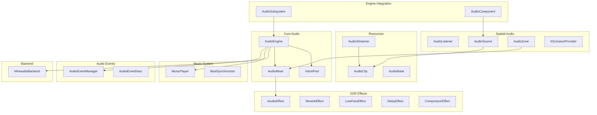

# Audio System Enhancement Plan

## Current State Analysis

The Audio module has a basic framework with interface definitions but stub implementations:

- [AudioEngine.h](e:\WorkSpace\RenderVerseX\Audio\Include\Audio\AudioEngine.h) - Core engine with TODO placeholders
- [AudioClip.h](e:\WorkSpace\RenderVerseX\Audio\Include\Audio\AudioClip.h) - Audio resource
- [AudioSource.h](e:\WorkSpace\RenderVerseX\Audio\Include\Audio\AudioSource.h) - Positional audio
- [AudioTypes.h](e:\WorkSpace\RenderVerseX\Audio\Include\Audio\AudioTypes.h) - Basic types defined

## Architecture Overview



## Implementation Phases

### Phase 1: Backend Implementation (P0)

Implement miniaudio backend integration in existing files.

**Files to modify:**

- [AudioEngine.cpp](e:\WorkSpace\RenderVerseX\Audio\Private\AudioEngine.cpp) - Replace TODO stubs with miniaudio calls
- [AudioClip.cpp](e:\WorkSpace\RenderVerseX\Audio\Private\AudioClip.cpp) - Implement loading with ma_decoder
- [CMakeLists.txt](e:\WorkSpace\RenderVerseX\Audio\CMakeLists.txt) - Add miniaudio include path

**Key implementation:**

```cpp
// In AudioEngine.cpp
#define MINIAUDIO_IMPLEMENTATION
#include <miniaudio.h>

struct AudioEngineImpl {
    ma_engine engine;
    ma_resource_manager resourceManager;
    std::unordered_map<uint64, ma_sound*> sounds;
};
```

### Phase 2: Engine Integration (P0)

Create AudioSubsystem following ResourceSubsystem pattern.

**New files:**

- `Audio/Include/Audio/AudioSubsystem.h`
- `Audio/Private/AudioSubsystem.cpp`

**Integration with existing subsystems:**

```cpp
class AudioSubsystem : public EngineSubsystem
{
public:
    const char* GetName() const override { return "AudioSubsystem"; }
    bool ShouldTick() const override { return true; }
    
    void Initialize() override;
    void Deinitialize() override;
    void Tick(float deltaTime) override;
    
    AudioEngine& GetEngine();
    AudioMixer& GetMixer();
    MusicPlayer& GetMusic();
};
```

### Phase 3: Voice Pool and Mixing (P1)

Implement voice management and bus mixing.

**New files:**

- `Audio/Include/Audio/Mixer/VoicePool.h`
- `Audio/Include/Audio/Mixer/AudioMixer.h`
- `Audio/Include/Audio/Mixer/AudioBus.h`
- `Audio/Private/Mixer/VoicePool.cpp`
- `Audio/Private/Mixer/AudioMixer.cpp`

**VoicePool responsibilities:**

- Limit concurrent voices (configurable max, e.g., 64)
- Priority-based allocation (important sounds never stolen)
- Virtualization (pause inaudible sounds, resume when audible)
- Audibility calculation (distance, volume, occlusion)

**AudioMixer structure:**

```
Master
├── Music (with crossfade support)
├── SFX
│   ├── Weapons
│   ├── Footsteps
│   └── UI
├── Voice (dialogue)
├── Ambient
└── System
```

### Phase 4: DSP Effects (P1)

Create effect processor chain.

**New files:**

- `Audio/Include/Audio/DSP/IAudioEffect.h`
- `Audio/Include/Audio/DSP/ReverbEffect.h`
- `Audio/Include/Audio/DSP/LowPassEffect.h`
- `Audio/Include/Audio/DSP/DelayEffect.h`
- `Audio/Include/Audio/DSP/CompressorEffect.h`
- `Audio/Include/Audio/DSP/EffectChain.h`
- `Audio/Private/DSP/*.cpp`

**Effect interface:**

```cpp
class IAudioEffect
{
public:
    virtual void Process(float* buffer, uint32 frameCount, uint32 channels) = 0;
    virtual void SetParameter(const std::string& name, float value) = 0;
    virtual void Reset() = 0;
    virtual const char* GetName() const = 0;
};
```

### Phase 5: Audio Events (P2)

Data-driven sound playback system.

**New files:**

- `Audio/Include/Audio/Events/AudioEvent.h`
- `Audio/Include/Audio/Events/AudioEventManager.h`
- `Audio/Private/Events/AudioEventManager.cpp`

**AudioEvent features:**

- Randomized clip selection (weighted)
- Volume/pitch variation
- Cooldown and max instances
- 3D spatial settings
- Effect routing
```cpp
struct AudioEventDesc
{
    std::string name;
    std::vector<AudioClip::Ptr> clips;
    float volumeMin = 1.0f, volumeMax = 1.0f;
    float pitchMin = 1.0f, pitchMax = 1.0f;
    float cooldown = 0.0f;
    int maxInstances = -1;
    uint32 targetBus = 0;  // SFX, Music, etc.
    Audio3DSettings spatial;
};
```


### Phase 6: Music System (P2)

Background music with transitions and beat sync.

**New files:**

- `Audio/Include/Audio/Music/MusicPlayer.h`
- `Audio/Include/Audio/Music/MusicTrack.h`
- `Audio/Include/Audio/Music/BeatSynchronizer.h`
- `Audio/Private/Music/*.cpp`

**Features:**

- Crossfade between tracks
- BPM detection/manual setting
- Beat callbacks for game sync
- Stinger support (one-shot overlays)
- Vertical layering (intensity levels)

### Phase 7: Streaming (P2)

Large file streaming support.

**New files:**

- `Audio/Include/Audio/Streaming/AudioStreamer.h`
- `Audio/Private/Streaming/AudioStreamer.cpp`

**Implementation:**

- Async buffer filling
- Ring buffer for streaming data
- Prefetch based on playback position
- Integration with AudioClip `IsStreaming()` flag

### Phase 8: Spatial Audio (P3)

Advanced 3D audio features.

**New files:**

- `Audio/Include/Audio/Spatial/AudioZone.h`
- `Audio/Include/Audio/Spatial/AudioZoneManager.h`
- `Audio/Include/Audio/Spatial/IOcclusionProvider.h`
- `Audio/Include/Audio/Spatial/RaycastOcclusion.h`
- `Audio/Private/Spatial/*.cpp`

**AudioZone features:**

- Box/Sphere/Capsule shapes
- Reverb presets (Cave, Hall, Room, etc.)
- Ambient sound loops
- Priority for overlapping zones
- Blend weights for smooth transitions

**Occlusion:**

- Ray-based occlusion using Physics module
- Low-pass filter based on material penetration
- Optional portal-based propagation

### Phase 9: Scene Integration (P3)

Create AudioComponent for entity attachment.

**New files:**

- `Scene/Include/Scene/Components/AudioComponent.h`
- `Scene/Private/Components/AudioComponent.cpp`

**AudioComponent:**

```cpp
class AudioComponent : public Component
{
public:
    const char* GetTypeName() const override { return "Audio"; }
    
    void OnAttach() override;
    void OnDetach() override;
    void Tick(float deltaTime) override;
    
    // Clip-based
    void SetClip(AudioClip::Ptr clip);
    void Play();
    void Stop();
    
    // Event-based
    void SetEvent(const std::string& eventName);
    void PostEvent();
    
    // Settings
    void SetVolume(float volume);
    void SetPitch(float pitch);
    void Set3DEnabled(bool enabled);
    void SetAttenuationSettings(const AttenuationSettings& settings);
    
private:
    AudioSource m_source;
    std::string m_eventName;
    bool m_playOnStart = false;
};
```

### Phase 10: Resource Integration

Integrate with Tools/Resource modules.

**New files in Tools:**

- `Tools/Include/Tools/Importers/AudioImporter.h`
- `Tools/Private/Importers/AudioImporter.cpp`

**Supported formats:**

- WAV (uncompressed, PCM)
- OGG Vorbis (compressed)
- MP3 (compressed)
- FLAC (lossless)

**Import options:**

- Force mono/stereo
- Resample to target rate
- Compression settings
- Streaming flag for large files

## File Structure Summary

```
Audio/
├── Include/Audio/
│   ├── Audio.h                    (main header)
│   ├── AudioSubsystem.h           [NEW]
│   ├── AudioEngine.h              [MODIFY]
│   ├── AudioClip.h                [MODIFY]
│   ├── AudioSource.h              [MODIFY]
│   ├── AudioListener.h            (unchanged)
│   ├── AudioTypes.h               [MODIFY - add more types]
│   ├── DSP/
│   │   ├── IAudioEffect.h         [NEW]
│   │   ├── ReverbEffect.h         [NEW]
│   │   ├── LowPassEffect.h        [NEW]
│   │   ├── DelayEffect.h          [NEW]
│   │   ├── CompressorEffect.h     [NEW]
│   │   └── EffectChain.h          [NEW]
│   ├── Mixer/
│   │   ├── VoicePool.h            [NEW]
│   │   ├── AudioMixer.h           [NEW]
│   │   └── AudioBus.h             [NEW]
│   ├── Events/
│   │   ├── AudioEvent.h           [NEW]
│   │   └── AudioEventManager.h    [NEW]
│   ├── Music/
│   │   ├── MusicPlayer.h          [NEW]
│   │   ├── MusicTrack.h           [NEW]
│   │   └── BeatSynchronizer.h     [NEW]
│   ├── Streaming/
│   │   └── AudioStreamer.h        [NEW]
│   └── Spatial/
│       ├── AudioZone.h            [NEW]
│       ├── AudioZoneManager.h     [NEW]
│       └── IOcclusionProvider.h   [NEW]
├── Private/
│   ├── AudioSubsystem.cpp         [NEW]
│   ├── AudioEngine.cpp            [MODIFY]
│   ├── AudioClip.cpp              [MODIFY]
│   ├── AudioSource.cpp            [MODIFY]
│   ├── DSP/*.cpp                  [NEW]
│   ├── Mixer/*.cpp                [NEW]
│   ├── Events/*.cpp               [NEW]
│   ├── Music/*.cpp                [NEW]
│   ├── Streaming/*.cpp            [NEW]
│   └── Spatial/*.cpp              [NEW]
└── CMakeLists.txt                 [MODIFY]
```

## Dependencies

Add to [vcpkg.json](e:\WorkSpace\RenderVerseX\vcpkg.json):

```json
{
  "name": "miniaudio",
  "version>=": "0.11.21"
}
```

Note: miniaudio is header-only, can also be vendored directly.

## Testing Checklist

- [ ] Basic 2D playback (WAV, OGG)
- [ ] 3D positioned audio with attenuation
- [ ] Multiple simultaneous sounds
- [ ] Voice pool limiting and virtualization
- [ ] Bus volume control
- [ ] Effect processing (reverb, low-pass)
- [ ] Music crossfade
- [ ] Event system with variations
- [ ] Streaming for large files
- [ ] AudioComponent in scene
- [ ] Hot reload of audio clips