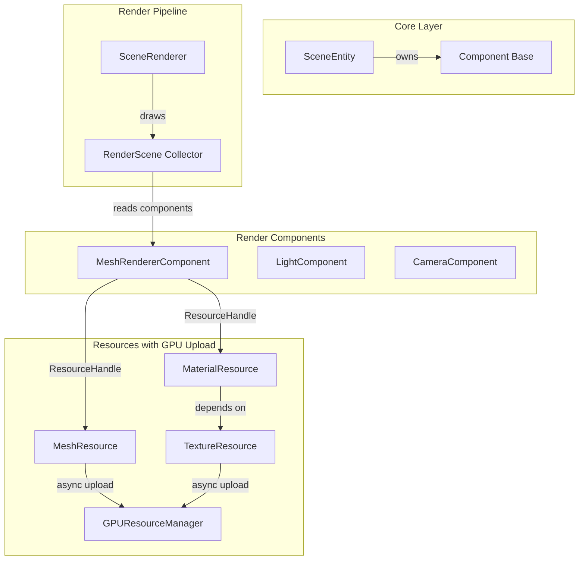
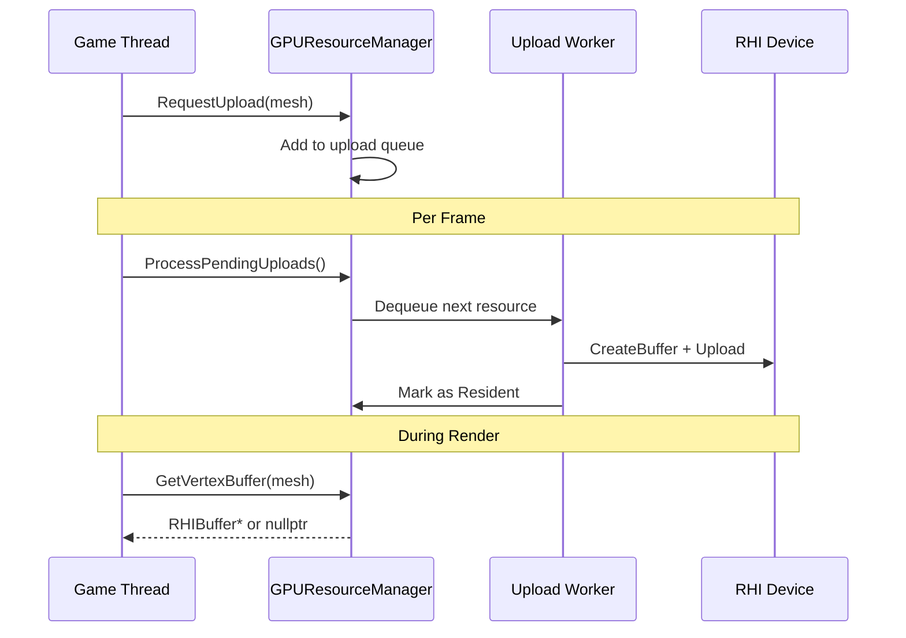

# Component-Based Resource-Scene-Render Integration

## Architecture Overview



---

## Phase 1: Component System Foundation

### 1.1 Create Component Base Class

File: `Scene/Include/Scene/Component.h`

```cpp
class Component
{
public:
    virtual ~Component() = default;
    virtual const char* GetTypeName() const = 0;
    virtual void OnAttach(SceneEntity* owner) {}
    virtual void OnDetach() {}
    virtual void OnUpdate(float deltaTime) {}
    
    SceneEntity* GetOwner() const { return m_owner; }
    bool IsEnabled() const { return m_enabled; }
    void SetEnabled(bool enabled) { m_enabled = enabled; }
    
protected:
    friend class SceneEntity;
    SceneEntity* m_owner = nullptr;
    bool m_enabled = true;
};
```

### 1.2 Extend SceneEntity with Component Support

Modify: [Scene/Include/Scene/SceneEntity.h](Scene/Include/Scene/SceneEntity.h)

```cpp
class SceneEntity : public Spatial::ISpatialEntity
{
    // Add component storage
    std::vector<std::unique_ptr<Component>> m_components;
    
public:
    template<typename T, typename... Args>
    T* AddComponent(Args&&... args);
    
    template<typename T>
    T* GetComponent() const;
    
    template<typename T>
    bool HasComponent() const;
    
    template<typename T>
    void RemoveComponent();
    
    void UpdateComponents(float deltaTime);
};
```

---

## Phase 2: Render Components

### 2.1 MeshRendererComponent

File: `Scene/Include/Scene/Components/MeshRendererComponent.h`

```cpp
class MeshRendererComponent : public Component
{
public:
    const char* GetTypeName() const override { return "MeshRenderer"; }
    
    // Resource references (via handles for hot-reload)
    void SetMesh(ResourceHandle<MeshResource> mesh);
    void SetMaterial(ResourceHandle<MaterialResource> material);
    void SetMaterial(size_t slot, ResourceHandle<MaterialResource> material);
    
    ResourceHandle<MeshResource> GetMesh() const { return m_mesh; }
    ResourceHandle<MaterialResource> GetMaterial(size_t slot = 0) const;
    
    // Render settings
    bool castsShadow = true;
    bool receivesShadow = true;
    uint32_t renderLayer = 1;
    
    // Collect render data for RenderScene
    void CollectRenderData(RenderScene& scene, const Mat4& worldMatrix) const;
    
private:
    ResourceHandle<MeshResource> m_mesh;
    std::vector<ResourceHandle<MaterialResource>> m_materials;
};
```

### 2.2 LightComponent

File: `Scene/Include/Scene/Components/LightComponent.h`

```cpp
class LightComponent : public Component
{
public:
    const char* GetTypeName() const override { return "Light"; }
    
    RenderLight::Type type = RenderLight::Type::Directional;
    Vec3 color{1.0f, 1.0f, 1.0f};
    float intensity = 1.0f;
    float range = 10.0f;
    float innerConeAngle = 0.0f;
    float outerConeAngle = 0.7854f;
    bool castsShadow = false;
    
    void CollectRenderData(RenderScene& scene, const Mat4& worldMatrix) const;
};
```

---

## Phase 3: GPU Resource Streaming

### 3.1 GPU Resource State

Modify: [Resource/Include/Resource/IResource.h](Resource/Include/Resource/IResource.h)

```cpp
enum class GPUResidencyState : uint8_t
{
    NotResident,      // CPU-only
    UploadPending,    // Queued for upload
    Uploading,        // Transfer in progress
    Resident,         // Available on GPU
    Evicting          // Being removed from GPU
};
```

### 3.2 GPUResourceManager

File: `Render/Include/Render/GPUResourceManager.h`

```cpp
class GPUResourceManager
{
public:
    void Initialize(IRHIDevice* device);
    void Shutdown();
    
    // Request async upload
    void RequestUpload(MeshResource* mesh);
    void RequestUpload(TextureResource* texture);
    
    // Get GPU handles (returns null if not resident)
    RHIBuffer* GetVertexBuffer(MeshResource* mesh) const;
    RHIBuffer* GetIndexBuffer(MeshResource* mesh) const;
    RHITexture* GetTexture(TextureResource* texture) const;
    
    // Frame update - processes pending uploads
    void ProcessPendingUploads(uint32_t maxUploadsPerFrame = 4);
    
    // Memory management
    void SetMemoryBudget(size_t bytes);
    void EvictUnused();
    
    struct Stats {
        size_t gpuMemoryUsed;
        size_t pendingUploads;
        size_t residentMeshes;
        size_t residentTextures;
    };
    Stats GetStats() const;
    
private:
    IRHIDevice* m_device = nullptr;
    
    struct MeshGPUData {
        RHIBufferRef vertexBuffer;
        RHIBufferRef indexBuffer;
        uint64_t lastUsedFrame = 0;
    };
    std::unordered_map<ResourceId, MeshGPUData> m_meshGPUData;
    
    struct TextureGPUData {
        RHITextureRef texture;
        uint64_t lastUsedFrame = 0;
    };
    std::unordered_map<ResourceId, TextureGPUData> m_textureGPUData;
    
    std::queue<std::pair<ResourceType, ResourceId>> m_uploadQueue;
    std::mutex m_queueMutex;
};
```

### 3.3 Streaming Upload Pipeline



---

## Phase 4: RenderScene Collection

### 4.1 Update RenderScene::CollectFromWorld

Modify: [Render/Private/Renderer/RenderScene.cpp](Render/Private/Renderer/RenderScene.cpp)

```cpp
void RenderScene::CollectFromWorld(World* world)
{
    Clear();
    if (!world) return;
    
    auto* sceneManager = world->GetSceneManager();
    if (!sceneManager) return;
    
    sceneManager->ForEachActiveEntity([this](SceneEntity* entity) {
        Mat4 worldMatrix = entity->GetWorldMatrix();
        
        // Collect MeshRenderer components
        if (auto* meshRenderer = entity->GetComponent<MeshRendererComponent>()) {
            if (meshRenderer->IsEnabled()) {
                meshRenderer->CollectRenderData(*this, worldMatrix);
            }
        }
        
        // Collect Light components
        if (auto* light = entity->GetComponent<LightComponent>()) {
            if (light->IsEnabled()) {
                light->CollectRenderData(*this, worldMatrix);
            }
        }
    });
}
```

### 4.2 MeshRendererComponent::CollectRenderData

```cpp
void MeshRendererComponent::CollectRenderData(RenderScene& scene, const Mat4& worldMatrix) const
{
    if (!m_mesh.IsValid()) return;
    
    RenderObject obj;
    obj.worldMatrix = worldMatrix;
    obj.normalMatrix = glm::transpose(glm::inverse(worldMatrix));
    obj.meshId = m_mesh.GetId();
    obj.materialId = m_materials.empty() ? 0 : m_materials[0].GetId();
    obj.bounds = TransformAABB(m_mesh->GetBounds(), worldMatrix);
    obj.entityId = GetOwner()->GetHandle();
    obj.castsShadow = castsShadow;
    obj.receivesShadow = receivesShadow;
    obj.visible = true;
    
    // Build sort key: material | mesh (for batching)
    obj.sortKey = (obj.materialId << 32) | obj.meshId;
    
    scene.AddObject(obj);
}
```

---

## Phase 5: SceneRenderer Integration

### 5.1 Update SceneRenderer::Render

Modify: [Render/Private/Renderer/SceneRenderer.cpp](Render/Private/Renderer/SceneRenderer.cpp)

The SceneRenderer needs to:

1. Get GPUResourceManager from RenderContext
2. For each RenderObject, lookup GPU buffers by resource ID
3. Issue draw calls only for GPU-resident resources
```cpp
void SceneRenderer::Render()
{
    // Ensure GPU resources are available
    auto* gpuResManager = m_renderContext->GetGPUResourceManager();
    gpuResManager->ProcessPendingUploads();
    
    // Cull visible objects
    m_visibleObjectIndices.clear();
    m_renderScene.CullAgainstCamera(*m_currentCamera, m_visibleObjectIndices);
    
    // Sort for batching
    m_renderScene.SortVisibleObjects(m_visibleObjectIndices, m_currentCamera->GetPosition());
    
    // Draw each visible object
    for (uint32_t idx : m_visibleObjectIndices) {
        const auto& obj = m_renderScene.GetObject(idx);
        
        // Get GPU resources
        auto* mesh = ResourceManager::Get().GetByIdAs<MeshResource>(obj.meshId);
        auto* vb = gpuResManager->GetVertexBuffer(mesh);
        auto* ib = gpuResManager->GetIndexBuffer(mesh);
        
        if (!vb || !ib) continue; // Skip if not GPU-resident
        
        // Set per-object constants and draw...
    }
}
```


---

## Phase 6: Integration with Engine::Tick

Update the unified tick to include GPU resource streaming:


---

## File Structure Summary

New files to create:

- `Scene/Include/Scene/Component.h` - Component base class
- `Scene/Include/Scene/Components/MeshRendererComponent.h`
- `Scene/Include/Scene/Components/LightComponent.h`
- `Scene/Private/Components/MeshRendererComponent.cpp`
- `Scene/Private/Components/LightComponent.cpp`
- `Render/Include/Render/GPUResourceManager.h`
- `Render/Private/GPUResourceManager.cpp`

Files to modify:

- `Scene/Include/Scene/SceneEntity.h` - Add component support
- `Scene/Private/SceneEntity.cpp` - Implement component methods
- `Resource/Include/Resource/IResource.h` - Add GPU residency state
- `Resource/Include/Resource/Types/MeshResource.h` - Add GPU buffer refs
- `Render/Include/Render/Context/RenderContext.h` - Add GPUResourceManager
- `Render/Private/Renderer/RenderScene.cpp` - Implement CollectFromWorld
- `Render/Private/Renderer/SceneRenderer.cpp` - Use GPU resources