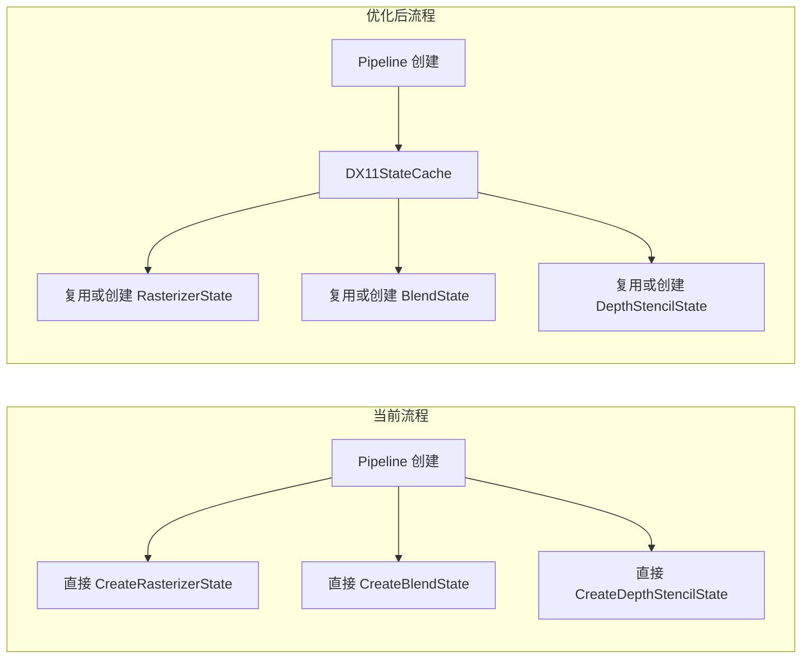

# DX11 RHI 完善与优化计划

## 现状分析

DX11 后端已实现基础功能，但存在以下问题：

- 多个核心 API 未实现 (Push Constants, Indirect Drawing, Buffer/Texture Copy)
- 性能优化机制已定义但未使用 (StateCache, BindingRemapper)
- Deferred Context 被禁用，无法利用多线程
- SwapChain 使用旧版 DISCARD 模式

---

## 阶段一：核心功能补全 (高优先级)

### 1.1 实现 Push Constants

**文件**: [DX11CommandContext.cpp](RHI_DX11/Private/DX11CommandContext.cpp)

Push Constants 在 DX11 中需要映射到 Constant Buffer。利用 `DX11PipelineLayout` 中已创建的 `m_pushConstantBuffer`：

```cpp
void DX11CommandContext::SetPushConstants(const void* data, uint32 size, uint32 offset)
{
    // 获取当前 pipeline 的 push constant buffer
    // 使用 Map/Unmap 更新数据
    // 绑定到保留的 CB slot (DX11BindingRemapper::PUSH_CONSTANT_SLOT = 13)
}
```

需要在 `DX11CommandContext` 中添加对当前 pipeline layout 的引用。

### 1.2 实现 Buffer-Texture 拷贝

**文件**: [DX11CommandContext.cpp](RHI_DX11/Private/DX11CommandContext.cpp)

```cpp
void DX11CommandContext::CopyBufferToTexture(RHIBuffer* src, RHITexture* dst, 
                                              const RHIBufferTextureCopyDesc& desc)
{
    // 1. Map source buffer
    // 2. 使用 UpdateSubresource 或创建 staging texture
    // 3. CopySubresourceRegion 到目标
}

void DX11CommandContext::CopyTextureToBuffer(RHITexture* src, RHIBuffer* dst,
                                              const RHIBufferTextureCopyDesc& desc)
{
    // 1. 创建 staging texture (D3D11_USAGE_STAGING)
    // 2. CopyResource 到 staging
    // 3. Map staging, memcpy 到 buffer
}
```

### 1.3 实现 Indirect Drawing

**文件**: [DX11CommandContext.cpp](RHI_DX11/Private/DX11CommandContext.cpp)

```cpp
void DX11CommandContext::DrawIndirect(RHIBuffer* buffer, uint64 offset, 
                                       uint32 drawCount, uint32 stride)
{
    auto* dx11Buffer = static_cast<DX11Buffer*>(buffer);
    for (uint32 i = 0; i < drawCount; ++i)
    {
        m_context->DrawInstancedIndirect(dx11Buffer->GetBuffer(), 
                                         static_cast<UINT>(offset + i * stride));
    }
}
```

DX11 不支持 multi-draw indirect，需要循环调用。

---

## 阶段二：性能优化

### 2.1 集成 DX11StateCache

**文件**: [DX11Pipeline.cpp](RHI_DX11/Private/DX11Pipeline.cpp), [DX11Device.h](RHI_DX11/Private/DX11Device.h)

当前问题：`DX11GraphicsPipeline` 直接创建状态对象，未使用缓存。

修改方案：



- 在 `DX11Device` 中添加 `DX11StateCache` 成员
- 修改 `DX11GraphicsPipeline` 构造函数使用缓存

### 2.2 批量化 VertexBuffer 绑定

**文件**: [DX11CommandContext.cpp](RHI_DX11/Private/DX11CommandContext.cpp)

```cpp
void DX11CommandContext::SetVertexBuffers(uint32 startSlot, 
    std::span<RHIBuffer* const> buffers, std::span<const uint64> offsets)
{
    std::array<ID3D11Buffer*, DX11_MAX_VERTEX_BUFFERS> d3dBuffers = {};
    std::array<UINT, DX11_MAX_VERTEX_BUFFERS> strides = {};
    std::array<UINT, DX11_MAX_VERTEX_BUFFERS> offs = {};
    
    for (size_t i = 0; i < buffers.size(); ++i)
    {
        auto* dx11Buffer = static_cast<DX11Buffer*>(buffers[i]);
        d3dBuffers[i] = dx11Buffer ? dx11Buffer->GetBuffer() : nullptr;
        strides[i] = dx11Buffer ? dx11Buffer->GetStride() : 0;
        offs[i] = (i < offsets.size()) ? static_cast<UINT>(offsets[i]) : 0;
    }
    
    m_context->IASetVertexBuffers(startSlot, static_cast<UINT>(buffers.size()),
                                   d3dBuffers.data(), strides.data(), offs.data());
}
```

### 2.3 集成 DX11BindingRemapper

**文件**: [DX11Pipeline.cpp](RHI_DX11/Private/DX11Pipeline.cpp)

当前 `DX11DescriptorSet::Apply` 直接使用 `binding` 作为 slot，这在多 descriptor set 场景下会冲突。

修改：

```cpp
void DX11DescriptorSet::Apply(ID3D11DeviceContext* context, 
                               RHIShaderStage stages, uint32 setIndex) const
{
    auto& remapper = DX11BindingRemapper::Get();
    
    for (const auto& binding : m_bindings)
    {
        switch (entry->type)
        {
            case RHIBindingType::UniformBuffer:
                UINT slot = remapper.GetCBSlot(setIndex, binding.binding);
                // ... bind to slot
        }
    }
}
```

### 2.4 优化 Pipeline Apply

**文件**: [DX11Pipeline.cpp](RHI_DX11/Private/DX11Pipeline.cpp)

```cpp
void DX11GraphicsPipeline::Apply(ID3D11DeviceContext* context) const
{
    // 只设置非空 shaders
    context->VSSetShader(m_vertexShader.Get(), nullptr, 0);
    context->PSSetShader(m_pixelShader.Get(), nullptr, 0);
    
    if (m_geometryShader) 
        context->GSSetShader(m_geometryShader.Get(), nullptr, 0);
    if (m_hullShader)
        context->HSSetShader(m_hullShader.Get(), nullptr, 0);
    if (m_domainShader)
        context->DSSetShader(m_domainShader.Get(), nullptr, 0);
    
    // ... 其余状态
}
```

---

## 阶段三：高级功能 (可选)

### 3.1 重新启用 Deferred Context

**文件**: [DX11CommandContext.cpp](RHI_DX11/Private/DX11CommandContext.cpp)

```cpp
DX11CommandContext::DX11CommandContext(DX11Device* device, RHICommandQueueType queueType)
{
    // 检查设备是否支持 deferred context
    if (device->SupportsDeferredContext() && 
        device->GetThreadingMode() != DX11ThreadingMode::SingleThreaded)
    {
        m_context = device->CreateDeferredContext();
        m_isDeferred = (m_context != nullptr);
    }
    
    if (!m_isDeferred)
    {
        m_context = device->GetImmediateContext();
    }
}
```

### 3.2 SwapChain FLIP 模式支持

**文件**: [DX11SwapChain.cpp](RHI_DX11/Private/DX11SwapChain.cpp)

```cpp
bool DX11SwapChain::CreateSwapChain(const RHISwapChainDesc& desc)
{
    // 检测 Windows 10+ 并使用 FLIP_DISCARD
    DXGI_SWAP_CHAIN_DESC1 swapChainDesc = {};
    
    // 尝试 FLIP 模式
    if (IsWindows10OrGreater())
    {
        swapChainDesc.BufferCount = std::max(2u, desc.bufferCount);
        swapChainDesc.SwapEffect = DXGI_SWAP_EFFECT_FLIP_DISCARD;
        swapChainDesc.Format = GetSwapChainBufferFormat(desc.format); // 非 SRGB
        m_isFlipModel = true;
    }
    else
    {
        // 回退到 DISCARD 模式
        swapChainDesc.BufferCount = 1;
        swapChainDesc.SwapEffect = DXGI_SWAP_EFFECT_DISCARD;
    }
    
    // 可选：启用 tearing (VRR 支持)
    if (m_isFlipModel && CheckTearingSupport())
    {
        swapChainDesc.Flags |= DXGI_SWAP_CHAIN_FLAG_ALLOW_TEARING;
    }
}
```

### 3.3 Dynamic Offset 支持

**文件**: [DX11CommandContext.cpp](RHI_DX11/Private/DX11CommandContext.cpp), [DX11Pipeline.cpp](RHI_DX11/Private/DX11Pipeline.cpp)

DX11 需要使用 `VSSetConstantBuffers1` (ID3D11DeviceContext1) 来支持 dynamic offset：

```cpp
void DX11DescriptorSet::ApplyWithOffsets(ID3D11DeviceContext1* context1,
    std::span<const uint32> dynamicOffsets) const
{
    // 使用 *SetConstantBuffers1 系列函数设置 offset
    UINT firstConstant = dynamicOffsets[i] / 16; // 16-byte alignment
    UINT numConstants = bufferSize / 16;
    context1->VSSetConstantBuffers1(slot, 1, &buffer, &firstConstant, &numConstants);
}
```

---

## 实施顺序

```mermaid
gantt
    title DX11 RHI 优化实施计划
    dateFormat X
    axisFormat %s
    
    section 阶段一
    Push Constants实现      :a1, 0, 1
    Buffer-Texture拷贝      :a2, 1, 2
    Indirect Drawing        :a3, 2, 3
    
    section 阶段二
    集成StateCache          :b1, 3, 4
    批量化绑定              :b2, 4, 5
    集成BindingRemapper     :b3, 5, 6
    优化Pipeline Apply      :b4, 6, 7
    
    section 阶段三
    Deferred Context        :c1, 7, 8
    FLIP SwapChain          :c2, 8, 9
    Dynamic Offset          :c3, 9, 10
```



---

## 涉及文件清单

| 文件 | 修改类型 |

|------|----------|

| `RHI_DX11/Private/DX11CommandContext.cpp` | 核心实现 |

| `RHI_DX11/Private/DX11CommandContext.h` | 添加成员 |

| `RHI_DX11/Private/DX11Pipeline.cpp` | StateCache集成/优化 |

| `RHI_DX11/Private/DX11Device.h` | 添加StateCache成员 |

| `RHI_DX11/Private/DX11Device.cpp` | 初始化StateCache |

| `RHI_DX11/Private/DX11SwapChain.cpp` | FLIP模式支持 |