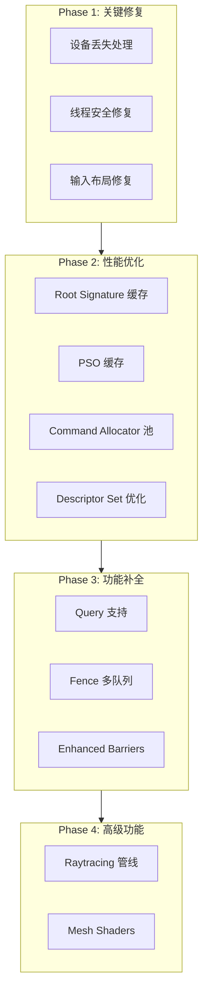

# DX12 后端完善与优化计划

## 架构概览



---

## Phase 1: 关键问题修复 (优先级最高)

### 1.1 设备丢失处理

**问题**: [DX12SwapChain.cpp](RHI_DX12/Private/DX12SwapChain.cpp) 第 163-167 行只打印错误，没有恢复机制。

**修改方案**:

1. 在 `DX12Device` 中添加设备丢失回调机制:
```cpp
// DX12Device.h
class DX12Device : public IRHIDevice
{
public:
    using DeviceLostCallback = std::function<void(HRESULT reason)>;
    void SetDeviceLostCallback(DeviceLostCallback callback);
    bool IsDeviceLost() const { return m_deviceLost; }
    HRESULT GetDeviceRemovedReason() const;
    
private:
    std::atomic<bool> m_deviceLost{false};
    DeviceLostCallback m_deviceLostCallback;
};
```

2. 在 `Present()` 中检测并触发回调
3. 添加 DRED (Device Removed Extended Data) 诊断支持

**涉及文件**:

- [DX12Device.h](RHI_DX12/Private/DX12Device.h)
- [DX12Device.cpp](RHI_DX12/Private/DX12Device.cpp)
- [DX12SwapChain.cpp](RHI_DX12/Private/DX12SwapChain.cpp)

---

### 1.2 线程安全修复

**问题**: [DX12DescriptorHeap.cpp](RHI_DX12/Private/DX12DescriptorHeap.cpp) 第 261-265 行的 `ResetTransientHeaps()` 存在竞态条件。

**修改方案**:

```cpp
// 当前代码 (有问题)
void DX12DescriptorHeapManager::ResetTransientHeaps()
{
    m_currentFrameIndex = (m_currentFrameIndex + 1) % RVX_MAX_FRAME_COUNT;
    m_transientHeaps[m_currentFrameIndex].Reset();
}

// 修复: 使用原子操作
class DX12DescriptorHeapManager
{
    std::atomic<uint32> m_currentFrameIndex{0};
};
```

**涉及文件**:

- [DX12DescriptorHeap.h](RHI_DX12/Private/DX12DescriptorHeap.h)
- [DX12DescriptorHeap.cpp](RHI_DX12/Private/DX12DescriptorHeap.cpp)

---

### 1.3 输入布局偏移量修复

**问题**: [DX12Pipeline.cpp](RHI_DX12/Private/DX12Pipeline.cpp) 第 482-496 行的自动偏移量计算在多 InputSlot 场景下不正确。

**修改方案**:

```cpp
// 修复: 按 InputSlot 分组计算偏移量
std::unordered_map<uint32, uint32> slotOffsets;
for (const auto& elem : desc.inputLayout.elements)
{
    uint32 slot = elem.inputSlot;
    if (slotOffsets.find(slot) == slotOffsets.end())
        slotOffsets[slot] = 0;
    
    d3dElem.AlignedByteOffset = (elem.alignedByteOffset == 0xFFFFFFFF) 
        ? slotOffsets[slot] : elem.alignedByteOffset;
    slotOffsets[slot] = d3dElem.AlignedByteOffset + GetFormatBytesPerPixel(elem.format);
}
```

**涉及文件**:

- [DX12Pipeline.cpp](RHI_DX12/Private/DX12Pipeline.cpp)

---

## Phase 2: 性能优化

### 2.1 Root Signature 缓存

**现状**: 每个 `DX12PipelineLayout` 都创建新的 Root Signature，即使结构相同。

**优化方案**:

1. 在 `DX12Device` 中添加缓存:
```cpp
class DX12Device
{
private:
    struct RootSignatureKey
    {
        std::vector<RHIBindingLayoutEntry> entries;
        uint32 pushConstantSize;
        bool operator==(const RootSignatureKey&) const;
    };
    
    std::unordered_map<size_t, ComPtr<ID3D12RootSignature>> m_rootSignatureCache;
    std::mutex m_rootSignatureCacheMutex;
    
public:
    ComPtr<ID3D12RootSignature> GetOrCreateRootSignature(const RHIPipelineLayoutDesc& desc);
};
```


**涉及文件**:

- [DX12Device.h](RHI_DX12/Private/DX12Device.h)
- [DX12Device.cpp](RHI_DX12/Private/DX12Device.cpp)
- [DX12Pipeline.cpp](RHI_DX12/Private/DX12Pipeline.cpp)

---

### 2.2 Pipeline State Object 缓存

**优化方案**:

使用 `ID3D12PipelineLibrary` 实现磁盘缓存:

```cpp
class DX12PipelineCache
{
public:
    void Initialize(DX12Device* device, const std::string& cachePath);
    void Shutdown();
    
    ComPtr<ID3D12PipelineState> GetOrCreateGraphicsPSO(
        const RHIGraphicsPipelineDesc& desc,
        ID3D12RootSignature* rootSig);
    
    void SaveToFile();
    
private:
    ComPtr<ID3D12PipelineLibrary> m_library;
    std::vector<uint8> m_cacheData;
    bool m_dirty = false;
};
```

**新增文件**:

- `RHI_DX12/Private/DX12PipelineCache.h`
- `RHI_DX12/Private/DX12PipelineCache.cpp`

---

### 2.3 Command Allocator 池化

**现状**: 每个 `DX12CommandContext` 持有独立的 Allocator。

**优化方案**:

```cpp
class DX12CommandAllocatorPool
{
public:
    void Initialize(DX12Device* device);
    
    // 获取可用的 Allocator (已完成 GPU 工作)
    ComPtr<ID3D12CommandAllocator> Acquire(D3D12_COMMAND_LIST_TYPE type);
    
    // 归还 Allocator，关联完成 fence 值
    void Release(ComPtr<ID3D12CommandAllocator> allocator, 
                 D3D12_COMMAND_LIST_TYPE type, uint64 fenceValue);
    
    // 帧结束时回收已完成的 Allocator
    void Tick(uint64 completedFenceValue);
    
private:
    struct AllocatorEntry
    {
        ComPtr<ID3D12CommandAllocator> allocator;
        uint64 fenceValue;
    };
    
    std::array<std::queue<AllocatorEntry>, 3> m_pendingAllocators;  // per queue type
    std::array<std::vector<ComPtr<ID3D12CommandAllocator>>, 3> m_availableAllocators;
};
```

**新增文件**:

- `RHI_DX12/Private/DX12CommandAllocatorPool.h`
- `RHI_DX12/Private/DX12CommandAllocatorPool.cpp`

---

### 2.4 Descriptor Set 脏标记优化

**现状**: `DX12DescriptorSet::Update()` 每次都复制所有描述符。

**优化方案**:

```cpp
class DX12DescriptorSet : public RHIDescriptorSet
{
public:
    void Update(const std::vector<RHIDescriptorBinding>& bindings) override;
    void UpdateSingle(uint32 binding, const RHIDescriptorBinding& update);
    
private:
    std::bitset<64> m_dirtyBindings;
    void FlushDirtyDescriptors();
};
```

**涉及文件**:

- [DX12Pipeline.h](RHI_DX12/Private/DX12Pipeline.h)
- [DX12Pipeline.cpp](RHI_DX12/Private/DX12Pipeline.cpp)

---

## Phase 3: 功能补全

### 3.1 GPU Query 支持

**现状**: RHI 层面没有 Query 相关接口定义。

**实现方案**:

1. 在 RHI 层添加接口 ([RHI/Include/RHI/RHIQuery.h](RHI/Include/RHI/)):
```cpp
enum class RHIQueryType : uint8
{
    Timestamp,
    Occlusion,
    BinaryOcclusion,
    PipelineStatistics,
};

struct RHIQueryPoolDesc
{
    RHIQueryType type;
    uint32 count;
    const char* debugName = nullptr;
};

class RHIQueryPool : public RHIResource { /* ... */ };

// IRHIDevice additions
virtual RHIQueryPoolRef CreateQueryPool(const RHIQueryPoolDesc& desc) = 0;

// RHICommandContext additions
virtual void BeginQuery(RHIQueryPool* pool, uint32 index) = 0;
virtual void EndQuery(RHIQueryPool* pool, uint32 index) = 0;
virtual void WriteTimestamp(RHIQueryPool* pool, uint32 index) = 0;
virtual void ResolveQueries(RHIQueryPool* pool, uint32 first, uint32 count, 
                            RHIBuffer* dst, uint64 offset) = 0;
```

2. DX12 实现:
```cpp
class DX12QueryPool : public RHIQueryPool
{
    ComPtr<ID3D12QueryHeap> m_heap;
    D3D12_QUERY_TYPE m_queryType;
    uint32 m_count;
};
```


**新增文件**:

- `RHI/Include/RHI/RHIQuery.h`
- `RHI_DX12/Private/DX12Query.h`
- `RHI_DX12/Private/DX12Query.cpp`

---

### 3.2 Fence 多队列支持

**现状**: `DX12Fence::Signal()` 硬编码使用 Graphics Queue。

**修改方案**:

```cpp
// RHIFence interface update
class RHIFence : public RHIResource
{
public:
    virtual void Signal(uint64 value) = 0;  // 保留，默认 Graphics
    virtual void SignalOnQueue(uint64 value, RHICommandQueueType queue) = 0;  // 新增
};

// DX12 implementation
void DX12Fence::SignalOnQueue(uint64 value, RHICommandQueueType queue)
{
    m_device->GetQueue(queue)->Signal(m_fence.Get(), value);
}
```

**涉及文件**:

- [RHI/Include/RHI/RHISynchronization.h](RHI/Include/RHI/RHISynchronization.h)
- [DX12Resources.h](RHI_DX12/Private/DX12Resources.h)
- [DX12Resources.cpp](RHI_DX12/Private/DX12Resources.cpp)

---

### 3.3 Enhanced Barriers (可选)

**说明**: 需要 Windows SDK 10.0.20348.0+ 和支持的 GPU 驱动。

**实现方案**:

1. 运行时检测 `ID3D12GraphicsCommandList7` 可用性
2. 提供两条代码路径: Legacy Barriers / Enhanced Barriers
3. Enhanced Barriers 支持 Split Barriers 和更细粒度同步
```cpp
class DX12CommandContext
{
private:
    ComPtr<ID3D12GraphicsCommandList7> m_commandList7;  // 可选
    bool m_useEnhancedBarriers = false;
    
    void FlushBarriersEnhanced();  // 新路径
    void FlushBarriersLegacy();    // 现有路径
};
```


---

## Phase 4: 高级功能 (远期规划)

### 4.1 Raytracing 管线

需要实现:

- `DX12AccelerationStructure` (BLAS/TLAS)
- `DX12RaytracingPipeline` (RTPSO)
- `DispatchRays` 命令
- Shader Table 管理

### 4.2 Mesh Shaders

需要实现:

- Mesh/Amplification Shader 支持
- `DispatchMesh` 命令
- 更新 `RHIShaderStage` 枚举

---

## 文件修改汇总

| 阶段 | 文件 | 操作 |

|------|------|------|

| P1 | DX12Device.h/cpp | 修改 - 添加设备丢失处理 |

| P1 | DX12SwapChain.cpp | 修改 - 触发设备丢失回调 |

| P1 | DX12DescriptorHeap.h/cpp | 修改 - 线程安全 |

| P1 | DX12Pipeline.cpp | 修改 - 输入布局修复 |

| P2 | DX12PipelineCache.h/cpp | 新增 - PSO 缓存 |

| P2 | DX12CommandAllocatorPool.h/cpp | 新增 - Allocator 池 |

| P2 | DX12Pipeline.h/cpp | 修改 - Descriptor Set 优化 |

| P3 | RHI/RHIQuery.h | 新增 - Query 接口 |

| P3 | DX12Query.h/cpp | 新增 - Query 实现 |

| P3 | DX12Resources.h/cpp | 修改 - Fence 多队列 |

| P3 | DX12CommandContext.h/cpp | 修改 - Query/Barrier 命令 |