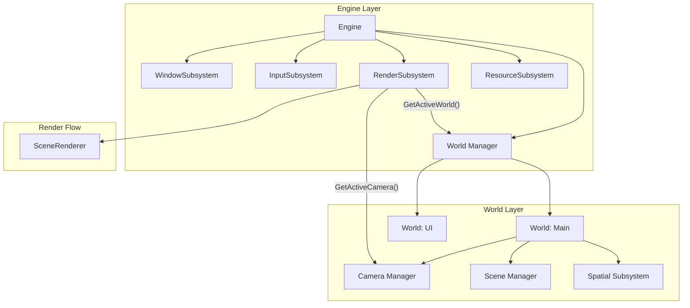

# Engine 子系统集成实施计划

## 目标

将 Engine 与 Render、World、Camera 系统深度集成，实现：

- `engine.Tick()` 一个调用完成整帧（包括渲染）
- Engine 管理 World 生命周期
- World 管理 Camera
- RenderSubsystem 自动绑定窗口并渲染活跃 World

## 架构设计



---

## Phase 1: Engine 管理 World

### 修改文件

- [Engine/Include/Engine/Engine.h](Engine/Include/Engine/Engine.h)
- [Engine/Private/Engine.cpp](Engine/Private/Engine.cpp)

### 改动内容

在 `Engine` 类中添加 World 管理功能：

```cpp
// Engine.h 新增
class Engine
{
public:
    // World 管理
    World* CreateWorld(const std::string& name = "Main");
    World* GetWorld(const std::string& name = "Main") const;
    void DestroyWorld(const std::string& name);
    
    void SetActiveWorld(World* world);
    World* GetActiveWorld() const;
    
private:
    std::unordered_map<std::string, std::unique_ptr<World>> m_worlds;
    World* m_activeWorld = nullptr;
};
```

---

## Phase 2: World 管理 Camera

### 修改文件

- [World/Include/World/World.h](World/Include/World/World.h)
- [World/Private/World.cpp](World/Private/World.cpp)

### 改动内容

在 `World` 类中添加 Camera 管理：

```cpp
// World.h 新增
class World
{
public:
    // Camera 管理
    Camera* CreateCamera(const std::string& name = "Main");
    Camera* GetCamera(const std::string& name = "Main") const;
    void DestroyCamera(const std::string& name);
    
    void SetActiveCamera(Camera* camera);
    Camera* GetActiveCamera() const;
    
private:
    std::unordered_map<std::string, std::unique_ptr<Camera>> m_cameras;
    Camera* m_activeCamera = nullptr;
};
```

---

## Phase 3: RenderSubsystem 自动化

### 修改文件

- [Render/Include/Render/RenderSubsystem.h](Render/Include/Render/RenderSubsystem.h)
- [Render/Private/RenderSubsystem.cpp](Render/Private/RenderSubsystem.cpp)

### 改动内容

1. **增强 RenderConfig**
```cpp
struct RenderConfig
{
    RHIBackendType backendType = RHIBackendType::Auto;  // 自动选择后端
    bool enableValidation = true;
    bool vsync = true;
    uint32_t frameBuffering = 2;
    bool autoBindWindow = true;   // 自动绑定 WindowSubsystem
    bool autoRender = true;       // 自动渲染（可禁用用于手动控制）
};
```

2. **Initialize 自动绑定窗口**
```cpp
void RenderSubsystem::Initialize()
{
    // 自动选择后端
    if (m_config.backendType == RHIBackendType::Auto) { ... }
    
    // 创建 RenderContext
    m_renderContext = std::make_unique<RenderContext>();
    m_renderContext->Initialize(ctxConfig);
    
    // 自动绑定窗口
    if (m_config.autoBindWindow)
    {
        auto* window = GetEngine()->GetSubsystem<WindowSubsystem>();
        if (window)
        {
            void* handle = window->GetNativeHandle();
            uint32_t w, h;
            window->GetFramebufferSize(w, h);
            m_renderContext->CreateSwapChain(handle, w, h);
        }
    }
    
    // 订阅窗口 resize 事件
    EventBus::Get().Subscribe<WindowResizedEvent>(...);
}
```

3. **新增 RenderFrame 方法**
```cpp
void RenderSubsystem::RenderFrame(World* world)
{
    if (!world) return;
    Camera* camera = world->GetActiveCamera();
    if (!camera) return;
    
    BeginFrame();
    Render(world, camera);
    EndFrame();
    Present();
}
```


---

## Phase 4: 统一帧循环

### 修改文件

- [Engine/Private/Engine.cpp](Engine/Private/Engine.cpp)

### 改动内容

重写 `Engine::Tick()`:

```cpp
void Engine::Tick()
{
    Time::Update();
    float deltaTime = Time::DeltaTime();
    
    // 1. 事件处理
    EventBus::Get().ProcessDeferredEvents();
    
    // 2. 子系统 Tick（窗口、输入等）
    m_subsystems.TickAll(deltaTime);
    
    // 3. 更新所有 World
    for (auto& [name, world] : m_worlds)
    {
        world->Tick(deltaTime);
    }
    
    // 4. 渲染活跃 World（如果开启自动渲染）
    if (auto* render = GetSubsystem<RenderSubsystem>())
    {
        if (render->GetConfig().autoRender && m_activeWorld)
        {
            render->RenderFrame(m_activeWorld);
        }
    }
    
    // 5. 检查窗口关闭
    if (auto* window = GetSubsystem<WindowSubsystem>())
    {
        if (window->ShouldClose())
        {
            RequestShutdown();
        }
    }
    
    m_frameNumber++;
}
```

新增 `TickWithoutRender()` 供高级用户使用：

```cpp
void Engine::TickWithoutRender()
{
    // 与 Tick() 相同，但跳过渲染步骤
}
```

---

## Phase 5: RHI 后端自动选择

### 修改文件

- [RHI/Include/RHI/RHITypes.h](RHI/Include/RHI/RHITypes.h)（添加 Auto 枚举）
- [Render/Private/RenderSubsystem.cpp](Render/Private/RenderSubsystem.cpp)

### 改动内容

```cpp
enum class RHIBackendType
{
    None = 0,
    Auto,      // 新增：自动选择
    DX11,
    DX12,
    Vulkan,
    Metal,
    OpenGL
};

// 自动选择逻辑
RHIBackendType SelectBestBackend()
{
    #if defined(_WIN32)
        return RHIBackendType::DX12;
    #elif defined(__APPLE__)
        return RHIBackendType::Metal;
    #else
        return RHIBackendType::Vulkan;
    #endif
}
```

---

## Phase 6: 更新示例

### 修改文件

- [Samples/Cube3D/main.cpp](Samples/Cube3D/main.cpp)

### 目标代码

```cpp
int main()
{
    RVX::Engine engine;
    
    // 配置（可选，有默认值）
    RVX::RenderSubsystem::Config renderConfig;
    renderConfig.backendType = RVX::RHIBackendType::Auto;
    
    // 添加子系统
    engine.AddSubsystem<RVX::WindowSubsystem>();
    engine.AddSubsystem<RVX::InputSubsystem>();
    auto* render = engine.AddSubsystem<RVX::RenderSubsystem>();
    render->SetConfig(renderConfig);
    
    engine.Initialize();
    
    // 创建 World 和 Camera
    auto* world = engine.CreateWorld();
    auto* camera = world->CreateCamera();
    camera->SetPerspective(60.0f * 3.14159f / 180.0f, 16.0f/9.0f, 0.1f, 100.0f);
    camera->SetPosition({0, 0, -3});
    world->SetActiveCamera(camera);
    engine.SetActiveWorld(world);
    
    // 主循环 - 极简
    while (!engine.ShouldShutdown())
    {
        engine.Tick();  // 一行搞定
    }
    
    engine.Shutdown();
    return 0;
}
```

---

## Phase 7: 事件系统增强

### 修改文件

- [HAL/Include/HAL/Window/WindowEvents.h](HAL/Include/HAL/Window/WindowEvents.h)（已有）
- [Render/Private/RenderSubsystem.cpp](Render/Private/RenderSubsystem.cpp)

### 改动内容

RenderSubsystem 订阅 WindowResizedEvent：

```cpp
void RenderSubsystem::Initialize()
{
    // ...
    EventBus::Get().Subscribe<HAL::WindowResizedEvent>(
        [this](const HAL::WindowResizedEvent& e) {
            OnResize(e.width, e.height);
        });
}
```

---

## 实施顺序

1. **Phase 5** - RHI 后端自动选择（基础设施）
2. **Phase 1** - Engine 管理 World
3. **Phase 2** - World 管理 Camera
4. **Phase 3** - RenderSubsystem 自动化
5. **Phase 4** - 统一帧循环
6. **Phase 7** - 事件系统增强
7. **Phase 6** - 更新示例

---

## 兼容性

- 保留 `RenderSubsystem::BeginFrame/Render/EndFrame/Present` 手动 API
- 新增 `autoRender = false` 配置项禁用自动渲染
- 新增 `Engine::TickWithoutRender()` 供高级用户使用
- 现有直接使用 RHI 的代码不受影响