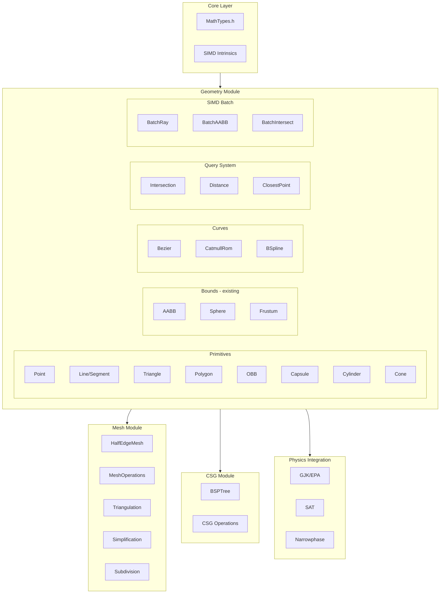
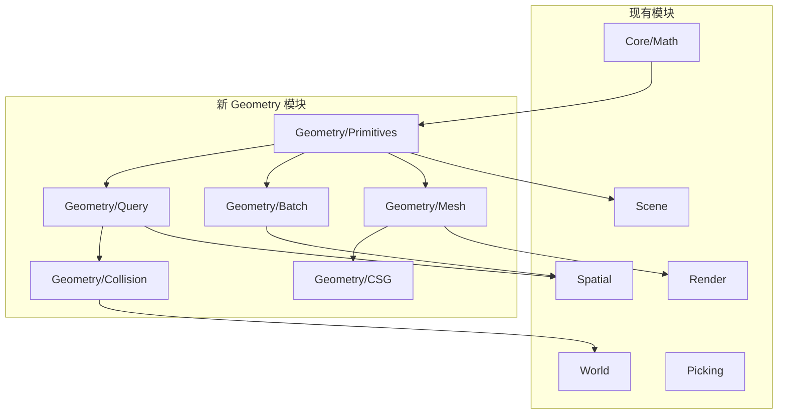

# RenderVerseX 几何库设计方案

## 1. 整体架构



## 2. 模块组织结构

```
Geometry/
├── CMakeLists.txt
├── Include/
│   └── Geometry/
│       ├── Geometry.h              # 统一头文件
│       ├── GeometryFwd.h           # 前向声明
│       │
│       ├── Primitives/             # 几何原语
│       │   ├── Line.h              # 直线/线段
│       │   ├── Triangle.h          # 三角形
│       │   ├── Polygon.h           # 多边形
│       │   ├── OBB.h               # 有向包围盒
│       │   ├── Capsule.h           # 胶囊体
│       │   ├── Cylinder.h          # 圆柱体
│       │   └── Cone.h              # 圆锥体
│       │
│       ├── Curves/                 # 曲线
│       │   ├── ICurve.h            # 曲线接口
│       │   ├── Bezier.h            # 贝塞尔曲线
│       │   ├── CatmullRom.h        # Catmull-Rom 样条
│       │   └── BSpline.h           # B-样条
│       │
│       ├── Query/                  # 查询系统
│       │   ├── Intersection.h      # 相交测试 (扩展现有)
│       │   ├── Distance.h          # 距离查询
│       │   ├── ClosestPoint.h      # 最近点查询
│       │   └── Containment.h       # 包含测试
│       │
│       ├── Batch/                  # SIMD 批量处理
│       │   ├── SIMDTypes.h         # SIMD 类型定义
│       │   ├── BatchRay.h          # 批量射线 (4/8条)
│       │   ├── BatchAABB.h         # 批量 AABB (4/8个)
│       │   └── BatchIntersect.h    # 批量相交测试
│       │
│       ├── Mesh/                   # 网格处理
│       │   ├── HalfEdgeMesh.h      # 半边数据结构
│       │   ├── MeshBuilder.h       # 网格构建器
│       │   ├── Triangulation.h     # 三角剖分
│       │   ├── Simplification.h    # 网格简化
│       │   ├── Subdivision.h       # 细分曲面
│       │   └── NormalGeneration.h  # 法线生成
│       │
│       ├── CSG/                    # 构造实体几何
│       │   ├── BSPTree.h           # BSP 树
│       │   ├── CSGOperations.h     # 布尔运算
│       │   └── CSGMesh.h           # CSG 网格表示
│       │
│       └── Collision/              # 碰撞检测
│           ├── GJK.h               # GJK 算法
│           ├── EPA.h               # EPA 算法
│           ├── SAT.h               # 分离轴测试
│           └── ContactManifold.h   # 接触流形
│
└── Private/
    ├── Primitives/
    ├── Curves/
    ├── Query/
    ├── Batch/
    ├── Mesh/
    ├── CSG/
    └── Collision/
```

## 3. 核心类型设计

### 3.1 几何原语基类设计

```cpp
// Geometry/Include/Geometry/GeometryFwd.h
namespace RVX::Geometry
{
    // 形状类型枚举 - 用于运行时类型识别和调度
    enum class ShapeType : uint8_t
    {
        Point, Line, Segment, Ray,
        Triangle, Quad, Polygon,
        AABB, OBB, Sphere, Capsule, Cylinder, Cone,
        Frustum, ConvexHull, Mesh
    };

    // 几何查询结果
    struct HitResult
    {
        float distance = FLT_MAX;
        Vec3 point{0};
        Vec3 normal{0, 1, 0};
        Vec2 uv{0};
        bool hit = false;
    };

    // 距离查询结果
    struct DistanceResult
    {
        float distance = FLT_MAX;
        Vec3 closestPointA{0};
        Vec3 closestPointB{0};
    };
}
```

### 3.2 关键原语示例

```cpp
// OBB - 有向包围盒 (物理碰撞必需)
struct OBB
{
    Vec3 center{0};
    Vec3 halfExtents{1};
    Quat orientation{1, 0, 0, 0};  // 或 Mat3 axes

    AABB ToAABB() const;
    bool Contains(const Vec3& point) const;
    Vec3 GetCorner(int index) const;  // 0-7
    void GetAxes(Vec3& axisX, Vec3& axisY, Vec3& axisZ) const;
};

// Capsule - 胶囊体 (角色碰撞常用)
struct Capsule
{
    Vec3 pointA{0, 0, 0};
    Vec3 pointB{0, 1, 0};
    float radius{0.5f};

    float GetHeight() const;
    Vec3 GetCenter() const;
    Sphere GetBoundingSphere() const;
    AABB GetBoundingBox() const;
};

// Triangle - 三角形 (光追/物理基础)
struct Triangle
{
    Vec3 v0, v1, v2;

    Vec3 GetNormal() const;
    Vec3 GetCenter() const;
    float GetArea() const;
    AABB GetBoundingBox() const;
    Vec3 GetBarycentric(const Vec3& point) const;
};
```

### 3.3 曲线接口设计

```cpp
// 曲线统一接口
template<typename T>  // T = Vec2 or Vec3
class ICurve
{
public:
    virtual ~ICurve() = default;

    // 核心求值
    virtual T Evaluate(float t) const = 0;           // 位置
    virtual T EvaluateTangent(float t) const = 0;    // 切线
    virtual T EvaluateNormal(float t) const = 0;     // 法线

    // 查询
    virtual float GetLength() const = 0;
    virtual float GetArcLengthParam(float distance) const = 0;
    virtual AABB GetBoundingBox() const = 0;

    // 采样
    virtual void Sample(float step, std::vector<T>& outPoints) const = 0;
    virtual void SampleAdaptive(float tolerance, std::vector<T>& outPoints) const = 0;
};

// 三次贝塞尔曲线
template<typename T>
class CubicBezier : public ICurve<T>
{
    T m_p0, m_p1, m_p2, m_p3;  // 控制点
public:
    // De Casteljau 算法求值
    T Evaluate(float t) const override;
    
    // 细分为两条曲线
    void Subdivide(float t, CubicBezier& left, CubicBezier& right) const;
};

// Catmull-Rom 样条 (路径动画常用)
template<typename T>
class CatmullRomSpline : public ICurve<T>
{
    std::vector<T> m_points;
    float m_tension = 0.5f;
public:
    void AddPoint(const T& point);
    int GetSegmentCount() const;
};
```

## 4. SIMD 批量处理设计

### 4.1 SIMD 类型定义

```cpp
// Batch/SIMDTypes.h
#include <immintrin.h>

namespace RVX::Geometry::SIMD
{
    // 4-wide float (SSE)
    struct Float4
    {
        __m128 data;

        static Float4 Load(const float* ptr);
        static Float4 Set(float x, float y, float z, float w);
        static Float4 Splat(float v);
        void Store(float* ptr) const;

        Float4 operator+(Float4 b) const;
        Float4 operator-(Float4 b) const;
        Float4 operator*(Float4 b) const;
        Float4 Min(Float4 b) const;
        Float4 Max(Float4 b) const;
    };

    // 4x Vec3 (SOA layout)
    struct Vec3x4
    {
        Float4 x, y, z;

        static Vec3x4 Load(const Vec3* ptrs[4]);
        Vec3x4 Cross(const Vec3x4& b) const;
        Float4 Dot(const Vec3x4& b) const;
        Float4 Length() const;
        Vec3x4 Normalize() const;
    };

    // 8-wide (AVX) 变体
    #ifdef __AVX__
    struct Float8 { __m256 data; /* ... */ };
    struct Vec3x8 { Float8 x, y, z; /* ... */ };
    #endif
}
```

### 4.2 批量射线-AABB 测试

```cpp
// Batch/BatchIntersect.h
namespace RVX::Geometry::SIMD
{
    // 同时测试 4 条射线 vs 1 个 AABB
    struct BatchRay4
    {
        Vec3x4 origins;
        Vec3x4 directions;
        Vec3x4 invDirections;  // 预计算
        Float4 tMin, tMax;
    };

    // 返回 4 个结果的掩码 (0xF = all hit)
    uint32_t RayAABBIntersect4(
        const BatchRay4& rays,
        const AABB& box,
        Float4& outTMin,
        Float4& outTMax);

    // 同时测试 1 条射线 vs 4 个 AABB (BVH 遍历优化)
    struct BatchAABB4
    {
        Float4 minX, minY, minZ;
        Float4 maxX, maxY, maxZ;
    };

    uint32_t RayBatchAABBIntersect(
        const Ray& ray,
        const BatchAABB4& boxes,
        Float4& outTMin,
        Float4& outTMax);

    // 批量三角形测试 (Moller-Trumbore x4)
    uint32_t RayTriangleIntersect4(
        const Ray& ray,
        const Vec3x4& v0, const Vec3x4& v1, const Vec3x4& v2,
        Float4& outT, Float4& outU, Float4& outV);
}
```

## 5. 查询系统设计

### 5.1 统一相交接口

```cpp
// Query/Intersection.h
namespace RVX::Geometry
{
    // 双重分派模式 - 支持所有形状组合
    class IntersectionDispatcher
    {
    public:
        // 注册自定义相交测试
        template<typename ShapeA, typename ShapeB>
        void Register(bool (*func)(const ShapeA&, const ShapeB&, HitResult*));

        // 通用相交测试
        bool Test(const IShape& a, const IShape& b, HitResult* outHit = nullptr);
    };

    // 常用相交测试 (inline 函数)
    bool Intersect(const Ray& ray, const OBB& obb, HitResult& hit);
    bool Intersect(const Ray& ray, const Capsule& capsule, HitResult& hit);
    bool Intersect(const Ray& ray, const Cylinder& cyl, HitResult& hit);
    bool Intersect(const Ray& ray, const Triangle& tri, HitResult& hit);

    bool Intersect(const OBB& a, const OBB& b);
    bool Intersect(const OBB& obb, const Sphere& sphere);
    bool Intersect(const Capsule& a, const Capsule& b);
    
    // Swept 测试 (连续碰撞检测)
    bool IntersectSwept(const Sphere& sphere, const Vec3& velocity,
                        const Triangle& tri, float& outT, Vec3& outNormal);
}
```

### 5.2 距离与最近点查询

```cpp
// Query/Distance.h
namespace RVX::Geometry
{
    // 点到形状距离
    float PointToLine(const Vec3& point, const Vec3& lineA, const Vec3& lineB,
                      Vec3* outClosest = nullptr);
    float PointToTriangle(const Vec3& point, const Triangle& tri,
                          Vec3* outClosest = nullptr);
    float PointToOBB(const Vec3& point, const OBB& obb,
                     Vec3* outClosest = nullptr);
    float PointToCapsule(const Vec3& point, const Capsule& cap,
                         Vec3* outClosest = nullptr);

    // 形状间距离 (GJK 通用实现)
    DistanceResult ShapeDistance(const IConvexShape& a, const IConvexShape& b);

    // 线段间距离 (常用)
    float SegmentToSegment(const Vec3& a0, const Vec3& a1,
                           const Vec3& b0, const Vec3& b1,
                           float& outS, float& outT);
}
```

## 6. 网格操作设计

### 6.1 半边数据结构

```cpp
// Mesh/HalfEdgeMesh.h
namespace RVX::Geometry
{
    struct HalfEdge
    {
        uint32_t vertex;      // 目标顶点
        uint32_t face;        // 所属面
        uint32_t next;        // 同一面的下一条半边
        uint32_t twin;        // 对边 (INVALID 表示边界)
        
        static constexpr uint32_t INVALID = ~0u;
    };

    class HalfEdgeMesh
    {
    public:
        // 构建
        void Build(std::span<const Vec3> vertices, std::span<const uint32_t> indices);
        void BuildFromPolygons(std::span<const Vec3> vertices,
                               std::span<const std::vector<uint32_t>> faces);

        // 拓扑查询
        std::vector<uint32_t> GetVertexNeighbors(uint32_t vertex) const;
        std::vector<uint32_t> GetVertexFaces(uint32_t vertex) const;
        bool IsBoundaryVertex(uint32_t vertex) const;
        bool IsBoundaryEdge(uint32_t halfEdge) const;

        // 拓扑操作
        uint32_t SplitEdge(uint32_t halfEdge, float t);
        void CollapseEdge(uint32_t halfEdge);
        void FlipEdge(uint32_t halfEdge);

        // 转换
        void ToIndexedMesh(std::vector<Vec3>& vertices,
                           std::vector<uint32_t>& indices) const;

    private:
        std::vector<Vec3> m_vertices;
        std::vector<HalfEdge> m_halfEdges;
        std::vector<uint32_t> m_vertexHalfEdge;  // 每顶点一条出边
        std::vector<uint32_t> m_faceHalfEdge;    // 每面一条边
    };
}
```

### 6.2 网格算法

```cpp
// Mesh/MeshOperations.h
namespace RVX::Geometry
{
    // 三角剖分
    class Triangulator
    {
    public:
        // Ear clipping (简单多边形)
        static void EarClipping(std::span<const Vec2> polygon,
                                std::vector<uint32_t>& outIndices);

        // Delaunay 三角剖分
        static void Delaunay2D(std::span<const Vec2> points,
                               std::vector<uint32_t>& outIndices);

        // 约束 Delaunay
        static void ConstrainedDelaunay(std::span<const Vec2> points,
                                        std::span<const std::pair<uint32_t, uint32_t>> constraints,
                                        std::vector<uint32_t>& outIndices);
    };

    // 网格简化 (QEM - Quadric Error Metrics)
    class MeshSimplifier
    {
    public:
        struct Options
        {
            float targetRatio = 0.5f;     // 目标三角形比例
            float maxError = 0.01f;       // 最大误差阈值
            bool preserveBoundary = true;
            bool preserveUVSeams = true;
        };

        static void Simplify(HalfEdgeMesh& mesh, const Options& options);
    };

    // 细分曲面
    class Subdivision
    {
    public:
        // Loop 细分 (三角形网格)
        static void Loop(HalfEdgeMesh& mesh, int iterations = 1);
        
        // Catmull-Clark 细分 (四边形网格)
        static void CatmullClark(HalfEdgeMesh& mesh, int iterations = 1);
    };

    // 法线生成
    class NormalGenerator
    {
    public:
        // 面法线
        static void ComputeFaceNormals(std::span<const Vec3> vertices,
                                       std::span<const uint32_t> indices,
                                       std::vector<Vec3>& outNormals);

        // 顶点法线 (面积加权平均)
        static void ComputeVertexNormals(std::span<const Vec3> vertices,
                                         std::span<const uint32_t> indices,
                                         std::vector<Vec3>& outNormals);

        // 平滑组法线
        static void ComputeSmoothNormals(std::span<const Vec3> vertices,
                                         std::span<const uint32_t> indices,
                                         float angleThreshold,
                                         std::vector<Vec3>& outNormals);
    };
}
```

## 7. CSG 设计

```cpp
// CSG/CSGOperations.h
namespace RVX::Geometry
{
    enum class CSGOperation { Union, Intersection, Difference };

    class CSGMesh
    {
    public:
        // 从多边形网格构建
        void FromPolygons(std::span<const Polygon3D> polygons);

        // CSG 布尔运算
        CSGMesh Union(const CSGMesh& other) const;
        CSGMesh Intersect(const CSGMesh& other) const;
        CSGMesh Subtract(const CSGMesh& other) const;

        // 基本形状工厂
        static CSGMesh Cube(const Vec3& center, const Vec3& size);
        static CSGMesh Sphere(const Vec3& center, float radius, int slices = 16);
        static CSGMesh Cylinder(const Vec3& start, const Vec3& end, float radius);

        // 导出
        void ToTriangleMesh(std::vector<Vec3>& vertices,
                            std::vector<uint32_t>& indices) const;

    private:
        std::vector<Polygon3D> m_polygons;
    };

    // BSP 树实现 (CSG 核心)
    class BSPTree
    {
    public:
        void Build(std::span<const Polygon3D> polygons);
        
        void ClipPolygons(std::vector<Polygon3D>& polygons) const;
        void ClipTo(const BSPTree& other);
        void Invert();

        std::vector<Polygon3D> GetPolygons() const;

    private:
        struct Node
        {
            Plane plane;
            std::vector<Polygon3D> polygons;
            std::unique_ptr<Node> front;
            std::unique_ptr<Node> back;
        };

        std::unique_ptr<Node> m_root;
    };
}
```

## 8. 碰撞检测设计

```cpp
// Collision/GJK.h
namespace RVX::Geometry
{
    // 凸形状支持函数接口
    class IConvexShape
    {
    public:
        virtual Vec3 Support(const Vec3& direction) const = 0;
        virtual Vec3 GetCenter() const = 0;
    };

    // GJK 碰撞检测
    class GJK
    {
    public:
        struct Result
        {
            bool intersecting = false;
            Vec3 closestA{0};
            Vec3 closestB{0};
            float distance = 0;
        };

        static Result Query(const IConvexShape& a, const IConvexShape& b,
                           int maxIterations = 32);
    };

    // EPA 穿透深度
    class EPA
    {
    public:
        struct Result
        {
            Vec3 normal{0, 1, 0};
            float depth = 0;
            Vec3 pointA{0};
            Vec3 pointB{0};
        };

        static Result Query(const IConvexShape& a, const IConvexShape& b,
                           const std::vector<Vec3>& gjkSimplex);
    };

    // 接触流形
    struct ContactManifold
    {
        static constexpr int MAX_CONTACTS = 4;

        struct Contact
        {
            Vec3 pointA;
            Vec3 pointB;
            Vec3 normal;
            float depth;
        };

        Contact contacts[MAX_CONTACTS];
        int contactCount = 0;

        void Add(const Contact& contact);
        void Reduce();  // 保留最具代表性的 4 个点
    };

    // SAT (分离轴测试) - OBB vs OBB 特化
    bool SATTest(const OBB& a, const OBB& b, ContactManifold* outManifold = nullptr);
}
```

## 9. 与现有系统集成

### 9.1 模块依赖关系图



### 9.2 CMake 集成

在根目录 `CMakeLists.txt` 中添加：

```cmake
# CMakeLists.txt (根目录)
# 在 add_subdirectory(Core) 之后添加
add_subdirectory(Geometry)   # 几何库 - 依赖 Core
```

新模块 `Geometry/CMakeLists.txt`：

```cmake
# =============================================================================
# Geometry Module - Geometric primitives, queries, and algorithms
# =============================================================================
add_library(RVX_Geometry STATIC)

# SIMD 编译选项
if(MSVC)
    target_compile_options(RVX_Geometry PRIVATE /arch:AVX2)
else()
    target_compile_options(RVX_Geometry PRIVATE -mavx2 -mfma)
endif()

target_sources(RVX_Geometry PRIVATE
    # Primitives
    Private/Primitives/OBB.cpp
    Private/Primitives/Capsule.cpp
    Private/Primitives/Triangle.cpp
    Private/Primitives/Line.cpp
    Private/Primitives/Cylinder.cpp
    Private/Primitives/Cone.cpp
    Private/Primitives/Polygon.cpp

    # Query
    Private/Query/Intersection.cpp
    Private/Query/Distance.cpp
    Private/Query/ClosestPoint.cpp

    # Batch (SIMD)
    Private/Batch/SIMDMath.cpp
    Private/Batch/BatchIntersect.cpp

    # Curves
    Private/Curves/Bezier.cpp
    Private/Curves/CatmullRom.cpp
    Private/Curves/BSpline.cpp

    # Mesh
    Private/Mesh/HalfEdgeMesh.cpp
    Private/Mesh/Triangulation.cpp
    Private/Mesh/Simplification.cpp
    Private/Mesh/Subdivision.cpp
    Private/Mesh/NormalGeneration.cpp

    # CSG
    Private/CSG/BSPTree.cpp
    Private/CSG/CSGMesh.cpp

    # Collision
    Private/Collision/GJK.cpp
    Private/Collision/EPA.cpp
    Private/Collision/SAT.cpp
    Private/Collision/ContactManifold.cpp
)

target_include_directories(RVX_Geometry PUBLIC
    $<BUILD_INTERFACE:${CMAKE_CURRENT_SOURCE_DIR}/Include>
    $<INSTALL_INTERFACE:include>
)

target_link_libraries(RVX_Geometry PUBLIC
    RVX::Core   # 依赖 Core 的 MathTypes
)

target_compile_features(RVX_Geometry PUBLIC cxx_std_20)

add_library(RVX::Geometry ALIAS RVX_Geometry)
```

### 9.3 现有模块更新

#### Spatial 模块集成 SIMD 批量处理

```cmake
# Spatial/CMakeLists.txt 更新
target_link_libraries(Spatial
    PUBLIC
        RVX::Core
        RVX::Geometry   # 新增依赖
)
```
```cpp
// Spatial/Private/Index/BVHIndex.cpp
#include "Geometry/Batch/BatchIntersect.h"

// 优化后的射线查询
bool BVHIndex::QueryRayRecursive(int nodeIdx, const Ray& ray, ...) const
{
    const Node& node = m_nodes[nodeIdx];
    
    if (node.IsLeaf()) {
        // 批量测试叶子节点中的三角形
        // ...
    } else {
        // 使用 SIMD 同时测试左右子节点
        using namespace RVX::Geometry::SIMD;
        
        BatchAABB4 childBoxes;
        // 填充 2 个子节点的 AABB (其余 2 个设为无效)
        childBoxes.Load(m_nodes[node.leftChild].bounds,
                       m_nodes[node.rightChild].bounds);
        
        Float4 tMin, tMax;
        uint32_t hitMask = RayBatchAABBIntersect(ray, childBoxes, tMin, tMax);
        
        // 按距离排序遍历
        if (hitMask & 0x1) /* left hit */ { ... }
        if (hitMask & 0x2) /* right hit */ { ... }
    }
}
```

#### World 模块集成碰撞检测

```cmake
# World/CMakeLists.txt 更新
target_link_libraries(RVX_World PUBLIC
    RVX_Core
    RVX_Scene
    Spatial
    RVX_Runtime
    RVX::Geometry   # 新增依赖
)
```
```cpp
// World/Include/World/CollisionSubsystem.h (新增)
#pragma once
#include "Geometry/Collision/GJK.h"
#include "Geometry/Collision/ContactManifold.h"

namespace RVX
{
    class CollisionSubsystem : public ISubsystem
    {
    public:
        // 碰撞对测试
        bool TestCollision(const Entity& a, const Entity& b,
                          Geometry::ContactManifold* outManifold = nullptr);
        
        // 射线投射 (使用新的 OBB/Capsule 支持)
        bool Raycast(const Ray& ray, const QueryFilter& filter,
                    Geometry::HitResult& outHit);
        
        // 扫掠测试 (连续碰撞检测)
        bool Sweep(const Geometry::Capsule& capsule, const Vec3& velocity,
                  const QueryFilter& filter, float& outT);
    };
}
```

#### Scene 模块集成新原语

```cpp
// Scene/Include/Scene/Components/ColliderComponent.h (新增)
#pragma once
#include "Geometry/Primitives/OBB.h"
#include "Geometry/Primitives/Capsule.h"
#include "Geometry/Primitives/Cylinder.h"

namespace RVX
{
    enum class ColliderType { Box, Sphere, Capsule, Cylinder, Mesh };
    
    struct ColliderComponent : public Component
    {
        ColliderType type = ColliderType::Box;
        
        union {
            AABB box;
            Sphere sphere;
            Geometry::Capsule capsule;
            Geometry::Cylinder cylinder;
        };
        
        // 从变换更新世界空间碰撞体
        void UpdateWorldBounds(const Transform& transform);
        
        // 获取 AABB (用于 Broadphase)
        AABB GetWorldAABB() const;
        
        // GJK 支持函数
        Vec3 Support(const Vec3& direction) const;
    };
}
```

### 9.4 头文件迁移策略

保持现有 `Core/Math/Geometry.h` 不变，新增统一入口：

```cpp
// Geometry/Include/Geometry/Geometry.h
#pragma once

/**
 * @file Geometry.h
 * @brief 统一几何库入口
 * 
 * 包含所有几何类型和算法。
 * 对于轻量级使用，可单独包含子模块。
 */

// 从 Core 重导出基础类型
#include "Core/Math/Geometry.h"  // AABB, Sphere, Ray, Plane, Frustum

// 扩展原语
#include "Geometry/Primitives/OBB.h"
#include "Geometry/Primitives/Capsule.h"
#include "Geometry/Primitives/Triangle.h"
#include "Geometry/Primitives/Line.h"
#include "Geometry/Primitives/Cylinder.h"
#include "Geometry/Primitives/Cone.h"
#include "Geometry/Primitives/Polygon.h"

// 查询
#include "Geometry/Query/Intersection.h"
#include "Geometry/Query/Distance.h"
#include "Geometry/Query/ClosestPoint.h"

// 便捷别名
namespace RVX
{
    // 将 Geometry 命名空间提升到 RVX
    using Geometry::OBB;
    using Geometry::Capsule;
    using Geometry::Triangle;
    using Geometry::Cylinder;
    using Geometry::Cone;
}
```

### 9.5 向后兼容性

```cpp
// Core/Math/Intersection.h 更新
#pragma once

// 保留现有相交测试
#include "Core/Math/Ray.h"
#include "Core/Math/AABB.h"
// ... 现有代码 ...

// 条件包含扩展测试 (如果 Geometry 模块可用)
#ifdef RVX_HAS_GEOMETRY_MODULE
#include "Geometry/Query/Intersection.h"
#endif
```

### 9.6 Render 模块集成网格操作

```cpp
// Render/Private/Mesh/MeshProcessor.cpp
#include "Geometry/Mesh/Simplification.h"
#include "Geometry/Mesh/NormalGeneration.h"

void MeshProcessor::GenerateLODs(const MeshData& source, 
                                 std::vector<MeshData>& outLODs)
{
    using namespace RVX::Geometry;
    
    HalfEdgeMesh mesh;
    mesh.Build(source.vertices, source.indices);
    
    float ratios[] = { 0.5f, 0.25f, 0.125f };
    for (float ratio : ratios)
    {
        MeshSimplifier::Options opts;
        opts.targetRatio = ratio;
        opts.preserveUVSeams = true;
        
        HalfEdgeMesh lod = mesh;  // 复制
        MeshSimplifier::Simplify(lod, opts);
        
        MeshData lodData;
        lod.ToIndexedMesh(lodData.vertices, lodData.indices);
        NormalGenerator::ComputeVertexNormals(lodData.vertices, 
                                              lodData.indices,
                                              lodData.normals);
        outLODs.push_back(std::move(lodData));
    }
}
```

### 9.7 集成验证测试

```cpp
// Tests/GeometryValidation/main.cpp (新增)
#include "Geometry/Geometry.h"
#include "Geometry/Batch/BatchIntersect.h"
#include "Geometry/Collision/GJK.h"

void TestSIMDBatchIntersect()
{
    using namespace RVX::Geometry::SIMD;
    
    Ray ray({0, 0, 0}, {1, 0, 0});
    
    // 创建 4 个 AABB
    BatchAABB4 boxes;
    boxes.minX = Float4::Set(1, 5, 10, 100);
    boxes.minY = Float4::Set(-1, -1, -1, -1);
    boxes.minZ = Float4::Set(-1, -1, -1, -1);
    boxes.maxX = Float4::Set(2, 6, 11, 101);
    boxes.maxY = Float4::Set(1, 1, 1, 1);
    boxes.maxZ = Float4::Set(1, 1, 1, 1);
    
    Float4 tMin, tMax;
    uint32_t hitMask = RayBatchAABBIntersect(ray, boxes, tMin, tMax);
    
    // 期望: 所有 4 个都命中
    assert(hitMask == 0xF);
}

void TestGJKCollision()
{
    using namespace RVX::Geometry;
    
    OBB boxA({0, 0, 0}, {1, 1, 1}, Quat(1, 0, 0, 0));
    OBB boxB({1.5f, 0, 0}, {1, 1, 1}, Quat(1, 0, 0, 0));
    
    auto result = GJK::Query(boxA, boxB);
    assert(result.intersecting);  // 重叠
    
    OBB boxC({5, 0, 0}, {1, 1, 1}, Quat(1, 0, 0, 0));
    result = GJK::Query(boxA, boxC);
    assert(!result.intersecting);  // 不重叠
}
```

## 10. 性能考量

| 场景 | 优化策略 |

|------|----------|

| BVH 遍历 | 批量 Ray-AABB (4x/8x SIMD) |

| 三角形测试 | Moller-Trumbore x4 SIMD |

| 视锥剔除 | SOA AABB 布局，批量平面测试 |

| 物理 Broadphase | 批量 AABB-AABB 测试 |

| GJK/EPA | 单体优化（少量迭代） |

| 网格简化 | 优先队列 + 延迟更新 |

## 11. 依赖关系

```
Core (MathTypes, SIMD intrinsics)
   └── Geometry
          ├── Primitives (无外部依赖)
          ├── Curves (无外部依赖)
          ├── Query (依赖 Primitives)
          ├── Batch (依赖 Primitives, SSE/AVX)
          ├── Mesh (依赖 Primitives)
          ├── CSG (依赖 Mesh)
          └── Collision (依赖 Primitives, Query)
```

## 12. 实现优先级建议

1. **Phase 1 - 核心原语** (基础)

                                                                                                                                                                                                - OBB, Capsule, Triangle, Line/Segment
                                                                                                                                                                                                - 基本相交/距离测试

2. **Phase 2 - SIMD 批量处理** (性能关键)

                                                                                                                                                                                                - BatchRay, BatchAABB
                                                                                                                                                                                                - 集成到 BVH

3. **Phase 3 - 碰撞检测** (物理需求)

                                                                                                                                                                                                - GJK/EPA
                                                                                                                                                                                                - SAT
                                                                                                                                                                                                - ContactManifold

4. **Phase 4 - 曲线** (路径/动画)

                                                                                                                                                                                                - Bezier, CatmullRom

5. **Phase 5 - 网格操作** (工具/程序化)

                                                                                                                                                                                                - HalfEdgeMesh
                                                                                                                                                                                                - 简化/细分

6. **Phase 6 - CSG** (建模工具)

                                                - BSPTree
                                                - 布尔运算

## 13. 优化与扩展建议（头脑风暴）

### 13.1 跨平台 SIMD 抽象

当前设计偏重 x86，应增加：

```cpp
// Batch/SIMDPlatform.h - 平台抽象层
namespace RVX::Geometry::SIMD
{
    #if defined(__AVX2__)
        #include "SIMDImpl_AVX2.h"
    #elif defined(__SSE4_1__)
        #include "SIMDImpl_SSE4.h"
    #elif defined(__ARM_NEON)
        #include "SIMDImpl_NEON.h"    // Apple Silicon, 移动设备
    #elif defined(__wasm_simd128__)
        #include "SIMDImpl_WASM.h"    // WebAssembly
    #else
        #include "SIMDImpl_Scalar.h"  // 回退实现
    #endif
}
```

### 13.2 2D 几何子模块

补充 2D 支持（UI、2D 游戏、导航）：

```
Geometry/
├── 2D/
│   ├── Circle.h
│   ├── Rect.h
│   ├── Polygon2D.h
│   ├── Line2D.h
│   ├── Intersection2D.h
│   └── Triangulation2D.h
```

### 13.3 Signed Distance Fields (SDF)

程序化建模和光追必需：

```cpp
// SDF/SignedDistance.h
namespace RVX::Geometry::SDF
{
    // 基本 SDF 原语
    float Sphere(const Vec3& p, const Vec3& center, float radius);
    float Box(const Vec3& p, const OBB& box);
    float Capsule(const Vec3& p, const Capsule& cap);
    float Torus(const Vec3& p, float majorR, float minorR);
    
    // SDF 组合操作
    float Union(float d1, float d2);
    float SmoothUnion(float d1, float d2, float k);
    float Intersection(float d1, float d2);
    float Subtraction(float d1, float d2);
    
    // Marching Cubes 网格生成
    void MarchingCubes(const std::function<float(Vec3)>& sdf,
                       const AABB& bounds, float cellSize,
                       HalfEdgeMesh& outMesh);
}
```

### 13.4 凸包生成

```cpp
// Mesh/ConvexHull.h
class ConvexHull
{
public:
    // Quickhull 3D
    static void Compute(std::span<const Vec3> points,
                       std::vector<Vec3>& outVertices,
                       std::vector<uint32_t>& outIndices);
    
    // Graham Scan 2D
    static void Compute2D(std::span<const Vec2> points,
                         std::vector<uint32_t>& outHullIndices);
    
    // GJK 支持函数
    Vec3 Support(const Vec3& direction) const;
};
```

### 13.5 连续碰撞检测 (CCD)

防止高速物体穿透：

```cpp
// Collision/CCD.h
namespace RVX::Geometry
{
    // 扫掠测试
    bool SphereCast(const Sphere& sphere, const Vec3& velocity,
                   const IMeshInterface& mesh, float& outT, Vec3& outNormal);
    
    bool CapsuleCast(const Capsule& capsule, const Vec3& velocity,
                    const IMeshInterface& mesh, float& outT, Vec3& outNormal);
    
    // 保守推进算法
    float ConservativeAdvancement(const IConvexShape& a, const Vec3& velA,
                                  const IConvexShape& b, const Vec3& velB);
}
```

### 13.6 额外空间索引

```cpp
// Spatial/Index/ 扩展
class SpatialHash : public ISpatialIndex;  // 均匀分布动态对象
class OctreeIndex : public ISpatialIndex;  // 稀疏场景
class KDTree;                               // 点云最近邻查询
```

### 13.7 调试可视化系统

```cpp
// Debug/GeometryDebugDraw.h
class GeometryDebugRenderer
{
public:
    void DrawAABB(const AABB& box, const Color& color);
    void DrawOBB(const OBB& box, const Color& color);
    void DrawSphere(const Sphere& sphere, int segments, const Color& color);
    void DrawCapsule(const Capsule& capsule, const Color& color);
    void DrawFrustum(const Frustum& frustum, const Color& color);
    void DrawRay(const Ray& ray, float length, const Color& color);
    void DrawBezier(const CubicBezier<Vec3>& curve, int segments, const Color& color);
    void DrawBVH(const BVHIndex& bvh, int maxDepth);
    void DrawContactManifold(const ContactManifold& manifold);
};
```

### 13.8 并行处理支持

```cpp
// Query/ParallelQuery.h
namespace RVX::Geometry
{
    // 并行视锥剔除
    void FrustumCullParallel(const Frustum& frustum,
                             std::span<const AABB> boxes,
                             std::vector<uint8_t>& outVisible,
                             JobSystem& jobs);
    
    // 并行射线批量测试
    void RaycastBatchParallel(std::span<const Ray> rays,
                              const BVHIndex& bvh,
                              std::vector<HitResult>& outHits,
                              JobSystem& jobs);
}
```

### 13.9 内存管理优化

```cpp
// Memory/GeometryAllocator.h
class FrameAllocator
{
public:
    void* Allocate(size_t size, size_t alignment = 16);
    void Reset();  // 每帧调用
};

template<typename T>
using TempVector = std::vector<T, FrameAllocatorAdapter<T>>;
```

### 13.10 数值稳定性

```cpp
// Core/GeometryConstants.h
namespace RVX::Geometry
{
    constexpr float EPSILON = 1e-6f;
    constexpr float PLANE_THICKNESS = 1e-5f;
    
    // 稳健几何谓词
    enum class Orientation { Negative = -1, Zero = 0, Positive = 1 };
    Orientation Orient2D(const Vec2& a, const Vec2& b, const Vec2& c);
    Orientation Orient3D(const Vec3& a, const Vec3& b, const Vec3& c, const Vec3& d);
}
```

### 13.11 资源序列化集成

```cpp
// 与 Resource 模块集成
class CollisionMeshResource : public IResource
{
    std::vector<Vec3> vertices;
    std::vector<uint32_t> indices;
    std::vector<BVHNode> prebuiltBVH;  // 避免运行时构建
};

class PathResource : public IResource
{
    std::vector<Vec3> controlPoints;
    CurveType type;  // Bezier, CatmullRom, BSpline
};
```

### 13.12 动画系统集成

```cpp
// 骨骼碰撞支持
struct BoneCapsule
{
    int boneIndex;
    Capsule localCapsule;
    Capsule GetWorldCapsule(const Skeleton& skel, const Pose& pose) const;
};

// 蒙皮网格快速包围盒
AABB ComputeSkinnedMeshBounds(const Mesh& mesh, const Pose& pose);
```

## 14. 更新的模块结构

```
Geometry/
├── Include/Geometry/
│   ├── Geometry.h
│   ├── GeometryFwd.h
│   ├── Constants.h           # 新增: 容差常量
│   │
│   ├── Primitives/           # 3D 原语
│   ├── 2D/                   # 新增: 2D 几何
│   ├── Curves/
│   ├── Query/
│   ├── Batch/
│   │   ├── SIMDPlatform.h    # 新增: 平台抽象
│   │   ├── SIMDImpl_AVX2.h
│   │   ├── SIMDImpl_SSE4.h
│   │   ├── SIMDImpl_NEON.h   # 新增: ARM 支持
│   │   └── SIMDImpl_Scalar.h # 新增: 回退
│   │
│   ├── Mesh/
│   │   ├── ConvexHull.h      # 新增
│   │   └── ...
│   │
│   ├── SDF/                  # 新增: Signed Distance Fields
│   │   ├── SignedDistance.h
│   │   └── MarchingCubes.h
│   │
│   ├── CSG/
│   ├── Collision/
│   │   ├── CCD.h             # 新增: 连续碰撞
│   │   └── ...
│   │
│   ├── Parallel/             # 新增: 并行查询
│   │   └── ParallelQuery.h
│   │
│   ├── Debug/                # 新增: 调试可视化
│   │   └── GeometryDebugDraw.h
│   │
│   └── Memory/               # 新增: 内存管理
│       └── FrameAllocator.h
```

## 15. 更新的实现优先级

| Phase | 内容 | 优先级 | 依赖 |

|-------|------|--------|------|

| 1 | 核心原语 + 常量/容差 | 高 | Core |

| 2 | SIMD 批量 + 平台抽象 | 高 | Phase 1 |

| 3 | 碰撞检测 (GJK/EPA/SAT) | 高 | Phase 1 |

| 3.5 | CCD 连续碰撞 | 中 | Phase 3 |

| 4 | 曲线系统 | 中 | Phase 1 |

| 5 | 网格操作 + 凸包 | 中 | Phase 1 |

| 5.5 | 并行查询 | 中 | Phase 2, JobSystem |

| 6 | CSG + SDF | 低 | Phase 5 |

| 7 | 2D 几何 | 低 | Phase 1 |

| 8 | 调试可视化 | 低 | Render |

| 9 | 资源序列化 | 低 | Resource |