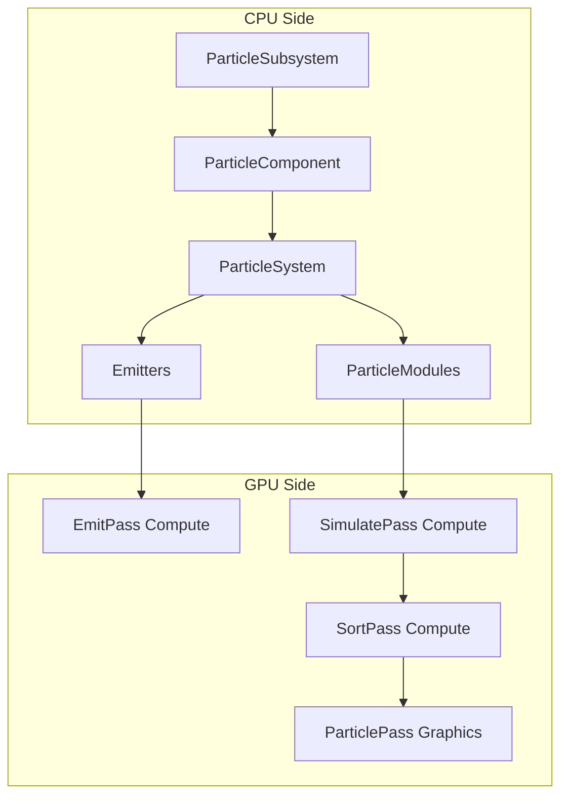

# RenderVerseX 粒子系统设计方案

## 1. 系统架构概述

粒子系统采用 **GPU 驱动** 的设计，利用 Compute Shader 进行粒子模拟，通过 Indirect Draw 进行渲染，与现有的 `GPUCulling` 和 `RenderGraph` 深度集成。



## 2. 模块目录结构

遵循引擎现有模块约定（参考 [Audio/](Audio/) 模块）：

```
Particle/
├── CMakeLists.txt
├── Include/
│   └── Particle/
│       ├── Particle.h                    # 统一头文件
│       ├── ParticleTypes.h               # 核心类型定义
│       ├── ParticleSubsystem.h           # 引擎子系统
│       ├── ParticleSystem.h              # 粒子系统定义
│       ├── ParticleSystemInstance.h      # 运行时实例
│       ├── ParticlePool.h                # 对象池
│       ├── ParticleLOD.h                 # LOD 配置
│       ├── Curves/
│       │   ├── AnimationCurve.h          # 动画曲线
│       │   └── GradientCurve.h           # 颜色渐变
│       ├── Emitters/
│       │   ├── IEmitter.h                # 发射器接口
│       │   ├── PointEmitter.h
│       │   ├── BoxEmitter.h
│       │   ├── SphereEmitter.h
│       │   ├── ConeEmitter.h
│       │   └── MeshEmitter.h
│       ├── Modules/
│       │   ├── IParticleModule.h         # 模块接口
│       │   ├── LifetimeModule.h
│       │   ├── VelocityModule.h
│       │   ├── ForceModule.h
│       │   ├── ColorOverLifetimeModule.h
│       │   ├── SizeOverLifetimeModule.h
│       │   ├── RotationModule.h
│       │   ├── NoiseModule.h
│       │   ├── CollisionModule.h
│       │   ├── SubEmitterModule.h
│       │   ├── TextureSheetModule.h      # [新增] 纹理动画
│       │   ├── TrailModule.h             # [新增] 拖尾配置
│       │   └── LightsModule.h            # [新增] 粒子光源
│       ├── Events/
│       │   ├── ParticleEvent.h           # [新增] 事件类型
│       │   └── ParticleEventHandler.h    # [新增] 事件回调
│       ├── Rendering/
│       │   ├── ParticleRenderer.h        # GPU 渲染管理
│       │   ├── ParticlePass.h            # IRenderPass 实现
│       │   ├── ParticleMaterial.h        # 粒子材质
│       │   ├── SoftParticleConfig.h      # [新增] 软粒子配置
│       │   └── TrailRenderer.h           # [新增] 拖尾渲染器
│       └── GPU/
│           ├── ParticleGPUData.h         # GPU 数据结构
│           ├── IParticleSimulator.h      # [新增] 模拟器接口
│           ├── GPUParticleSimulator.h    # GPU Compute 模拟器
│           ├── CPUParticleSimulator.h    # [新增] CPU 回退模拟器
│           └── ParticleSorter.h          # GPU 排序
├── Private/
│   ├── ParticleSubsystem.cpp
│   ├── ParticleSystem.cpp
│   ├── ParticleSystemInstance.cpp
│   ├── ParticlePool.cpp
│   ├── Curves/
│   │   └── [实现文件...]
│   ├── Emitters/
│   │   └── [实现文件...]
│   ├── Modules/
│   │   └── [实现文件...]
│   ├── Events/
│   │   └── [实现文件...]
│   ├── Rendering/
│   │   └── [实现文件...]
│   └── GPU/
│       └── [实现文件...]
└── Shaders/
    ├── ParticleEmit.hlsl
    ├── ParticleSimulate.hlsl
    ├── ParticleCompact.hlsl
    ├── ParticleBitonicSort.hlsl
    ├── ParticleBillboard.hlsl
    ├── ParticleStretchedBillboard.hlsl
    ├── ParticleTrail.hlsl
    └── Include/
        ├── ParticleCommon.hlsli
        ├── NoiseUtils.hlsli
        └── SoftParticle.hlsli

# 编辑器扩展（放在 Editor 模块）
Editor/
├── Include/Editor/Panels/
│   └── ParticleEditor.h                  # [新增] 粒子编辑面板
└── Private/Panels/
    └── ParticleEditor.cpp
```

## 3. 核心类型定义

### 3.1 粒子数据结构 (GPU)

```cpp
// ParticleTypes.h
namespace RVX::Particle
{
    /// GPU 粒子数据 (64 bytes, cache-friendly)
    struct GPUParticle
    {
        Vec3 position;           // 12 bytes
        float lifetime;          // 4 bytes
        Vec3 velocity;           // 12 bytes
        float age;               // 4 bytes
        Vec4 color;              // 16 bytes
        Vec2 size;               // 8 bytes
        float rotation;          // 4 bytes
        uint32 flags;            // 4 bytes (alive, emitter id, etc.)
    };

    /// 发射器类型
    enum class EmitterShape : uint8
    {
        Point,
        Box,
        Sphere,
        Hemisphere,
        Cone,
        Circle,
        Edge,
        Mesh
    };

    /// 粒子渲染模式
    enum class ParticleRenderMode : uint8
    {
        Billboard,               // 面向相机
        StretchedBillboard,      // 速度方向拉伸
        HorizontalBillboard,     // 水平面
        VerticalBillboard,       // 垂直面
        Mesh,                    // 3D 网格
        Trail                    // 拖尾
    };

    /// 粒子混合模式
    enum class ParticleBlendMode : uint8
    {
        Additive,
        AlphaBlend,
        Multiply,
        Premultiplied
    };
}
```

### 3.2 动画曲线和渐变类型

```cpp
// Curves/AnimationCurve.h
namespace RVX::Particle
{
    /// 曲线关键帧
    struct CurveKeyframe
    {
        float time;              // 0-1 归一化时间
        float value;
        float inTangent = 0.0f;
        float outTangent = 0.0f;
    };

    /// 动画曲线（用于 Size/Alpha/Speed over lifetime）
    class AnimationCurve
    {
    public:
        std::vector<CurveKeyframe> keyframes;
        
        float Evaluate(float t) const;
        
        // 预设工厂方法
        static AnimationCurve Linear();
        static AnimationCurve EaseIn();
        static AnimationCurve EaseOut();
        static AnimationCurve EaseInOut();
        static AnimationCurve Constant(float value);
        
        // GPU 数据导出（烘焙为查找表）
        void BakeToLUT(float* outData, uint32 samples) const;
    };
}

// Curves/GradientCurve.h
namespace RVX::Particle
{
    /// 渐变关键帧
    struct GradientKey
    {
        float time;              // 0-1 归一化时间
        Vec4 color;              // RGBA
    };

    /// 颜色渐变曲线
    class GradientCurve
    {
    public:
        std::vector<GradientKey> keys;
        
        Vec4 Evaluate(float t) const;
        
        // 预设
        static GradientCurve White();
        static GradientCurve FadeOut();  // 白到透明
        static GradientCurve Fire();     // 黄->橙->红->黑
        
        // GPU 数据导出
        void BakeToLUT(Vec4* outData, uint32 samples) const;
    };
}
```

### 3.2 粒子系统定义

```cpp
// ParticleSystem.h - 资产定义（可序列化）
class ParticleSystem
{
public:
    using Ptr = std::shared_ptr<ParticleSystem>;

    // 基本属性
    std::string name;
    uint32 maxParticles = 10000;
    float duration = 5.0f;
    bool looping = true;
    bool prewarm = false;
    
    // 发射器列表
    std::vector<std::unique_ptr<IEmitter>> emitters;
    
    // 行为模块列表（按执行顺序）
    std::vector<std::unique_ptr<IParticleModule>> modules;
    
    // 渲染设置
    ParticleRenderMode renderMode = ParticleRenderMode::Billboard;
    ParticleBlendMode blendMode = ParticleBlendMode::AlphaBlend;
    std::string materialPath;
    
    // 空间设置
    bool worldSpace = true;  // true: 世界空间, false: 本地空间
    
    // 排序
    bool sortByDistance = true;
};
```

## 4. 发射器设计

### 4.1 发射器接口

```cpp
// IEmitter.h
class IEmitter
{
public:
    virtual ~IEmitter() = default;
    
    virtual const char* GetTypeName() const = 0;
    virtual EmitterShape GetShape() const = 0;
    
    // 发射配置
    float emissionRate = 10.0f;           // 每秒粒子数
    uint32 burstCount = 0;                // 突发数量
    float burstInterval = 0.0f;           // 突发间隔
    
    // 初始属性范围
    FloatRange initialLifetime{1.0f, 2.0f};
    FloatRange initialSpeed{1.0f, 5.0f};
    Vec3Range initialVelocity{{0,1,0}, {0,1,0}};
    ColorRange initialColor{Vec4(1), Vec4(1)};
    FloatRange initialSize{0.1f, 0.2f};
    FloatRange initialRotation{0.0f, 360.0f};
    
    // 生成发射参数（上传到 GPU）
    virtual void GetEmitParams(EmitterGPUData& outData) const = 0;
};
```

### 4.2 具体发射器

```cpp
// PointEmitter.h
class PointEmitter : public IEmitter
{
public:
    const char* GetTypeName() const override { return "PointEmitter"; }
    EmitterShape GetShape() const override { return EmitterShape::Point; }
};

// SphereEmitter.h
class SphereEmitter : public IEmitter
{
public:
    float radius = 1.0f;
    float radiusThickness = 0.0f;  // 0 = 表面, 1 = 实心
    bool emitFromShell = false;
    
    EmitterShape GetShape() const override { return EmitterShape::Sphere; }
};

// ConeEmitter.h
class ConeEmitter : public IEmitter
{
public:
    float angle = 25.0f;          // 锥角（度）
    float radius = 1.0f;          // 底部半径
    float length = 5.0f;          // 锥体长度
    bool emitFromBase = true;     // 从底部发射
    
    EmitterShape GetShape() const override { return EmitterShape::Cone; }
};
```

## 5. 行为模块设计

### 5.1 模块接口

```cpp
// IParticleModule.h
class IParticleModule
{
public:
    virtual ~IParticleModule() = default;
    
    virtual const char* GetTypeName() const = 0;
    virtual bool IsGPUModule() const { return true; }
    
    // 生成 GPU 常量数据
    virtual void GetGPUData(void* outData, size_t maxSize) const = 0;
    virtual size_t GetGPUDataSize() const = 0;
    
    bool enabled = true;
};
```

### 5.2 核心模块

```cpp
// ColorOverLifetimeModule.h
class ColorOverLifetimeModule : public IParticleModule
{
public:
    const char* GetTypeName() const override { return "ColorOverLifetime"; }
    
    // 支持渐变曲线
    GradientCurve colorGradient;
    GradientCurve alphaGradient;
};

// SizeOverLifetimeModule.h
class SizeOverLifetimeModule : public IParticleModule
{
public:
    AnimationCurve sizeCurve;      // 0-1 归一化生命周期
    Vec2 sizeMultiplier{1.0f, 1.0f};
};

// ForceModule.h
class ForceModule : public IParticleModule
{
public:
    Vec3 gravity{0.0f, -9.81f, 0.0f};
    Vec3 constantForce{0.0f, 0.0f, 0.0f};
    float drag = 0.0f;
};

// NoiseModule.h
class NoiseModule : public IParticleModule
{
public:
    float strength = 1.0f;
    float frequency = 1.0f;
    float scrollSpeed = 0.0f;
    uint32 octaves = 1;
    bool separateAxes = false;
};

// CollisionModule.h
class CollisionModule : public IParticleModule
{
public:
    enum class CollisionType { World, Planes };
    
    CollisionType type = CollisionType::Planes;
    float bounce = 0.5f;
    float lifetimeLoss = 0.0f;
    float radiusScale = 1.0f;
    std::vector<Vec4> planes;  // xyz = normal, w = distance
};

// TextureSheetModule.h [新增]
class TextureSheetModule : public IParticleModule
{
public:
    const char* GetTypeName() const override { return "TextureSheet"; }
    
    UVec2 tiles{4, 4};                    // 网格分割
    uint32 frameCount = 0;                // 0 = tiles.x * tiles.y
    float frameRate = 30.0f;
    AnimationCurve frameOverTime;         // 帧选择曲线
    uint32 startFrame = 0;
    bool randomStartFrame = false;
    
    // 计算 UV
    void GetUVTransform(float normalizedAge, Vec2& outOffset, Vec2& outScale) const;
};

// TrailModule.h [新增]
class TrailModule : public IParticleModule
{
public:
    const char* GetTypeName() const override { return "Trail"; }
    
    float width = 0.5f;
    float lifetime = 1.0f;
    uint32 maxPoints = 50;                // 每粒子最大拖尾点数
    float minVertexDistance = 0.1f;       // 最小顶点间距
    AnimationCurve widthOverTrail;        // 沿拖尾的宽度
    GradientCurve colorOverTrail;         // 沿拖尾的颜色
    bool inheritParticleColor = true;
    bool dieWithParticle = true;
};

// LightsModule.h [新增]
class LightsModule : public IParticleModule
{
public:
    const char* GetTypeName() const override { return "Lights"; }
    
    float intensity = 1.0f;
    float range = 5.0f;
    float ratio = 0.1f;                   // 发光粒子比例
    uint32 maxLights = 10;                // 最大动态光源数
    bool useParticleColor = true;
    AnimationCurve intensityOverLifetime;
    
    // 与 LightManager 集成
    void UpdateLights(const std::vector<GPUParticle>& particles, 
                      class LightManager* lightManager);
};
```

## 6. GPU 模拟管线

### 6.1 模拟器设计

```cpp
// ParticleSimulator.h
class ParticleSimulator
{
public:
    void Initialize(IRHIDevice* device, uint32 maxParticles);
    void Shutdown();
    
    // 每帧执行
    void Emit(RHICommandContext& ctx, const EmitParams& params);
    void Simulate(RHICommandContext& ctx, float deltaTime, const SimulateParams& params);
    void Compact(RHICommandContext& ctx);  // 压缩死亡粒子
    
    // GPU 资源
    RHIBuffer* GetParticleBuffer() const;
    RHIBuffer* GetAliveCountBuffer() const;
    RHIBuffer* GetIndirectDrawBuffer() const;

private:
    RHIBufferRef m_particleBufferA;     // 双缓冲
    RHIBufferRef m_particleBufferB;
    RHIBufferRef m_aliveIndexBuffer;
    RHIBufferRef m_deadIndexBuffer;
    RHIBufferRef m_counterBuffer;        // alive/dead 计数
    RHIBufferRef m_indirectArgsBuffer;
    
    RHIPipelineRef m_emitPipeline;
    RHIPipelineRef m_simulatePipeline;
    RHIPipelineRef m_compactPipeline;
};
```

### 6.2 GPU 排序（用于透明粒子）

```cpp
// ParticleSorter.h
class ParticleSorter
{
public:
    void Initialize(IRHIDevice* device, uint32 maxParticles);
    
    // 基于 GPU 的双调排序
    void Sort(RHICommandContext& ctx, 
              RHIBuffer* particleBuffer,
              RHIBuffer* indexBuffer,
              uint32 particleCount,
              const Vec3& cameraPosition);

private:
    RHIPipelineRef m_bitonicSortPipeline;
    RHIPipelineRef m_bitonicMergePipeline;
};
```

### 6.3 CPU 回退模拟器 [新增]

对于不支持 Compute Shader 的平台（OpenGL < 4.3, DX11 Feature Level < 11.0），提供 CPU 回退：

```cpp
// GPU/IParticleSimulator.h
class IParticleSimulator
{
public:
    virtual ~IParticleSimulator() = default;
    
    virtual void Initialize(IRHIDevice* device, uint32 maxParticles) = 0;
    virtual void Shutdown() = 0;
    
    virtual void Emit(const EmitParams& params) = 0;
    virtual void Simulate(float deltaTime, const SimulateParams& params) = 0;
    virtual void PrepareRender(RHICommandContext& ctx) = 0;
    
    virtual RHIBuffer* GetParticleBuffer() const = 0;
    virtual RHIBuffer* GetIndirectDrawBuffer() const = 0;
    virtual uint32 GetAliveCount() const = 0;
    
    virtual bool IsGPUBased() const = 0;
};

// GPU/CPUParticleSimulator.h
class CPUParticleSimulator : public IParticleSimulator
{
public:
    bool IsGPUBased() const override { return false; }
    
    void Emit(const EmitParams& params) override;
    void Simulate(float deltaTime, const SimulateParams& params) override;
    void PrepareRender(RHICommandContext& ctx) override;  // 上传到 GPU Buffer

private:
    std::vector<CPUParticle> m_particles;
    std::vector<uint32> m_aliveIndices;
    std::vector<uint32> m_deadIndices;
    
    // 使用 JobSystem 并行模拟
    void SimulateParallel(float deltaTime, const SimulateParams& params);
    
    // GPU 上传缓冲
    RHIBufferRef m_uploadBuffer;
    RHIBufferRef m_particleBuffer;
    RHIBufferRef m_indirectArgsBuffer;
};
```

### 6.4 后端能力检查 [新增]

```cpp
// ParticleSubsystem 初始化时检查 Compute Shader 支持
void ParticleSubsystem::Initialize()
{
    auto& caps = m_device->GetCapabilities();
    m_gpuSimulationSupported = true;
    
    // OpenGL 需要 4.3+ 才支持 Compute Shader
    if (caps.backendType == RHIBackendType::OpenGL)
    {
        if (!caps.opengl.hasComputeShader)
        {
            RVX_CORE_WARN("ParticleSubsystem: OpenGL Compute Shader unavailable, using CPU fallback");
            m_gpuSimulationSupported = false;
        }
    }
    
    // DX11 需要 Feature Level 11.0+
    if (caps.backendType == RHIBackendType::DX11)
    {
        if (caps.dx11.featureLevel < 0xB000)
        {
            RVX_CORE_WARN("ParticleSubsystem: DX11 Feature Level < 11.0, using CPU fallback");
            m_gpuSimulationSupported = false;
        }
    }
    
    // 创建合适的模拟器
    if (m_gpuSimulationSupported)
        m_simulator = std::make_unique<GPUParticleSimulator>();
    else
        m_simulator = std::make_unique<CPUParticleSimulator>();
    
    m_simulator->Initialize(m_device, m_config.maxGlobalParticles);
}
```

## 7. 渲染集成

### 7.1 ParticlePass（继承 IRenderPass）

```cpp
// ParticlePass.h
class ParticlePass : public IRenderPass
{
public:
    const char* GetName() const override { return "ParticlePass"; }
    int32_t GetPriority() const override { return PassPriority::Transparent + 50; }  // 透明物体之后
    
    void Setup(RenderGraphBuilder& builder, const ViewData& view) override;
    void Execute(RHICommandContext& ctx, const ViewData& view) override;
    
    void SetParticleSystems(const std::vector<ParticleSystemInstance*>& instances);

private:
    // 按混合模式分组的绘制列表
    struct DrawBatch
    {
        ParticleBlendMode blendMode;
        RHIPipeline* pipeline;
        std::vector<ParticleSystemInstance*> instances;
    };
    
    std::vector<DrawBatch> m_batches;
    RGTextureHandle m_colorTarget;
    RGTextureHandle m_depthTarget;
};
```

### 7.2 渲染模式

```cpp
// ParticleRenderer.h
class ParticleRenderer
{
public:
    void Initialize(IRHIDevice* device, PipelineCache* pipelineCache);
    
    // 不同渲染模式的管线
    RHIPipeline* GetBillboardPipeline(ParticleBlendMode blend, bool softParticle);
    RHIPipeline* GetStretchedBillboardPipeline(ParticleBlendMode blend, bool softParticle);
    RHIPipeline* GetMeshPipeline(ParticleBlendMode blend);
    RHIPipeline* GetTrailPipeline(ParticleBlendMode blend, bool softParticle);
    
    // 绘制
    void DrawParticles(RHICommandContext& ctx,
                       ParticleSystemInstance* instance,
                       const ViewData& view,
                       RHITexture* depthTexture);  // 用于 Soft Particles

private:
    std::unordered_map<uint32, RHIPipelineRef> m_pipelineCache;
    RHIBufferRef m_quadVertexBuffer;   // Billboard 四边形
};
```

### 7.3 Soft Particles [新增]

利用场景深度缓冲实现软边缘效果，避免粒子与几何体相交时的硬边：

```cpp
// Rendering/SoftParticleConfig.h
struct SoftParticleConfig
{
    bool enabled = true;
    float fadeDistance = 0.5f;      // 淡出距离（世界单位）
    float contrastPower = 1.0f;     // 淡出对比度
};

// HLSL 实现 (Include/SoftParticle.hlsli)
// float ComputeSoftParticleFade(float particleDepth, float sceneDepth, float fadeDistance)
// {
//     float depthDiff = sceneDepth - particleDepth;
//     return saturate(depthDiff / fadeDistance);
// }
```

### 7.4 Trail/Ribbon 渲染器 [新增]

```cpp
// Rendering/TrailRenderer.h
struct TrailVertex
{
    Vec3 position;
    Vec3 direction;      // 用于计算宽度方向
    float width;
    float texCoordU;     // 沿拖尾方向的 UV
    Vec4 color;
};

class TrailRenderer
{
public:
    void Initialize(IRHIDevice* device, uint32 maxTrailVertices);
    
    void BeginFrame();
    void AddTrailSegment(uint32 particleId, const Vec3& position, 
                         float width, const Vec4& color);
    void EndFrame(RHICommandContext& ctx);
    
    void Draw(RHICommandContext& ctx, const ViewData& view);

private:
    RHIBufferRef m_trailVertexBuffer;
    RHIBufferRef m_trailIndexBuffer;
    
    // 每个粒子的拖尾点历史
    struct TrailHistory
    {
        std::vector<TrailVertex> points;
        float age = 0.0f;
    };
    std::unordered_map<uint32, TrailHistory> m_trailHistories;
};
```

## 8. 引擎集成

### 8.1 ParticleSubsystem

```cpp
// ParticleSubsystem.h
class ParticleSubsystem : public EngineSubsystem
{
public:
    const char* GetName() const override { return "ParticleSubsystem"; }
    bool ShouldTick() const override { return true; }
    TickPhase GetTickPhase() const override { return TickPhase::PreRender; }
    
    RVX_SUBSYSTEM_DEPENDENCIES(RenderSubsystem, ResourceSubsystem);
    
    void Initialize() override;
    void Deinitialize() override;
    void Tick(float deltaTime) override;
    
    // 粒子系统管理
    ParticleSystemInstance* CreateInstance(ParticleSystem::Ptr system);
    void DestroyInstance(ParticleSystemInstance* instance);
    
    // 模拟和渲染
    void Simulate(float deltaTime);
    void PrepareRender(const ViewData& view);
    
    // 获取可见粒子系统
    const std::vector<ParticleSystemInstance*>& GetVisibleInstances() const;

private:
    std::unique_ptr<ParticleSimulator> m_simulator;
    std::unique_ptr<ParticleSorter> m_sorter;
    std::unique_ptr<ParticleRenderer> m_renderer;
    
    std::vector<std::unique_ptr<ParticleSystemInstance>> m_instances;
    std::vector<ParticleSystemInstance*> m_visibleInstances;
};
```

### 8.2 ParticleComponent

```cpp
// ParticleComponent.h (放在 Scene/Components/ 目录)
class ParticleComponent : public Component
{
public:
    const char* GetTypeName() const override { return "ParticleComponent"; }
    bool ProvidesBounds() const override { return true; }
    AABB GetLocalBounds() const override;
    
    void OnAttach() override;
    void OnDetach() override;
    void Tick(float deltaTime) override;
    
    // 设置粒子系统
    void SetParticleSystem(ParticleSystem::Ptr system);
    ParticleSystem::Ptr GetParticleSystem() const;
    
    // 播放控制
    void Play();
    void Stop();
    void Pause();
    void Clear();
    bool IsPlaying() const;
    
    // 参数覆盖
    void SetEmissionRate(float rate);
    void SetStartColor(const Vec4& color);
    void SetStartSize(float size);

private:
    ParticleSystem::Ptr m_particleSystem;
    ParticleSystemInstance* m_instance = nullptr;
    bool m_autoPlay = true;
};
```

### 8.3 粒子事件系统 [新增]

```cpp
// Events/ParticleEvent.h
enum class ParticleEventType : uint8
{
    OnBirth,          // 粒子生成时
    OnDeath,          // 粒子死亡时
    OnCollision,      // 粒子碰撞时
    OnTriggerEnter,   // 进入触发器区域
    OnTriggerExit     // 离开触发器区域
};

struct ParticleEvent
{
    ParticleEventType type;
    Vec3 position;
    Vec3 velocity;
    Vec4 color;
    uint32 particleIndex;
    uint32 emitterIndex;
    float age;
    float lifetime;
};

// Events/ParticleEventHandler.h
class ParticleEventHandler
{
public:
    using Callback = std::function<void(const ParticleEvent&)>;
    
    void RegisterCallback(ParticleEventType type, Callback callback);
    void UnregisterCallback(ParticleEventType type);
    
    void DispatchEvents(const std::vector<ParticleEvent>& events);
    
    // 便捷方法
    void OnBirth(Callback callback) { RegisterCallback(ParticleEventType::OnBirth, callback); }
    void OnDeath(Callback callback) { RegisterCallback(ParticleEventType::OnDeath, callback); }
    void OnCollision(Callback callback) { RegisterCallback(ParticleEventType::OnCollision, callback); }

private:
    std::unordered_map<ParticleEventType, std::vector<Callback>> m_callbacks;
};

// 使用示例：
// instance->GetEventHandler().OnDeath([](const ParticleEvent& e) {
//     AudioSubsystem::Get().PlaySound3D("pop.wav", e.position);
// });
```

### 8.4 LOD 系统 [新增]

```cpp
// ParticleLOD.h
struct ParticleLODLevel
{
    float distance;                     // 切换距离
    float emissionRateMultiplier;       // 发射率倍率 (0.0 - 1.0)
    float simulationRateMultiplier;     // 模拟频率倍率
    uint32 maxParticles;                // 该级别最大粒子数
    bool disableCollision;              // 禁用碰撞模块
    bool disableNoise;                  // 禁用噪声模块
    bool disableTrail;                  // 禁用拖尾
    bool disableLights;                 // 禁用动态光源
};

class ParticleLODConfig
{
public:
    std::vector<ParticleLODLevel> levels;
    bool fadeTransition = true;         // 平滑过渡
    float fadeRange = 5.0f;             // 过渡距离
    float cullDistance = 100.0f;        // 完全剔除距离
    
    const ParticleLODLevel& GetLevel(float distance) const;
    float GetTransitionAlpha(float distance) const;
    
    // 预设
    static ParticleLODConfig Default();
    static ParticleLODConfig HighPerformance();
    static ParticleLODConfig HighQuality();
};
```

### 8.5 对象池 [新增]

```cpp
// ParticlePool.h
class ParticlePool
{
public:
    static ParticlePool& Get();
    
    /// 获取粒子系统实例（优先从池中获取）
    ParticleSystemInstance* Acquire(ParticleSystem::Ptr system);
    
    /// 归还实例到池中
    void Release(ParticleSystemInstance* instance);
    
    /// 预热：提前创建实例
    void Prewarm(ParticleSystem::Ptr system, uint32 count);
    
    /// 设置特定系统的池大小
    void SetPoolSize(ParticleSystem::Ptr system, uint32 size);
    
    /// 清理未使用的实例
    void Cleanup(float maxIdleTime = 30.0f);
    
    /// 清空所有池
    void Clear();

private:
    struct PoolEntry
    {
        std::unique_ptr<ParticleSystemInstance> instance;
        float idleTime = 0.0f;
    };
    
    std::unordered_map<ParticleSystem*, std::vector<PoolEntry>> m_pools;
    std::unordered_map<ParticleSystem*, uint32> m_poolSizes;
};

// ParticleSystemInstance Prewarm 支持
class ParticleSystemInstance
{
public:
    /// 预热：快速模拟到指定时间点
    void Prewarm(float duration)
    {
        const float step = 1.0f / 60.0f;  // 60 FPS 模拟
        for (float t = 0.0f; t < duration; t += step)
        {
            Simulate(step);
        }
    }
};
```

## 9. Shader 设计

### 9.1 Compute Shader - 发射

```hlsl
// ParticleEmit.hlsl
[numthreads(64, 1, 1)]
void CSMain(uint3 DTid : SV_DispatchThreadID)
{
    uint particleIndex = DTid.x;
    if (particleIndex >= emitCount) return;
    
    // 从死亡列表获取槽位
    uint deadIndex;
    InterlockedAdd(counters[1], -1, deadIndex);
    if (deadIndex == 0) return;
    
    uint slot = deadList[deadIndex - 1];
    
    // 初始化粒子
    GPUParticle p;
    p.position = EmitterPosition(emitterData, Random(seed + particleIndex));
    p.velocity = EmitterVelocity(emitterData, Random(seed + particleIndex + 1));
    p.lifetime = lerp(minLifetime, maxLifetime, Random(seed + particleIndex + 2));
    p.age = 0.0;
    p.color = startColor;
    p.size = lerp(minSize, maxSize, Random(seed + particleIndex + 3));
    p.rotation = lerp(minRotation, maxRotation, Random(seed + particleIndex + 4));
    p.flags = PARTICLE_ALIVE;
    
    particles[slot] = p;
    
    // 添加到活跃列表
    uint aliveIndex;
    InterlockedAdd(counters[0], 1, aliveIndex);
    aliveList[aliveIndex] = slot;
}
```

### 9.2 Compute Shader - 模拟

```hlsl
// ParticleSimulate.hlsl
[numthreads(256, 1, 1)]
void CSMain(uint3 DTid : SV_DispatchThreadID)
{
    uint index = DTid.x;
    if (index >= aliveCount) return;
    
    uint particleIndex = aliveList[index];
    GPUParticle p = particles[particleIndex];
    
    // 更新年龄
    p.age += deltaTime;
    
    // 检查死亡
    if (p.age >= p.lifetime)
    {
        p.flags &= ~PARTICLE_ALIVE;
        uint deadIndex;
        InterlockedAdd(counters[1], 1, deadIndex);
        deadList[deadIndex] = particleIndex;
        particles[particleIndex] = p;
        return;
    }
    
    float normalizedAge = p.age / p.lifetime;
    
    // 应用力
    p.velocity += gravity * deltaTime;
    p.velocity += constantForce * deltaTime;
    p.velocity *= (1.0 - drag * deltaTime);
    
    // 噪声扰动
    if (noiseEnabled)
    {
        float3 noiseOffset = SimplexNoise3D(p.position * noiseFrequency + time * noiseScrollSpeed);
        p.velocity += noiseOffset * noiseStrength * deltaTime;
    }
    
    // 碰撞检测
    if (collisionEnabled)
    {
        for (uint i = 0; i < planeCount; i++)
        {
            float4 plane = collisionPlanes[i];
            float dist = dot(p.position, plane.xyz) + plane.w;
            if (dist < p.size.x * radiusScale)
            {
                p.velocity = reflect(p.velocity, plane.xyz) * bounce;
                p.position += plane.xyz * (p.size.x * radiusScale - dist);
                p.lifetime -= p.lifetime * lifetimeLoss;
            }
        }
    }
    
    // 更新位置
    p.position += p.velocity * deltaTime;
    
    // 颜色/大小 over lifetime
    p.color = SampleGradient(colorGradient, normalizedAge);
    p.size = startSize * SampleCurve(sizeCurve, normalizedAge);
    
    // 保存
    particles[particleIndex] = p;
    newAliveList[index] = particleIndex;
}
```

### 9.3 Vertex/Pixel Shader - Billboard

```hlsl
// ParticleBillboard.hlsl
struct VSInput
{
    uint vertexID : SV_VertexID;
    uint instanceID : SV_InstanceID;
};

struct VSOutput
{
    float4 position : SV_Position;
    float4 color : COLOR;
    float2 uv : TEXCOORD0;
};

VSOutput VSMain(VSInput input)
{
    uint particleIndex = aliveList[input.instanceID];
    GPUParticle p = particles[particleIndex];
    
    // Billboard 顶点 (0-3)
    float2 corners[4] = { {-1,-1}, {1,-1}, {-1,1}, {1,1} };
    float2 corner = corners[input.vertexID];
    
    // 旋转
    float s = sin(p.rotation);
    float c = cos(p.rotation);
    corner = float2(corner.x * c - corner.y * s, corner.x * s + corner.y * c);
    
    // 世界空间 billboard
    float3 worldPos = p.position;
    worldPos += cameraRight * corner.x * p.size.x;
    worldPos += cameraUp * corner.y * p.size.y;
    
    VSOutput output;
    output.position = mul(viewProjection, float4(worldPos, 1.0));
    output.color = p.color;
    output.uv = corners[input.vertexID] * 0.5 + 0.5;
    return output;
}

float4 PSMain(VSOutput input) : SV_Target
{
    float4 texColor = particleTexture.Sample(linearSampler, input.uv);
    return texColor * input.color;
}
```

## 10. 序列化与资产管线 [新增]

### 10.1 序列化支持

```cpp
// ParticleSystem 序列化
class ParticleSystem : public ISerializable
{
public:
    void Serialize(Archive& archive) override
    {
        archive.Serialize("name", name);
        archive.Serialize("maxParticles", maxParticles);
        archive.Serialize("duration", duration);
        archive.Serialize("looping", looping);
        archive.Serialize("prewarm", prewarm);
        archive.Serialize("worldSpace", worldSpace);
        archive.Serialize("sortByDistance", sortByDistance);
        
        // 枚举需要转换
        int32 rm = static_cast<int32>(renderMode);
        archive.Serialize("renderMode", rm);
        renderMode = static_cast<ParticleRenderMode>(rm);
        
        int32 bm = static_cast<int32>(blendMode);
        archive.Serialize("blendMode", bm);
        blendMode = static_cast<ParticleBlendMode>(bm);
        
        archive.Serialize("materialPath", materialPath);
        
        // 多态序列化
        archive.SerializePolymorphic("emitters", emitters);
        archive.SerializePolymorphic("modules", modules);
        
        // LOD 配置
        archive.Serialize("lodConfig", lodConfig);
        
        // 软粒子配置
        archive.Serialize("softParticleConfig", softParticleConfig);
    }
};

// 类型注册（在模块初始化时）
void RegisterParticleTypes()
{
    auto& registry = TypeRegistry::Get();
    
    // 发射器
    registry.RegisterType<PointEmitter>("PointEmitter");
    registry.RegisterType<BoxEmitter>("BoxEmitter");
    registry.RegisterType<SphereEmitter>("SphereEmitter");
    registry.RegisterType<ConeEmitter>("ConeEmitter");
    registry.RegisterType<MeshEmitter>("MeshEmitter");
    
    // 模块
    registry.RegisterType<LifetimeModule>("LifetimeModule");
    registry.RegisterType<VelocityModule>("VelocityModule");
    registry.RegisterType<ForceModule>("ForceModule");
    registry.RegisterType<ColorOverLifetimeModule>("ColorOverLifetimeModule");
    registry.RegisterType<SizeOverLifetimeModule>("SizeOverLifetimeModule");
    registry.RegisterType<RotationModule>("RotationModule");
    registry.RegisterType<NoiseModule>("NoiseModule");
    registry.RegisterType<CollisionModule>("CollisionModule");
    registry.RegisterType<TextureSheetModule>("TextureSheetModule");
    registry.RegisterType<TrailModule>("TrailModule");
    registry.RegisterType<LightsModule>("LightsModule");
    registry.RegisterType<SubEmitterModule>("SubEmitterModule");
}
```

### 10.2 资源加载器

```cpp
// ParticleSystemLoader.h
class ParticleSystemLoader : public IResourceLoader
{
public:
    ResourceType GetResourceType() const override { return ResourceType::ParticleSystem; }
    
    std::vector<std::string> GetSupportedExtensions() const override
    {
        return { ".particle", ".vfx" };
    }
    
    IResource* Load(const std::string& path) override
    {
        auto system = std::make_shared<ParticleSystem>();
        
        JsonArchive archive;
        if (!archive.LoadFromFile(path))
            return nullptr;
        
        system->Serialize(archive);
        return new ParticleSystemResource(system);
    }
};

// 注册到 ResourceManager
void ParticleSubsystem::Initialize()
{
    // ...
    ResourceManager::Get().RegisterLoader(
        ResourceType::ParticleSystem,
        std::make_unique<ParticleSystemLoader>());
}
```

## 11. 编辑器集成 [新增]

### 11.1 粒子编辑面板

```cpp
// Editor/Include/Editor/Panels/ParticleEditor.h
class ParticleEditor : public IEditorPanel
{
public:
    const char* GetName() const override { return "Particle Editor"; }
    
    void OnGUI() override;
    
    void SetParticleSystem(ParticleSystem::Ptr system);
    ParticleSystem::Ptr GetParticleSystem() const { return m_system; }
    
    void SetPreviewEnabled(bool enabled) { m_previewEnabled = enabled; }

private:
    // UI 绘制方法
    void DrawSystemProperties();
    void DrawEmitterList();
    void DrawEmitterProperties(IEmitter* emitter);
    void DrawModuleList();
    void DrawModuleProperties(IParticleModule* module);
    
    // 专用编辑器
    void DrawCurveEditor(const char* label, AnimationCurve& curve);
    void DrawGradientEditor(const char* label, GradientCurve& gradient);
    void DrawRangeEditor(const char* label, FloatRange& range);
    void DrawVec3RangeEditor(const char* label, Vec3Range& range);
    
    // 预览
    void DrawPreviewWindow();
    void UpdatePreview(float deltaTime);
    
    ParticleSystem::Ptr m_system;
    ParticleSystemInstance* m_previewInstance = nullptr;
    bool m_previewEnabled = true;
    bool m_previewPaused = false;
    float m_previewTime = 0.0f;
    
    // 曲线编辑状态
    int m_selectedCurveKey = -1;
    bool m_editingCurve = false;
};
```

### 11.2 曲线编辑器

```cpp
// 曲线编辑器核心功能
void ParticleEditor::DrawCurveEditor(const char* label, AnimationCurve& curve)
{
    ImGui::Text("%s", label);
    
    // 绘制曲线背景网格
    ImVec2 canvasSize(200, 100);
    ImDrawList* drawList = ImGui::GetWindowDrawList();
    ImVec2 canvasPos = ImGui::GetCursorScreenPos();
    
    // 绘制曲线
    for (size_t i = 0; i < curve.keyframes.size() - 1; ++i)
    {
        // 使用贝塞尔曲线绘制关键帧之间的曲线
        // ...
    }
    
    // 绘制关键帧点（可拖拽）
    for (size_t i = 0; i < curve.keyframes.size(); ++i)
    {
        // 绘制可交互的控制点
        // ...
    }
    
    // 预设按钮
    if (ImGui::Button("Linear")) curve = AnimationCurve::Linear();
    ImGui::SameLine();
    if (ImGui::Button("Ease In")) curve = AnimationCurve::EaseIn();
    ImGui::SameLine();
    if (ImGui::Button("Ease Out")) curve = AnimationCurve::EaseOut();
}
```

### 11.3 Inspector 集成

```cpp
// 在 Inspector 中显示 ParticleComponent
template<>
void InspectorDrawer<ParticleComponent>::Draw(ParticleComponent* component)
{
    // 粒子系统资产选择
    if (ImGui::Button("Select Particle System"))
    {
        // 打开资产浏览器
    }
    
    // 显示当前系统名称
    if (auto system = component->GetParticleSystem())
    {
        ImGui::Text("System: %s", system->name.c_str());
        ImGui::Text("Particles: %u / %u", 
                    component->GetInstance()->GetAliveCount(),
                    system->maxParticles);
    }
    
    // 播放控制
    ImGui::Separator();
    if (ImGui::Button(component->IsPlaying() ? "Stop" : "Play"))
    {
        if (component->IsPlaying()) component->Stop();
        else component->Play();
    }
    ImGui::SameLine();
    if (ImGui::Button("Restart"))
    {
        component->Clear();
        component->Play();
    }
    
    // 参数覆盖
    ImGui::Separator();
    ImGui::Text("Overrides");
    
    float emissionRate = component->GetEmissionRateOverride();
    if (ImGui::DragFloat("Emission Rate", &emissionRate, 0.1f, 0.0f, 1000.0f))
        component->SetEmissionRate(emissionRate);
    
    // 打开详细编辑器
    if (ImGui::Button("Open Particle Editor"))
    {
        auto* editor = EditorContext::Get().GetPanel<ParticleEditor>();
        editor->SetParticleSystem(component->GetParticleSystem());
        editor->SetPreviewEnabled(true);
    }
}
```

## 12. 性能优化策略

### 12.1 GPU 优化

- **双缓冲粒子 Buffer**：避免读写冲突
- **Index Compaction**：使用 Append/Consume Buffer 或原子操作压缩活跃粒子
- **GPU 排序**：Bitonic Sort 实现，仅对透明粒子排序
- **Indirect Draw**：避免 CPU-GPU 同步
- **LOD**：基于距离减少粒子数量和模拟复杂度
- **Curve LUT Baking**：将 AnimationCurve/GradientCurve 烘焙为纹理查找表

### 12.2 CPU 优化

- **空间剔除**：利用 `SpatialSubsystem` 进行视锥剔除
- **Job System 集成**：使用 `JobSystem::ParallelFor` 更新多个粒子系统
- **对象池**：复用 `ParticleSystemInstance`
- **延迟事件分发**：批量处理粒子事件，避免每帧大量回调

### 12.3 内存优化

- 粒子数据 SoA 布局（可选，用于 CPU 模拟器）
- 按需分配粒子 Buffer
- 与 `TransientResourcePool` 集成临时资源
- Trail 历史数据使用环形缓冲区

## 13. 与现有系统集成点

| 系统 | 集成方式 |

|------|---------|

| RenderGraph | `ParticlePass` 声明资源依赖（颜色、深度），自动 barrier 管理 |

| SceneRenderer | 注册 `ParticlePass`，在透明 Pass 后执行（priority = 550） |

| Component | `ParticleComponent` 继承 `Component`，附加到 `SceneEntity` |

| ResourceManager | 注册 `ParticleSystemLoader` 加载 `.particle` 资产 |

| Spatial | `ParticleComponent::GetLocalBounds()` 支持空间查询和视锥剔除 |

| JobSystem | 并行更新多个粒子系统的 CPU 端逻辑 |

| Serialization | 所有类型实现 `ISerializable`，注册到 `TypeRegistry` |

| LightManager | `LightsModule` 动态添加/移除点光源 |

| Editor | `ParticleEditor` 面板，`Inspector` 集成 |

| RHICapabilities | 检查 Compute Shader 支持，决定 GPU/CPU 模拟路径 |

## 14. Shader 补充设计

### 14.1 Soft Particles Shader

```hlsl
// Include/SoftParticle.hlsli
Texture2D<float> sceneDepthTexture : register(t1);
SamplerState depthSampler : register(s1);

cbuffer SoftParticleParams : register(b2)
{
    float fadeDistance;
    float contrastPower;
    float2 invScreenSize;
};

float ComputeSoftParticleFade(float4 clipPos, float particleDepthVS)
{
    // 计算屏幕 UV
    float2 screenUV = clipPos.xy * invScreenSize;
    
    // 采样场景深度
    float sceneDepthNDC = sceneDepthTexture.Sample(depthSampler, screenUV);
    
    // 转换为视空间深度（假设使用反向深度）
    float sceneDepthVS = ConvertNDCToViewDepth(sceneDepthNDC);
    
    // 计算深度差并应用淡出
    float depthDiff = sceneDepthVS - particleDepthVS;
    float fade = saturate(depthDiff / fadeDistance);
    
    // 可选：应用对比度
    fade = pow(fade, contrastPower);
    
    return fade;
}

// 在 ParticleBillboard.hlsl 的 PSMain 中使用：
// float4 PSMain(VSOutput input) : SV_Target
// {
//     float4 texColor = particleTexture.Sample(linearSampler, input.uv);
//     float4 color = texColor * input.color;
//     
//     if (softParticleEnabled)
//     {
//         float fade = ComputeSoftParticleFade(input.clipPos, input.viewDepth);
//         color.a *= fade;
//     }
//     
//     return color;
// }
```

### 14.2 Texture Sheet Animation Shader

```hlsl
// Include/TextureSheet.hlsli
cbuffer TextureSheetParams : register(b3)
{
    float2 tileSize;      // 1.0 / tiles
    float2 tileCount;     // tiles.x, tiles.y
    float frameCount;
    float frameRate;
};

float2 GetTextureSheetUV(float2 baseUV, float age, float lifetime)
{
    float normalizedAge = age / lifetime;
    float frameIndex = floor(normalizedAge * frameCount);
    frameIndex = min(frameIndex, frameCount - 1);
    
    float row = floor(frameIndex / tileCount.x);
    float col = fmod(frameIndex, tileCount.x);
    
    float2 offset = float2(col, row) * tileSize;
    float2 uv = baseUV * tileSize + offset;
    
    return uv;
}
```

## 15. 后续扩展

### 近期扩展（Phase 2）

- **VFX Graph 编辑器**：节点式可视化编辑器（类似 Unity VFX Graph / Unreal Niagara）
- **GPU 深度碰撞**：使用场景深度缓冲进行碰撞检测
- **SDF 碰撞**：与 Signed Distance Field 进行碰撞
- **Vector Field**：外部力场/速度场支持

### 远期扩展（Phase 3）

- **体积粒子**：雾、云、烟等体积效果
- **流体模拟**：SPH 或网格流体
- **GPU 粒子物理**：与 GPU 物理引擎集成
- **粒子网格生成**：Marching Cubes 生成流体表面
- **多线程渲染**：Secondary Command Buffer 支持