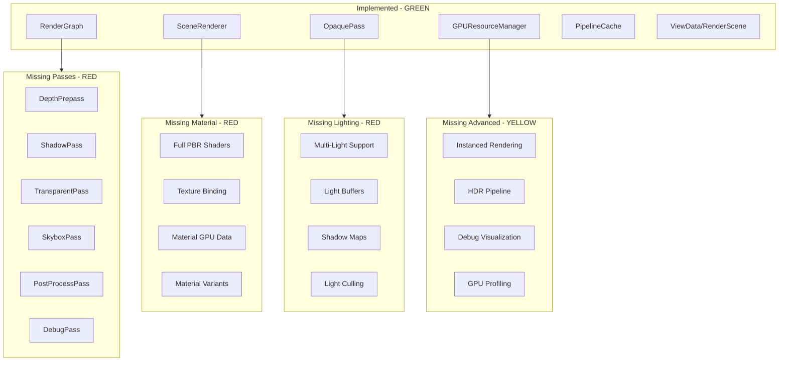
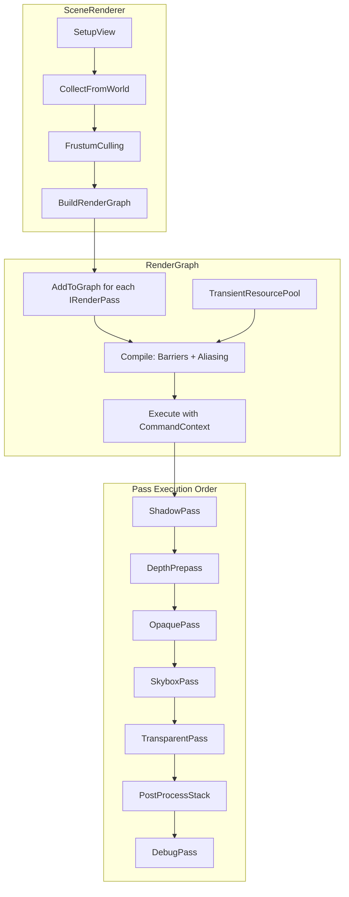

# Render Module Enhancement Plan

## Current State Analysis

### RenderGraph - Already Well Implemented

The RenderGraph has a mature implementation with:

| Feature | Status | Notes |

|---------|--------|-------|

| Pass Management | Done | AddPass with typed data, setup/execute callbacks |

| Resource State Tracking | Done | Full subresource-level for textures, range-level for buffers |

| Barrier Management | Done | Auto insertion, merging, cross-pass optimization |

| Pass Culling | Done | Dead-code elimination via dependency analysis |

| Topological Sort | Done | Proper execution order based on dependencies |

| Memory Aliasing | Done | Interval graph coloring for transient resources |

| Placed Resources | Done | Heap allocation for aliased resources |

| Debug Visualization | Done | Graphviz export |

| Compile Statistics | Done | Barriers, passes, memory savings |

### RenderGraph - Areas for Enhancement

| Feature | Priority | Description |

|---------|----------|-------------|

| IRenderPass Integration | High | IRenderPass not connected to RenderGraph callbacks |

| Resource Pooling | High | Transient resources recreated each frame |

| Async Compute | Medium | No multi-queue synchronization support |

| Auto View Creation | Medium | Views created externally, not by RenderGraph |

| Split Barriers | Low | DX12 split barriers for better overlap |

| Parallel Compilation | Low | Single-threaded barrier computation |

### Other Render Components

- **SceneRenderer**: Orchestrates rendering with view frustum culling and front-to-back sorting
- **OpaquePass**: Basic opaque geometry rendering with separate vertex buffers
- **GPUResourceManager**: Async GPU upload with priority queue and eviction
- **PipelineCache**: Pipeline caching with shader reflection

## Gap Analysis Overview



---

## Phase 0: RenderGraph Enhancements

### 0.1 IRenderPass Integration with RenderGraph

**Problem**: Currently `IRenderPass` and `RenderGraph` are disconnected. SceneRenderer manually calls `pass->Execute()` instead of letting RenderGraph manage execution.

**Files to modify:**

- [`Render/Include/Render/Passes/IRenderPass.h`](Render/Include/Render/Passes/IRenderPass.h)
- [`Render/Include/Render/Graph/RenderGraph.h`](Render/Include/Render/Graph/RenderGraph.h)
- [`Render/Private/Renderer/SceneRenderer.cpp`](Render/Private/Renderer/SceneRenderer.cpp)

**Solution:**

```cpp
// Enhanced IRenderPass with RenderGraph-native setup
class IRenderPass
{
public:
    // Existing interface...
    
    // NEW: Register pass with RenderGraph using callback pattern
    virtual void AddToGraph(RenderGraph& graph, const ViewData& view)
    {
        // Default implementation wraps Setup/Execute for compatibility
        graph.AddPass<PassData>(
            GetName(),
            GetPassType(),
            [this, &view](RenderGraphBuilder& builder, PassData& data) {
                this->Setup(builder, view);
            },
            [this, &view](const PassData& data, RHICommandContext& ctx) {
                this->Execute(ctx, view);
            });
    }
    
    virtual RenderGraphPassType GetPassType() const { return RenderGraphPassType::Graphics; }
};
```

**SceneRenderer changes:**

```cpp
void SceneRenderer::BuildRenderGraph()
{
    // Instead of manual execution, register passes with graph
    for (auto& pass : m_passes)
    {
        if (pass && pass->IsEnabled())
        {
            pass->AddToGraph(*m_renderGraph, m_viewData);
        }
    }
}

void SceneRenderer::Render()
{
    m_renderGraph->Clear();
    BuildRenderGraph();
    m_renderGraph->Compile();
    
    RHICommandContext* ctx = m_renderContext->GetGraphicsContext();
    m_renderGraph->Execute(*ctx);  // RenderGraph handles all execution
}
```

### 0.2 Transient Resource Pool

**Problem**: Transient textures/buffers are created and destroyed every frame, causing allocation overhead.

**Files to create:**

- [`Render/Include/Render/Graph/TransientResourcePool.h`](Render/Include/Render/Graph/TransientResourcePool.h)
- [`Render/Private/Graph/TransientResourcePool.cpp`](Render/Private/Graph/TransientResourcePool.cpp)

**Key design:**

```cpp
class TransientResourcePool
{
public:
    void Initialize(IRHIDevice* device);
    void BeginFrame();
    void EndFrame();
    
    // Get or create a texture matching the description
    RHITexture* AcquireTexture(const RHITextureDesc& desc);
    RHIBuffer* AcquireBuffer(const RHIBufferDesc& desc);
    
    // Return resources to pool (called by RenderGraph::Clear)
    void ReleaseTexture(RHITexture* texture);
    void ReleaseBuffer(RHIBuffer* buffer);
    
    // Evict unused resources after N frames
    void EvictUnused(uint32 frameThreshold = 3);
    
    struct Stats {
        uint32 textureHits = 0;
        uint32 textureMisses = 0;
        uint32 bufferHits = 0;
        uint32 bufferMisses = 0;
        uint64 pooledMemory = 0;
    };
    Stats GetStats() const;

private:
    struct PooledResource {
        RHITextureRef texture;  // or RHIBufferRef
        uint32 lastUsedFrame = 0;
        uint64 descHash = 0;  // Hash of description for matching
    };
    
    std::vector<PooledResource> m_texturePool;
    std::vector<PooledResource> m_bufferPool;
    uint32 m_currentFrame = 0;
};
```

**Integration with RenderGraph:**

```cpp
// In RenderGraphCompiler.cpp CreateTransientResources()
void CreateTransientResources(RenderGraphImpl& graph)
{
    auto* pool = graph.resourcePool;  // NEW: Reference to pool
    
    for (auto& texture : graph.textures)
    {
        if (!texture.imported && !texture.texture)
        {
            if (pool)
            {
                // Try to get from pool first
                texture.texture.Reset(pool->AcquireTexture(texture.desc));
            }
            
            if (!texture.texture)
            {
                // Fallback to new creation
                texture.texture = graph.device->CreateTexture(texture.desc);
            }
        }
    }
}
```

### 0.3 Async Compute Support

**Problem**: No support for parallel compute queue execution with proper synchronization.

**Files to modify:**

- [`Render/Include/Render/Graph/RenderGraph.h`](Render/Include/Render/Graph/RenderGraph.h)
- [`Render/Private/Graph/RenderGraphInternal.h`](Render/Private/Graph/RenderGraphInternal.h)
- [`Render/Private/Graph/RenderGraphCompiler.cpp`](Render/Private/Graph/RenderGraphCompiler.cpp)
- [`Render/Private/Graph/RenderGraphExecutor.cpp`](Render/Private/Graph/RenderGraphExecutor.cpp)

**Key additions:**

```cpp
// New enum for queue types
enum class RenderGraphQueueType : uint8
{
    Graphics,
    Compute,
    Copy
};

// Pass now specifies queue preference
struct Pass
{
    // Existing...
    RenderGraphQueueType queueType = RenderGraphQueueType::Graphics;
    bool allowAsyncCompute = false;  // Can run on async compute queue
    
    // Sync points
    std::vector<uint32> waitOnPasses;   // Passes this must wait for
    std::vector<uint32> signalPasses;   // Passes that wait for this
};

// RenderGraph additions
class RenderGraph
{
public:
    // Specify async compute preference
    template<typename Data>
    void AddAsyncComputePass(
        const char* name,
        std::function<void(RenderGraphBuilder&, Data&)> setup,
        std::function<void(const Data&, RHICommandContext&)> execute);
    
    // Execute with multiple command contexts
    void Execute(RHICommandContext& graphicsCtx, RHICommandContext* asyncComputeCtx = nullptr);
    
private:
    // Compiled timeline for multi-queue execution
    struct ExecutionTimeline {
        std::vector<uint32> graphicsOrder;
        std::vector<uint32> asyncComputeOrder;
        std::vector<std::pair<uint32, uint32>> syncPoints;  // (signaler, waiter)
    };
    ExecutionTimeline m_timeline;
};
```

### 0.4 Automatic Resource View Creation

**Problem**: Passes must manually create RHITextureView/RHIBufferView. RenderGraph could cache and provide views.

**Files to modify:**

- [`Render/Include/Render/Graph/RenderGraph.h`](Render/Include/Render/Graph/RenderGraph.h)
- [`Render/Private/Graph/RenderGraphInternal.h`](Render/Private/Graph/RenderGraphInternal.h)

**Key additions:**

```cpp
// RenderGraphBuilder additions
class RenderGraphBuilder
{
public:
    // Existing Read/Write...
    
    // NEW: Get views for resources
    RHITextureView* GetTextureView(RGTextureHandle handle, const RHITextureViewDesc& desc);
    RHITextureView* GetRenderTargetView(RGTextureHandle handle);
    RHITextureView* GetDepthStencilView(RGTextureHandle handle);
    RHITextureView* GetShaderResourceView(RGTextureHandle handle);
    
    RHIBufferView* GetBufferView(RGBufferHandle handle, const RHIBufferViewDesc& desc);
};

// Internal view cache per resource
struct TextureResource
{
    // Existing...
    
    // View cache (created on demand)
    std::unordered_map<uint64, RHITextureViewRef> viewCache;  // hash -> view
    RHITextureViewRef defaultRTV;
    RHITextureViewRef defaultDSV;
    RHITextureViewRef defaultSRV;
};
```

---

## Phase 1: Core Render Passes

### 1.1 DepthPrepass

Renders scene geometry to depth buffer only, enabling early-Z rejection for subsequent passes.

**Files to create:**

- [`Render/Include/Render/Passes/DepthPrepass.h`](Render/Include/Render/Passes/DepthPrepass.h)
- [`Render/Private/Passes/DepthPrepass.cpp`](Render/Private/Passes/DepthPrepass.cpp)
- [`Render/Shaders/DepthOnly.hlsl`](Render/Shaders/DepthOnly.hlsl)

**Key implementation:**

```cpp
class DepthPrepass : public IRenderPass
{
    int32_t GetPriority() const override { return PassPriority::DepthPrepass; }  // 100
    // Render only to depth buffer, no color output
    // Use simplified depth-only shader
};
```

### 1.2 ShadowPass

Generates shadow maps for directional, point, and spot lights.

**Files to create:**

- [`Render/Include/Render/Passes/ShadowPass.h`](Render/Include/Render/Passes/ShadowPass.h)
- [`Render/Private/Passes/ShadowPass.cpp`](Render/Private/Passes/ShadowPass.cpp)
- [`Render/Include/Render/Lighting/ShadowAtlas.h`](Render/Include/Render/Lighting/ShadowAtlas.h) - Shadow map atlas management
- [`Render/Shaders/ShadowCaster.hlsl`](Render/Shaders/ShadowCaster.hlsl)

**Key features:**

- Cascaded Shadow Maps (CSM) for directional lights
- Shadow atlas for point/spot lights
- Shadow filtering (PCF, PCSS)

### 1.3 TransparentPass

Renders transparent/alpha-blended geometry with proper depth sorting.

**Files to create:**

- [`Render/Include/Render/Passes/TransparentPass.h`](Render/Include/Render/Passes/TransparentPass.h)
- [`Render/Private/Passes/TransparentPass.cpp`](Render/Private/Passes/TransparentPass.cpp)

**Key implementation:**

- Back-to-front sorting for transparent objects
- Alpha blending with depth read (no write)
- Integration with existing `RenderScene` visibility

### 1.4 SkyboxPass

Renders environment skybox/procedural sky.

**Files to create:**

- [`Render/Include/Render/Passes/SkyboxPass.h`](Render/Include/Render/Passes/SkyboxPass.h)
- [`Render/Private/Passes/SkyboxPass.cpp`](Render/Private/Passes/SkyboxPass.cpp)
- [`Render/Shaders/Skybox.hlsl`](Render/Shaders/Skybox.hlsl)
- [`Render/Shaders/ProceduralSky.hlsl`](Render/Shaders/ProceduralSky.hlsl)

---

## Phase 2: Material System Enhancement

### 2.1 Full PBR Shader Implementation

Enhance the existing [`DefaultLit.hlsl`](Render/Shaders/DefaultLit.hlsl) to support complete PBR workflow.

**Files to modify/create:**

- [`Render/Shaders/PBRLit.hlsl`](Render/Shaders/PBRLit.hlsl) - Full PBR shader
- [`Render/Shaders/Include/BRDF.hlsli`](Render/Shaders/Include/BRDF.hlsli) - BRDF functions
- [`Render/Shaders/Include/Lighting.hlsli`](Render/Shaders/Include/Lighting.hlsli) - Lighting utilities

**PBR features:**

- Metallic-roughness workflow (matching Material class)
- Normal mapping
- Ambient occlusion
- Emissive support
- IBL (Image-Based Lighting) preparation

### 2.2 Material GPU Data Manager

Create GPU-side material management.

**Files to create:**

- [`Render/Include/Render/Material/MaterialGPUData.h`](Render/Include/Render/Material/MaterialGPUData.h)
- [`Render/Private/Material/MaterialGPUData.cpp`](Render/Private/Material/MaterialGPUData.cpp)
- [`Render/Include/Render/Material/MaterialBinder.h`](Render/Include/Render/Material/MaterialBinder.h)
- [`Render/Private/Material/MaterialBinder.cpp`](Render/Private/Material/MaterialBinder.cpp)

**Key structures:**

```cpp
struct MaterialGPUConstants  // GPU cbuffer layout
{
    Vec4 baseColor;
    float metallicFactor;
    float roughnessFactor;
    float normalScale;
    float occlusionStrength;
    Vec3 emissiveColor;
    float emissiveStrength;
    uint32 textureFlags;  // Bitmask for which textures are bound
};

class MaterialBinder
{
    // Binds material textures and constants to pipeline
    void Bind(RHICommandContext& ctx, const Material& material);
};
```

### 2.3 Texture Upload Integration

Extend [`GPUResourceManager`](Render/Include/Render/GPUResourceManager.h) for texture management.

**Files to modify:**

- [`Render/Private/GPUResourceManager.cpp`](Render/Private/GPUResourceManager.cpp) - Enhance texture upload
- [`Render/Include/Render/GPUResourceManager.h`](Render/Include/Render/GPUResourceManager.h) - Add texture view cache

---

## Phase 3: Lighting System

### 3.1 Light Buffer Management

Create GPU light data structures and culling.

**Files to create:**

- [`Render/Include/Render/Lighting/LightManager.h`](Render/Include/Render/Lighting/LightManager.h)
- [`Render/Private/Lighting/LightManager.cpp`](Render/Private/Lighting/LightManager.cpp)
- [`Render/Include/Render/Lighting/LightTypes.h`](Render/Include/Render/Lighting/LightTypes.h)

**GPU light structures:**

```cpp
struct GPUDirectionalLight
{
    Vec3 direction;
    float intensity;
    Vec3 color;
    int32 shadowMapIndex;  // -1 if no shadow
    Mat4 lightSpaceMatrix;
};

struct GPUPointLight
{
    Vec3 position;
    float range;
    Vec3 color;
    float intensity;
};

struct GPUSpotLight
{
    Vec3 position;
    float range;
    Vec3 direction;
    float innerConeAngle;
    Vec3 color;
    float outerConeAngle;
    float intensity;
    int32 shadowMapIndex;
};
```

### 3.2 Multi-Light Shader Support

Update shaders to handle multiple light sources.

**Files to modify:**

- [`Render/Shaders/PBRLit.hlsl`](Render/Shaders/PBRLit.hlsl) - Add light loop
- [`Render/Shaders/Include/Lighting.hlsli`](Render/Shaders/Include/Lighting.hlsli)

**Shader structure:**

```hlsl
StructuredBuffer<GPUPointLight> PointLights : register(t10);
StructuredBuffer<GPUSpotLight> SpotLights : register(t11);
cbuffer LightCounts : register(b2)
{
    uint NumPointLights;
    uint NumSpotLights;
    GPUDirectionalLight DirectionalLight;
};
```

---

## Phase 4: Post-Processing Framework

### 4.1 Post-Process Pass Infrastructure

**Files to create:**

- [`Render/Include/Render/PostProcess/PostProcessPass.h`](Render/Include/Render/PostProcess/PostProcessPass.h) - Base class
- [`Render/Include/Render/PostProcess/PostProcessStack.h`](Render/Include/Render/PostProcess/PostProcessStack.h) - Pass chain manager
- [`Render/Private/PostProcess/PostProcessStack.cpp`](Render/Private/PostProcess/PostProcessStack.cpp)

**Key design:**

```cpp
class IPostProcessPass
{
public:
    virtual void Configure(PostProcessSettings& settings) = 0;
    virtual void Render(RHICommandContext& ctx, RGTextureHandle input, RGTextureHandle output) = 0;
    virtual int32 GetPriority() const { return 0; }  // Execution order
};

class PostProcessStack
{
    std::vector<std::unique_ptr<IPostProcessPass>> m_passes;
    void Execute(RenderGraph& graph, RGTextureHandle sceneColor, RGTextureHandle output);
};
```

### 4.2 Essential Post-Process Effects

**Files to create:**

- [`Render/Include/Render/PostProcess/ToneMapping.h`](Render/Include/Render/PostProcess/ToneMapping.h)
- [`Render/Include/Render/PostProcess/Bloom.h`](Render/Include/Render/PostProcess/Bloom.h)
- [`Render/Include/Render/PostProcess/FXAA.h`](Render/Include/Render/PostProcess/FXAA.h)
- [`Render/Shaders/PostProcess/ToneMapping.hlsl`](Render/Shaders/PostProcess/ToneMapping.hlsl)
- [`Render/Shaders/PostProcess/Bloom.hlsl`](Render/Shaders/PostProcess/Bloom.hlsl)
- [`Render/Shaders/PostProcess/FXAA.hlsl`](Render/Shaders/PostProcess/FXAA.hlsl)

---

## Phase 5: Debug and Profiling

### 5.1 Debug Visualization Pass

**Files to create:**

- [`Render/Include/Render/Debug/DebugRenderer.h`](Render/Include/Render/Debug/DebugRenderer.h)
- [`Render/Private/Debug/DebugRenderer.cpp`](Render/Private/Debug/DebugRenderer.cpp)
- [`Render/Include/Render/Passes/DebugPass.h`](Render/Include/Render/Passes/DebugPass.h)
- [`Render/Shaders/Debug/DebugLines.hlsl`](Render/Shaders/Debug/DebugLines.hlsl)

**Debug features:**

- Wireframe rendering
- Bounding box visualization
- Light gizmos
- Grid/axis helpers
- Text overlay (ImGui integration point)

### 5.2 GPU Profiling Integration

**Files to create:**

- [`Render/Include/Render/Profiling/GPUProfiler.h`](Render/Include/Render/Profiling/GPUProfiler.h)
- [`Render/Private/Profiling/GPUProfiler.cpp`](Render/Private/Profiling/GPUProfiler.cpp)

**Key features:**

- Timestamp queries for pass timing
- Pipeline statistics
- Integration with RenderGraph compilation stats

---

## Phase 6: Advanced Rendering Features

### 6.1 Instanced Rendering

**Files to modify:**

- [`Render/Include/Render/GPUResourceManager.h`](Render/Include/Render/GPUResourceManager.h) - Add instance buffer support
- [`Render/Private/Passes/OpaquePass.cpp`](Render/Private/Passes/OpaquePass.cpp) - Add instancing path

### 6.2 HDR Rendering Pipeline

**Files to create:**

- [`Render/Include/Render/HDRPipeline.h`](Render/Include/Render/HDRPipeline.h)

**Key changes:**

- Scene rendered to HDR target (R16G16B16A16_FLOAT)
- Tone mapping applied before final output
- Auto-exposure (optional)

### 6.3 Compute Shader Integration

**Files to create:**

- [`Render/Include/Render/Compute/ComputePass.h`](Render/Include/Render/Compute/ComputePass.h)

Extend RenderGraph to better support compute passes for:

- Light culling
- SSAO
- Screen-space reflections

---

## Implementation Priority

| Phase | Components | Priority | Effort | Dependencies |

|-------|------------|----------|--------|--------------|

| **0.1** | IRenderPass + RenderGraph Integration | **Critical** | Medium | None |

| **0.2** | Transient Resource Pool | High | Medium | 0.1 |

| 1.1 | DepthPrepass | High | Low | 0.1 |

| 1.3 | TransparentPass | High | Medium | 0.1 |

| 2.1 | Full PBR Shaders | High | Medium | None |

| 2.2 | Material GPU Data | High | Medium | 2.1 |

| 3.1 | Light Buffer Manager | High | Medium | 2.1 |

| 1.4 | SkyboxPass | Medium | Low | 0.1 |

| 1.2 | ShadowPass + CSM | Medium | High | 3.1 |

| 4.1 | PostProcess Framework | Medium | Medium | 0.1 |

| 4.2 | ToneMapping/Bloom/FXAA | Medium | Medium | 4.1 |

| 5.1 | Debug Visualization | Medium | Medium | 0.1 |

| **0.3** | Async Compute Support | Medium | High | 0.1, 0.2 |

| **0.4** | Auto View Creation | Low | Medium | 0.1 |

| 5.2 | GPU Profiling | Low | Low | None |

| 6.1 | Instanced Rendering | Low | Medium | 2.2 |

| 6.2 | HDR Pipeline | Low | Medium | 4.1 |

---

## Architecture After Enhancement

### RenderGraph-Centric Flow



### Render Pass Timeline

```mermaid
flowchart LR
    subgraph ShadowPhase [Shadow Phase - Priority 200]
        SP[ShadowPass]
    end
    
    subgraph DepthPhase [Depth Phase - Priority 100]
        DP[DepthPrepass]
    end
    
    subgraph OpaquePhase [Opaque Phase - Priority 300]
        OP[OpaquePass with PBR + Lighting]
    end
    
    subgraph SkyPhase [Sky Phase - Priority 400]
        SKY[SkyboxPass]
    end
    
    subgraph TransPhase [Transparent Phase - Priority 500]
        TP[TransparentPass]
    end
    
    subgraph PostPhase [Post Process - Priority 1000]
        Bloom[Bloom]
        Tone[ToneMapping]
        AA[FXAA]
    end
    
    subgraph DebugPhase [Debug - Priority 2000]
        DBG[DebugPass + UI]
    end
    
    SP --> DP --> OP --> SKY --> TP --> Bloom --> Tone --> AA --> DBG
```



---

## Files Summary

### Phase 0: RenderGraph Enhancements (8 files)

| File | Type | Description |

|------|------|-------------|

| `Render/Include/Render/Graph/TransientResourcePool.h` | New | Resource pooling interface |

| `Render/Private/Graph/TransientResourcePool.cpp` | New | Pool implementation |

| `Render/Include/Render/Passes/IRenderPass.h` | Modify | Add `AddToGraph()` method |

| `Render/Include/Render/Graph/RenderGraph.h` | Modify | Async compute, view helpers |

| `Render/Private/Graph/RenderGraphInternal.h` | Modify | View cache, queue types |

| `Render/Private/Graph/RenderGraphCompiler.cpp` | Modify | Pool integration |

| `Render/Private/Graph/RenderGraphExecutor.cpp` | Modify | Multi-context execution |

| `Render/Private/Renderer/SceneRenderer.cpp` | Modify | RenderGraph-based pass execution |

### Phase 1-6: New Files (40+)

| Category | Files |

|----------|-------|

| Passes | `DepthPrepass`, `TransparentPass`, `SkyboxPass`, `ShadowPass`, `DebugPass` (.h/.cpp) |

| Material | `MaterialGPUData`, `MaterialBinder` (.h/.cpp) |

| Lighting | `LightManager`, `LightTypes`, `ShadowAtlas` (.h/.cpp) |

| PostProcess | `PostProcessPass`, `PostProcessStack`, `ToneMapping`, `Bloom`, `FXAA` (.h/.cpp) |

| Debug | `DebugRenderer`, `GPUProfiler` (.h/.cpp) |

| Shaders | `DepthOnly.hlsl`, `PBRLit.hlsl`, `Skybox.hlsl`, `ShadowCaster.hlsl`, `PostProcess/*.hlsl`, `Debug/*.hlsl`, `Include/BRDF.hlsli`, `Include/Lighting.hlsli` |

### Existing Files to Modify

| File | Changes |

|------|---------|

| `Render/Private/GPUResourceManager.cpp` | Texture upload, sampler cache |

| `Render/Private/PipelineCache.cpp` | New pipeline variants for each pass |

| `Render/CMakeLists.txt` | Add all new source files |

---

## Recommended Execution Order

1. **Phase 0.1**: IRenderPass + RenderGraph integration (foundational change)
2. **Phase 0.2**: Transient Resource Pool (performance optimization)
3. **Phase 2.1 + 2.2**: PBR shaders and material GPU binding (visual quality)
4. **Phase 1.1 + 1.3**: DepthPrepass and TransparentPass (core passes)
5. **Phase 3.1**: Light Manager (multi-light support)
6. **Phase 1.2**: Shadow Pass (shadows require light system)
7. **Phase 4.1 + 4.2**: Post-processing framework and effects
8. **Phase 1.4**: Skybox Pass (environment rendering)
9. **Phase 5.1 + 5.2**: Debug rendering and GPU profiling
10. **Phase 0.3 + 0.4**: Async compute and auto views (advanced features)