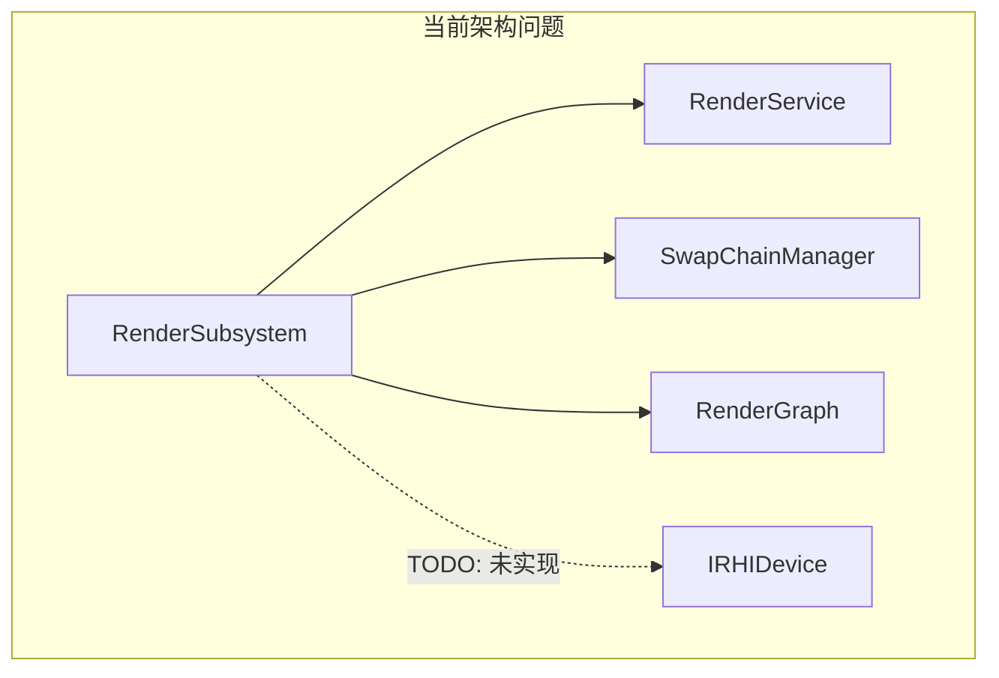
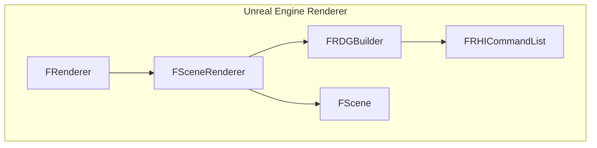
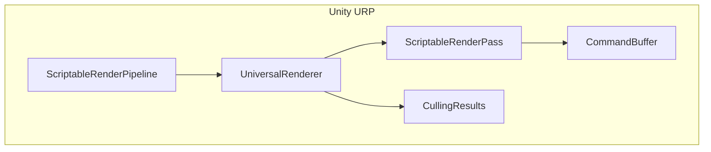
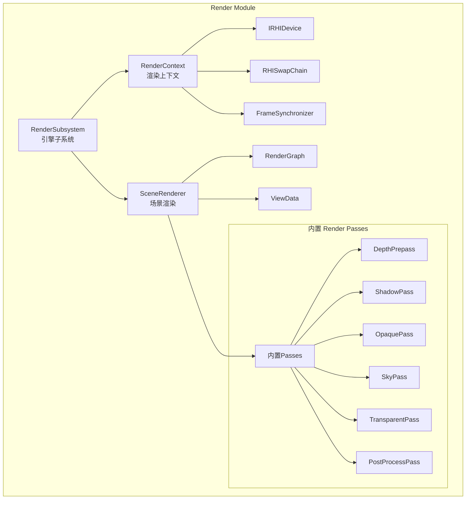
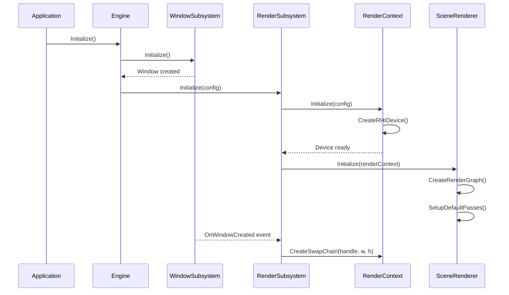
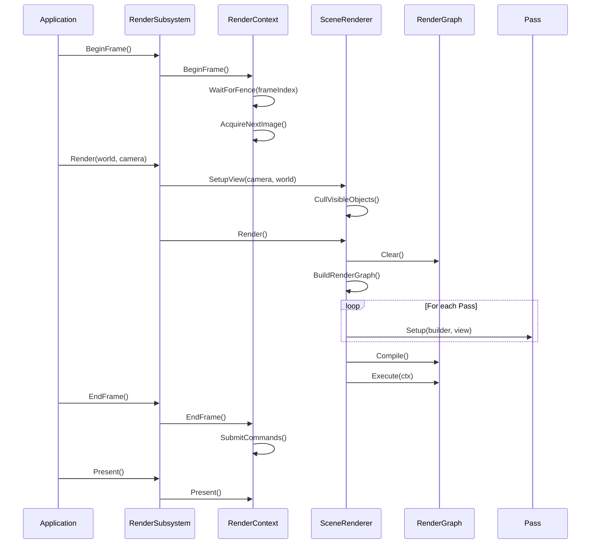

# Render 模块全面重构方案

## 一、当前问题分析

### 1.1 职责划分不清



**问题**:

- `RenderSubsystem`: 既是协调者又持有 RHI 资源，职责混杂
- `RenderService`: 当前仅是 Device/SwapChain 的简单包装，功能过薄
- RHI Device 创建被注释掉（TODO 状态），初始化链路断裂
- RenderGraph 作为独立模块，但 Samples 中直接创建 Device/SwapChain 绕过 Render 模块

### 1.2 初始化流程问题

当前 Samples 的初始化模式:

```cpp
// Samples/Cube3D/main.cpp - 直接创建 RHI
auto device = RVX::CreateRHIDevice(backend, deviceDesc);
auto swapChain = device->CreateSwapChain(swapChainDesc);
```

而 `RenderSubsystem::SetWindow()` 中:

```cpp
// TODO: Initialize RHI device with window
// m_device = RHI::CreateDevice(m_config.backendType, windowHandle);
```

**结果**: 两套并行的初始化路径，Subsystem 模式未被使用。

---

## 二、主流引擎参考

### 2.1 Unreal Engine 架构



- **FRenderer**: 全局渲染器，管理渲染线程和帧生命周期
- **FSceneRenderer**: 场景渲染逻辑（Deferred/Forward）
- **FRDGBuilder**: Render Dependency Graph（类似 RenderGraph）
- **FScene**: 渲染场景数据，从 UWorld 同步

### 2.2 Unity URP 架构



- **ScriptableRenderPipeline**: 渲染管线资产/配置
- **UniversalRenderer**: 渲染器，编排 Pass 执行
- **ScriptableRenderPass**: 可配置的渲染 Pass

---

## 三、目标架构设计

### 3.1 新架构图



### 3.2 组件职责定义

| 组件 | 职责 | 参考 |

|------|------|------|

| **RenderSubsystem** | EngineSubsystem，生命周期管理，协调渲染 | UE FRenderer |

| **RenderContext** | 封装 RHI Device/SwapChain/帧同步 | Unity GraphicsContext |

| **SceneRenderer** | 场景渲染逻辑，编排 RenderGraph | UE FSceneRenderer |

| **RenderGraph** | 依赖图构建与执行（合并到 Render 模块） | UE FRDGBuilder |

| **ViewData** | 视图相关数据（Camera/Frustum/可见对象） | UE FViewInfo |

---

## 四、目录结构重设计

```
Render/
├── CMakeLists.txt
├── Include/Render/
│   ├── Render.h                    # 统一头文件
│   │
│   ├── RenderSubsystem.h           # 重构: 精简为纯协调者
│   │
│   ├── Context/                    # NEW: 渲染上下文管理
│   │   ├── RenderContext.h         # 设备/交换链/帧同步封装
│   │   ├── FrameSynchronizer.h     # 帧同步 (Fence 管理)
│   │   └── SwapChainManager.h      # 移入，简化
│   │
│   ├── Renderer/                   # NEW: 渲染器层
│   │   ├── SceneRenderer.h         # 场景渲染主逻辑
│   │   ├── ViewData.h              # 视图数据
│   │   ├── RenderScene.h           # 渲染场景快照
│   │   └── VisibilityQuery.h       # 可见性查询
│   │
│   ├── RenderGraph/                # 从 RenderGraph 模块合并
│   │   ├── RenderGraph.h
│   │   ├── RenderGraphBuilder.h
│   │   ├── RGHandle.h              # 资源句柄
│   │   └── RGPass.h                # Pass 定义
│   │
│   ├── Passes/                     # NEW: 内置渲染 Pass
│   │   ├── IRenderPass.h           # Pass 接口
│   │   ├── DepthPrepass.h
│   │   ├── OpaquePass.h
│   │   ├── SkyboxPass.h
│   │   ├── TransparentPass.h
│   │   └── PostProcessPass.h
│   │
│   └── Material/                   # 预留: 材质系统
│       └── MaterialBinder.h
│
└── Private/
    ├── RenderSubsystem.cpp
    ├── Context/
    │   ├── RenderContext.cpp
    │   ├── FrameSynchronizer.cpp
    │   └── SwapChainManager.cpp
    ├── Renderer/
    │   ├── SceneRenderer.cpp
    │   ├── ViewData.cpp
    │   └── RenderScene.cpp
    ├── RenderGraph/
    │   ├── RenderGraph.cpp
    │   ├── RenderGraphCompiler.cpp
    │   ├── RenderGraphExecutor.cpp
    │   ├── FrameResourceManager.cpp
    │   └── RenderGraphInternal.h
    └── Passes/
        ├── DepthPrepass.cpp
        ├── OpaquePass.cpp
        └── ...
```

---

## 五、核心类设计

### 5.1 RenderContext

```cpp
// Render/Include/Render/Context/RenderContext.h

/// @brief 渲染上下文，管理 Device 和 SwapChain 生命周期
class RenderContext
{
public:
    struct Config
    {
        RHIBackendType backendType = RHIBackendType::None;
        bool enableValidation = true;
        bool enableGPUValidation = false;
        const char* appName = "RenderVerseX";
    };

    bool Initialize(const Config& config);
    void Shutdown();

    // 窗口关联
    bool CreateSwapChain(void* windowHandle, uint32_t width, uint32_t height);
    void ResizeSwapChain(uint32_t width, uint32_t height);

    // 帧管理
    void BeginFrame();
    void EndFrame();
    void Present();
    void WaitIdle();

    // 访问器
    IRHIDevice* GetDevice() const { return m_device.get(); }
    RHISwapChain* GetSwapChain() const { return m_swapChain.Get(); }
    RHICommandContext* GetGraphicsContext() const;
    uint32_t GetFrameIndex() const { return m_frameIndex; }

private:
    std::unique_ptr<IRHIDevice> m_device;
    RHISwapChainRef m_swapChain;
    std::unique_ptr<FrameSynchronizer> m_frameSynchronizer;
    std::array<RHICommandContextRef, RVX_MAX_FRAME_COUNT> m_cmdContexts;
    uint32_t m_frameIndex = 0;
};
```

### 5.2 SceneRenderer

```cpp
// Render/Include/Render/Renderer/SceneRenderer.h

/// @brief 场景渲染器，编排渲染 Pass
class SceneRenderer
{
public:
    void Initialize(RenderContext* renderContext);
    void Shutdown();

    /// 从 World 收集渲染数据
    void SetupView(const Camera& camera, World* world);

    /// 构建并执行 RenderGraph
    void Render();

    // Pass 管理
    void AddPass(std::unique_ptr<IRenderPass> pass);
    void RemovePass(const char* name);

    // 访问
    RenderGraph* GetRenderGraph() { return m_renderGraph.get(); }
    const ViewData& GetViewData() const { return m_viewData; }

private:
    void BuildRenderGraph();
    void ExecuteRenderGraph();

    RenderContext* m_renderContext = nullptr;
    std::unique_ptr<RenderGraph> m_renderGraph;
    std::vector<std::unique_ptr<IRenderPass>> m_passes;
    ViewData m_viewData;
    RenderScene m_renderScene;
};
```

### 5.3 重构后的 RenderSubsystem

```cpp
// Render/Include/Render/RenderSubsystem.h

/// @brief 渲染子系统 - 纯协调者，不持有 RHI 资源细节
class RenderSubsystem : public EngineSubsystem
{
public:
    const char* GetName() const override { return "RenderSubsystem"; }
    const char** GetDependencies(int& count) const override;

    void Initialize() override;
    void Initialize(const RenderConfig& config);
    void Deinitialize() override;

    // 帧生命周期 (委托给 RenderContext + SceneRenderer)
    void BeginFrame();
    void Render(World* world, Camera* camera);
    void EndFrame();
    void Present();

    // 窗口事件
    void SetWindow(void* windowHandle, uint32_t width, uint32_t height);
    void OnResize(uint32_t width, uint32_t height);

    // 访问
    RenderContext* GetRenderContext() { return m_renderContext.get(); }
    SceneRenderer* GetSceneRenderer() { return m_sceneRenderer.get(); }
    IRHIDevice* GetDevice() const;
    RHISwapChain* GetSwapChain() const;

private:
    RenderConfig m_config;
    std::unique_ptr<RenderContext> m_renderContext;
    std::unique_ptr<SceneRenderer> m_sceneRenderer;
    bool m_frameActive = false;
};
```

### 5.4 IRenderPass 接口

```cpp
// Render/Include/Render/Passes/IRenderPass.h

/// @brief 渲染 Pass 接口，类似 Unity ScriptableRenderPass
class IRenderPass
{
public:
    virtual ~IRenderPass() = default;

    virtual const char* GetName() const = 0;

    /// 设置阶段：声明资源依赖
    virtual void Setup(RenderGraphBuilder& builder, const ViewData& view) = 0;

    /// 执行阶段：录制命令
    virtual void Execute(RHICommandContext& ctx, const ViewData& view) = 0;

    // 可选：Pass 排序优先级
    virtual int32_t GetPriority() const { return 0; }

    // 可选：是否启用
    virtual bool IsEnabled() const { return true; }
};
```

---

## 六、初始化流程重设计

### 6.1 新初始化序列



### 6.2 帧渲染流程



---

## 七、RenderGraph 模块合并策略

### 7.1 文件迁移

| 源文件 | 目标文件 |

|--------|----------|

| `RenderGraph/Include/RenderGraph/RenderGraph.h` | `Render/Include/Render/RenderGraph/RenderGraph.h` |

| `RenderGraph/Private/RenderGraph.cpp` | `Render/Private/RenderGraph/RenderGraph.cpp` |

| `RenderGraph/Private/RenderGraphCompiler.cpp` | `Render/Private/RenderGraph/RenderGraphCompiler.cpp` |

| `RenderGraph/Private/RenderGraphExecutor.cpp` | `Render/Private/RenderGraph/RenderGraphExecutor.cpp` |

| `RenderGraph/Private/FrameResourceManager.cpp` | `Render/Private/RenderGraph/FrameResourceManager.cpp` |

| `RenderGraph/Private/RenderGraphInternal.h` | `Render/Private/RenderGraph/RenderGraphInternal.h` |

### 7.2 兼容层

```cpp
// RenderGraph/Include/RenderGraph/RenderGraph.h (兼容层)
#pragma once
#pragma message("Warning: RenderGraph module is deprecated. Use Render/RenderGraph/RenderGraph.h")
#include "Render/RenderGraph/RenderGraph.h"
```

---

## 八、实施阶段

### Phase 1: 基础架构 (RenderContext)

- 创建 `RenderContext` 类，封装 Device/SwapChain 创建
- 实现 `FrameSynchronizer` 处理多帧同步
- 测试：确保 Samples 可通过 RenderContext 正常运行

### Phase 2: 合并 RenderGraph

- 迁移 RenderGraph 源文件到 Render/RenderGraph/
- 更新 include 路径和命名空间
- 创建兼容层头文件
- 更新 CMakeLists.txt

### Phase 3: SceneRenderer 实现

- 创建 `SceneRenderer`、`ViewData`、`RenderScene`
- 实现 World 到 RenderScene 的数据同步
- 实现基本的可见性查询

### Phase 4: Pass 系统

- 定义 `IRenderPass` 接口
- 实现 `OpaquePass` 作为示例
- 集成到 SceneRenderer 的 BuildRenderGraph 流程

### Phase 5: RenderSubsystem 精简

- 重构 RenderSubsystem 为纯协调者
- 移除直接的 RHI 资源持有
- 更新 Engine 集成

### Phase 6: Samples 迁移

- 更新 Samples 使用新 API
- 可选：保留低级 RHI 直接访问示例
- 添加使用 RenderSubsystem 的高级示例

---

## 九、关键接口契约

### 9.1 RenderContext 初始化

```cpp
RenderContext::Config config;
config.backendType = RHIBackendType::Vulkan;
config.enableValidation = true;
config.appName = "MyGame";

RenderContext ctx;
if (!ctx.Initialize(config))
    return false;

if (!ctx.CreateSwapChain(windowHandle, 1280, 720))
    return false;
```

### 9.2 帧渲染

```cpp
// 游戏循环
while (running)
{
    renderSubsystem->BeginFrame();
    renderSubsystem->Render(world, mainCamera);
    renderSubsystem->EndFrame();
    renderSubsystem->Present();
}
```

### 9.3 自定义 Pass

```cpp
class MyCustomPass : public IRenderPass
{
public:
    const char* GetName() const override { return "MyCustomPass"; }

    void Setup(RenderGraphBuilder& builder, const ViewData& view) override
    {
        m_colorTarget = builder.Write(view.colorTarget);
        m_depthTarget = builder.Read(view.depthTarget);
    }

    void Execute(RHICommandContext& ctx, const ViewData& view) override
    {
        ctx.SetPipeline(m_pipeline);
        ctx.Draw(/* ... */);
    }
};

// 注册
sceneRenderer->AddPass(std::make_unique<MyCustomPass>());
```

---

## 十、风险与缓解

| 风险 | 影响 | 缓解措施 |

|------|------|----------|

| Samples 依赖变化 | 现有 Samples 编译失败 | 分阶段迁移，保留低级 API |

| RenderGraph 命名空间变化 | 外部代码引用失效 | 兼容层 + deprecation 警告 |

| 帧同步复杂度 | 多帧 in-flight 同步问题 | FrameSynchronizer 封装，充分测试 |

| 性能回归 | 新增抽象层开销 | Profile 验证，关键路径内联 |