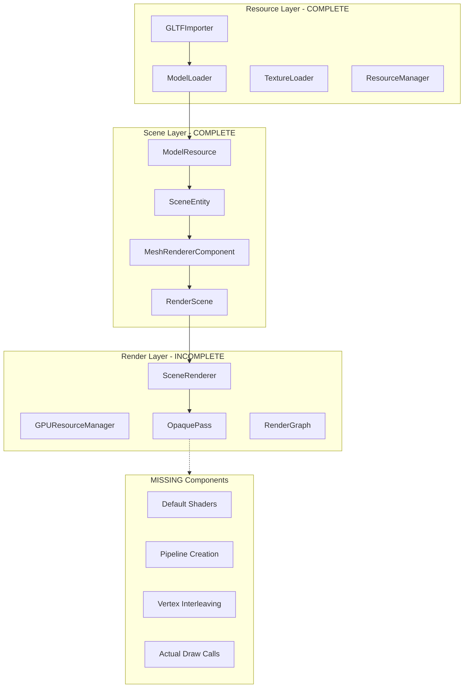
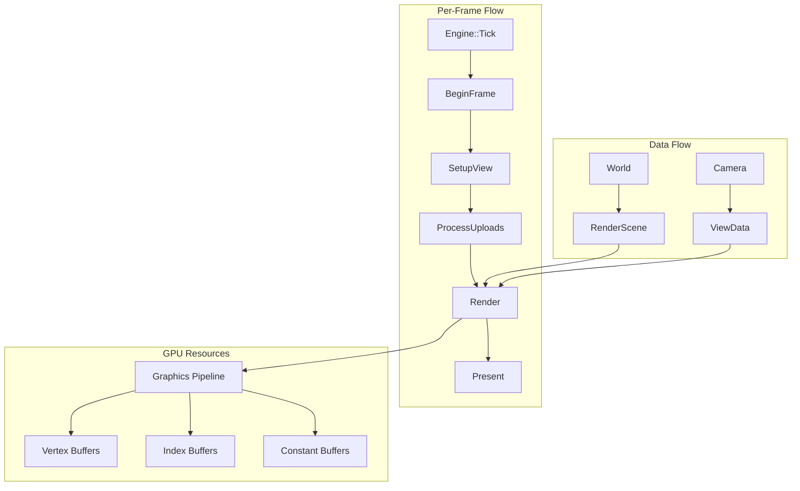

# Rendering Pipeline Completion Plan

## Current Architecture Analysis



## Gap Analysis

| Component | Status | Issue |

|-----------|--------|-------|

| GPUResourceManager | 60% | Vertex data not properly interleaved |

| ShaderManager | 40% | No default rendering shaders |

| PipelineManager | 0% | Does not exist |

| OpaquePass::Execute | 10% | Only placeholder, no draw calls |

| Material GPU Binding | 0% | No texture/constant buffer binding |

---

## Phase 1: Default Shaders (Foundation)

Create basic shaders that work with the existing Mesh vertex format.

### 1.1 Create Shader Directory Structure

```
Render/Shaders/
├── Common/
│   └── Common.hlsli          # Shared structures and functions
├── Default/
│   ├── DefaultLit.vs.hlsl    # Vertex shader (Position, Normal, UV)
│   └── DefaultLit.ps.hlsl    # Pixel shader (simple diffuse)
└── Unlit/
    ├── Unlit.vs.hlsl         # Simple unlit vertex shader
    └── Unlit.ps.hlsl         # Simple unlit pixel shader
```

### 1.2 Shader Constants Structure

```hlsl
// Common.hlsli
cbuffer ViewConstants : register(b0)
{
    float4x4 ViewProjection;
    float3 CameraPosition;
    float Time;
    float3 LightDirection;
    float Padding;
};

cbuffer ObjectConstants : register(b1)
{
    float4x4 World;
    float4x4 WorldInvTranspose;
};
```

### 1.3 Vertex Input Layout

Match the glTF-loaded vertex format:

- POSITION (float3)
- NORMAL (float3)
- TEXCOORD0 (float2)
- TANGENT (float4) - optional

---

## Phase 2: Vertex Format and GPU Upload Fix

Fix [GPUResourceManager.cpp](Render/Private/GPUResourceManager.cpp) to properly upload mesh data.

### 2.1 Create VertexFormat Descriptor

```cpp
// New file: Render/Include/Render/VertexFormat.h
struct VertexElement {
    const char* semantic;      // "POSITION", "NORMAL", etc.
    RHIFormat format;          // RGBA32_FLOAT, etc.
    uint32_t offset;           // Byte offset in vertex
    uint32_t semanticIndex;    // For multiple UV sets
};

struct VertexFormat {
    std::vector<VertexElement> elements;
    uint32_t stride;           // Total vertex size in bytes
    
    static VertexFormat PositionNormalUV();  // Standard format
    RHIInputLayoutDesc ToInputLayout() const;
};
```

### 2.2 Fix UploadMesh in GPUResourceManager

Current issue: Only copies position data. Need to interleave all attributes.

```cpp
void GPUResourceManager::UploadMesh(MeshResource* mesh)
{
    // 1. Determine which attributes exist
    // 2. Calculate interleaved stride
    // 3. Create interleaved buffer
    // 4. Copy each attribute with proper stride
    // 5. Upload to GPU
}
```

Key changes in [GPUResourceManager.cpp](Render/Private/GPUResourceManager.cpp) lines 259-350.

---

## Phase 3: Pipeline Management

Create a system to manage graphics pipelines.

### 3.1 Create PipelineCache

```cpp
// New file: Render/Include/Render/PipelineCache.h
class PipelineCache {
public:
    void Initialize(IRHIDevice* device, ShaderManager* shaderMgr);
    
    // Get or create pipeline for a vertex format + material type
    RHIPipeline* GetOpaquePipeline(const VertexFormat& format);
    RHIPipeline* GetUnlitPipeline(const VertexFormat& format);
    
private:
    std::unordered_map<uint64_t, RHIPipelineRef> m_pipelines;
    RHIPipelineLayoutRef m_defaultLayout;
    RHIShaderRef m_defaultVS, m_defaultPS;
};
```

### 3.2 Initialize in SceneRenderer

Modify [SceneRenderer.cpp](Render/Private/Renderer/SceneRenderer.cpp) `Initialize()`:

```cpp
void SceneRenderer::Initialize(RenderContext* ctx)
{
    // ... existing code ...
    
    // Create shader manager
    m_shaderManager = std::make_unique<ShaderManager>(...);
    
    // Create pipeline cache
    m_pipelineCache = std::make_unique<PipelineCache>();
    m_pipelineCache->Initialize(ctx->GetDevice(), m_shaderManager.get());
    
    // Setup default passes
    SetupDefaultPasses();  // Now actually adds passes
}
```

---

## Phase 4: OpaquePass Implementation

Complete the render pass in [OpaquePass.cpp](Render/Private/Passes/OpaquePass.cpp).

### 4.1 Pass Data Structure

```cpp
struct OpaquePassData {
    std::vector<RenderObject*> visibleObjects;
    GPUResourceManager* gpuResources;
    PipelineCache* pipelines;
    RHIBuffer* viewConstantBuffer;
};
```

### 4.2 Execute Implementation

```cpp
void OpaquePass::Execute(RHICommandContext& ctx, const ViewData& view)
{
    // 1. Begin render pass
    RHIRenderPassDesc rpDesc;
    rpDesc.colorAttachments[0].texture = GetColorTarget();
    rpDesc.colorAttachments[0].loadOp = RHILoadOp::Clear;
    rpDesc.colorAttachments[0].clearColor = {0.1f, 0.1f, 0.15f, 1.0f};
    rpDesc.depthAttachment.texture = GetDepthTarget();
    ctx.BeginRenderPass(rpDesc);
    
    // 2. Set viewport/scissor
    ctx.SetViewport(view.GetRHIViewport());
    ctx.SetScissor(view.GetRHIScissor());
    
    // 3. Bind pipeline
    ctx.SetPipeline(m_pipeline);
    
    // 4. Update and bind view constants
    UpdateViewConstants(view);
    ctx.SetConstantBuffer(0, m_viewConstantBuffer);
    
    // 5. Draw each visible object
    for (const auto& obj : m_visibleObjects)
    {
        auto buffers = m_gpuResources->GetMeshBuffers(obj.meshId);
        if (!buffers.IsValid()) continue;
        
        // Update object constants (world matrix)
        UpdateObjectConstants(obj);
        ctx.SetConstantBuffer(1, m_objectConstantBuffer);
        
        // Bind buffers and draw
        ctx.SetVertexBuffer(0, buffers.vertexBuffer);
        ctx.SetIndexBuffer(buffers.indexBuffer, RHIFormat::R32_UINT);
        
        for (const auto& submesh : buffers.submeshes)
        {
            ctx.DrawIndexed(submesh.indexCount, 1, 
                           submesh.indexOffset, submesh.baseVertex, 0);
        }
    }
    
    // 6. End render pass
    ctx.EndRenderPass();
}
```

---

## Phase 5: Render Loop Integration

Connect everything in the engine tick loop.

### 5.1 Modify RenderSubsystem::Render

In [RenderSubsystem.cpp](Render/Private/RenderSubsystem.cpp):

```cpp
void RenderSubsystem::Render(World* world, Camera* camera)
{
    if (!camera || !m_sceneRenderer) return;
    
    // 1. Process GPU uploads
    m_sceneRenderer->GetGPUResourceManager()->ProcessPendingUploads(2.0f);
    
    // 2. Setup view from camera
    m_sceneRenderer->SetupView(*camera, world);
    
    // 3. Ensure visible resources are GPU-resident
    EnsureVisibleResourcesResident();
    
    // 4. Render
    m_sceneRenderer->Render();
}
```

### 5.2 Resource Residency Check

```cpp
void RenderSubsystem::EnsureVisibleResourcesResident()
{
    auto& renderScene = m_sceneRenderer->GetRenderScene();
    auto* gpuMgr = m_sceneRenderer->GetGPUResourceManager();
    
    for (const auto& obj : renderScene.GetObjects())
    {
        if (!gpuMgr->IsResident(obj.meshId))
        {
            // Get MeshResource from ResourceManager and upload
            auto meshRes = ResourceManager::Get().Get<MeshResource>(obj.meshId);
            if (meshRes) gpuMgr->UploadImmediate(meshRes.Get());
        }
    }
}
```

---

## Phase 6: Testing and Validation

### 6.1 Debug Visualization

Add fallback rendering when resources aren't ready:

- Wireframe bounding boxes
- Magenta error color for missing textures
- Console warnings for missing resources

### 6.2 Validation Checklist

- [ ] Cube3D sample continues to work
- [ ] ModelViewer loads and displays DamagedHelmet.glb
- [ ] No validation layer errors (DX12)
- [ ] Memory usage is reasonable (< 100MB for helmet)
- [ ] Frame rate is stable (60+ FPS)

---

## File Summary

| File | Action | Description |

|------|--------|-------------|

| `Render/Shaders/Common/Common.hlsli` | Create | Shared shader structures |

| `Render/Shaders/Default/DefaultLit.vs.hlsl` | Create | Default vertex shader |

| `Render/Shaders/Default/DefaultLit.ps.hlsl` | Create | Default pixel shader |

| `Render/Include/Render/VertexFormat.h` | Create | Vertex format descriptor |

| `Render/Private/VertexFormat.cpp` | Create | Vertex format implementation |

| `Render/Include/Render/PipelineCache.h` | Create | Pipeline cache class |

| `Render/Private/PipelineCache.cpp` | Create | Pipeline cache implementation |

| `Render/Private/GPUResourceManager.cpp` | Modify | Fix vertex interleaving |

| `Render/Private/Passes/OpaquePass.cpp` | Modify | Implement actual rendering |

| `Render/Private/Renderer/SceneRenderer.cpp` | Modify | Initialize pipelines, add passes |

| `Render/Private/RenderSubsystem.cpp` | Modify | Connect render loop |

| `Render/CMakeLists.txt` | Modify | Add new source files |

---

## Architecture After Implementation



---

## Risk Mitigation

| Risk | Mitigation |

|------|------------|

| Shader compilation fails on different backends | Start with DX12, add OpenGL/Vulkan variants later |

| Vertex format mismatch | Add runtime validation, log detailed errors |

| Performance issues with immediate upload | Async upload queue is already in place, use it |

| Memory leaks | Use RAII patterns, GPU validation layers |

---

## Success Criteria

1. **MVP**: DamagedHelmet.glb renders correctly in ModelViewer
2. **Stability**: No crashes, no validation errors
3. **Performance**: 60+ FPS at 1280x720
4. **Code Quality**: Follows existing patterns, well-documented