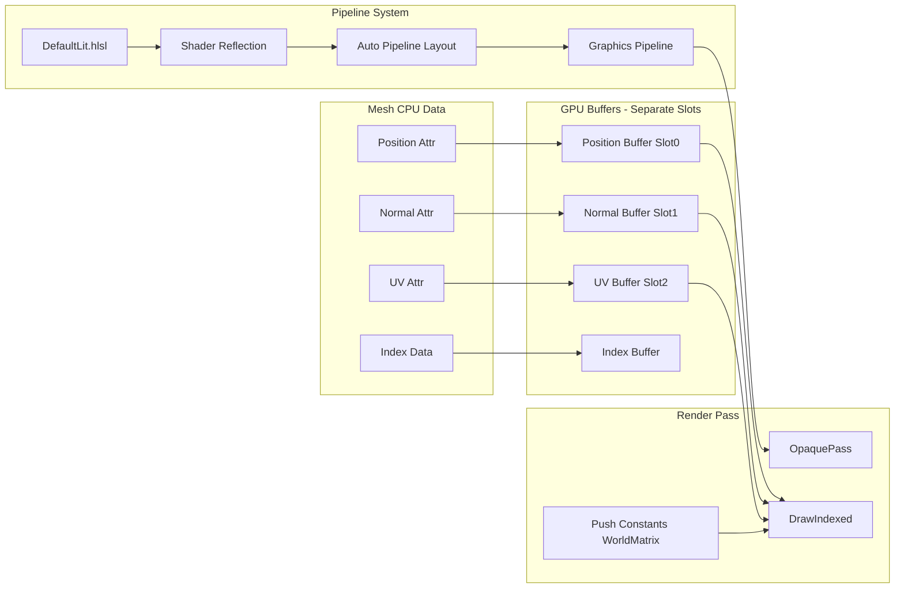

# Rendering Pipeline Completion Plan (Optimized)

## Key Optimizations vs Original Plan

| Aspect | Original Plan | Optimized Approach | Benefit |

|--------|---------------|-------------------|---------|

| Vertex Buffers | Single interleaved buffer | Separate slots per attribute | Simpler upload, matches glTF storage |

| Pipeline Layout | Manual definition | Shader reflection auto-layout | Less maintenance, less error-prone |

| Per-Object Data | Constant buffer update | Push constants | Faster, no buffer mapping overhead |

| VertexFormat Class | New complex class | Remove, use direct attribute binding | Less code, simpler design |

---

## Architecture Overview



---

## Phase 1: Default Shaders

Create shaders with multi-slot vertex input (matching separate vertex buffers).

### 1.1 Files to Create

| File | Description |

|------|-------------|

| `Render/Shaders/DefaultLit.hlsl` | Combined VS/PS shader with multi-slot input |

### 1.2 Shader Design

```hlsl
// DefaultLit.hlsl - Vertex inputs from SEPARATE buffers (slots)
struct VSInput
{
    float3 Position : POSITION;   // Slot 0: position buffer
    float3 Normal   : NORMAL;     // Slot 1: normal buffer
    float2 TexCoord : TEXCOORD0;  // Slot 2: uv buffer
};

// View constants in descriptor set
cbuffer ViewConstants : register(b0)
{
    float4x4 ViewProjection;
    float3 CameraPosition;
    float Time;
    float3 LightDirection;
    float Padding;
};

// Object constants via push constants (faster than cbuffer for per-object)
cbuffer ObjectConstants : register(b1)
{
    float4x4 World;
};
```

### 1.3 Input Layout Matches Separate Buffers

```cpp
// In PipelineCache - each semantic gets its own slot
pipelineDesc.inputLayout.AddElement("POSITION", RHIFormat::RGB32_FLOAT, 0);  // slot 0
pipelineDesc.inputLayout.AddElement("NORMAL", RHIFormat::RGB32_FLOAT, 1);    // slot 1
pipelineDesc.inputLayout.AddElement("TEXCOORD", RHIFormat::RG32_FLOAT, 2);   // slot 2
```

---

## Phase 2: GPU Resource Manager - Separate Buffers

Modify [GPUResourceManager.cpp](Render/Private/GPUResourceManager.cpp) to use separate vertex buffers.

### 2.1 Update MeshGPUData Structure

In [GPUResourceManager.h](Render/Include/Render/GPUResourceManager.h):

```cpp
struct MeshGPUData
{
    // Separate buffers for each attribute (matches glTF storage)
    RHIBufferRef positionBuffer;    // Slot 0
    RHIBufferRef normalBuffer;      // Slot 1 (optional)
    RHIBufferRef uvBuffer;          // Slot 2 (optional)
    RHIBufferRef tangentBuffer;     // Slot 3 (optional)
    RHIBufferRef indexBuffer;
    
    std::vector<SubmeshGPUInfo> submeshes;
    uint64_t lastUsedFrame = 0;
    size_t gpuMemorySize = 0;
    bool isResident = false;
    
    // Track which attributes are available
    bool hasNormals = false;
    bool hasUVs = false;
    bool hasTangents = false;
};

struct MeshGPUBuffers
{
    RHIBuffer* positionBuffer = nullptr;  // Slot 0
    RHIBuffer* normalBuffer = nullptr;    // Slot 1
    RHIBuffer* uvBuffer = nullptr;        // Slot 2
    RHIBuffer* tangentBuffer = nullptr;   // Slot 3
    RHIBuffer* indexBuffer = nullptr;
    std::vector<SubmeshGPUInfo> submeshes;
    bool isResident = false;
    
    bool IsValid() const { return positionBuffer && indexBuffer && isResident; }
};
```

### 2.2 Simplified UploadMesh

```cpp
void GPUResourceManager::UploadMesh(MeshResource* meshRes)
{
    auto* mesh = meshRes->GetMesh().get();
    MeshGPUData gpuData;
    
    // Upload each attribute to its own buffer (no interleaving needed!)
    if (auto* posAttr = mesh->GetAttribute("position"))
    {
        gpuData.positionBuffer = CreateAttributeBuffer(posAttr, "PositionBuffer");
    }
    
    if (auto* normAttr = mesh->GetAttribute("normal"))
    {
        gpuData.normalBuffer = CreateAttributeBuffer(normAttr, "NormalBuffer");
        gpuData.hasNormals = true;
    }
    
    if (auto* uvAttr = mesh->GetAttribute("uv0"))
    {
        gpuData.uvBuffer = CreateAttributeBuffer(uvAttr, "UVBuffer");
        gpuData.hasUVs = true;
    }
    
    // Upload index buffer
    gpuData.indexBuffer = CreateIndexBuffer(mesh);
    
    // Store submesh info
    CollectSubmeshInfo(mesh, gpuData);
    
    gpuData.isResident = true;
    m_meshGPUData[meshRes->GetId()] = std::move(gpuData);
}

RHIBufferRef GPUResourceManager::CreateAttributeBuffer(VertexAttribute* attr, const char* name)
{
    RHIBufferDesc desc;
    desc.size = attr->GetTotalSize();
    desc.usage = RHIBufferUsage::Vertex;
    desc.memoryType = RHIMemoryType::Upload;
    desc.debugName = name;
    
    auto buffer = m_device->CreateBuffer(desc);
    if (buffer)
    {
        void* mapped = buffer->Map();
        std::memcpy(mapped, attr->GetData(), attr->GetTotalSize());
        buffer->Unmap();
    }
    return buffer;
}
```

---

## Phase 3: Pipeline Cache with Shader Reflection

Create [PipelineCache.h](Render/Include/Render/PipelineCache.h) using auto-layout from shader reflection.

### 3.1 PipelineCache Design

```cpp
class PipelineCache
{
public:
    void Initialize(IRHIDevice* device, const std::string& shaderDir);
    void Shutdown();
    
    // Get default opaque pipeline
    RHIPipeline* GetOpaquePipeline();
    
    // Get pipeline layout for binding
    RHIPipelineLayout* GetDefaultLayout();
    
    // Get view constants descriptor set
    RHIDescriptorSet* GetViewDescriptorSet();
    
    // Update view constants
    void UpdateViewConstants(const ViewData& view);
    
private:
    void CompileShaders();
    void CreatePipelineLayout();  // Uses BuildAutoPipelineLayout()
    void CreatePipeline();
    
    IRHIDevice* m_device = nullptr;
    std::unique_ptr<ShaderManager> m_shaderManager;
    
    RHIShaderRef m_vertexShader;
    RHIShaderRef m_pixelShader;
    RHIPipelineLayoutRef m_pipelineLayout;
    RHIPipelineRef m_opaquePipeline;
    
    RHIDescriptorSetLayoutRef m_viewSetLayout;
    RHIDescriptorSetRef m_viewDescriptorSet;
    RHIBufferRef m_viewConstantBuffer;
};
```

### 3.2 Use Shader Reflection (like Cube3D sample)

```cpp
void PipelineCache::CreatePipelineLayout()
{
    // Use shader reflection to auto-generate layout
    std::vector<ReflectedShader> reflectedShaders = {
        {m_vsResult.compileResult.reflection, RHIShaderStage::Vertex},
        {m_psResult.compileResult.reflection, RHIShaderStage::Pixel}
    };
    
    auto autoLayout = BuildAutoPipelineLayout(reflectedShaders);
    
    // Create descriptor set layouts from reflection
    for (size_t i = 0; i < autoLayout.setLayouts.size(); ++i)
    {
        if (!autoLayout.setLayouts[i].entries.empty())
        {
            m_setLayouts[i] = m_device->CreateDescriptorSetLayout(autoLayout.setLayouts[i]);
        }
    }
    
    // Create pipeline layout
    m_pipelineLayout = m_device->CreatePipelineLayout(autoLayout.pipelineLayout);
}
```

---

## Phase 4: OpaquePass Implementation

Complete [OpaquePass.cpp](Render/Private/Passes/OpaquePass.cpp) with actual rendering.

### 4.1 OpaquePass Needs Access to Resources

Update [OpaquePass.h](Render/Include/Render/Passes/OpaquePass.h):

```cpp
class OpaquePass : public IRenderPass
{
public:
    // Set dependencies before rendering
    void SetResources(GPUResourceManager* gpuMgr, PipelineCache* pipelines);
    void SetRenderScene(const RenderScene* scene, const std::vector<uint32_t>* visibleIndices);
    
private:
    GPUResourceManager* m_gpuResources = nullptr;
    PipelineCache* m_pipelineCache = nullptr;
    const RenderScene* m_renderScene = nullptr;
    const std::vector<uint32_t>* m_visibleIndices = nullptr;
    
    RHIBufferRef m_objectConstantBuffer;  // For push constants fallback
};
```

### 4.2 Execute with Separate Vertex Buffers

```cpp
void OpaquePass::Execute(RHICommandContext& ctx, const ViewData& view)
{
    if (!m_renderScene || !m_visibleIndices || m_visibleIndices->empty())
        return;
    
    // 1. Begin render pass with back buffer
    RHIRenderPassDesc rpDesc;
    // ... configure color/depth attachments ...
    ctx.BeginRenderPass(rpDesc);
    
    // 2. Set viewport/scissor
    ctx.SetViewport(view.GetRHIViewport());
    ctx.SetScissor(view.GetRHIScissor());
    
    // 3. Bind pipeline and view constants
    ctx.SetPipeline(m_pipelineCache->GetOpaquePipeline());
    ctx.SetDescriptorSet(0, m_pipelineCache->GetViewDescriptorSet());
    
    // 4. Draw each visible object
    for (uint32_t idx : *m_visibleIndices)
    {
        const auto& obj = m_renderScene->GetObject(idx);
        auto buffers = m_gpuResources->GetMeshBuffers(obj.meshId);
        if (!buffers.IsValid()) continue;
        
        // Set world matrix via push constants (fast!)
        ctx.SetPushConstants(&obj.worldMatrix, sizeof(Mat4));
        
        // Bind SEPARATE vertex buffers to different slots
        ctx.SetVertexBuffer(0, buffers.positionBuffer);  // Slot 0: Position
        if (buffers.normalBuffer)
            ctx.SetVertexBuffer(1, buffers.normalBuffer);  // Slot 1: Normal
        if (buffers.uvBuffer)
            ctx.SetVertexBuffer(2, buffers.uvBuffer);      // Slot 2: UV
        
        ctx.SetIndexBuffer(buffers.indexBuffer, RHIFormat::R32_UINT);
        
        // Draw each submesh
        for (const auto& submesh : buffers.submeshes)
        {
            ctx.DrawIndexed(submesh.indexCount, 1, 
                           submesh.indexOffset, submesh.baseVertex, 0);
        }
    }
    
    // 5. End render pass
    ctx.EndRenderPass();
}
```

---

## Phase 5: SceneRenderer Integration

Connect everything in [SceneRenderer.cpp](Render/Private/Renderer/SceneRenderer.cpp).

### 5.1 Add PipelineCache to SceneRenderer

```cpp
// SceneRenderer.h additions
class SceneRenderer
{
private:
    std::unique_ptr<PipelineCache> m_pipelineCache;
};

// SceneRenderer.cpp
void SceneRenderer::Initialize(RenderContext* renderContext)
{
    // ... existing initialization ...
    
    // Create pipeline cache with shader reflection
    m_pipelineCache = std::make_unique<PipelineCache>();
    m_pipelineCache->Initialize(m_renderContext->GetDevice(), GetShaderDirectory());
    
    // Setup default passes with resources
    SetupDefaultPasses();
}

void SceneRenderer::SetupDefaultPasses()
{
    auto opaquePass = std::make_unique<OpaquePass>();
    opaquePass->SetResources(m_gpuResourceManager.get(), m_pipelineCache.get());
    AddPass(std::move(opaquePass));
}
```

### 5.2 Pass Data to OpaquePass Before Render

```cpp
void SceneRenderer::Render()
{
    // Update view constants in pipeline cache
    m_pipelineCache->UpdateViewConstants(m_viewData);
    
    // Pass render scene and visible indices to opaque pass
    for (auto& pass : m_passes)
    {
        if (auto* opaquePass = dynamic_cast<OpaquePass*>(pass.get()))
        {
            opaquePass->SetRenderScene(&m_renderScene, &m_visibleObjectIndices);
        }
    }
    
    // ... rest of render graph execution ...
}
```

---

## Phase 6: RenderSubsystem - Resource Residency

Update [RenderSubsystem.cpp](Render/Private/RenderSubsystem.cpp) to ensure GPU residency.

```cpp
void RenderSubsystem::Render(World* world, Camera* camera)
{
    if (!camera || !m_sceneRenderer) return;
    
    // 1. Setup view and collect scene
    m_sceneRenderer->SetupView(*camera, world);
    
    // 2. Ensure visible meshes are GPU-resident
    EnsureVisibleResourcesResident();
    
    // 3. Render
    m_sceneRenderer->Render();
}

void RenderSubsystem::EnsureVisibleResourcesResident()
{
    auto* gpuMgr = m_sceneRenderer->GetGPUResourceManager();
    const auto& renderScene = m_sceneRenderer->GetRenderScene();
    
    for (const auto& obj : renderScene.GetObjects())
    {
        if (!gpuMgr->IsResident(obj.meshId))
        {
            // Upload immediately for now (could use async queue)
            auto handle = Resource::ResourceManager::Get().Get<Resource::MeshResource>(obj.meshId);
            if (handle.IsValid())
            {
                gpuMgr->UploadImmediate(handle.Get());
            }
        }
    }
}
```

---

## File Summary

| File | Action | Description |

|------|--------|-------------|

| `Render/Shaders/DefaultLit.hlsl` | Create | Combined VS/PS with multi-slot input |

| `Render/Include/Render/PipelineCache.h` | Create | Pipeline cache with shader reflection |

| `Render/Private/PipelineCache.cpp` | Create | Pipeline cache implementation |

| `Render/Include/Render/GPUResourceManager.h` | Modify | Update MeshGPUData for separate buffers |

| `Render/Private/GPUResourceManager.cpp` | Modify | Simplified upload with separate buffers |

| `Render/Include/Render/Passes/OpaquePass.h` | Modify | Add resource dependencies |

| `Render/Private/Passes/OpaquePass.cpp` | Modify | Implement rendering with separate slots |

| `Render/Include/Render/Renderer/SceneRenderer.h` | Modify | Add PipelineCache member |

| `Render/Private/Renderer/SceneRenderer.cpp` | Modify | Initialize pipeline cache, pass resources |

| `Render/Private/RenderSubsystem.cpp` | Modify | Add resource residency check |

| `Render/CMakeLists.txt` | Modify | Add new source files |

---

## Removed from Original Plan

| Item | Reason |

|------|--------|

| VertexFormat.h/cpp | Not needed - use direct attribute binding |

| Vertex interleaving code | Not needed - separate buffers simpler |

| Manual pipeline layout | Use shader reflection instead |

---

## Success Criteria

1. DamagedHelmet.glb renders correctly in ModelViewer
2. No GPU validation errors (DX12 debug layer)
3. 60+ FPS at 1280x720
4. Memory usage reasonable (< 150MB for helmet model)
5. Cube3D sample continues to work