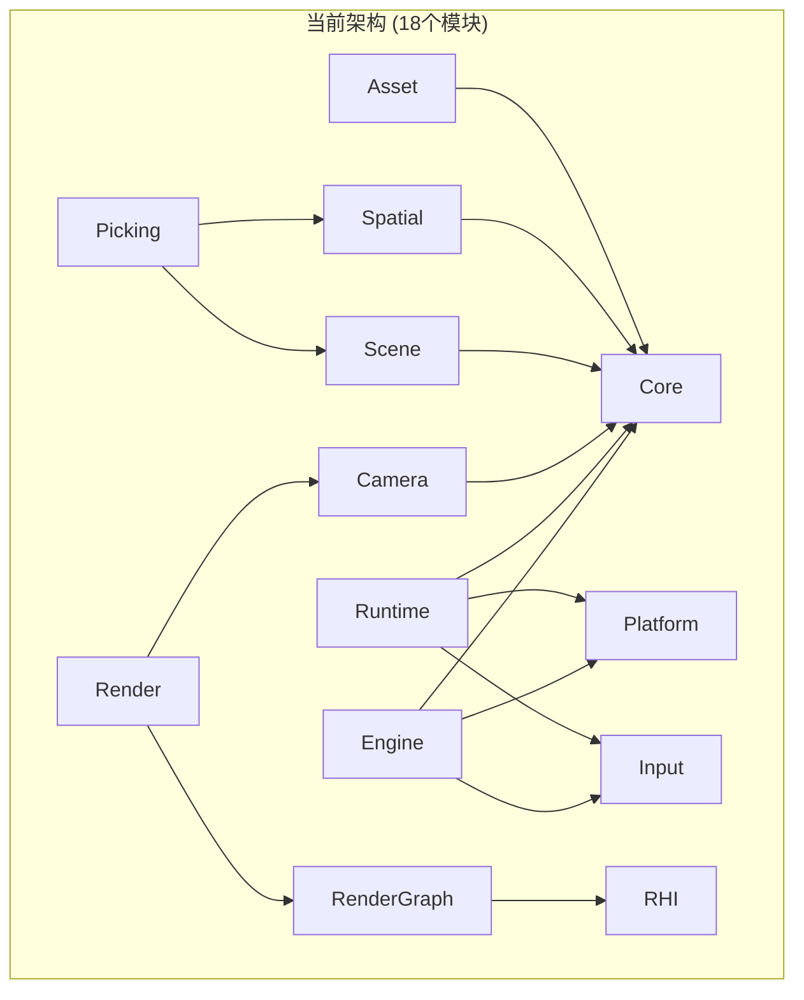
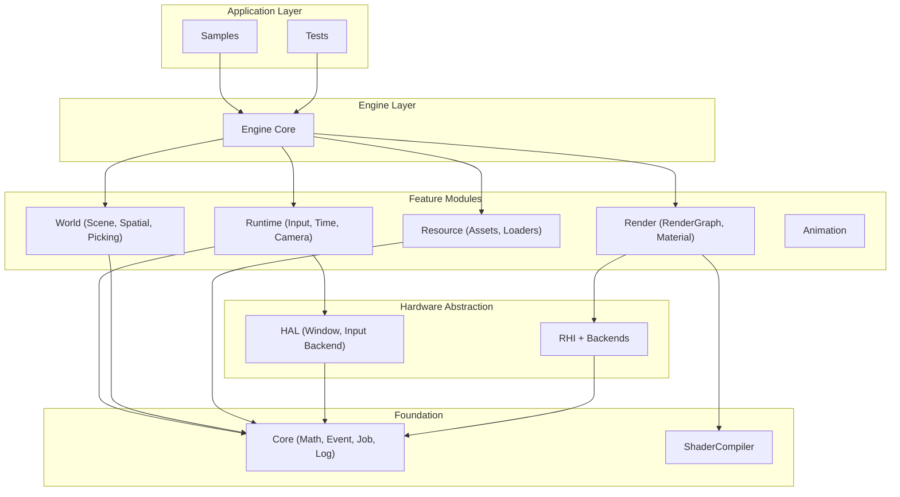
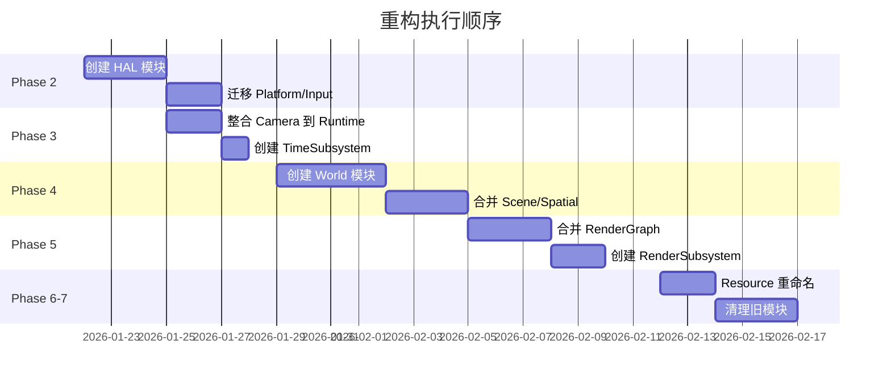

# RenderVerseX 游戏引擎重构方案分析

## 1. 当前架构状态评估

### 1.1 已完成的基础设施 (Phase 1 已完成)

Core 模块已具备重构计划中的核心基础设施：

- **EventBus 事件系统**:
  - 支持订阅/发布模式，线程安全
  - 支持延迟事件处理
  - 支持作用域订阅 (RAII)
```1:50:e:\WorkSpace\RenderVerseX\Core\Include\Core\Event\EventBus.h
// 完整实现了 Publish/Subscribe/PublishDeferred
```

- **Subsystem 子系统**:
  - `ISubsystem` 基类，支持依赖声明
  - `EngineSubsystem` 引擎级子系统
  - `WorldSubsystem` 世界级子系统
  - `SubsystemCollection` 管理模板
```10:20:e:\WorkSpace\RenderVerseX\Core\Include\Core\Subsystem\ISubsystem.h
// SubsystemLifetime: Engine, World, LocalPlayer
```

- **JobSystem 任务系统**: 基础线程池实现

### 1.2 部分完成的模块

| 模块 | 状态 | 说明 |

|------|------|------|

| Engine | 90% | 已支持 Subsystem API，保留 Legacy 兼容 |

| Runtime | 60% | 有 InputSubsystem, WindowSubsystem, Time，缺 Camera |

| HAL | 0% | 未创建，Platform/Input 独立存在 |

| World | 0% | Scene/Spatial/Picking 独立存在 |

| Render | 30% | RenderService 存在，RenderGraph 独立 |

| Resource | 0% | Asset 模块独立存在 |

### 1.3 当前模块依赖关系



## 2. 重构方案分析

### 2.1 目标架构



### 2.2 模块合并策略

| 合并前 | 合并后 | 合并原因 |

|--------|--------|----------|

| Platform + Input (底层) | HAL | 统一平台抽象 |

| Camera + Input (高级 API) | Runtime | 运行时服务 |

| Scene + Spatial + Picking | World | 世界管理 |

| RenderGraph + Render | Render | 渲染功能 |

| Asset | Resource | 命名规范化 |

## 3. 分阶段实施计划

### Phase 2: 创建 HAL 层 (优先级: 高)

**目标**: 整合平台抽象，为其他模块提供统一接口

**当前问题**:

- `Platform/Window.h` 和 `Input/InputBackend.h` 分散
- `InputSubsystem` 直接依赖 `Platform/InputBackend.h`

**实施步骤**:

1. 创建 HAL 目录结构:
```
HAL/
├── Include/HAL/
│   ├── HAL.h
│   ├── Window/
│   │   ├── IWindow.h          # 从 Platform/Window.h 迁移
│   │   └── WindowEvents.h     # 从 Platform/WindowEvents.h 迁移
│   ├── Input/
│   │   ├── IInputBackend.h    # 从 Platform/InputBackend.h 迁移
│   │   └── KeyCodes.h
│   └── FileSystem/
│       └── FileSystem.h
└── Private/
    └── GLFW/
        ├── GLFWWindow.cpp     # 从 Platform/Window.cpp 迁移
        └── GLFWInputBackend.cpp
```

2. 更新依赖:

   - `Runtime/InputSubsystem` 改为依赖 `HAL/Input/IInputBackend.h`
   - `Runtime/WindowSubsystem` 改为依赖 `HAL/Window/IWindow.h`

3. 创建兼容层保持向后兼容

---

### Phase 3: 完善 Runtime 模块 (优先级: 高)

**目标**: 整合 Camera 模块到 Runtime

**当前状态**:

- [Runtime/Input/InputSubsystem.h](Runtime/Include/Runtime/Input/InputSubsystem.h) ✅
- [Runtime/Window/WindowSubsystem.h](Runtime/Include/Runtime/Window/WindowSubsystem.h) ✅
- [Runtime/Time/Time.h](Runtime/Include/Runtime/Time/Time.h) ✅
- Camera 模块独立 ❌

**实施步骤**:

1. 迁移 Camera:
```
Runtime/Include/Runtime/Camera/
├── Camera.h              # 从 Camera/Camera.h
├── CameraController.h    # 从 Camera/CameraController.h
├── FPSController.h
├── OrbitController.h
└── CameraRegistry.h
```

2. 创建 `TimeSubsystem` (当前只有 Time 工具类):
```cpp
class TimeSubsystem : public EngineSubsystem
{
    float GetDeltaTime() const;
    float GetTimeScale() const;
    void SetTimeScale(float scale);
    uint64_t GetFrameCount() const;
};
```

3. Camera 兼容层

---

### Phase 4: 创建 World 模块 (优先级: 中)

**目标**: 整合 Scene + Spatial + Picking

**当前问题**:

- `Picking` 有独立的 `PickingBVH.h`，与 `Spatial/BVHIndex.h` 重复
- `Scene/BoundingBox.h` 与 `Spatial/Bounds/BoundingBox.h` 重复
- 三个模块间耦合紧密但分散

**实施步骤**:

1. 创建 World 结构:
```
World/
├── Include/World/
│   ├── World.h                    # 世界容器
│   ├── Scene/                     # 从 Scene 模块
│   │   ├── SceneManager.h
│   │   ├── SceneEntity.h
│   │   └── Node.h
│   ├── Spatial/                   # 从 Spatial 模块
│   │   ├── SpatialSubsystem.h     # 封装空间查询
│   │   ├── BVHIndex.h
│   │   └── SpatialQuery.h
│   └── Picking/                   # 简化的拾取服务
│       └── PickingService.h       # 委托给 SpatialSubsystem
```

2. 合并重复代码:

   - 删除 `Scene/BoundingBox.h`，使用 `Core/Math/AABB.h`
   - 删除 `Picking/PickingBVH.h`，复用 `SpatialSubsystem`

3. 创建 `SpatialSubsystem`:
```cpp
class SpatialSubsystem : public WorldSubsystem
{
    void QueryFrustum(const Frustum& f, std::vector<QueryResult>&);
    bool Raycast(const Ray& ray, RaycastHit& hit);
    void RaycastAll(const Ray& ray, std::vector<RaycastHit>&);
};
```


---

### Phase 5: 重构 Render 模块 (优先级: 中)

**目标**: 合并 RenderGraph，创建 RenderSubsystem

**当前状态**:

- `RenderGraph` 功能完整，但独立存在
- `RenderService` 是简单的聚合器

**实施步骤**:

1. 合并 RenderGraph:
```
Render/
├── Include/Render/
│   ├── RenderSubsystem.h          # 新建
│   ├── RenderService.h            # 保持
│   ├── RenderGraph/               # 从 RenderGraph 模块
│   │   ├── RenderGraph.h
│   │   └── ...
│   └── Material/                  # 新建
│       └── MaterialSystem.h
```

2. 创建 `RenderSubsystem`:
```cpp
class RenderSubsystem : public EngineSubsystem
{
    void Initialize() override;
    void BeginFrame();
    void Render(World* world, Camera* camera);
    void EndFrame();
    void Present();
    
    RenderGraph* GetRenderGraph();
    MaterialSystem* GetMaterialSystem();
};
```


---

### Phase 6: Resource 模块 (优先级: 低)

**目标**: 重命名 Asset 为 Resource，添加 ResourceSubsystem

**实施步骤**:

1. 复制 Asset 目录为 Resource
2. 重命名类: `Asset` → `IResource`
3. 创建 `ResourceSubsystem`
4. 保持 Asset 兼容层

---

### Phase 7: 清理与验证 (优先级: 低)

**目标**: 删除旧模块，更新所有依赖

**删除清单**:

- Platform/ (合并到 HAL)
- Input/ (底层合并到 HAL，高级 API 在 Runtime)
- Camera/ (合并到 Runtime)
- Picking/ (合并到 World)
- Scene/ (合并到 World)
- Spatial/ (合并到 World)
- RenderGraph/ (合并到 Render)
- Asset/ (重命名为 Resource)

## 4. 最佳实践建议

### 4.1 依赖注入模式

当前 `InputSubsystem` 的依赖声明是好的模式，建议推广:

```cpp
const char** GetDependencies(int& outCount) const override
{
    static const char* deps[] = { "WindowSubsystem" };
    outCount = 1;
    return deps;
}
```

### 4.2 事件驱动解耦

利用已有的 EventBus 解耦模块:

```cpp
// 窗口大小改变
EventBus::Get().Publish(WindowResizeEvent{width, height});

// 渲染模块订阅
EventBus::Get().Subscribe<WindowResizeEvent>([this](const auto& e) {
    m_swapChain->Resize(e.width, e.height);
});
```

### 4.3 渐进式迁移

每个 Phase 使用兼容层:

```cpp
// Platform/Window.h (兼容层)
#pragma once
#pragma message("Warning: Platform/Window.h is deprecated, use HAL/Window/IWindow.h")
#include "HAL/Window/IWindow.h"
namespace RVX::Platform { using namespace RVX::HAL; }
```

## 5. 风险与缓解

| 风险 | 影响 | 缓解措施 |

|------|------|----------|

| 大量 include 路径变更 | 编译错误 | 使用兼容层头文件 |

| 命名空间冲突 | 歧义 | 分阶段迁移，每阶段验证 |

| Sample 程序破坏 | 功能回归 | 每阶段运行 Sample 测试 |

| 循环依赖 | 编译失败 | 使用 CMake 依赖图验证 |

## 6. 执行优先级建议



**建议优先级**: Phase 2 > Phase 3 > Phase 4 > Phase 5 > Phase 6 > Phase 7

Phase 2 (HAL) 优先，因为它是其他模块的基础依赖。