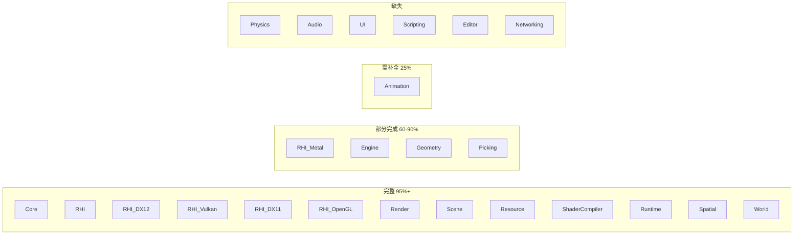
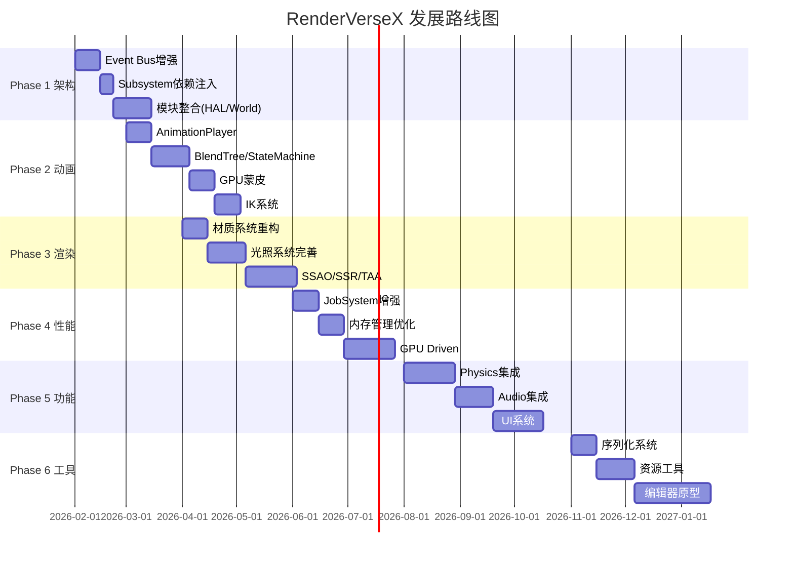

# RenderVerseX 引擎改进路线图

## 当前状态评估

### 模块完整性概览



### 现有优势

- RHI抽象设计优秀，5后端实现完整
- RenderGraph系统成熟（编译器、执行器、内存混叠）
- 资源管理系统完善（异步加载、依赖图、热重载）
- ShaderCompiler多平台支持（DXC、SPIRV-Cross）

### 需改进领域

- Animation模块仅有数据结构，无运行时播放器
- 模块边界不够清晰，存在潜在循环依赖
- 缺少物理、音频、UI等完整游戏引擎功能

---

## Phase 1: 架构基础设施强化 (基于现有重构计划)

参考: [Docs/游戏引擎最佳实践重构计划.md](Docs/游戏引擎最佳实践重构计划.md)

### 1.1 Event Bus 增强 (参考 Unreal GameplayMessageSubsystem)

现有 `Core/Event/EventBus.h` 已实现，增强功能：

- 添加 Channel 机制隔离事件域
- 添加事件过滤器（按类型、来源过滤）
- 支持优先级排序的事件处理

### 1.2 Subsystem 依赖注入 (参考 Unreal Subsystem)

增强 [Core/Subsystem/SubsystemCollection.h](Core/Include/Core/Subsystem/SubsystemCollection.h)：

- 添加 `DependsOn<T>()` 声明式依赖
- 拓扑排序自动初始化顺序
- 循环依赖检测

### 1.3 Service Locator 模式

新增全局服务注册表：

```cpp
// 核心服务访问模式
auto* render = Services::Get<RenderSubsystem>();
auto* input = Services::Get<InputSubsystem>();
```

### 1.4 模块整合 (执行现有计划)

按现有计划执行模块合并：

- Platform + Input -> HAL
- Scene + Spatial + Picking -> World
- Camera + Input高级API + Time -> Runtime
- RenderGraph -> Render/Graph

---

## Phase 2: Animation 模块补全 (优先级最高)

### 2.1 数据层 (已完成)

现有实现位于 [Animation/Include/Animation/](Animation/Include/Animation/)：

- `Keyframe.h`, `TransformSample.h` - 关键帧类型
- `AnimationClip.h`, `AnimationTrack.h` - 动画片段
- `Skeleton.h` - 骨骼定义

### 2.2 运行时层 (需新增)

```
Animation/
├── Include/Animation/
│   ├── Runtime/
│   │   ├── AnimationPlayer.h      # 动画播放器
│   │   ├── AnimationEvaluator.h   # 曲线求值器
│   │   ├── SkeletonPose.h         # 骨骼姿态
│   │   └── PoseBlender.h          # 姿态混合
│   ├── Blend/
│   │   ├── BlendTree.h            # 混合树 (参考 Unity Animator)
│   │   ├── BlendNode.h            # 混合节点基类
│   │   ├── Blend1D.h              # 1D混合
│   │   ├── Blend2D.h              # 2D混合空间
│   │   └── AdditiveBlend.h        # 加法混合
│   ├── State/
│   │   ├── AnimationStateMachine.h  # 状态机 (参考 Unreal AnimBP)
│   │   ├── AnimationState.h
│   │   └── StateTransition.h
│   └── IK/
│       ├── IKSolver.h             # IK求解器接口
│       ├── TwoBoneIK.h            # 两骨骼IK
│       └── FABRIK.h               # FABRIK算法
└── Private/
    ├── Runtime/
    ├── Blend/
    ├── State/
    └── IK/
```

### 2.3 GPU蒙皮 (需新增)

```
Animation/
├── Include/Animation/
│   └── Skinning/
│       ├── SkinningTypes.h        # 蒙皮数据结构
│       ├── GPUSkinning.h          # GPU蒙皮管理器
│       └── DualQuaternion.h       # 双四元数蒙皮
└── Shaders/
    ├── LinearBlendSkinning.hlsl
    └── DualQuaternionSkinning.hlsl
```

### 2.4 集成点

- `AnimationSubsystem` - 引擎级子系统
- `AnimatorComponent` - 实体组件
- `RenderScene` 整合骨骼矩阵上传

---

## Phase 3: 渲染系统增强

### 3.1 材质系统重构 (参考 Filament MaterialSystem)

现有 [Render/Material/](Render/Include/Render/Material/) 增强：

- 分离材质定义（MaterialTemplate）与实例（MaterialInstance）
- 添加 MaterialGraph 可视化编辑数据结构
- 支持运行时材质参数修改

### 3.2 光照系统完善

现有 [Render/Lighting/LightManager.h](Render/Include/Render/Lighting/LightManager.h) 增强：

- Clustered Forward Rendering
- 多光源阴影（CSM、Point Light Shadow）
- 区域光源支持
- 间接光照探针

### 3.3 渲染特性扩展

```
Render/Include/Render/Features/
├── SSAO.h                 # 屏幕空间环境光遮蔽
├── SSR.h                  # 屏幕空间反射
├── TAA.h                  # 时间抗锯齿
├── MotionBlur.h           # 运动模糊
├── DepthOfField.h         # 景深
├── VolumetricFog.h        # 体积雾
└── GlobalIllumination.h   # 全局光照接口
```

### 3.4 渲染调试工具

```
Render/Include/Render/Debug/
├── RenderDocIntegration.h # RenderDoc集成
├── PIXIntegration.h       # PIX集成  
├── GPUProfiler.h          # GPU性能分析 (已有)
├── DebugRenderer.h        # 调试渲染 (已有)
└── ShaderDebug.h          # Shader调试输出
```

---

## Phase 4: 性能优化 (参考 Unity DOTS)

### 4.1 JobSystem 增强

现有 [Core/Job/JobSystem.h](Core/Include/Core/Job/JobSystem.h) 增强：

- 添加 Job 依赖图（参考 Unity JobHandle.Complete）
- 任务窃取调度优化
- 添加帧级任务调度器

### 4.2 内存管理优化

```
Core/Include/Core/Memory/
├── PoolAllocator.h        # 对象池分配器
├── FrameAllocator.h       # 帧分配器
├── LinearAllocator.h      # 线性分配器
├── BuddyAllocator.h       # 伙伴系统
└── MemoryTracker.h        # 内存追踪
```

### 4.3 数据导向设计 (DOD)

关键热路径引入 DOD：

- `RenderScene` 使用 SoA 布局
- Culling 使用 SIMD 批处理（利用 Geometry/Batch）
- Animation 姿态计算并行化

### 4.4 GPU Driven Rendering

```
Render/Include/Render/GPUDriven/
├── MeshletRenderer.h      # Meshlet渲染
├── GPUCulling.h           # GPU剔除
├── IndirectDrawing.h      # 间接绘制
└── VisibilityBuffer.h     # 可见性缓冲
```

---

## Phase 5: 游戏功能模块

### 5.1 Physics 物理系统

```
Physics/
├── Include/Physics/
│   ├── Physics.h
│   ├── PhysicsWorld.h         # 物理世界
│   ├── RigidBody.h            # 刚体
│   ├── Collider.h             # 碰撞体
│   ├── CollisionShape.h       # 碰撞形状
│   ├── PhysicsMaterial.h      # 物理材质
│   ├── Constraints/           # 约束
│   │   ├── Joint.h
│   │   ├── HingeJoint.h
│   │   └── SpringJoint.h
│   └── Query/
│       ├── RaycastQuery.h
│       ├── SweepQuery.h
│       └── OverlapQuery.h
└── Private/
    ├── Jolt/                  # Jolt Physics后端
    └── PhysX/                 # PhysX后端(可选)
```

推荐集成：Jolt Physics（MIT协议、高性能、现代C++）

### 5.2 Audio 音频系统

```
Audio/
├── Include/Audio/
│   ├── Audio.h
│   ├── AudioEngine.h
│   ├── AudioSource.h
│   ├── AudioListener.h
│   ├── AudioClip.h
│   ├── AudioMixer.h
│   ├── Effects/
│   │   ├── Reverb.h
│   │   ├── LowPass.h
│   │   └── Spatialization.h
│   └── 3D/
│       ├── HRTF.h
│       └── OcclusionCulling.h
└── Private/
    ├── MiniAudio/             # miniaudio后端
    └── FMOD/                  # FMOD后端(可选)
```

推荐集成：miniaudio（单头文件、跨平台、MIT协议）

### 5.3 UI 系统 (参考 Godot Control)

```
UI/
├── Include/UI/
│   ├── UI.h
│   ├── UICanvas.h             # UI画布
│   ├── Widget.h               # 组件基类
│   ├── Widgets/
│   │   ├── Panel.h
│   │   ├── Button.h
│   │   ├── Label.h
│   │   ├── Image.h
│   │   ├── Slider.h
│   │   └── TextField.h
│   ├── Layout/
│   │   ├── HBoxLayout.h
│   │   ├── VBoxLayout.h
│   │   └── GridLayout.h
│   └── Styling/
│       ├── Style.h
│       └── Theme.h
└── Private/
    ├── UIRenderer.h           # UI渲染器
    └── UIInputHandler.h       # UI输入处理
```

---

## Phase 6: 工具链与编辑器

### 6.1 资源工具

```
Tools/
├── AssetProcessor/        # 资源预处理
│   ├── TextureCompressor  # 纹理压缩(BC/ASTC/ETC)
│   ├── MeshOptimizer      # 网格优化
│   └── ShaderPrecompiler  # Shader预编译
├── AssetBrowser/          # 资源浏览器
└── ContentPipeline/       # 内容管线
```

### 6.2 场景编辑器核心

```
Editor/
├── Include/Editor/
│   ├── Editor.h
│   ├── Selection.h        # 选择管理
│   ├── Gizmos/
│   │   ├── TransformGizmo.h
│   │   ├── CameraGizmo.h
│   │   └── LightGizmo.h
│   ├── Viewport/
│   │   ├── ViewportCamera.h
│   │   └── ViewportRenderer.h
│   ├── Inspector/
│   │   ├── PropertyEditor.h
│   │   └── ComponentEditor.h
│   └── Hierarchy/
│       └── SceneHierarchy.h
└── Private/
```

### 6.3 序列化系统

```
Core/Include/Core/Serialization/
├── Archive.h              # 序列化存档
├── BinaryArchive.h        # 二进制格式
├── JsonArchive.h          # JSON格式
├── Reflection.h           # 反射系统
└── TypeRegistry.h         # 类型注册
```

---

## Phase 7: 脚本与扩展

### 7.1 脚本绑定 (可选)

```
Scripting/
├── Lua/                   # Lua绑定
│   ├── LuaVM.h
│   └── LuaBindings.h
└── Native/                # Native脚本
    ├── NativeScript.h
    └── HotReload.h
```

### 7.2 插件系统

```
Core/Include/Core/Plugin/
├── IPlugin.h              # 插件接口
├── PluginManager.h        # 插件管理器
└── PluginRegistry.h       # 插件注册
```

---

## 实施路线图



---

## 设计原则总结

| 原则 | 参考引擎 | 应用场景 |

|------|----------|----------|

| Subsystem模式 | Unreal | 引擎/世界级服务管理 |

| Event Bus | Unreal | 模块间解耦通信 |

| ECS可选 | Unity DOTS | 高性能场景可考虑 |

| JobSystem | Unity | 并行任务调度 |

| Node树 | Godot | 场景层级组织 |

| 组件化 | Unity/Godot | 实体行为扩展 |

| RenderGraph | Frostbite | 渲染资源管理 |

| Material Instance | Filament | 材质系统 |

| 数据驱动 | 所有 | 配置与代码分离 |

---

## 优先级排序

1. **立即执行** - Animation运行时补全（引擎核心能力缺失）
2. **短期** - 架构重构Phase 1（提升代码质量）
3. **中期** - 渲染增强 + 性能优化
4. **长期** - 游戏功能模块 + 编辑器