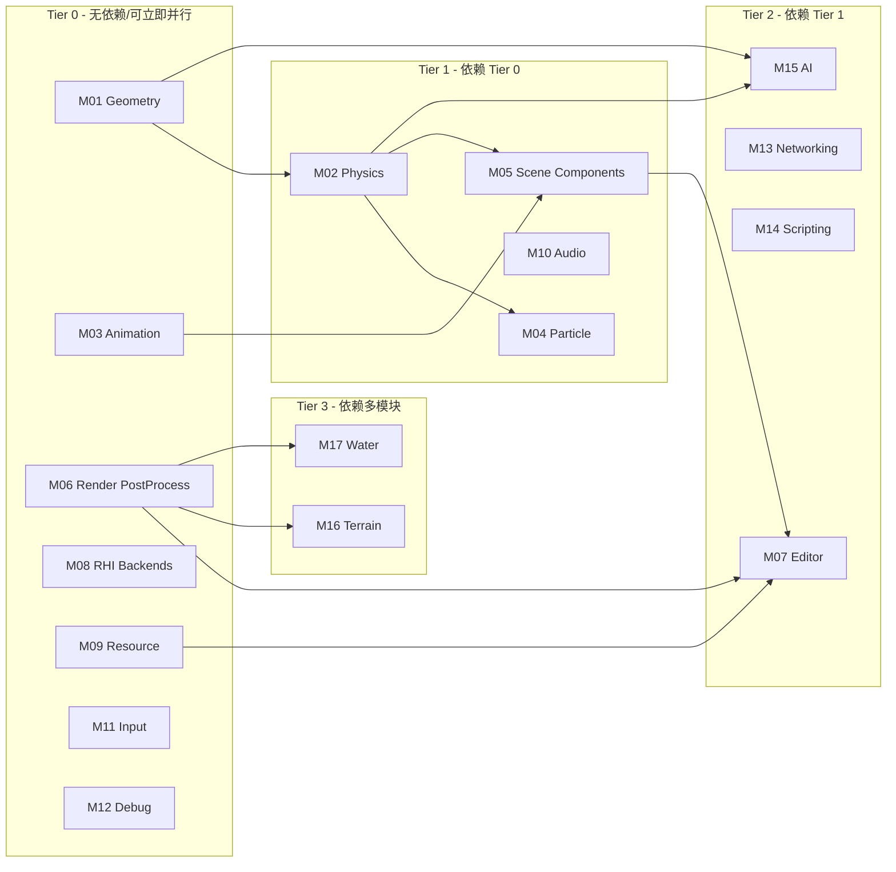

# RenderVerseX 引擎模块完善计划 (并行化版本)

本计划按**独立模块**组织，每个模块可分配给独立的 Agent 并行执行。模块之间的依赖关系已标注，无依赖的模块可同时开发。

---

## 模块依赖关系图



---

## 并行执行策略

| 批次 | 可并行模块 | 预计工作量 |

|------|-----------|-----------|

| **Batch 1** | M01, M03, M06, M08, M09, M11, M12 | 高 (7个模块) |

| **Batch 2** | M02, M04, M05, M10 | 高 (4个模块) |

| **Batch 3** | M07, M13, M14, M15 | 中 (4个模块) |

| **Batch 4** | M16, M17 | 低 (2个模块) |

---

# Module 01: Geometry (几何模块)

**负责 Agent**: `Agent-Geometry`

**依赖**: Core

**被依赖**: Physics, AI, Picking

**当前状态**: 85% (大部分 header-only)

**优先级**: P0 - 可立即开始

## 任务列表

### 1.1 SAT 分离轴定理

- 文件: `Geometry/Include/Geometry/Collision/SAT.h`
- 实现凸多边形/多面体的分离轴测试
- 支持 OBB vs OBB, Convex vs Convex

### 1.2 EPA 穿透深度

- 文件: `Geometry/Include/Geometry/Collision/EPA.h`
- 完善 EPA 算法计算穿透方向和深度
- 与 GJK 配合使用

### 1.3 ContactManifold 接触点

- 新文件: `Geometry/Include/Geometry/Collision/ContactManifold.h`
- 管理碰撞接触点集合
- 支持持久接触点追踪

### 1.4 SIMD 批量查询

- 文件: `Geometry/Include/Geometry/Batch/`
- 实现 SSE/AVX/NEON 批量射线-AABB 相交
- 批量球体-球体相交

### 1.5 三角化算法

- 新文件: `Geometry/Include/Geometry/Mesh/Triangulation.h`
- Ear Clipping 多边形三角化
- Delaunay 三角剖分 (可选)

## 接口规范

```cpp
namespace RVX::Geometry {
    // SAT
    struct SATResult {
        bool separated;
        Vec3 separatingAxis;
        float penetration;
    };
    SATResult SAT_OBB_OBB(const OBB& a, const OBB& b);

    // EPA
    struct EPAResult {
        Vec3 normal;
        float depth;
        Vec3 contactPoint;
    };
    EPAResult EPA(const IConvexShape& a, const IConvexShape& b, const Simplex& gjkSimplex);

    // ContactManifold
    struct ContactPoint {
        Vec3 positionOnA, positionOnB;
        Vec3 normal;
        float penetration;
    };
    class ContactManifold {
        void AddContact(const ContactPoint& point);
        void Refresh(const Mat4& transformA, const Mat4& transformB);
    };
}
```

---

# Module 02: Physics (物理模块)

**负责 Agent**: `Agent-Physics`

**依赖**: Core, Geometry

**被依赖**: Scene/Components, Particle, AI

**当前状态**: 40%

**优先级**: P0 - Geometry 部分完成后开始

## 任务列表

### 2.1 Jolt Physics 集成

- 修改: `Physics/CMakeLists.txt` - 取消注释 Jolt 链接
- 修改: `vcpkg.json` - 添加 `jolt-physics`
- 实现: `Physics/Private/JoltBackend.cpp`

### 2.2 碰撞形状扩展

- 文件: `Physics/Include/Physics/Shapes/`
- BoxShape, SphereShape, CapsuleShape
- ConvexHullShape, TriangleMeshShape (静态)

### 2.3 碰撞响应

- 实现弹性碰撞/非弹性碰撞
- 摩擦力计算
- 碰撞事件回调完善

### 2.4 约束系统

```
Physics/Include/Physics/Constraints/
├── IConstraint.h
├── FixedConstraint.h
├── HingeConstraint.h
├── SliderConstraint.h
├── SpringConstraint.h
└── DistanceConstraint.h
```

### 2.5 CharacterController

- 文件: `Physics/Include/Physics/CharacterController.h`
- 胶囊体形状的角色控制
- 地面检测、斜坡处理、台阶跨越

### 2.6 连续碰撞检测 (CCD)

- 防止高速物体穿透
- 扫掠测试 (Sweep Test)

### 2.7 物理材质

```cpp
struct PhysicsMaterial {
    float friction = 0.5f;
    float restitution = 0.3f;
    float density = 1.0f;
};
```

---

# Module 03: Animation (动画模块)

**负责 Agent**: `Agent-Animation`

**依赖**: Core

**被依赖**: Scene/Components, Editor

**当前状态**: 75%

**优先级**: P0 - 可立即开始

## 任务列表

### 3.1 Core 层实现

```
Animation/Private/Core/
├── Types.cpp        # 时间转换工具
├── Keyframe.cpp     # 关键帧操作/压缩
└── Interpolation.cpp # Hermite, Cubic, Slerp
```

### 3.2 动画加载器

- 集成到 Resource 模块
- glTF 动画导入 (已有部分)
- FBX 动画导入 (需要 OpenFBX)

### 3.3 动画事件系统

```cpp
struct AnimationEvent {
    TimeUs time;
    std::string eventName;
    std::unordered_map<std::string, Variant> parameters;
};

class AnimationEventDispatcher {
    void RegisterHandler(const std::string& event, EventHandler handler);
    void Dispatch(const AnimationEvent& event);
};
```

### 3.4 Root Motion

- 从根骨骼提取位移/旋转
- 应用到实体变换
- 支持启用/禁用切换

### 3.5 动画压缩

- 曲线拟合压缩
- 量化压缩
- 目标: 减少 50%+ 内存占用

---

# Module 04: Particle (粒子模块)

**负责 Agent**: `Agent-Particle`

**依赖**: Core, RHI, Render, Scene, Physics (CollisionModule)

**被依赖**: Editor

**当前状态**: 55%

**优先级**: P1 - Physics 基础完成后开始

## 任务列表

### 4.1 Emitters 实现 (7个)

| 发射器 | 描述 | 复杂度 |

|--------|------|--------|

| PointEmitter | 点发射 | 低 |

| BoxEmitter | 盒体内随机 | 低 |

| SphereEmitter | 球体表面/内部 | 低 |

| ConeEmitter | 锥形发射 | 中 |

| CircleEmitter | 圆形边缘/填充 | 低 |

| EdgeEmitter | 线段发射 | 低 |

| MeshEmitter | 网格表面发射 | 高 |

```cpp
// 实现模板
class BoxEmitter : public IEmitter {
public:
    Vec3 halfExtents{1.0f};
    bool surfaceOnly = false;

    const char* GetTypeName() const override { return "BoxEmitter"; }
    EmitterShape GetShape() const override { return EmitterShape::Box; }
    void GetEmitParams(EmitterGPUData& outData) const override;
};
```

### 4.2 Modules 实现 (11个)

| 模块 | 功能 | GPU/CPU |

|------|------|---------|

| ForceModule | 重力/风力/吸引 | GPU |

| ColorOverLifetimeModule | 颜色随生命周期 | GPU |

| SizeOverLifetimeModule | 大小随生命周期 | GPU |

| VelocityOverLifetimeModule | 速度修改 | GPU |

| RotationOverLifetimeModule | 旋转修改 | GPU |

| NoiseModule | Perlin/Simplex 扰动 | GPU |

| CollisionModule | 粒子碰撞 | GPU/CPU |

| TextureSheetModule | 纹理动画 | GPU |

| TrailModule | 拖尾生成 | CPU |

| LightsModule | 粒子发光 | CPU |

| SubEmitterModule | 子发射器触发 | CPU |

### 4.3 Curves 实现

- `AnimationCurve.cpp` - 可编辑曲线采样
- `GradientCurve.cpp` - 颜色渐变采样

### 4.4 Events 实现

- 粒子生成事件
- 粒子死亡事件
- 碰撞事件

---

# Module 05: Scene/Components (场景组件模块)

**负责 Agent**: `Agent-Scene`

**依赖**: Core, Physics, Animation

**被依赖**: Editor

**当前状态**: 60% (仅4个组件)

**优先级**: P1

## 任务列表

### 5.1 核心组件

```
Scene/Include/Scene/Components/
├── CameraComponent.h      # 相机挂载
├── ColliderComponent.h    # 碰撞器包装
├── RigidBodyComponent.h   # 刚体包装  
├── AnimatorComponent.h    # 动画状态机绑定
├── SkeletonComponent.h    # 骨骼蒙皮数据
├── SkyboxComponent.h      # 天空盒
├── ReflectionProbeComponent.h
├── LightProbeComponent.h
└── DecalComponent.h
```

### 5.2 Prefab 预制体系统

```cpp
class Prefab : public IResource {
    SceneEntity* rootTemplate;
    
    SceneEntity* Instantiate(Scene& scene, const Vec3& position);
    void ApplyOverrides(SceneEntity* instance);
};

class PrefabInstance {
    Prefab::Ptr source;
    std::vector<PropertyOverride> overrides;
};
```

### 5.3 LOD 系统

```cpp
struct LODLevel {
    float screenSizeThreshold;  // 0.0-1.0
    Mesh::Ptr mesh;
    Material::Ptr material;     // 可选: 低配材质
};

class LODComponent : public Component {
    std::vector<LODLevel> levels;
    float lodBias = 0.0f;
    bool fadeTransition = true;
};
```

---

# Module 06: Render (渲染增强模块)

**负责 Agent**: `Agent-Render`

**依赖**: Core, RHI

**被依赖**: Editor, Terrain, Water

**当前状态**: 90% 核心完成，缺后处理

**优先级**: P0 - 可立即开始

## 任务列表

### 6.1 后处理扩展

```
Render/Include/Render/PostProcess/
├── DOF.h                # 景深
├── MotionBlur.h         # 运动模糊
├── ColorGrading.h       # 颜色分级/LUT
├── Vignette.h           # 暗角
├── ChromaticAberration.h # 色差
├── FilmGrain.h          # 电影颗粒
└── VolumetricLighting.h # 体积光
```

### 6.2 DOF 景深

- 基于 CoC (Circle of Confusion)
- 支持散景形状 (Bokeh Shapes)
- 前景/背景分离模糊

### 6.3 MotionBlur 运动模糊

- 基于速度缓冲
- Per-object motion blur
- 可调采样数

### 6.4 ColorGrading

- 3D LUT 支持
- Lift/Gamma/Gain 调整
- 白平衡/饱和度

### 6.5 VolumetricLighting 体积光

- Ray Marching 实现
- 与 ClusteredLighting 集成
- 性能优化 (半分辨率)

### 6.6 Decal 贴花系统

```cpp
class DecalRenderer {
    void AddDecal(const DecalData& decal);
    void Render(RenderGraph& graph, const ViewData& view);
};

struct DecalData {
    Mat4 transform;
    Material::Ptr material;
    float fadeDistance;
    uint32 layerMask;
};
```

### 6.7 大气散射

- Rayleigh/Mie 散射
- 天空颜色/日落效果
- 与天空盒集成

---

# Module 07: Editor (编辑器模块)

**负责 Agent**: `Agent-Editor`

**依赖**: Core, RHI, Render, Scene, Resource, Animation, Particle

**被依赖**: 无

**当前状态**: 50% (未激活)

**优先级**: P2

## 任务列表

### 7.1 激活编辑器

```cmake
# Editor/CMakeLists.txt - 取消注释
add_executable(RVXEditor Private/Main.cpp)
target_link_libraries(RVXEditor PRIVATE RVX::Editor)
```

- 添加 `imgui` 到 vcpkg.json
- 实现 EditorApplication 主循环

### 7.2 Viewport

- 场景渲染视口
- 相机控制 (Orbit/FPS/2D)
- Gizmo 变换工具
- 多视口支持

### 7.3 Inspector

- 基于反射的属性编辑
- 组件添加/删除
- 自定义编辑器扩展

### 7.4 AssetBrowser

- 资产缩略图预览
- 拖放支持
- 搜索/过滤
- 资产导入对话框

### 7.5 ParticleEditor

- 粒子系统实时预览
- Emitter/Module 可视化编辑
- 曲线编辑器

### 7.6 AnimationEditor

- 时间轴 UI
- 关键帧编辑
- 动画预览
- 骨骼可视化

### 7.7 MaterialEditor

- 节点式材质编辑
- 实时预览
- Shader 变体管理

---

# Module 08: RHI Backends (RHI 后端模块)

**负责 Agent**: `Agent-RHI`

**依赖**: Core, RHI

**被依赖**: 所有渲染相关模块

**当前状态**: DX12/Vulkan 90%, 其他 60-75%

**优先级**: P0 - 可立即开始

## 任务列表

### 8.1 DX11 后端

- Compute Shader 支持
- Query 系统 (Timestamp, Occlusion)
- UAV 绑定
- 估计工作量: 中

### 8.2 Metal 后端

- Descriptor 绑定完善
- macOS 测试
- iOS 测试
- Tessellation 支持 (可选)
- 估计工作量: 高

### 8.3 OpenGL 后端

- SSBO (Shader Storage Buffer) 支持
- Framebuffer 管理优化
- 多采样支持
- 估计工作量: 中

---

# Module 09: Resource (资源增强模块)

**负责 Agent**: `Agent-Resource`

**依赖**: Core

**被依赖**: 所有内容模块, Editor

**当前状态**: 85%

**优先级**: P0 - 可立即开始

## 任务列表

### 9.1 FBX Importer

- 集成 OpenFBX 或 ufbx
- 导入网格、骨骼、动画
- 材质映射

### 9.2 音频资源完善

- WAV 加载
- OGG Vorbis 加载 (stb_vorbis)
- MP3 加载 (dr_mp3)
- 流式加载支持

### 9.3 HDR/EXR 加载

- 天空盒 HDR 支持
- 环境贴图预处理
- IBL 预计算

### 9.4 热重载完善

- 文件监视系统
- 资源版本控制
- 自动刷新通知

---

# Module 10: Audio (音频模块)

**负责 Agent**: `Agent-Audio`

**依赖**: Core

**被依赖**: Scene

**当前状态**: 80% (缺后端集成)

**优先级**: P1

## 任务列表

### 10.1 miniaudio 后端集成

- 添加 miniaudio (header-only)
- 实现 AudioDevice 后端
- 跨平台音频输出

### 10.2 多普勒效应

- 基于相对速度计算音高偏移
- 与 AudioSource 集成

### 10.3 HRTF 空间音频

- 头部相关传输函数
- VR/3D 音频增强
- 可选: 使用 Steam Audio

---

# Module 11: Input (输入模块)

**负责 Agent**: `Agent-Input`

**依赖**: Core, HAL

**被依赖**: Runtime, Editor

**当前状态**: 70%

**优先级**: P0 - 可立即开始

## 任务列表

### 11.1 Input Action 系统

```cpp
struct InputAction {
    std::string name;
    std::vector<InputBinding> bindings;
    ActionType type;  // Button, Axis1D, Axis2D
};

class InputActionMap {
    void AddAction(const InputAction& action);
    float GetAxisValue(const std::string& name) const;
    bool IsActionPressed(const std::string& name) const;
    void LoadFromFile(const std::string& path);
};
```

### 11.2 手柄支持

- XInput (Windows)
- GameController (SDL)
- 震动反馈

### 11.3 触摸输入

- 多点触控
- 手势识别 (Tap, Swipe, Pinch)
- 虚拟摇杆

---

# Module 12: Debug/Profiling (调试分析模块)

**负责 Agent**: `Agent-Debug`

**依赖**: Core

**被依赖**: Editor

**当前状态**: 50%

**优先级**: P0 - 可立即开始

## 任务列表

### 12.1 CPU Profiler

```cpp
class CPUProfiler {
    void BeginFrame();
    void EndFrame();
    
    ScopeId BeginScope(const char* name);
    void EndScope(ScopeId id);
    
    const FrameData& GetLastFrame() const;
};

// 使用宏
#define RVX_PROFILE_SCOPE(name) \
    auto _scope = CPUProfiler::Get().ScopedProfile(name)
```

### 12.2 内存追踪器

- 分配/释放追踪
- 内存泄漏检测
- 分配统计

### 12.3 Console/CVars

```cpp
class Console {
    void Execute(const std::string& command);
    void RegisterCommand(const std::string& name, CommandHandler handler);
};

class CVarSystem {
    CVarRef RegisterFloat(const char* name, float defaultValue, const char* help);
    CVarRef RegisterInt(const char* name, int defaultValue, const char* help);
    CVarRef RegisterBool(const char* name, bool defaultValue, const char* help);
    
    template<typename T>
    T Get(const char* name) const;
};
```

### 12.4 统计 HUD

- FPS / 帧时间
- Draw Calls / 三角形数
- 内存使用
- 可切换显示

---

# Module 13: Networking (网络模块) [新建]

**负责 Agent**: `Agent-Network`

**依赖**: Core

**被依赖**: 游戏逻辑

**当前状态**: 0% (新模块)

**优先级**: P2

## 模块结构

```
Networking/
├── CMakeLists.txt
├── Include/Networking/
│   ├── Networking.h
│   ├── NetworkManager.h
│   ├── Connection.h
│   ├── Packet.h
│   ├── Serialization/
│   │   ├── BitStream.h
│   │   └── NetworkSerializer.h
│   ├── Replication/
│   │   ├── ReplicatedObject.h
│   │   └── PropertyReplication.h
│   └── Transport/
│       ├── ITransport.h
│       ├── UDPTransport.h
│       └── ReliableUDP.h
└── Private/
    ├── NetworkManager.cpp
    ├── Connection.cpp
    ├── Serialization/
    ├── Replication/
    └── Transport/
```

## 依赖

- vcpkg: `enet` 或 `asio`

---

# Module 14: Scripting (脚本模块) [新建]

**负责 Agent**: `Agent-Scripting`

**依赖**: Core, Scene

**被依赖**: 游戏逻辑

**当前状态**: 0% (新模块)

**优先级**: P2

## 模块结构

```
Scripting/
├── CMakeLists.txt
├── Include/Scripting/
│   ├── Scripting.h
│   ├── ScriptEngine.h
│   ├── ScriptComponent.h
│   ├── LuaState.h
│   └── Bindings/
│       ├── CoreBindings.h
│       ├── MathBindings.h
│       ├── SceneBindings.h
│       ├── InputBindings.h
│       └── PhysicsBindings.h
└── Private/
    ├── ScriptEngine.cpp
    ├── ScriptComponent.cpp
    ├── LuaState.cpp
    └── Bindings/
```

## 依赖

- vcpkg: `lua` + `sol2` (或 `luabridge3`)

---

# Module 15: AI (人工智能模块) [新建]

**负责 Agent**: `Agent-AI`

**依赖**: Core, Geometry, Physics

**被依赖**: 游戏逻辑

**当前状态**: 0% (新模块)

**优先级**: P2

## 模块结构

```
AI/
├── CMakeLists.txt
├── Include/AI/
│   ├── AI.h
│   ├── AISubsystem.h
│   ├── Navigation/
│   │   ├── NavMesh.h
│   │   ├── NavMeshBuilder.h
│   │   ├── PathFinder.h
│   │   └── NavigationAgent.h
│   ├── BehaviorTree/
│   │   ├── BehaviorTree.h
│   │   ├── BTNode.h
│   │   ├── BTTask.h
│   │   ├── BTDecorator.h
│   │   ├── BTService.h
│   │   └── Blackboard.h
│   └── Perception/
│       ├── AIPerception.h
│       ├── SightSense.h
│       └── HearingSense.h
└── Private/
    ├── AISubsystem.cpp
    ├── Navigation/
    ├── BehaviorTree/
    └── Perception/
```

## 依赖

- vcpkg: `recastnavigation`

---

# Module 16: Terrain (地形模块) [新建]

**负责 Agent**: `Agent-Terrain`

**依赖**: Core, RHI, Render, Geometry

**被依赖**: 无

**当前状态**: 0% (新模块)

**优先级**: P3

## 模块结构

```
Terrain/
├── CMakeLists.txt
├── Include/Terrain/
│   ├── Terrain.h
│   ├── TerrainComponent.h
│   ├── Heightmap.h
│   ├── TerrainLOD.h
│   ├── TerrainMaterial.h
│   └── TerrainCollider.h
└── Private/
    ├── TerrainRenderer.cpp
    ├── TerrainLOD.cpp
    └── TerrainCollider.cpp
```

---

# Module 17: Water (水体模块) [新建]

**负责 Agent**: `Agent-Water`

**依赖**: Core, RHI, Render

**被依赖**: 无

**当前状态**: 0% (新模块)

**优先级**: P3

## 模块结构

```
Water/
├── CMakeLists.txt
├── Include/Water/
│   ├── Water.h
│   ├── WaterComponent.h
│   ├── WaterSurface.h
│   ├── WaterSimulation.h
│   ├── Caustics.h
│   └── Underwater.h
├── Private/
│   ├── WaterRenderer.cpp
│   ├── WaterSimulation.cpp
│   └── Caustics.cpp
└── Shaders/
    ├── WaterSurface.hlsl
    ├── Caustics.hlsl
    └── Underwater.hlsl
```

---

# vcpkg.json 更新

需要添加以下依赖:

```json
{
  "dependencies": [
    // 现有依赖...
    
    // 新增依赖
    { "name": "jolt-physics", "platform": "windows | linux | osx" },
    { "name": "imgui", "features": ["docking-experimental"] },
    { "name": "enet", "platform": "windows | linux | osx" },
    { "name": "lua" },
    { "name": "sol2" },
    { "name": "recastnavigation" },
    { "name": "ufbx" },
    { "name": "miniaudio" }
  ]
}
```

---

# Agent 分配建议

| Agent ID | 负责模块 | 技能要求 |

|----------|----------|----------|

| `Agent-Geometry` | M01 Geometry | 计算几何、SIMD |

| `Agent-Physics` | M02 Physics | 物理引擎、Jolt |

| `Agent-Animation` | M03 Animation | 骨骼动画、插值 |

| `Agent-Particle` | M04 Particle | GPU Compute、粒子系统 |

| `Agent-Scene` | M05 Scene/Components | ECS、组件架构 |

| `Agent-Render` | M06 Render | 图形学、Shader |

| `Agent-Editor` | M07 Editor | ImGui、工具开发 |

| `Agent-RHI` | M08 RHI Backends | DX11/Metal/OpenGL |

| `Agent-Resource` | M09 Resource | 资产管道、格式解析 |

| `Agent-Audio` | M10 Audio | 音频编程 |

| `Agent-Input` | M11 Input | 输入处理 |

| `Agent-Debug` | M12 Debug | 性能分析、工具 |

| `Agent-Network` | M13 Networking | 网络编程 |

| `Agent-Scripting` | M14 Scripting | Lua、绑定生成 |

| `Agent-AI` | M15 AI | 寻路、行为树 |

| `Agent-Terrain` | M16 Terrain | 地形渲染 |

| `Agent-Water` | M17 Water | 水体渲染 |