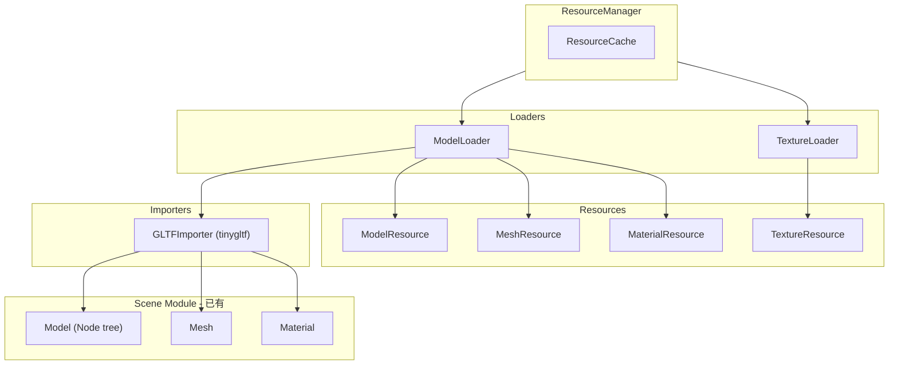

# glTF 资源加载器实施计划

## 关键设计原则

### 1. 资源 ID 全局唯一性

所有资源使用 `path#type_index` 格式生成唯一 ID：

```cpp
// ResourceId 生成策略
ResourceId GenerateResourceId(const std::string& uniqueKey);

// 各类资源的 uniqueKey 格式
ModelResource:    "helmet.gltf"                    // 模型路径
MeshResource:     "helmet.gltf#mesh_0"             // 模型内索引
MaterialResource: "helmet.gltf#material_0"         // 模型内索引
TextureResource:  
 - 外部纹理:     "/abs/path/textures/albedo.png"  // 绝对路径（可共享）
 - 嵌入式纹理:   "helmet.gltf#texture_0"          // 模型特定（不共享）
```

### 2. 外部纹理跨模型共享

```
helmet.gltf  → textures/metal.png → 解析为绝对路径 → ResourceId = hash("/abs/textures/metal.png")
armor.gltf   → textures/metal.png → 解析为绝对路径 → 同一个 ResourceId → 缓存命中！
```

### 3. Node 存储索引而非指针

Node 作为 Prefab 模板，存储资源索引，Instantiate 时通过 ModelResource 解析为 Handle：

```cpp
class Node {
    int meshIndex = -1;              // 引用 ModelResource.meshes[index]
    std::vector<int> materialIndices; // 引用 ModelResource.materials[index]
};
```

### 4. 复用现有 Scene 结构

| Scene 类 | 功能 | 说明 |

|----------|------|------|

| `Model` | 节点树容器 | 包含 Node tree |

| `Node` | 层级、Transform | 存储索引（优化后）|

| `Mesh` | 顶点属性、SubMesh | GLTFImporter 输出 |

| `Material` | PBR 参数、TextureInfo | GLTFImporter 输出 |

---

## 架构概览



---

## Phase 1: 基础结构优化

### 1.1 TextureReference

**文件**: `Resource/Include/Resource/Loader/TextureReference.h`

纹理来源描述，支持外部共享：

```cpp
enum class TextureSourceType { External, Embedded };

struct TextureReference {
    TextureSourceType sourceType = TextureSourceType::External;
    std::string path;                    // 外部：相对路径；嵌入：内部标识
    std::vector<uint8_t> embeddedData;   // 嵌入式数据
    std::string mimeType;                // "image/png", "image/jpeg"
    int imageIndex = -1;                 // glTF image 索引（用于嵌入式标识）
    
    /// 生成唯一 key（用于缓存和 ResourceId）
    std::string GetUniqueKey(const std::string& modelPath) const
    {
        if (sourceType == TextureSourceType::External)
        {
            // 外部纹理：解析为绝对路径（支持跨模型共享）
            return ResolveAbsolutePath(modelPath, path);
        }
        else
        {
            // 嵌入式纹理：模型特定
            return modelPath + "#texture_" + std::to_string(imageIndex);
        }
    }
};
```

### 1.2 TextureResource 增强

**文件**: [Resource/Include/Resource/Types/TextureResource.h](Resource/Include/Resource/Types/TextureResource.h)

```cpp
enum class TextureUsage : uint8_t {
    Color,      // sRGB (albedo, emissive)
    Normal,     // Linear
    Data        // Linear (metallic-roughness, AO)
};

struct TextureMetadata {
    // 现有字段...
    
    // 新增
    bool isSRGB = true;
    TextureUsage usage = TextureUsage::Color;
};
```

### 1.3 Node 索引优化

**文件**: [Scene/Include/Scene/Node.h](Scene/Include/Scene/Node.h)

在 Node 中添加资源索引字段（保留现有 MeshComponent 兼容性）：

```cpp
class Node {
    // 现有字段...
    
    // =========================================================================
    // 资源索引（用于 Prefab/Instantiate 模式）
    // =========================================================================
    
    /// Mesh 索引（-1 表示无 mesh），引用 ModelResource.meshes[]
    int meshIndex = -1;
    
    /// 每个 submesh 对应的材质索引，引用 ModelResource.materials[]
    std::vector<int> materialIndices;
    
    /// 是否使用索引模式（true = 使用索引，false = 使用 MeshComponent）
    bool usesIndexMode() const { return meshIndex >= 0; }
};
```

---

## Phase 2: GLTFImporter

**文件**: `Resource/Include/Resource/Importer/GLTFImporter.h`

直接输出 `Scene::Model`，内部包含 `Node` 树、`Mesh`、`Material`：

```cpp
struct GLTFImportResult {
    bool success = false;
    std::string errorMessage;
    
    Model::Ptr model;                          // Scene::Model (Node tree)
    std::vector<Mesh::Ptr> meshes;             // Scene::Mesh
    std::vector<Material::Ptr> materials;      // Scene::Material
    std::vector<TextureReference> textures;    // 纹理引用（待加载）
};

class GLTFImporter {
public:
    std::vector<std::string> GetSupportedExtensions() const { return {".gltf", ".glb"}; }
    bool CanImport(const std::string& path) const;
    
    GLTFImportResult Import(const std::string& path);

private:
    // 解析到 Scene 类型
    void ParseNodes(const tinygltf::Model& gltf, GLTFImportResult& result);
    void ParseMeshes(const tinygltf::Model& gltf, GLTFImportResult& result);
    void ParseMaterials(const tinygltf::Model& gltf, GLTFImportResult& result);
    void ExtractTextures(const tinygltf::Model& gltf, const std::string& basePath, 
                         GLTFImportResult& result);
    
    // 转换辅助
    Mesh::Ptr ConvertMesh(const tinygltf::Model& gltf, const tinygltf::Mesh& mesh);
    Material::Ptr ConvertMaterial(const tinygltf::Model& gltf, const tinygltf::Material& mat);
    Node::Ptr ConvertNode(const tinygltf::Model& gltf, int nodeIndex,
                          const std::vector<Mesh::Ptr>& meshes);
};
```

### 解析映射

| glTF | Scene 类 |

|------|---------|

| `gltf.nodes[]` | `Node` (hierarchy, Transform) |

| `gltf.meshes[].primitives[]` | `Mesh` (positions, normals, uvs, indices, SubMesh) |

| `gltf.materials[]` | `Material` (PBR params, TextureInfo) |

| `gltf.images[]` | `TextureReference` (path or embedded data) |

---

## Phase 3: 资源加载器

### 3.1 TextureLoader

**文件**: `Resource/Include/Resource/Loader/TextureLoader.h`

```cpp
class TextureLoader : public IResourceLoader {
public:
    TextureLoader(ResourceManager* manager);
    
    IResource* Load(const std::string& path) override;
    
    /// 从 TextureReference 加载（ModelLoader 使用）
    /// 外部纹理使用绝对路径作为缓存 Key，支持跨模型共享
    TextureResource* LoadFromReference(const TextureReference& ref, 
                                        const std::string& modelPath);
    
    /// 默认纹理
    TextureResource* GetDefaultTexture(TextureUsage usage);

private:
    TextureResource* LoadFromFile(const std::string& absolutePath);
    TextureResource* LoadFromMemory(const void* data, size_t size, 
                                     const std::string& uniqueKey, bool sRGB);
    ResourceManager* m_manager;
};
```

### 3.2 ModelLoader

**文件**: `Resource/Include/Resource/Loader/ModelLoader.h`

```cpp
class ModelLoader : public IResourceLoader {
public:
    ModelLoader(ResourceManager* manager);
    
    IResource* Load(const std::string& path) override;

private:
    /// ResourceId 生成（保证全局唯一）
    ResourceId GenerateMeshId(const std::string& modelPath, int index);     // "path#mesh_0"
    ResourceId GenerateMaterialId(const std::string& modelPath, int index); // "path#material_0"
    
    ResourceManager* m_manager;
    std::unique_ptr<GLTFImporter> m_gltfImporter;
};
```

### 3.3 ComponentFactory

**文件**: `Scene/Include/Scene/ComponentFactory.h`

Node 索引到 ECS Component 的统一转换：

```cpp
class ComponentFactory {
public:
    using Creator = std::function<Component*(SceneEntity*, const Node*, const ModelResource*)>;
    
    /// 注册组件创建器
    static void Register(const std::string& typeName, Creator creator);
    
    /// 创建所有组件（Instantiate 时调用）
    static void CreateComponents(SceneEntity* entity, const Node* node, 
                                  const ModelResource* model);
    
    /// 注册默认创建器（MeshRenderer 等）
    static void RegisterDefaults();

private:
    static std::unordered_map<std::string, Creator> s_creators;
};

// 默认 MeshRenderer 创建器
void RegisterDefaults() {
    Register("MeshRenderer", [](SceneEntity* entity, const Node* node, 
                                 const ModelResource* model) -> Component* {
        if (node->meshIndex < 0)
            return nullptr;
        
        auto* renderer = entity->AddComponent<MeshRendererComponent>();
        renderer->SetMesh(model->GetMesh(node->meshIndex));
        
        // 设置材质
        for (size_t i = 0; i < node->materialIndices.size(); ++i) {
            int matIdx = node->materialIndices[i];
            if (matIdx >= 0)
                renderer->SetMaterial(i, model->GetMaterial(matIdx));
        }
        return renderer;
    });
}
```

### 加载流程

```
ModelLoader::Load("helmet.gltf")
    │
    ├── GLTFImporter::Import()
    │   └── 返回 GLTFImportResult {
    │           model: Scene::Model (Node tree with indices),
    │           meshes: [Mesh::Ptr, ...],
    │           materials: [Material::Ptr, ...],
    │           textures: [TextureReference, ...]
    │       }
    │
    ├── 遍历 textures[]
    │   └── TextureLoader::LoadFromReference()
    │       ├── External → 绝对路径作为 Key → 缓存共享
    │       └── Embedded → "modelPath#texture_N" 作为 Key
    │       └── 创建 TextureResource，存入 Cache
    │
    ├── 创建 MeshResource[] (ID: "helmet.gltf#mesh_0", ...)
    │
    ├── 创建 MaterialResource[] (ID: "helmet.gltf#material_0", ...)
    │   └── 关联 TextureResource Handles
    │
    └── 创建 ModelResource (ID: "helmet.gltf")
        └── 存储 meshes[], materials[], rootNode
```

### Instantiate 流程

```
ModelResource::Instantiate(sceneManager)
    │
    ├── 遍历 Node tree
    │   │
    │   ├── 创建 SceneEntity
    │   │
    │   ├── 设置 Transform
    │   │
    │   ├── ComponentFactory::CreateComponents()
    │   │   ├── node.meshIndex → MeshRendererComponent
    │   │   │   └── SetMesh(model.meshes[meshIndex])
    │   │   │   └── SetMaterial(i, model.materials[materialIndices[i]])
    │   │   └── 其他组件...
    │   │
    │   └── 递归处理子节点
    │
    └── 返回根 SceneEntity
```

---

## Phase 4: ResourceManager 集成

**文件**: [Resource/Private/ResourceManager.cpp](Resource/Private/ResourceManager.cpp)

```cpp
void ResourceManager::Initialize(const ResourceManagerConfig& config) {
    // ... 现有初始化 ...
    
    // 注册 TextureLoader
    auto textureLoader = std::make_unique<TextureLoader>(this);
    RegisterLoader(ResourceType::Texture, std::move(textureLoader));
    
    // 注册 ModelLoader
    auto modelLoader = std::make_unique<ModelLoader>(this);
    RegisterLoader(ResourceType::Model, std::move(modelLoader));
}
```

---

## Phase 5: GPUResourceManager 纹理支持

**文件**: [Render/Include/Render/GPUResourceManager.h](Render/Include/Render/GPUResourceManager.h)

```cpp
struct TextureGPUData {
    RHITextureRef texture;
    uint64_t lastUsedFrame = 0;
    size_t gpuMemorySize = 0;
    bool isResident = false;
};

class GPUResourceManager {
    // 新增
    void RequestUpload(Resource::TextureResource* texture, UploadPriority priority);
    void UploadImmediate(Resource::TextureResource* texture);
    RHITexture* GetTexture(Resource::ResourceId textureId) const;
    
private:
    void UploadTexture(Resource::TextureResource* texture);
    std::unordered_map<Resource::ResourceId, TextureGPUData> m_textureGPUData;
};
```

---

## Phase 6: 默认资源

**文件**: `Resource/Include/Resource/DefaultResources.h`

```cpp
class DefaultResources {
public:
    static void Initialize();
    static void Shutdown();
    
    static TextureResource* WhiteTexture();   // 1x1 白色
    static TextureResource* NormalTexture();  // 1x1 (128, 128, 255)
    static TextureResource* ErrorTexture();   // 2x2 粉色棋盘
};
```

---

## Phase 7: CMake 与依赖

### 依赖

```bash
vcpkg install tinygltf
# stb_image 已包含在 tinygltf 中
```

### CMakeLists.txt

**文件**: [Resource/CMakeLists.txt](Resource/CMakeLists.txt)

```cmake
find_package(tinygltf CONFIG REQUIRED)

target_sources(RVX_Resource PRIVATE
    Private/Loader/TextureLoader.cpp
    Private/Loader/ModelLoader.cpp
    Private/Importer/GLTFImporter.cpp
    Private/DefaultResources.cpp
)

target_link_libraries(RVX_Resource PRIVATE tinygltf::tinygltf)
```

---

## 文件结构

```
Resource/
├── Include/Resource/
│   ├── Loader/
│   │   ├── TextureReference.h     # 纹理来源描述（含 GetUniqueKey）
│   │   ├── TextureLoader.h        # 纹理加载（外部共享策略）
│   │   └── ModelLoader.h          # 模型加载（ResourceId 生成）
│   ├── Importer/
│   │   └── GLTFImporter.h         # glTF → Scene 类型（输出索引）
│   └── DefaultResources.h
└── Private/
    ├── Loader/
    │   ├── TextureLoader.cpp
    │   └── ModelLoader.cpp
    ├── Importer/
    │   └── GLTFImporter.cpp
    └── DefaultResources.cpp

Scene/
├── Include/Scene/
│   ├── Node.h                     # 添加 meshIndex, materialIndices
│   └── ComponentFactory.h         # Node → ECS Component 工厂
└── Private/
    └── ComponentFactory.cpp
```

---

## 验证

### 单模型测试

1. 加载 `DamagedHelmet.glb` 测试 GLB 嵌入式纹理
2. 加载 `helmet.gltf` 测试外部纹理引用
3. 验证 Node 层级正确（meshIndex, materialIndices）
4. 验证 Mesh 顶点/索引数据正确
5. 验证 Material PBR 参数正确

### 多模型测试

6. 同时加载 `helmet.gltf` 和 `car.gltf`

                        - 验证两个模型的 meshes[0] 是不同的 MeshResource（不同 ResourceId）
                        - 验证 Instantiate 后渲染正确（不会混淆）

7. 同一模型多次 Instantiate

                        - 验证创建多个独立的 SceneEntity 树
                        - 验证共享同一个 MeshResource（引用计数）

### 纹理共享测试

8. 两个模型引用同一外部纹理

                        - 验证只创建一个 TextureResource（缓存命中）
                        - 验证 ResourceId 相同（绝对路径哈希）

9. 嵌入式纹理不共享

                        - 验证不同模型的嵌入式纹理是独立的 TextureResource

### 渲染测试

10. 验证 GPUResourceManager 纹理上传
11. 验证最终渲染结果正确