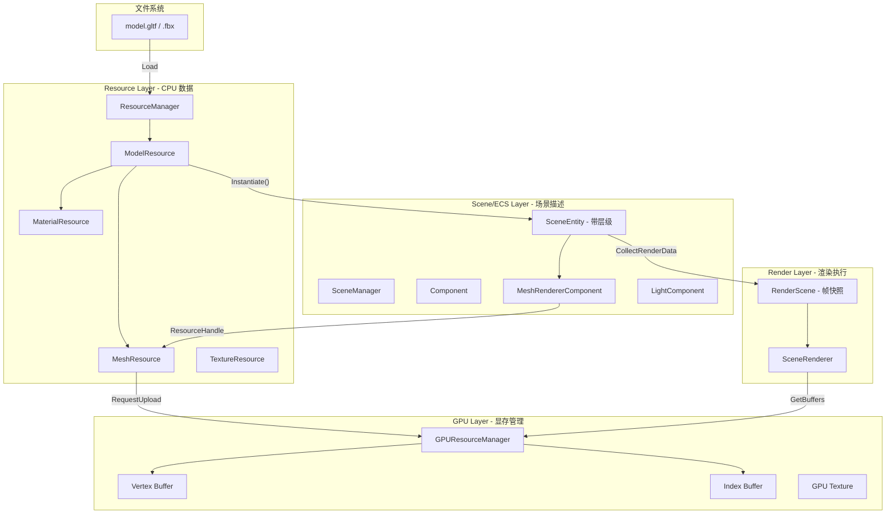

# Resource-Scene-Render 完整集成方案

## 架构总览



---

## Phase 1: SceneEntity 层级 + 空间索引

**目标**: 为 SceneEntity 添加父子层级关系，并采用混合模式的空间索引设计

**修改文件**: [Scene/Include/Scene/SceneEntity.h](Scene/Include/Scene/SceneEntity.h)

### 设计原则

- **保持继承 ISpatialEntity**：接口简单，所有实体可参与空间查询
- **Bounds 由 Component 提供**：MeshRendererComponent、LightComponent 等提供实际边界
- **无视觉组件返回无效 AABB**：自动排除空节点
```cpp
class SceneEntity : public Spatial::ISpatialEntity
{
public:
    // ===================== 层级关系 =====================
    SceneEntity* GetParent() const { return m_parent; }
    const std::vector<SceneEntity*>& GetChildren() const { return m_children; }
    
    void AddChild(SceneEntity* child);
    bool RemoveChild(SceneEntity* child);
    void SetParent(SceneEntity* parent);
    
    // ===================== 变换 =====================
    Mat4 GetWorldMatrix() const;  // parent.WorldMatrix * localMatrix
    Mat4 GetLocalMatrix() const;
    
    // ===================== 空间索引（混合模式）=====================
    // ISpatialEntity 实现 - Bounds 来自 Component
    AABB GetWorldBounds() const override
    {
        if (m_boundsDirty)
        {
            m_cachedWorldBounds = ComputeBoundsFromComponents();
            m_boundsDirty = false;
        }
        return m_cachedWorldBounds;
    }
    
    // 从所有提供 bounds 的组件计算合并 AABB
    AABB ComputeBoundsFromComponents() const;
    
    // 标记 bounds 需要重新计算
    void MarkBoundsDirty();
    
private:
    SceneEntity* m_parent = nullptr;
    std::vector<SceneEntity*> m_children;
    
    // Bounds 缓存
    mutable AABB m_cachedWorldBounds;
    mutable bool m_boundsDirty = true;
};
```


### ComputeBoundsFromComponents 实现

```cpp
AABB SceneEntity::ComputeBoundsFromComponents() const
{
    AABB combined;
    combined.SetInvalid();
    
    // MeshRendererComponent 提供 Mesh bounds
    if (auto* renderer = GetComponent<MeshRendererComponent>())
    {
        if (renderer->GetMesh().IsValid())
        {
            AABB meshBounds = renderer->GetMesh()->GetBounds();
            combined.Merge(TransformAABB(meshBounds, GetWorldMatrix()));
        }
    }
    
    // LightComponent 提供灯光影响范围
    if (auto* light = GetComponent<LightComponent>())
    {
        AABB lightBounds = light->GetBounds();
        combined.Merge(TransformAABB(lightBounds, GetWorldMatrix()));
    }
    
    // 可选：合并子节点的 bounds
    for (auto* child : m_children)
    {
        AABB childBounds = child->GetWorldBounds();
        if (childBounds.IsValid())
            combined.Merge(childBounds);
    }
    
    return combined;
}
```

---

## Phase 2: Component 系统

**目标**: 实现组件基类和 MeshRendererComponent

**新建文件**:

- [Scene/Include/Scene/Component.h](Scene/Include/Scene/Component.h)
- [Scene/Include/Scene/Components/MeshRendererComponent.h](Scene/Include/Scene/Components/MeshRendererComponent.h)
- [Scene/Include/Scene/Components/LightComponent.h](Scene/Include/Scene/Components/LightComponent.h)

### Component 基类

```cpp
class Component
{
public:
    virtual ~Component() = default;
    virtual const char* GetTypeName() const = 0;
    
    SceneEntity* GetOwner() const { return m_owner; }
    bool IsEnabled() const { return m_enabled; }
    void SetEnabled(bool enabled) { m_enabled = enabled; }
    
    virtual void OnAttach() {}
    virtual void OnDetach() {}
    virtual void Tick(float deltaTime) {}
    
    // ===================== 空间边界（可选实现）=====================
    /// 是否提供空间边界
    virtual bool ProvidesBounds() const { return false; }
    
    /// 获取局部空间边界（由子类实现）
    virtual AABB GetLocalBounds() const { return AABB(); }
    
protected:
    friend class SceneEntity;
    SceneEntity* m_owner = nullptr;
    bool m_enabled = true;
    
    /// 通知 Owner 边界已改变
    void NotifyBoundsChanged()
    {
        if (m_owner)
            m_owner->MarkBoundsDirty();
    }
};
```

### IBoundsProvider 接口（可选）

```cpp
// 另一种方式：使用接口而非虚函数
class IBoundsProvider
{
public:
    virtual ~IBoundsProvider() = default;
    virtual AABB GetLocalBounds() const = 0;
};

// MeshRendererComponent 实现 IBoundsProvider
class MeshRendererComponent : public Component, public IBoundsProvider
{
    AABB GetLocalBounds() const override
    {
        return m_mesh.IsValid() ? m_mesh->GetBounds() : AABB();
    }
};
```

### MeshRendererComponent

```cpp
class MeshRendererComponent : public Component
{
public:
    const char* GetTypeName() const override { return "MeshRenderer"; }
    
    // ===================== 空间边界 =====================
    bool ProvidesBounds() const override { return true; }
    AABB GetLocalBounds() const override
    {
        return m_mesh.IsValid() ? m_mesh->GetBounds() : AABB();
    }
    
    // ===================== Mesh =====================
    void SetMesh(ResourceHandle<MeshResource> mesh)
    {
        m_mesh = mesh;
        NotifyBoundsChanged();  // 通知边界改变
    }
    ResourceHandle<MeshResource> GetMesh() const { return m_mesh; }
    
    // ===================== 材质（支持 SubMesh 覆盖）=====================
    void SetMaterial(size_t submeshIndex, ResourceHandle<MaterialResource> material);
    ResourceHandle<MaterialResource> GetMaterial(size_t submeshIndex) const;
    size_t GetMaterialCount() const;
    
    // ===================== 渲染属性 =====================
    bool IsVisible() const { return m_visible; }
    void SetVisible(bool visible) { m_visible = visible; }
    bool CastsShadow() const { return m_castShadow; }
    void SetCastsShadow(bool cast) { m_castShadow = cast; }
    
    // ===================== 渲染数据收集 =====================
    void CollectRenderData(RenderScene& scene, const Mat4& worldMatrix) const;
    
private:
    ResourceHandle<MeshResource> m_mesh;
    std::vector<ResourceHandle<MaterialResource>> m_materials;
    bool m_visible = true;
    bool m_castShadow = true;
    bool m_receiveShadow = true;
};
```

### SceneEntity 扩展

```cpp
// SceneEntity 添加组件管理
template<typename T, typename... Args>
T* AddComponent(Args&&... args);

template<typename T>
T* GetComponent() const;

template<typename T>
bool HasComponent() const;

template<typename T>
bool RemoveComponent();
```

---

## Phase 3: ModelResource 与实例化

**目标**: 创建 ModelResource，支持从模型文件实例化到场景

**新建文件**:

- [Resource/Include/Resource/Types/ModelResource.h](Resource/Include/Resource/Types/ModelResource.h)
- [Resource/Private/Types/ModelResource.cpp](Resource/Private/Types/ModelResource.cpp)
```cpp
class ModelResource : public IResource
{
public:
    ResourceType GetType() const override { return ResourceType::Model; }
    
    // 原始节点树（只读模板）
    Node::Ptr GetRootNode() const;
    
    // 资源引用
    const std::vector<ResourceHandle<MeshResource>>& GetMeshes() const;
    const std::vector<ResourceHandle<MaterialResource>>& GetMaterials() const;
    std::shared_ptr<Skeleton> GetSkeleton() const;
    
    // 实例化：创建 SceneEntity 树
    SceneEntity* Instantiate(SceneManager* scene) const;
    
private:
    Node::Ptr m_rootNode;
    std::vector<ResourceHandle<MeshResource>> m_meshes;
    std::vector<ResourceHandle<MaterialResource>> m_materials;
    std::shared_ptr<Skeleton> m_skeleton;
    
    SceneEntity* InstantiateNode(const Node* node, SceneManager* scene, SceneEntity* parent) const;
};
```


---

## Phase 4: GPUResourceManager

**目标**: 管理 GPU 资源的上传、查询、回收

**新建文件**:

- [Render/Include/Render/GPUResourceManager.h](Render/Include/Render/GPUResourceManager.h)
- [Render/Private/GPUResourceManager.cpp](Render/Private/GPUResourceManager.cpp)
```cpp
class GPUResourceManager
{
public:
    // 上传请求
    void RequestUpload(MeshResource* mesh, UploadPriority priority = Normal);
    void RequestUpload(TextureResource* texture, UploadPriority priority = Normal);
    void UploadImmediate(MeshResource* mesh);
    
    // 查询 GPU 资源
    struct MeshGPUBuffers {
        IRHIBuffer* vertexBuffer;
        IRHIBuffer* indexBuffer;
        std::vector<SubmeshInfo> submeshes;
        bool isResident;
    };
    MeshGPUBuffers GetMeshBuffers(ResourceId meshId) const;
    bool IsResident(ResourceId id) const;
    
    // 每帧处理
    void ProcessPendingUploads(float timeBudgetMs = 2.0f);
    void EvictUnused(uint64_t currentFrame, uint64_t frameThreshold = 300);
    
    // 内存管理
    void SetMemoryBudget(size_t bytes);
    size_t GetUsedMemory() const;
    
private:
    IRHIDevice* m_device;
    std::priority_queue<PendingUpload> m_pendingQueue;
    std::unordered_map<ResourceId, MeshGPUData> m_meshGPUData;
    std::unordered_map<ResourceId, TextureGPUData> m_textureGPUData;
    std::vector<StagingBuffer> m_stagingPool;
};
```


---

## Phase 5: RenderScene 数据收集

**目标**: 从 SceneEntity 树收集渲染数据

**修改文件**: [Render/Include/Render/Renderer/RenderScene.h](Render/Include/Render/Renderer/RenderScene.h)

```cpp
struct RenderObject
{
    Mat4 worldMatrix;
    Mat4 normalMatrix;
    AABB bounds;
    ResourceId meshId;
    std::vector<ResourceId> materials;  // 每个 SubMesh 的材质
    uint64_t entityId;
    bool castsShadow;
    bool receivesShadow;
};

class RenderScene
{
public:
    void CollectFromWorld(World* world);
    void CullAgainstCamera(const Camera& camera, std::vector<uint32_t>& outVisible);
    void SortByMaterial(std::vector<uint32_t>& indices);
    
    const RenderObject& GetObject(uint32_t index) const;
    
private:
    std::vector<RenderObject> m_objects;
    std::vector<RenderLight> m_lights;
    
    void CollectFromEntity(SceneEntity* entity, const Mat4& parentMatrix);
};
```

---

## Phase 6: SceneRenderer 集成

**目标**: 使用 GPUResourceManager 执行渲染

**修改文件**: [Render/Private/Renderer/SceneRenderer.cpp](Render/Private/Renderer/SceneRenderer.cpp)

```cpp
void SceneRenderer::Render(World* world, Camera* camera)
{
    // 1. 收集场景
    m_renderScene.CollectFromWorld(world);
    
    // 2. 视锥剔除
    std::vector<uint32_t> visible;
    m_renderScene.CullAgainstCamera(*camera, visible);
    
    // 3. 排序
    m_renderScene.SortByMaterial(visible);
    
    // 4. 渲染
    for (uint32_t idx : visible)
    {
        const auto& obj = m_renderScene.GetObject(idx);
        
        auto buffers = m_gpuManager->GetMeshBuffers(obj.meshId);
        if (!buffers.isResident)
        {
            m_gpuManager->RequestUpload(obj.meshId, High);
            continue;
        }
        
        // 绑定 VB/IB
        m_context->SetVertexBuffer(0, buffers.vertexBuffer);
        m_context->SetIndexBuffer(buffers.indexBuffer);
        
        // 绘制每个 SubMesh
        for (size_t i = 0; i < buffers.submeshes.size(); ++i)
        {
            BindMaterial(obj.materials[i]);
            SetObjectConstants(obj.worldMatrix);
            m_context->DrawIndexed(buffers.submeshes[i].indexCount, ...);
        }
    }
}
```

---

## Phase 7: Engine::Tick 集成

**修改文件**: [Engine/Private/Engine.cpp](Engine/Private/Engine.cpp)

```cpp
void Engine::Tick(float deltaTime)
{
    // 1. 输入处理
    if (auto* input = GetSubsystem<InputSubsystem>())
        input->ProcessEvents();
    
    // 2. 更新子系统
    m_subsystems.Tick(deltaTime);
    
    // 3. 更新场景
    if (m_activeWorld)
        m_activeWorld->Tick(deltaTime);
    
    // 4. 处理 GPU 资源上传
    if (auto* render = GetSubsystem<RenderSubsystem>())
        render->GetGPUResourceManager()->ProcessPendingUploads(2.0f);
    
    // 5. 渲染
    if (m_renderConfig.autoRender && m_activeWorld)
    {
        if (auto* render = GetSubsystem<RenderSubsystem>())
            render->RenderFrame(m_activeWorld);
    }
    
    // 6. 检查退出
    ...
}
```

---

## Phase 8: 示例更新

**目标**: 创建使用新架构的示例

**新建文件**: [Samples/ModelViewer/main.cpp](Samples/ModelViewer/main.cpp)

```cpp
int main()
{
    Engine engine;
    engine.AddSubsystem<WindowSubsystem>();
    engine.AddSubsystem<RenderSubsystem>();
    engine.Initialize();
    
    auto* world = engine.CreateWorld("Main");
    auto* camera = world->CreateCamera("Main");
    camera->SetPosition(Vec3(0, 2, 5));
    
    // 加载模型
    auto& rm = ResourceManager::Get();
    auto model = rm.Load<ModelResource>("models/helmet.gltf");
    
    // 实例化到场景
    auto* helmet = model->Instantiate(world->GetSceneManager());
    helmet->SetPosition(Vec3(0, 0, 0));
    
    world->SetActiveCamera(camera);
    engine.SetActiveWorld(world);
    
    while (!engine.ShouldShutdown())
    {
        engine.Tick(0.016f);
    }
    
    engine.Shutdown();
    return 0;
}
```

---

## 数据流总结

| 阶段 | 模块 | 输入 | 输出 |

|------|------|------|------|

| 加载 | ResourceManager | 文件路径 | ModelResource |

| 实例化 | ModelResource | SceneManager | SceneEntity 树 |

| 关联 | MeshRendererComponent | ResourceHandle | 引用 MeshResource |

| 收集 | RenderScene | World | RenderObject 列表 |

| 上传 | GPUResourceManager | MeshResource | GPU Buffers |

| 渲染 | SceneRenderer | RenderScene + GPU Buffers | Draw Calls |

---

## 文件变更汇总

### 新建文件

- `Scene/Include/Scene/Component.h`
- `Scene/Include/Scene/Components/MeshRendererComponent.h`
- `Scene/Include/Scene/Components/LightComponent.h`
- `Scene/Private/Component.cpp`
- `Scene/Private/Components/MeshRendererComponent.cpp`
- `Resource/Include/Resource/Types/ModelResource.h`
- `Resource/Private/Types/ModelResource.cpp`
- `Render/Include/Render/GPUResourceManager.h`
- `Render/Private/GPUResourceManager.cpp`
- `Samples/ModelViewer/main.cpp`

### 修改文件

- `Scene/Include/Scene/SceneEntity.h` - 添加层级 + 组件系统 + 混合模式空间索引
- `Scene/Private/SceneEntity.cpp` - 实现层级 + 组件 + ComputeBoundsFromComponents
- `Scene/Include/Scene/SceneManager.h` - 添加 GetRootEntities()
- `Render/Include/Render/Renderer/RenderScene.h` - 更新 RenderObject
- `Render/Private/Renderer/RenderScene.cpp` - 实现 CollectFromWorld
- `Render/Private/Renderer/SceneRenderer.cpp` - 集成 GPUResourceManager
- `Render/Include/Render/RenderSubsystem.h` - 添加 GetGPUResourceManager()
- `Engine/Private/Engine.cpp` - 集成 GPU 上传处理

---

## 设计决策总结

| 决策 | 选择 | 理由 |

|------|------|------|

| SceneEntity 与 ISpatialEntity | 保持继承 | 接口简单，兼容现有空间索引 |

| Bounds 来源 | Component 提供 | 数据来自正确位置（MeshRenderer 知道 Mesh 边界）|

| 空节点处理 | 返回无效 AABB | 自动排除不需要空间查询的实体 |

| Bounds 计算 | 缓存 + 脏标记 | 避免每帧重复计算 |

| Node 类 | 保留 | 作为 ModelResource 内部层级模板 |

| Material 查找 | 覆盖优先 | MeshRendererComponent 可覆盖默认材质 |