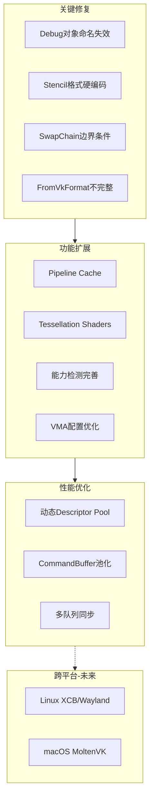
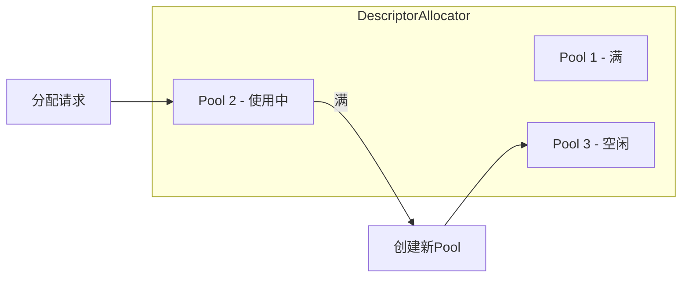

# Vulkan RHI 完善与优化计划

## 问题全景图



---

## 阶段一：关键修复 (Critical Fixes)

### 1.1 修复 Debug Utils 对象命名

**文件**: [VulkanResources.cpp](RHI_Vulkan/Private/VulkanResources.cpp)

当前代码准备了 debug name 但未调用：

```cpp
// 第 77-84 行：注释说 "would need to be loaded dynamically"
// 但 device->vkSetDebugUtilsObjectName 已经加载了
```

**修复方案**:

- 在 `VulkanBuffer`、`VulkanTexture`、`VulkanSampler`、`VulkanShader` 构造函数中调用 `device->vkSetDebugUtilsObjectName`
- 添加辅助函数 `SetVulkanObjectName()` 统一处理

### 1.2 修复 Stencil 附件格式

**文件**: [VulkanPipeline.cpp](RHI_Vulkan/Private/VulkanPipeline.cpp) 第 319 行

```cpp
renderingInfo.stencilAttachmentFormat = VK_FORMAT_UNDEFINED;  // 硬编码
```

**修复方案**:

- 检测深度格式是否包含 stencil (D24S8/D32S8)
- 使用 `RHI/RHIDefinitions.h` 中的 `IsStencilFormat()` 函数
- 正确设置 `stencilAttachmentFormat`

### 1.3 SwapChain 边界条件处理

**文件**: [VulkanSwapChain.cpp](RHI_Vulkan/Private/VulkanSwapChain.cpp)

**问题**:

- `Resize(0, 0)` 时会创建无效 swapchain
- `AcquireNextImage` 失败后可能递归调用 `Resize`

**修复方案**:

```cpp
void VulkanSwapChain::Resize(uint32 width, uint32 height)
{
    // 窗口最小化时跳过重建
    if (width == 0 || height == 0)
        return;
    // ...
}
```

### 1.4 完善 FromVkFormat 转换

**文件**: [VulkanCommon.h](RHI_Vulkan/Private/VulkanCommon.h) 第 140-152 行

当前只支持 7 种格式，应与 `ToVkFormat` 对称支持 40+ 种格式。

---

## 阶段二：功能扩展 (Feature Completion)

### 2.1 实现 Pipeline Cache

**涉及文件**:

- [VulkanDevice.h](RHI_Vulkan/Private/VulkanDevice.h) - 添加成员
- [VulkanDevice.cpp](RHI_Vulkan/Private/VulkanDevice.cpp) - 创建/销毁/保存/加载
- [VulkanPipeline.cpp](RHI_Vulkan/Private/VulkanPipeline.cpp) - 使用 cache

**实现要点**:

```cpp
class VulkanDevice {
    VkPipelineCache m_pipelineCache = VK_NULL_HANDLE;
    
    bool CreatePipelineCache();      // 启动时加载或创建
    void SavePipelineCache();        // 关闭时保存到磁盘
    VkPipelineCache GetPipelineCache() const;
};
```

### 2.2 添加 Tessellation Shader 支持

**文件**: [VulkanPipeline.cpp](RHI_Vulkan/Private/VulkanPipeline.cpp) `CreateGraphicsPipeline()`

添加 Hull (Tessellation Control) 和 Domain (Tessellation Evaluation) shader 阶段：

```cpp
if (desc.hullShader) {
    // VK_SHADER_STAGE_TESSELLATION_CONTROL_BIT
}
if (desc.domainShader) {
    // VK_SHADER_STAGE_TESSELLATION_EVALUATION_BIT
}
// 设置 VkPipelineTessellationStateCreateInfo
```

### 2.3 完善能力检测

**文件**: [VulkanDevice.cpp](RHI_Vulkan/Private/VulkanDevice.cpp) `QueryDeviceCapabilities()`

实际检查扩展支持：

```cpp
// 检查 VK_KHR_ray_tracing_pipeline
m_capabilities.supportsRaytracing = CheckExtensionSupport("VK_KHR_ray_tracing_pipeline");

// 检查 VK_EXT_mesh_shader
m_capabilities.supportsMeshShaders = CheckExtensionSupport("VK_EXT_mesh_shader");

// 检查 VK_KHR_fragment_shading_rate
m_capabilities.supportsVariableRateShading = CheckExtensionSupport("VK_KHR_fragment_shading_rate");
```

### 2.4 VMA 配置优化

**文件**: [VulkanDevice.cpp](RHI_Vulkan/Private/VulkanDevice.cpp) `CreateAllocator()`

添加额外的 VMA 配置：

```cpp
allocatorInfo.flags |= VMA_ALLOCATOR_CREATE_EXT_MEMORY_BUDGET_BIT;

// 设置 VMA 函数回调（用于 Vulkan 1.3 动态加载）
VmaVulkanFunctions vulkanFunctions = {};
vulkanFunctions.vkGetInstanceProcAddr = vkGetInstanceProcAddr;
vulkanFunctions.vkGetDeviceProcAddr = vkGetDeviceProcAddr;
allocatorInfo.pVulkanFunctions = &vulkanFunctions;
```

---

## 阶段三：性能优化 (Performance)

### 3.1 动态 Descriptor Pool 分配器

**新建文件**: `VulkanDescriptorAllocator.h/cpp`



**设计要点**:

- 维护 pool 列表，当前 pool 满时创建新 pool
- 每帧重置机制或延迟释放
- 按 descriptor type 分组优化

### 3.2 Command Buffer 池化 (可选)

**涉及文件**: [VulkanCommandContext.cpp](RHI_Vulkan/Private/VulkanCommandContext.cpp)

- 创建 per-frame command buffer pool
- Reset 时归还而非销毁
- 降低频繁分配开销

### 3.3 多队列同步改进

**文件**: [VulkanCommandContext.cpp](RHI_Vulkan/Private/VulkanCommandContext.cpp) `SubmitVulkanCommandContexts()`

- 添加跨队列信号量依赖
- Copy ->