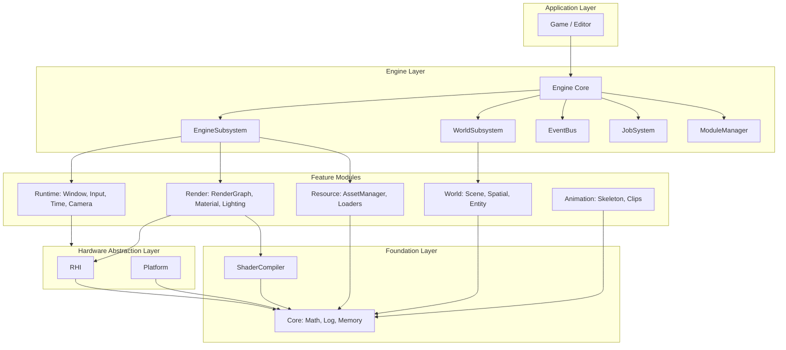
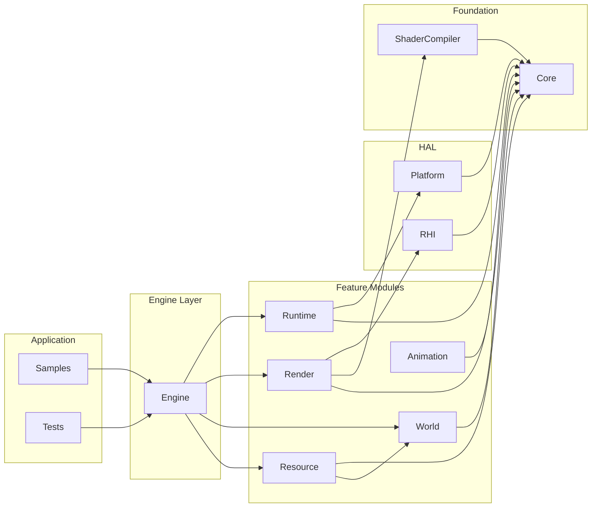
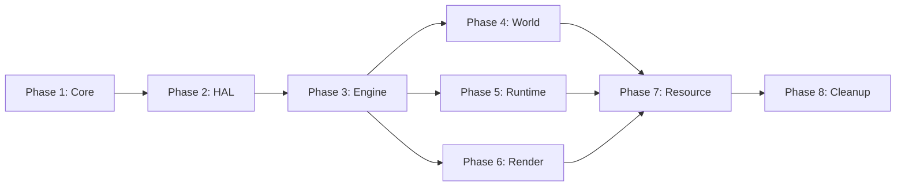

# 游戏引擎最佳实践重构计划

## 1. 设计原则（参考主流引擎）

| 原则 | 说明 | 参考引擎 |

|------|------|----------|

| **Subsystem 模式** | 子系统有明确的生命周期和作用域 | Unreal Engine |

| **Event Bus** | 模块间通过事件/消息解耦通信 | Unreal GameplayMessageSubsystem |

| **Module 边界** | 清晰的模块依赖，避免循环依赖 | Unreal Modules |

| **组件化设计** | Entity-Component 或 Node-Component | Unity, Godot |

| **数据驱动** | 配置与代码分离，可序列化 | 所有主流引擎 |

| **平台抽象层** | HAL 隔离平台差异 | 所有主流引擎 |

| **Job System** | 并行化任务调度 | Unreal, Unity DOTS |

## 2. 目标架构



### 2.1 层次说明

| 层次 | 职责 | 模块 |

|------|------|------|

| Application | 游戏/编辑器逻辑 | Game, Editor, Samples |

| Engine | 协调、子系统管理、事件分发 | Engine, SubsystemCollection |

| Feature Modules | 具体功能实现 | Runtime, Render, World, Resource, Animation |

| HAL | 硬件/平台抽象 | RHI, Platform |

| Foundation | 基础设施 | Core, ShaderCompiler |

## 3. 核心设计：Subsystem 模式

### 3.1 Subsystem 基类设计

```cpp
// Core/Include/Core/Subsystem.h

namespace RVX
{
    // 子系统生命周期类型
    enum class SubsystemLifetime
    {
        Engine,      // 引擎全局：从 Engine::Init 到 Engine::Shutdown
        World,       // 世界级别：从 World::Load 到 World::Unload
        LocalPlayer  // 本地玩家：多人分屏场景
    };

    // 子系统基类
    class ISubsystem
    {
    public:
        virtual ~ISubsystem() = default;
        
        virtual const char* GetName() const = 0;
        virtual SubsystemLifetime GetLifetime() const = 0;
        
        virtual void Initialize() {}
        virtual void Deinitialize() {}
        virtual void Tick(float deltaTime) { (void)deltaTime; }
        
        // 是否需要 Tick
        virtual bool ShouldTick() const { return false; }
    };
    
    // 引擎级子系统
    class EngineSubsystem : public ISubsystem
    {
    public:
        SubsystemLifetime GetLifetime() const override { return SubsystemLifetime::Engine; }
    };
    
    // 世界级子系统
    class WorldSubsystem : public ISubsystem
    {
    public:
        SubsystemLifetime GetLifetime() const override { return SubsystemLifetime::World; }
        
        // 获取所属世界
        class World* GetWorld() const { return m_world; }
        
    protected:
        friend class World;
        World* m_world = nullptr;
    };
}
```

### 3.2 子系统管理器

```cpp
// Engine/Include/Engine/SubsystemCollection.h

template<typename TBase>
class SubsystemCollection
{
public:
    template<typename T, typename... Args>
    T* AddSubsystem(Args&&... args);
    
    template<typename T>
    T* GetSubsystem();
    
    void InitializeAll();
    void DeinitializeAll();
    void TickAll(float deltaTime);
    
private:
    std::vector<std::unique_ptr<TBase>> m_subsystems;
    std::unordered_map<std::type_index, TBase*> m_lookup;
};
```

## 4. 核心设计：Event Bus

### 4.1 事件系统设计

```cpp
// Core/Include/Core/Event/EventBus.h

namespace RVX
{
    // 事件基类
    struct Event
    {
        virtual ~Event() = default;
        virtual const char* GetTypeName() const = 0;
    };
    
    // 事件总线
    class EventBus
    {
    public:
        static EventBus& Get();
        
        // 发布事件
        template<typename T>
        void Publish(const T& event);
        
        // 订阅事件
        template<typename T>
        EventHandle Subscribe(std::function<void(const T&)> callback);
        
        // 取消订阅
        void Unsubscribe(EventHandle handle);
        
        // 延迟发布（下一帧处理）
        template<typename T>
        void PublishDeferred(T event);
        
        // 处理延迟事件
        void ProcessDeferredEvents();
    };
    
    // 常用事件示例
    struct WindowResizeEvent : Event
    {
        uint32_t width, height;
        const char* GetTypeName() const override { return "WindowResize"; }
    };
    
    struct EntityCreatedEvent : Event
    {
        EntityHandle entity;
        const char* GetTypeName() const override { return "EntityCreated"; }
    };
}
```

## 5. 模块目录结构

```
RenderVerseX/
├── Core/                          # 基础设施
│   ├── Include/Core/
│   │   ├── Core.h                 # 统一头文件
│   │   ├── Math/                  # 数学库
│   │   ├── Memory/                # 内存管理
│   │   ├── Log.h                  # 日志
│   │   ├── Subsystem.h            # NEW: 子系统基类
│   │   ├── Event/                 # NEW: 事件系统
│   │   │   ├── EventBus.h
│   │   │   ├── Event.h
│   │   │   └── Delegate.h
│   │   └── Job/                   # NEW: 任务系统
│   │       ├── JobSystem.h
│   │       └── Task.h
│   └── Private/
│
├── HAL/                           # NEW: 硬件抽象层
│   ├── Include/HAL/
│   │   ├── Platform.h             # 平台检测
│   │   ├── Window.h               # 窗口抽象
│   │   ├── Input.h                # 输入抽象
│   │   ├── FileSystem.h           # 文件系统
│   │   └── Timer.h                # 计时器
│   └── Private/
│       ├── GLFW/                  # GLFW 实现
│       └── Win32/                 # Win32 原生实现
│
├── RHI/                           # 渲染硬件接口 (保持)
├── RHI_DX11/
├── RHI_DX12/
├── RHI_Vulkan/
├── RHI_Metal/
├── RHI_OpenGL/
├── ShaderCompiler/
│
├── Runtime/                       # NEW: 运行时模块
│   ├── Include/Runtime/
│   │   ├── Camera/
│   │   │   ├── Camera.h
│   │   │   ├── CameraComponent.h  # 组件化
│   │   │   └── CameraController.h
│   │   ├── InputSubsystem.h       # 输入子系统
│   │   └── TimeSubsystem.h        # 时间子系统
│   └── Private/
│
├── World/                         # NEW: 世界模块
│   ├── Include/World/
│   │   ├── World.h                # 世界容器
│   │   ├── Entity/
│   │   │   ├── Entity.h           # 实体
│   │   │   ├── Component.h        # 组件基类
│   │   │   └── EntityRegistry.h   # 实体注册表
│   │   ├── Scene/
│   │   │   ├── SceneGraph.h       # 场景图
│   │   │   ├── Node.h
│   │   │   └── Transform.h
│   │   ├── Spatial/
│   │   │   ├── SpatialSubsystem.h # 空间子系统
│   │   │   ├── SpatialIndex.h
│   │   │   └── BVH.h
│   │   └── Components/            # 内置组件
│   │       ├── MeshComponent.h
│   │       ├── LightComponent.h
│   │       └── CameraComponent.h
│   └── Private/
│
├── Render/                        # 渲染模块 (增强)
│   ├── Include/Render/
│   │   ├── RenderSubsystem.h      # 渲染子系统
│   │   ├── RenderGraph/
│   │   ├── Material/
│   │   ├── Lighting/
│   │   └── Pipeline/
│   └── Private/
│
├── Resource/                      # NEW: 资源模块
│   ├── Include/Resource/
│   │   ├── ResourceSubsystem.h    # 资源子系统
│   │   ├── ResourceManager.h
│   │   ├── AssetHandle.h
│   │   ├── Types/
│   │   └── Loaders/
│   └── Private/
│
├── Animation/                     # 动画模块 (保持)
│
├── Engine/                        # 引擎核心 (重构)
│   ├── Include/Engine/
│   │   ├── Engine.h
│   │   ├── EngineConfig.h
│   │   ├── ModuleManager.h        # 模块管理器
│   │   ├── SubsystemCollection.h  # 子系统集合
│   │   └── EngineLoop.h           # 主循环
│   └── Private/
│
├── Samples/
└── Tests/
```

## 6. Phase 1: 核心基础设施 (Core 模块扩展)

**目标**: 在 Core 模块添加 Event Bus、Subsystem 基类、Job System，不破坏现有代码

### 6.1 添加 Event Bus

**创建文件**:

```
Core/Include/Core/Event/
├── Event.h           # 事件基类
├── EventBus.h        # 事件总线
├── EventHandle.h     # 事件句柄
└── Delegate.h        # 委托/回调封装

Core/Private/Event/
├── EventBus.cpp
└── Delegate.cpp
```

**具体步骤**:

1. 创建 `Core/Include/Core/Event/` 目录
2. 创建 `Event.h` - 定义 `struct Event` 基类
3. 创建 `EventHandle.h` - 定义订阅句柄类型
4. 创建 `Delegate.h` - 类型安全的回调封装
5. 创建 `EventBus.h` - 事件发布/订阅管理器
6. 创建 `Core/Private/Event/EventBus.cpp` - 实现
7. 更新 `Core/CMakeLists.txt` 添加新源文件
8. 更新 `Core/Include/Core/Core.h` 包含新头文件

### 6.2 添加 Subsystem 基类

**创建文件**:

```
Core/Include/Core/Subsystem/
├── ISubsystem.h           # 子系统接口
├── EngineSubsystem.h      # 引擎级子系统
├── WorldSubsystem.h       # 世界级子系统
└── SubsystemCollection.h  # 子系统集合模板
```

**具体步骤**:

1. 创建 `Core/Include/Core/Subsystem/` 目录
2. 创建 `ISubsystem.h` - 定义子系统接口
3. 创建 `EngineSubsystem.h` - 引擎级子系统基类
4. 创建 `WorldSubsystem.h` - 世界级子系统基类
5. 创建 `SubsystemCollection.h` - 模板类管理子系统集合
6. 更新 `Core/CMakeLists.txt`
7. 更新 `Core/Include/Core/Core.h`

### 6.3 Job System 基础

**创建文件**:

```
Core/Include/Core/Job/
├── JobSystem.h      # 任务调度器
├── Task.h           # 任务封装
└── ThreadPool.h     # 线程池实现

Core/Private/Job/
├── JobSystem.cpp
└── ThreadPool.cpp
```

**具体步骤**:

1. 创建 `Core/Include/Core/Job/` 目录
2. 创建 `ThreadPool.h` - 基础线程池
3. 创建 `Task.h` - 任务封装
4. 创建 `JobSystem.h` - 任务调度 API
5. 创建实现文件
6. 更新 `Core/CMakeLists.txt`

### 6.4 验证步骤

```bash
# 编译验证
cmake --build build --target RVX_Core
# 运行现有测试确保未破坏
cmake --build build --target SystemIntegrationTest
```

## 7. Phase 2: 创建 HAL 层 (硬件抽象层)

**目标**: 创建 HAL 模块，整合 Platform 和 Input 的底层实现

### 7.1 当前模块分析

**Platform 模块** (`Platform/`):

- `Window.h` - 窗口管理
- `WindowEvents.h` - 窗口事件
- `InputBackend.h` - 输入后端接口
- `InputBackend_GLFW.h/.cpp` - GLFW 实现

**Input 模块** (`Input/`):

- `Input.h` - 输入状态管理
- `InputState.h` - 输入状态定义
- `InputEvents.h` - 输入事件

### 7.2 HAL 模块结构

**创建文件**:

```
HAL/
├── CMakeLists.txt
├── Include/HAL/
│   ├── HAL.h                    # 统一头文件
│   ├── Platform.h               # 平台检测宏
│   ├── Window/
│   │   ├── IWindow.h            # 窗口接口
│   │   ├── WindowConfig.h       # 窗口配置
│   │   └── WindowEvents.h       # 窗口事件 (从 Platform 移入)
│   ├── Input/
│   │   ├── IInputBackend.h      # 输入后端接口
│   │   ├── InputState.h         # 输入状态 (从 Input 移入)
│   │   ├── InputEvents.h        # 输入事件 (从 Input 移入)
│   │   └── KeyCodes.h           # 按键码定义
│   ├── FileSystem/
│   │   └── FileSystem.h         # 文件系统接口
│   └── Time/
│       └── Timer.h              # 高精度计时器
└── Private/
    ├── GLFW/
    │   ├── GLFWWindow.h
    │   ├── GLFWWindow.cpp       # 从 Platform/Window.cpp 迁移
    │   ├── GLFWInputBackend.h
    │   └── GLFWInputBackend.cpp # 从 Platform/InputBackend_GLFW.cpp 迁移
    ├── FileSystem.cpp
    └── Timer.cpp
```

### 7.3 具体迁移步骤

**Step 1: 创建 HAL 模块骨架**

```bash
mkdir -p HAL/Include/HAL/Window
mkdir -p HAL/Include/HAL/Input
mkdir -p HAL/Include/HAL/FileSystem
mkdir -p HAL/Include/HAL/Time
mkdir -p HAL/Private/GLFW
```

**Step 2: 创建 HAL/CMakeLists.txt**

```cmake
add_library(RVX_HAL STATIC)

target_sources(RVX_HAL PRIVATE
    Private/GLFW/GLFWWindow.cpp
    Private/GLFW/GLFWInputBackend.cpp
    Private/FileSystem.cpp
    Private/Timer.cpp
)

target_include_directories(RVX_HAL PUBLIC
    $<BUILD_INTERFACE:${CMAKE_CURRENT_SOURCE_DIR}/Include>
)

target_link_libraries(RVX_HAL PUBLIC
    RVX_Core
    glfw
)

add_library(RVX::HAL ALIAS RVX_HAL)
```

**Step 3: 迁移文件**

| 源文件 | 目标文件 | 操作 |

|--------|----------|------|

| `Platform/Include/Platform/Window.h` | `HAL/Include/HAL/Window/IWindow.h` | 重命名为接口 |

| `Platform/Include/Platform/WindowEvents.h` | `HAL/Include/HAL/Window/WindowEvents.h` | 直接移动 |

| `Platform/Include/Platform/InputBackend.h` | `HAL/Include/HAL/Input/IInputBackend.h` | 重命名为接口 |

| `Platform/Private/Window.cpp` | `HAL/Private/GLFW/GLFWWindow.cpp` | 移动并重命名 |

| `Platform/Private/InputBackend_GLFW.cpp` | `HAL/Private/GLFW/GLFWInputBackend.cpp` | 移动 |

| `Input/Include/Input/InputState.h` | `HAL/Include/HAL/Input/InputState.h` | 移动 |

| `Input/Include/Input/InputEvents.h` | `HAL/Include/HAL/Input/InputEvents.h` | 移动 |

**Step 4: 更新命名空间**

- `RVX::Platform::Window` → `RVX::HAL::Window`
- `RVX::Input::InputState` → `RVX::HAL::InputState`

**Step 5: 创建兼容层**

在原 Platform 和 Input 模块创建转发头文件，保持向后兼容：

```cpp
// Platform/Include/Platform/Window.h (兼容层)
#pragma once
#pragma message("Warning: Platform/Window.h is deprecated, use HAL/Window/IWindow.h")
#include "HAL/Window/IWindow.h"
namespace RVX::Platform { using namespace RVX::HAL; }
```

**Step 6: 更新根 CMakeLists.txt**

```cmake
add_subdirectory(HAL)  # 在 Platform 之前
# ... 暂时保留 Platform 和 Input 模块
```

### 7.4 验证步骤

```bash
# 1. 编译 HAL 模块
cmake --build build --target RVX_HAL

# 2. 编译依赖模块确保兼容层工作
cmake --build build --target RVX_Platform
cmake --build build --target RVX_Engine

# 3. 运行测试
ctest --test-dir build -R SystemIntegration
```

## 8. Phase 3: 重构 Engine 核心

**目标**: 将 Engine 从简单的 SystemManager 包装升级为完整的引擎协调器

### 8.1 当前 Engine 分析

**现有文件**:

- `Engine/Include/Engine/Engine.h` - 简单的 SystemManager 包装
- `Engine/Private/Engine.cpp` - Init/Tick/Shutdown 委托
- `Core/Include/Core/SystemManager.h` - 系统管理器
- `Core/Include/Core/ISystem.h` - 系统接口

### 8.2 新 Engine 模块结构

```
Engine/
├── CMakeLists.txt
├── Include/Engine/
│   ├── Engine.h                  # 重构: 添加子系统支持
│   ├── EngineConfig.h            # NEW: 引擎配置
│   ├── EngineLoop.h              # NEW: 主循环
│   ├── ModuleManager.h           # NEW: 模块管理器
│   └── Systems/                  # 保持兼容旧 ISystem
│       ├── ISystem.h             # 从 Core 移入或 include
│       └── SystemManager.h       # 从 Core 移入或 include
└── Private/
    ├── Engine.cpp                # 重构
    ├── EngineLoop.cpp            # NEW
    └── ModuleManager.cpp         # NEW
```

### 8.3 具体实施步骤

**Step 1: 创建 EngineConfig.h**

```cpp
// Engine/Include/Engine/EngineConfig.h
#pragma once
#include <string>

namespace RVX
{
    struct EngineConfig
    {
        std::string appName = "RenderVerseX App";
        uint32_t windowWidth = 1280;
        uint32_t windowHeight = 720;
        bool enableValidation = true;
        bool vsync = true;
        
        // RHI 选择
        enum class RHIBackend { Auto, DX11, DX12, Vulkan, Metal, OpenGL };
        RHIBackend rhiBackend = RHIBackend::Auto;
    };
}
```

**Step 2: 创建新 Engine.h**

```cpp
// Engine/Include/Engine/Engine.h
#pragma once
#include "Core/Subsystem/SubsystemCollection.h"
#include "Core/Subsystem/EngineSubsystem.h"
#include "Core/Event/EventBus.h"
#include "Engine/EngineConfig.h"
#include "Engine/Systems/SystemManager.h"

namespace RVX
{
    class World;
    
    class Engine
    {
    public:
        static Engine& Get();
        
        // 生命周期
        void Initialize(const EngineConfig& config);
        void Run();
        void RequestShutdown() { m_running = false; }
        void Shutdown();
        
        // 子系统访问 (新 API)
        template<typename T> T* GetSubsystem();
        SubsystemCollection<EngineSubsystem>& GetSubsystems() { return m_subsystems; }
        
        // 兼容旧 API
        SystemManager& GetSystemManager() { return m_legacySystems; }
        
        // 核心服务
        EventBus& GetEventBus() { return *m_eventBus; }
        
        // 世界管理
        World* GetWorld() { return m_world.get(); }
        void LoadWorld(const std::string& path);
        void UnloadWorld();
        
        // 状态
        bool IsRunning() const { return m_running; }
        const EngineConfig& GetConfig() const { return m_config; }
        
    private:
        Engine() = default;
        
        EngineConfig m_config;
        SubsystemCollection<EngineSubsystem> m_subsystems;
        SystemManager m_legacySystems;  // 兼容旧代码
        std::unique_ptr<EventBus> m_eventBus;
        std::unique_ptr<World> m_world;
        bool m_running = false;
        bool m_initialized = false;
    };
}
```

**Step 3: 创建 EngineLoop.h**

```cpp
// Engine/Include/Engine/EngineLoop.h
#pragma once

namespace RVX
{
    class Engine;
    
    class EngineLoop
    {
    public:
        void Run(Engine& engine);
        
    private:
        void BeginFrame();
        void ProcessInput();
        void Tick(float deltaTime);
        void Render();
        void EndFrame();
        void ProcessDeferredEvents();
        
        float CalculateDeltaTime();
    };
}
```

**Step 4: 更新 Engine/CMakeLists.txt**

```cmake
add_library(RVX_Engine STATIC)

target_sources(RVX_Engine PRIVATE
    Private/Engine.cpp
    Private/EngineLoop.cpp
    Private/ModuleManager.cpp
)

target_include_directories(RVX_Engine PUBLIC
    $<BUILD_INTERFACE:${CMAKE_CURRENT_SOURCE_DIR}/Include>
)

target_link_libraries(RVX_Engine PUBLIC
    RVX_Core
    RVX_HAL
    RVX_RenderGraph
    RVX_RHI
)

add_library(RVX::Engine ALIAS RVX_Engine)
```

**Step 5: 实现 Engine.cpp**

重构 `Engine/Private/Engine.cpp`，添加子系统初始化逻辑

### 8.4 验证步骤

```bash
# 编译 Engine
cmake --build build --target RVX_Engine

# 确保 Samples 仍能工作 (使用兼容 API)
cmake --build build --target TriangleSample
```

## 9. Phase 4: 创建 World 模块

**目标**: 整合 Scene、Spatial、Picking 为统一的 World 模块

### 9.1 当前模块分析

**Scene 模块** (9 头文件, 7 实现文件):

- `SceneManager.h` - 场景管理器
- `SceneEntity.h` - 实体基类
- `Node.h` - 节点
- `Mesh.h`, `Material.h`, `Model.h` - 几何数据
- `VertexAttribute.h` - 顶点属性
- `BoundingBox.h` - 边界盒 (应使用 Spatial)

**Spatial 模块** (9 头文件, 2 实现文件):

- `ISpatialIndex.h` - 空间索引接口
- `ISpatialEntity.h` - 可索引实体接口
- `BVHIndex.h` - BVH 实现
- `QueryFilter.h`, `SpatialQuery.h` - 查询
- `Bounds/` - AABB, Sphere, Frustum 等

**Picking 模块** (1 头文件, 2 实现文件):

- `PickingSystem.h` - 拾取系统
- `PickingBVH.h` - 独立 BVH (应复用 Spatial)

### 9.2 World 模块结构

```
World/
├── CMakeLists.txt
├── Include/World/
│   ├── World.h                      # 世界容器
│   ├── WorldSubsystem.h             # 世界级子系统基类
│   │
│   ├── Scene/                       # 从 Scene 模块迁移
│   │   ├── SceneManager.h           # 重命名命名空间
│   │   ├── SceneEntity.h
│   │   ├── Node.h
│   │   ├── Transform.h              # 从 Node 分离
│   │   ├── Mesh.h
│   │   ├── Material.h
│   │   ├── Model.h
│   │   └── VertexAttribute.h
│   │
│   ├── Spatial/                     # 从 Spatial 模块迁移
│   │   ├── SpatialSubsystem.h       # NEW: 封装空间查询
│   │   ├── ISpatialIndex.h
│   │   ├── ISpatialEntity.h
│   │   ├── BVHIndex.h
│   │   ├── QueryFilter.h
│   │   ├── SpatialQuery.h
│   │   └── Bounds/
│   │       ├── AABB.h               # 使用 Core/Math/AABB.h
│   │       ├── Sphere.h
│   │       └── Frustum.h
│   │
│   ├── Picking/                     # 从 Picking 模块迁移
│   │   └── PickingService.h         # 简化，使用 SpatialSubsystem
│   │
│   └── Components/                  # 组件定义
│       ├── Component.h
│       ├── MeshComponent.h
│       └── TransformComponent.h
│
└── Private/
    ├── World.cpp
    ├── Scene/
    │   ├── SceneManager.cpp
    │   ├── SceneEntity.cpp
    │   ├── Node.cpp
    │   ├── Mesh.cpp
    │   ├── Material.cpp
    │   └── Model.cpp
    ├── Spatial/
    │   ├── SpatialSubsystem.cpp
    │   ├── BVHIndex.cpp
    │   └── SpatialFactory.cpp
    └── Picking/
        └── PickingService.cpp       # 简化实现
```

### 9.3 迁移步骤

**Step 1: 创建 World 模块骨架**

```bash
mkdir -p World/Include/World/Scene
mkdir -p World/Include/World/Spatial/Bounds
mkdir -p World/Include/World/Picking
mkdir -p World/Include/World/Components
mkdir -p World/Private/Scene
mkdir -p World/Private/Spatial
mkdir -p World/Private/Picking
```

**Step 2: 创建 World.h**

```cpp
// World/Include/World/World.h
#pragma once
#include "Core/Subsystem/SubsystemCollection.h"
#include "Core/Subsystem/WorldSubsystem.h"
#include <memory>
#include <string>

namespace RVX
{
    class SceneManager;
    class SpatialSubsystem;
    
    class World
    {
    public:
        World();
        ~World();
        
        // 生命周期
        void Initialize();
        void Load(const std::string& path);
        void Unload();
        void Tick(float deltaTime);
        void Shutdown();
        
        // 子系统访问
        template<typename T> T* GetSubsystem();
        SubsystemCollection<WorldSubsystem>& GetSubsystems() { return m_subsystems; }
        
        // 便捷访问
        SceneManager* GetSceneManager();
        SpatialSubsystem* GetSpatial();
        
        // 拾取 (委托给 SpatialSubsystem)
        struct PickResult;
        bool Pick(const Ray& ray, PickResult& outResult);
        
    private:
        SubsystemCollection<WorldSubsystem> m_subsystems;
        std::string m_loadedPath;
        bool m_initialized = false;
    };
}
```

**Step 3: 创建 SpatialSubsystem**

```cpp
// World/Include/World/Spatial/SpatialSubsystem.h
#pragma once
#include "Core/Subsystem/WorldSubsystem.h"
#include "World/Spatial/ISpatialIndex.h"
#include <memory>

namespace RVX
{
    class Camera;
    struct RaycastHit;
    
    class SpatialSubsystem : public WorldSubsystem
    {
    public:
        const char* GetName() const override { return "SpatialSubsystem"; }
        
        void Initialize() override;
        void Deinitialize() override;
        
        // 空间索引
        ISpatialIndex* GetIndex() { return m_index.get(); }
        void SetIndex(std::unique_ptr<ISpatialIndex> index);
        
        // 查询 API
        void QueryFrustum(const Frustum& frustum, std::vector<QueryResult>& results);
        void QueryVisible(const Camera& camera, std::vector<SceneEntity*>& entities);
        
        // 拾取 (替代 PickingSystem)
        bool Raycast(const Ray& ray, RaycastHit& outHit);
        void RaycastAll(const Ray& ray, std::vector<RaycastHit>& outHits);
        
        // 屏幕拾取
        static Ray ScreenToRay(const Camera& camera, float x, float y, float w, float h);
        bool PickScreen(const Camera& camera, float x, float y, float w, float h, RaycastHit& hit);
        
    private:
        std::unique_ptr<ISpatialIndex> m_index;
    };
}
```

**Step 4: 文件迁移表**

| 源文件 | 目标文件 | 修改 |

|--------|----------|------|

| `Scene/Include/Scene/*.h` | `World/Include/World/Scene/*.h` | 更新命名空间 |

| `Scene/Private/*.cpp` | `World/Private/Scene/*.cpp` | 更新 include |

| `Spatial/Include/Spatial/*.h` | `World/Include/World/Spatial/*.h` | 更新命名空间 |

| `Spatial/Private/Index/*.cpp` | `World/Private/Spatial/*.cpp` | 更新 include |

| `Picking/Include/Picking/PickingSystem.h` | `World/Include/World/Picking/PickingService.h` | 重构为轻量服务 |

| `Picking/Private/*.cpp` | 删除 | 功能合并到 SpatialSubsystem |

**Step 5: 删除 Picking 独立 BVH**

将 `Picking/Private/PickingBVH.h` 中的三角形级拾取逻辑合并到 `SpatialSubsystem`

**Step 6: 创建兼容层**

```cpp
// Scene/Include/Scene/Scene.h (兼容层)
#pragma once
#pragma message("Warning: Scene module deprecated, use World module")
#include "World/Scene/SceneManager.h"
#include "World/Scene/SceneEntity.h"
// ... 其他转发
namespace RVX { using namespace RVX::World; }
```

**Step 7: 创建 World/CMakeLists.txt**

```cmake
add_library(RVX_World STATIC)

target_sources(RVX_World PRIVATE
    Private/World.cpp
    Private/Scene/SceneManager.cpp
    Private/Scene/SceneEntity.cpp
    Private/Scene/Node.cpp
    Private/Scene/Mesh.cpp
    Private/Scene/Material.cpp
    Private/Scene/Model.cpp
    Private/Scene/VertexAttribute.cpp
    Private/Spatial/SpatialSubsystem.cpp
    Private/Spatial/BVHIndex.cpp
    Private/Spatial/SpatialFactory.cpp
    Private/Picking/PickingService.cpp
)

target_include_directories(RVX_World PUBLIC
    $<BUILD_INTERFACE:${CMAKE_CURRENT_SOURCE_DIR}/Include>
)

target_link_libraries(RVX_World PUBLIC
    RVX_Core
)

add_library(RVX::World ALIAS RVX_World)
```

### 9.4 验证步骤

```bash
# 编译 World 模块
cmake --build build --target RVX_World

# 编译依赖模块 (通过兼容层)
cmake --build build --target RVX_Scene
cmake --build build --target RVX_Spatial
cmake --build build --target RVX_Picking

# 运行测试
ctest --test-dir build -R SystemIntegration
```

## 10. Phase 5: 创建 Runtime 模块

**目标**: 整合 Camera 模块，创建 Input/Time 子系统

### 10.1 当前 Camera 模块分析

**文件列表**:

- `Camera/Include/Camera/Camera.h` - 相机数据
- `Camera/Include/Camera/CameraController.h` - 控制器接口
- `Camera/Include/Camera/FPSController.h` - FPS 控制器
- `Camera/Include/Camera/OrbitController.h` - 轨道控制器
- `Camera/Include/Camera/CameraRegistry.h` - 相机注册表

### 10.2 Runtime 模块结构

```
Runtime/
├── CMakeLists.txt
├── Include/Runtime/
│   ├── Runtime.h                    # 统一头文件
│   │
│   ├── Camera/                      # 从 Camera 模块迁移
│   │   ├── Camera.h
│   │   ├── CameraController.h
│   │   ├── FPSController.h
│   │   ├── OrbitController.h
│   │   └── CameraRegistry.h
│   │
│   ├── Input/
│   │   ├── InputSubsystem.h         # NEW: 输入子系统
│   │   └── InputManager.h           # 从 Input 模块迁移高级 API
│   │
│   └── Time/
│       ├── TimeSubsystem.h          # NEW: 时间子系统
│       ├── Timer.h                  # 计时器
│       └── DeltaTime.h              # 帧时间管理
│
└── Private/
    ├── Camera/
    │   ├── Camera.cpp
    │   ├── FPSController.cpp
    │   ├── OrbitController.cpp
    │   └── CameraRegistry.cpp
    ├── Input/
    │   ├── InputSubsystem.cpp
    │   └── InputManager.cpp
    └── Time/
        └── TimeSubsystem.cpp
```

### 10.3 具体实施步骤

**Step 1: 创建目录结构**

```bash
mkdir -p Runtime/Include/Runtime/Camera
mkdir -p Runtime/Include/Runtime/Input
mkdir -p Runtime/Include/Runtime/Time
mkdir -p Runtime/Private/Camera
mkdir -p Runtime/Private/Input
mkdir -p Runtime/Private/Time
```

**Step 2: 创建 InputSubsystem**

```cpp
// Runtime/Include/Runtime/Input/InputSubsystem.h
#pragma once
#include "Core/Subsystem/EngineSubsystem.h"
#include "HAL/Input/InputState.h"
#include "HAL/Input/IInputBackend.h"
#include <memory>

namespace RVX
{
    class InputSubsystem : public EngineSubsystem
    {
    public:
        const char* GetName() const override { return "InputSubsystem"; }
        bool ShouldTick() const override { return true; }
        
        void Initialize() override;
        void Deinitialize() override;
        void Tick(float deltaTime) override;
        
        // 输入查询
        bool IsKeyDown(KeyCode key) const;
        bool IsKeyPressed(KeyCode key) const;  // 本帧按下
        bool IsKeyReleased(KeyCode key) const; // 本帧释放
        
        bool IsMouseButtonDown(MouseButton button) const;
        Vec2 GetMousePosition() const;
        Vec2 GetMouseDelta() const;
        float GetScrollDelta() const;
        
        // 后端
        void SetBackend(std::unique_ptr<IInputBackend> backend);
        
    private:
        std::unique_ptr<IInputBackend> m_backend;
        InputState m_currentState;
        InputState m_previousState;
    };
}
```

**Step 3: 创建 TimeSubsystem**

```cpp
// Runtime/Include/Runtime/Time/TimeSubsystem.h
#pragma once
#include "Core/Subsystem/EngineSubsystem.h"
#include <chrono>

namespace RVX
{
    class TimeSubsystem : public EngineSubsystem
    {
    public:
        const char* GetName() const override { return "TimeSubsystem"; }
        bool ShouldTick() const override { return true; }
        
        void Initialize() override;
        void Tick(float deltaTime) override;
        
        // 时间查询
        float GetDeltaTime() const { return m_deltaTime; }
        float GetUnscaledDeltaTime() const { return m_unscaledDeltaTime; }
        float GetTimeScale() const { return m_timeScale; }
        void SetTimeScale(float scale) { m_timeScale = scale; }
        
        double GetTime() const { return m_time; }           // 游戏时间 (受 scale 影响)
        double GetRealTime() const { return m_realTime; }   // 真实时间
        
        uint64_t GetFrameCount() const { return m_frameCount; }
        float GetFPS() const { return m_fps; }
        
    private:
        using Clock = std::chrono::high_resolution_clock;
        Clock::time_point m_startTime;
        Clock::time_point m_lastFrameTime;
        
        float m_deltaTime = 0.0f;
        float m_unscaledDeltaTime = 0.0f;
        float m_timeScale = 1.0f;
        double m_time = 0.0;
        double m_realTime = 0.0;
        uint64_t m_frameCount = 0;
        float m_fps = 0.0f;
    };
}
```

**Step 4: 迁移 Camera 文件**

| 源文件 | 目标文件 |

|--------|----------|

| `Camera/Include/Camera/*.h` | `Runtime/Include/Runtime/Camera/*.h` |

| `Camera/Private/*.cpp` | `Runtime/Private/Camera/*.cpp` |

**Step 5: 迁移 Input 高级 API**

将 `Input/Include/Input/Input.h` 中的高级 API 迁移到 `InputSubsystem`

**Step 6: 创建 Runtime/CMakeLists.txt**

```cmake
add_library(RVX_Runtime STATIC)

target_sources(RVX_Runtime PRIVATE
    Private/Camera/Camera.cpp
    Private/Camera/FPSController.cpp
    Private/Camera/OrbitController.cpp
    Private/Camera/CameraRegistry.cpp
    Private/Input/InputSubsystem.cpp
    Private/Input/InputManager.cpp
    Private/Time/TimeSubsystem.cpp
)

target_include_directories(RVX_Runtime PUBLIC
    $<BUILD_INTERFACE:${CMAKE_CURRENT_SOURCE_DIR}/Include>
)

target_link_libraries(RVX_Runtime PUBLIC
    RVX_Core
    RVX_HAL
)

add_library(RVX::Runtime ALIAS RVX_Runtime)
```

**Step 7: 创建兼容层**

```cpp
// Camera/Include/Camera/Camera.h (兼容层)
#pragma once
#pragma message("Warning: Camera module deprecated, use Runtime/Camera")
#include "Runtime/Camera/Camera.h"
```

### 10.4 验证步骤

```bash
cmake --build build --target RVX_Runtime
cmake --build build --target RVX_Camera  # 验证兼容层
ctest --test-dir build -R SystemIntegration
```

## 11. Phase 6: 重构 Render 模块

**目标**: 将 RenderGraph 合并到 Render 模块，创建 RenderSubsystem

### 11.1 当前模块分析

**Render 模块**:

- `Render/Include/Render/RenderService.h`
- `Render/Include/Render/SwapChainManager.h`
- `Render/Private/RenderService.cpp`
- `Render/Private/SwapChainManager.cpp`

**RenderGraph 模块**:

- `RenderGraph/Include/RenderGraph/RenderGraph.h`
- `RenderGraph/Private/RenderGraph.cpp`
- `RenderGraph/Private/RenderGraphCompiler.cpp`
- `RenderGraph/Private/RenderGraphExecutor.cpp`
- `RenderGraph/Private/FrameResourceManager.cpp`
- `RenderGraph/Private/RenderGraphInternal.h`

### 11.2 新 Render 模块结构

```
Render/
├── CMakeLists.txt
├── Include/Render/
│   ├── Render.h                     # 统一头文件
│   ├── RenderSubsystem.h            # NEW: 渲染子系统
│   ├── RenderService.h              # 保持
│   ├── SwapChainManager.h           # 保持
│   │
│   ├── RenderGraph/                 # 从 RenderGraph 模块合并
│   │   ├── RenderGraph.h
│   │   ├── RenderPass.h
│   │   ├── FrameResource.h
│   │   └── RenderGraphBuilder.h
│   │
│   ├── Material/                    # NEW: 材质系统
│   │   ├── MaterialSystem.h
│   │   ├── MaterialBinder.h
│   │   └── GPUMaterial.h
│   │
│   ├── Lighting/                    # NEW: 光照 (预留)
│   │   └── Light.h
│   │
│   └── Pipeline/                    # NEW: 管线管理
│       └── PipelineManager.h
│
└── Private/
    ├── RenderSubsystem.cpp
    ├── RenderService.cpp
    ├── SwapChainManager.cpp
    ├── RenderGraph/
    │   ├── RenderGraph.cpp
    │   ├── RenderGraphCompiler.cpp
    │   ├── RenderGraphExecutor.cpp
    │   ├── FrameResourceManager.cpp
    │   └── RenderGraphInternal.h
    ├── Material/
    │   ├── MaterialSystem.cpp
    │   └── MaterialBinder.cpp
    └── Pipeline/
        └── PipelineManager.cpp
```

### 11.3 具体实施步骤

**Step 1: 创建目录结构**

```bash
mkdir -p Render/Include/Render/RenderGraph
mkdir -p Render/Include/Render/Material
mkdir -p Render/Include/Render/Lighting
mkdir -p Render/Include/Render/Pipeline
mkdir -p Render/Private/RenderGraph
mkdir -p Render/Private/Material
mkdir -p Render/Private/Pipeline
```

**Step 2: 创建 RenderSubsystem**

```cpp
// Render/Include/Render/RenderSubsystem.h
#pragma once
#include "Core/Subsystem/EngineSubsystem.h"
#include "RHI/RHIDevice.h"
#include <memory>

namespace RVX
{
    class World;
    class Camera;
    class RenderGraph;
    class MaterialSystem;
    class SwapChainManager;
    
    struct RenderConfig
    {
        RHI::BackendType backendType = RHI::BackendType::Auto;
        bool enableValidation = true;
        bool vsync = true;
        uint32_t frameBuffering = 2;
    };
    
    class RenderSubsystem : public EngineSubsystem
    {
    public:
        const char* GetName() const override { return "RenderSubsystem"; }
        bool ShouldTick() const override { return false; }
        
        void Initialize() override;
        void Initialize(const RenderConfig& config);
        void Deinitialize() override;
        
        // 渲染流程
        void BeginFrame();
        void Render(World* world, Camera* camera);
        void EndFrame();
        void Present();
        
        // RHI 访问
        RHI::IDevice* GetDevice() { return m_device.get(); }
        RHI::ISwapChain* GetSwapChain();
        
        // 子系统
        RenderGraph* GetRenderGraph() { return m_renderGraph.get(); }
        MaterialSystem* GetMaterialSystem() { return m_materialSystem.get(); }
        SwapChainManager* GetSwapChainManager() { return m_swapChainManager.get(); }
        
        // 窗口关联
        void SetWindow(void* windowHandle, uint32_t width, uint32_t height);
        void OnResize(uint32_t width, uint32_t height);
        
    private:
        RenderConfig m_config;
        std::unique_ptr<RHI::IDevice> m_device;
        std::unique_ptr<RenderGraph> m_renderGraph;
        std::unique_ptr<MaterialSystem> m_materialSystem;
        std::unique_ptr<SwapChainManager> m_swapChainManager;
    };
}
```

**Step 3: 迁移 RenderGraph 文件**

| 源文件 | 目标文件 |

|--------|----------|

| `RenderGraph/Include/RenderGraph/*.h` | `Render/Include/Render/RenderGraph/*.h` |

| `RenderGraph/Private/*.cpp` | `Render/Private/RenderGraph/*.cpp` |

| `RenderGraph/Private/*.h` | `Render/Private/RenderGraph/*.h` |

**Step 4: 更新命名空间**

- `RVX::RenderGraph::` → `RVX::Render::` (可选，或保持 RenderGraph 命名空间)

**Step 5: 更新 Render/CMakeLists.txt**

```cmake
add_library(RVX_Render STATIC)

target_sources(RVX_Render PRIVATE
    Private/RenderSubsystem.cpp
    Private/RenderService.cpp
    Private/SwapChainManager.cpp
    # RenderGraph
    Private/RenderGraph/RenderGraph.cpp
    Private/RenderGraph/RenderGraphCompiler.cpp
    Private/RenderGraph/RenderGraphExecutor.cpp
    Private/RenderGraph/FrameResourceManager.cpp
    # Material
    Private/Material/MaterialSystem.cpp
    Private/Material/MaterialBinder.cpp
)

target_include_directories(RVX_Render PUBLIC
    $<BUILD_INTERFACE:${CMAKE_CURRENT_SOURCE_DIR}/Include>
)

target_link_libraries(RVX_Render PUBLIC
    RVX_Core
    RVX_RHI
    RVX_ShaderCompiler
)

add_library(RVX::Render ALIAS RVX_Render)
```

**Step 6: 创建兼容层**

```cpp
// RenderGraph/Include/RenderGraph/RenderGraph.h (兼容层)
#pragma once
#pragma message("Warning: RenderGraph module deprecated, use Render/RenderGraph")
#include "Render/RenderGraph/RenderGraph.h"
```

### 11.4 验证步骤

```bash
cmake --build build --target RVX_Render
cmake --build build --target RVX_RenderGraph  # 验证兼容层
cmake --build build --target TriangleSample
```

## 12. Phase 7: 资源模块

### 12.1 创建 ResourceSubsystem

**目标**: 重命名 Asset 为 Resource，添加 ResourceSubsystem 封装

### 12.1 迁移步骤

**Step 1: 复制 Asset 目录为 Resource**

```bash
cp -r Asset Resource
```

**Step 2: 重命名文件和类**

| 原名 | 新名 |

|------|------|

| `Asset.h` | `IResource.h` |

| `AssetHandle.h` | `ResourceHandle.h` |

| `class Asset` | `class IResource` |

**Step 3: 创建 ResourceSubsystem**

```cpp
// Resource/Include/Resource/ResourceSubsystem.h
#pragma once
#include "Core/Subsystem/EngineSubsystem.h"
#include "Resource/ResourceHandle.h"

namespace RVX
{
    class ResourceManager;
    
    class ResourceSubsystem : public EngineSubsystem
    {
    public:
        const char* GetName() const override { return "ResourceSubsystem"; }
        
        void Initialize() override;
        void Deinitialize() override;
        
        // 同步加载
        template<typename T>
        ResourceHandle<T> Load(const std::string& path);
        
        // 异步加载
        template<typename T>
        void LoadAsync(const std::string& path, 
                       std::function<void(ResourceHandle<T>)> callback);
        
        // 资源管理
        void UnloadUnused();
        void EnableHotReload(bool enable);
        
        ResourceManager* GetManager() { return m_manager.get(); }
        
    private:
        std::unique_ptr<ResourceManager> m_manager;
    };
}
```

**Step 4: 创建兼容层**

```cpp
// Asset/Include/Asset/Asset.h (兼容层)
#pragma once
#pragma message("Warning: Asset module deprecated, use Resource")
#include "Resource/IResource.h"
namespace RVX::Asset { using Asset = RVX::Resource::IResource; }
```

### 12.2 验证步骤

```bash
cmake --build build --target RVX_Resource
cmake --build build --target RVX_Asset  # 验证兼容层
```

---

## 13. Phase 8: 清理旧模块 + 更新依赖

**目标**: 删除兼容层，更新所有依赖到新模块

### 13.1 模块删除清单

| 原模块 | 目标位置 | 删除时机 |

|--------|----------|----------|

| Platform | HAL | Phase 2 完成后 |

| Input | HAL + Runtime/InputSubsystem | Phase 2, 5 完成后 |

| Camera | Runtime/Camera | Phase 5 完成后 |

| Picking | World/Spatial | Phase 4 完成后 |

| RenderGraph | Render/RenderGraph | Phase 6 完成后 |

| Scene | World/Scene | Phase 4 完成后 |

| Spatial | World/Spatial | Phase 4 完成后 |

| Asset | Resource | Phase 7 完成后 |

### 13.2 清理步骤

**Step 1: 更新所有 Samples**

遍历 `Samples/` 目录，更新 include 路径：

```cpp
// 旧
#include "Platform/Window.h"
#include "Scene/SceneManager.h"

// 新
#include "HAL/Window/IWindow.h"
#include "World/Scene/SceneManager.h"
```

**Step 2: 更新所有 Tests**

遍历 `Tests/` 目录，更新 include 和依赖

**Step 3: 更新根 CMakeLists.txt**

```cmake
# 删除旧模块
# add_subdirectory(Platform)  # 已删除
# add_subdirectory(Input)     # 已删除
# add_subdirectory(Camera)    # 已删除
# add_subdirectory(Picking)   # 已删除
# add_subdirectory(Scene)     # 已删除
# add_subdirectory(Spatial)   # 已删除
# add_subdirectory(RenderGraph) # 已删除
# add_subdirectory(Asset)     # 已删除

# 新模块
add_subdirectory(HAL)
add_subdirectory(Runtime)
add_subdirectory(World)
add_subdirectory(Resource)
add_subdirectory(Render)  # 已包含 RenderGraph
```

**Step 4: 删除兼容层头文件**

```bash
rm -rf Platform/
rm -rf Input/
rm -rf Camera/
rm -rf Picking/
rm -rf Scene/
rm -rf Spatial/
rm -rf RenderGraph/
rm -rf Asset/
```

**Step 5: 最终验证**

```bash
# 清理构建目录
rm -rf build
mkdir build && cd build

# 重新配置
cmake .. -G "Visual Studio 17 2022" -A x64

# 完整构建
cmake --build . --config Debug

# 运行所有测试
ctest -C Debug --output-on-failure
```

---

## 14. 依赖关系图



## 15. 命名规范

| 类型 | 命名规则 | 示例 |

|------|----------|------|

| 子系统 | `XxxSubsystem` | `RenderSubsystem`, `SpatialSubsystem` |

| 组件 | `XxxComponent` | `MeshComponent`, `CameraComponent` |

| 事件 | `XxxEvent` | `WindowResizeEvent`, `EntityCreatedEvent` |

| 接口 | `IXxx` | `ISubsystem`, `ISpatialIndex` |

| 模块 | 首字母大写 | `Runtime`, `World`, `Render` |

## 16. 迁移策略

采用渐进式迁移，每个 Phase 完成后可编译运行：

1. **Phase 1**: Core 添加新基础设施（不破坏现有代码）
2. **Phase 2**: 创建 HAL，Platform/Input 保留兼容接口
3. **Phase 3**: Engine 重构，保留旧 API 作为兼容层
4. **Phase 4-7**: 逐步迁移各模块
5. **Final**: 删除兼容层和旧模块

---

## 17. 执行计划总结

### 17.1 Phase 执行顺序



### 17.2 验证检查点

| Phase | 检查点 | 验证命令 |

|-------|--------|----------|

| 1 | Core 编译通过，EventBus 单元测试 | `cmake --build build --target RVX_Core` |

| 2 | HAL 编译通过，Platform 兼容层工作 | `cmake --build build --target RVX_HAL` |

| 3 | Engine 编译通过，旧 Samples 可运行 | `cmake --build build --target TriangleSample` |

| 4 | World 编译通过，Scene/Spatial 兼容层工作 | `cmake --build build --target RVX_World` |

| 5 | Runtime 编译通过，Camera 兼容层工作 | `cmake --build build --target RVX_Runtime` |

| 6 | Render 编译通过，RenderGraph 兼容层工作 | `cmake --build build --target RVX_Render` |

| 7 | Resource 编译通过，Asset 兼容层工作 | `cmake --build build --target RVX_Resource` |

| 8 | 全部测试通过，无兼容层警告 | `ctest -C Debug` |

### 17.3 回滚策略

每个 Phase 都使用兼容层，如果出现问题：

1. **保留兼容层**: 旧代码继续工作
2. **Git 分支**: 每个 Phase 创建独立分支
3. **增量提交**: 每个 Step 单独提交

建议的 Git 分支策略：

```bash
git checkout -b refactor/phase1-core
# ... 完成 Phase 1
git checkout main && git merge refactor/phase1-core

git checkout -b refactor/phase2-hal
# ... 完成 Phase 2
git checkout main && git merge refactor/phase2-hal
# ... 以此类推
```

### 17.4 最终模块结构对比

**重构前 (18 个顶级模块)**:

```
Core, Platform, Input, Camera, Picking, Scene, Spatial,
Animation, Asset, RHI, RHI_DX11, RHI_DX12, RHI_Vulkan,
RHI_Metal, RHI_OpenGL, ShaderCompiler, RenderGraph,
Render, Engine, Samples, Tests
```

**重构后 (14 个顶级模块)**:

```
Core, HAL, Runtime, World, Resource, Animation,
RHI, RHI_DX11, RHI_DX12, RHI_Vulkan, RHI_Metal,
RHI_OpenGL, ShaderCompiler, Render, Engine, Samples, Tests
```

**减少**: 4 个模块 (Platform, Input, Camera, Picking, Scene, Spatial, RenderGraph, Asset 合并)

**新增**: Event Bus, Subsystem, JobSystem 基础设施

### 17.5 开始执行

准备好后，从 Phase 1 开始执行。每个 Phase 完成后请告知，我会帮助验证并继续下一步。